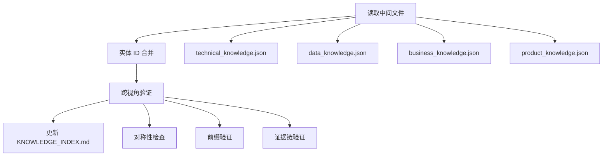

# 归并阶段规范

阶段 **四** 是 docs-build 的收口阶段（在 [阶段 3：各视角 README 填充](readme-fill-spec.md) 之后）。读取四视角 `*_knowledge.json`（schema 2.1）中间文件，执行前缀验证、跨视角对称性检查，最终更新 **`system/knowledge/KNOWLEDGE_INDEX.md`**。

---

## 归并流程

**前置条件**：各视角 `README.md` 索引表已与 JSON 同步（见 [readme-fill-spec.md](readme-fill-spec.md)），避免人类从视角目录阅读时与主索引不一致。

## 归并规则

### 1. 前缀验证

仅包含内置 `contains_prefixes` 定义的前缀：

| 视角 | 允许前缀 |
|------|---------|
| technical | SYS-、APP-、MS-、API- |
| data | DS-、ENT- |
| business | BD-、BSD-、BC-、AGG-、AB- |
| product | PL-、PM-、FT-、UC- |

### 2. 唯一性约束

- `层级+ID` 全知识库唯一
- `层级+别名（英文名）` 全知识库唯一
- `full_id` 全知识库唯一

### 3. 对称性检查

遵守内置 `symmetry.rules`（完整定义见 [builtin-config.md](builtin-config.md)）：

| 规则 ID | 说明 |
|---------|------|
| `same_round_four_sections` | `KNOWLEDGE_INDEX.md` 的 §1～§4 同一轮维护 |
| `no_template_only` | 禁止以非本应用模板 ID 作为 INDEX/README 唯一内容 |
| `index_over_template` | 可登记 ID 时优先主 INDEX §3/§3.2/§六/§七 与工程事实 |
| `bc_agg_linkage` | §1 已登记 BC/AGG 时，§3 或 §4 至少一类有证据行，或显式待补充与原因 |

---

## 各视角 entities 结构差异

四个视角共享 `schema_version: "2.1"` 和 `metadata` 节，但 `entities` 结构不同：

| 视角 | entities 结构 | 说明 |
|------|-------------|------|
| technical | **分类对象**：`{ systems[], applications[], services[], apis[] }` | 按层级分组 |
| data | **扁平数组**：`[...]` | DS 和 ENT 通过 `parent_id` 关联 |
| business | **扁平数组**：`[...]` | BD→BSD→BC→AGG→AB 通过 `parent_id`/`children` 关联 |
| product | **扁平数组**：`[...]` | PL→PM→FT→UC 通过 `parent_id` 关联 |

完整 JSON 结构与示例见 [../assets/knowledge-schema-template.json](../assets/knowledge-schema-template.json)。

---

## KNOWLEDGE_INDEX.md 表头规范

### 语义说明

| 列名 | 含义 |
|------|------|
| **层级** | 实体在知识库中的层次位置 |
| **ID** | 数字编码，同一层级下按数字序列管理，格式如 001、002 |
| **Full ID** | 目录风格规范 ID（如 `SYS-BILLING-APPEAL`），全知识库唯一 |
| **别名（英文名）** | 英文编码，机器可读标识 |
| **名称** | 中文名称，面向业务/阅读的可理解名称 |
| **能力概述** | 聚合边界对外暴露的核心业务能力（仅 AB 层级，其余用 `-`） |
| **证据链** | 分号分隔的多个证据来源 |

### 证据链填写规范

每个 ID 的证据链应包含至少一个可验证来源：

| 证据类型 | 格式 | 示例 |
|----------|------|------|
| 文档章节 | `{文件} §{章节}` | `INDEX_GUIDE.md §3.2` |
| 代码位置 | `{类}#{行号}` 或 `{类}:{方法}` | `BillingAppealApiImpl#create:111` |
| 配置文件 | `{路径}:{键}` | `application.yml:spring.datasource` |
| 工程事实 | `{文件}` | `pom.xml`、`AGENTS.md` |
| 技术实体引用 | `{前缀}-{ID} {名称}` | `MS-001 BillingAppeal` |
| API 引用 | `{API-ID} {别名}` | `API-002 BillingAppeal.create` |

完整输出模板见 [../assets/knowledge-index-template.md](../assets/knowledge-index-template.md)。
