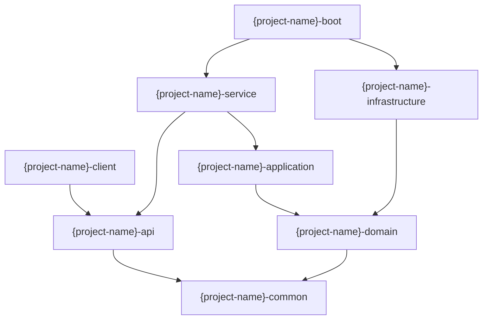

# {项目名称} 索引指南

> **最后更新**: {YYYY-MM-DD}
> **文档定位**: AI Agent 与开发者的系统全景导航，按金字塔结构组织，遵循 MECE 原则

---

## 一、项目概览（Project Overview）

### 1.1 速查表

| 组件 | 路径 | 描述 |
|------|------|------|
| {组件名} | {相对路径} | {一句话描述} |

### 1.2 元信息

- **项目名称**: {name}
- **技术栈**: {frameworks}
- **语言版本**: {version}
- **构建工具**: {build tool}
- **启动入口**: {entry point}

---

## 二、架构视图（Architecture View）

### 2.1 模块结构

```
{project}/
├── {module-1}/    # {描述}
├── {module-2}/    # {描述}
└── {module-n}/    # {描述}
```

### 2.2 依赖关系



### 2.3 包结构

```
{root.package}
├── {layer-1}/    # {描述}
├── {layer-2}/    # {描述}
└── {layer-n}/    # {描述}
```

### 2.4 文档目录

```
application/
├── INDEX_GUIDE.md    # 系统索引指南（本文件）
├── knowledge/        # 知识库
└── changelogs/       # 变更日志
```

---

## 三、接口清单（Interface Catalog）

### 3.1 服务接口

| 接口名 | 类型 | 路径 | 方法 |
|--------|------|------|------|
| {ServiceName} | {Dubbo/gRPC} | {FQCN} | {methods} |

### 3.2 HTTP 接口

| 路径 | 方法 | 功能 |
|------|------|------|
| {/api/path} | {GET/POST} | {描述} |

### 3.3 定时任务

| 任务名 | 调度 | 描述 |
|--------|------|------|
| {JobName} | {cron} | {描述} |

### 3.4 消息队列

| 主题 | 消费者 | 描述 |
|------|--------|------|
| {topic} | {ConsumerClass} | {描述} |

---

## 四、领域模型（Domain Model）

### 4.1 业务术语

| 术语 | 定义 | 使用场景 |
|------|------|----------|
| {Term} | {definition} | {context} |

### 4.2 聚合根

| 聚合根 | 职责 | 关键属性 |
|--------|------|----------|
| {AggRoot} | {responsibility} | {key fields} |

### 4.3 领域服务

| 服务 | 功能 | 依赖 |
|------|------|------|
| {DomainService} | {capability} | {dependencies} |

### 4.4 领域事件

| 事件 | 触发条件 | 处理逻辑 |
|------|----------|----------|
| {Event} | {trigger} | {handler} |

---

## 五、业务逻辑（Business Logic）

### 5.1 状态流转

```mermaid
stateDiagram-v2
    [*] --> {STATE_1} : {action}
    {STATE_1} --> {STATE_2} : {action}
    {STATE_2} --> [*]
```

### 5.2 核心流程

1. **{流程名称}**
   - {步骤 1}
   - {步骤 2}
   - {步骤 n}

### 5.3 业务规则

| 规则 ID | 描述 | 约束 |
|---------|------|------|
| {RULE-001} | {description} | {constraint} |

### 5.4 枚举定义

```java
public enum {EnumName} {
    {VALUE_1},    // {描述}
    {VALUE_2},    // {描述}
}
```

---

## 六、数据映射（Data Mapping）

### 6.1 数据源

| 数据源 | 类型 | 用途 |
|--------|------|------|
| {table/store} | {MySQL/Redis/...} | {描述} |

### 6.2 实体映射

| 表名 | 核心字段 | 描述 |
|------|----------|------|
| {table_name} | {key columns} | {描述} |

### 6.3 关系映射

| 实体 | 关系 | 目标 | 描述 |
|------|------|------|------|
| {Entity} | {1:N/N:1} | {Target} | {描述} |

### 6.4 SQL 索引

| 表名 | 索引字段 | 用途 |
|------|----------|------|
| {table} | {columns} | {描述} |

---

## 七、配置中心（Configuration Hub）

### 7.1 配置项

| 配置项 | 值 | 环境 | 描述 |
|--------|----|------|------|
| {key} | {value} | {env} | {描述} |

### 7.2 环境差异

| 配置项 | 开发 | 测试 | 生产 |
|--------|------|------|------|
| {key} | {dev} | {test} | {prod} |

### 7.3 敏感信息

- {敏感配置处理方式说明}

---

## 八、索引边界（Index Boundary）

### 8.1 覆盖范围

| 文件类型 | 数量 | 描述 |
|----------|------|------|
| {type} | {count} | {描述} |

### 8.2 排除列表

| 文件类型 | 原因 |
|----------|------|
| {pattern} | {reason} |

### 8.3 维护规则

- {更新策略与触发条件}

---

## 九、扩展资源（Extended Resources）

### 9.1 核心文档

| 文档 | 路径 | 描述 |
|------|------|------|
| {DocName} | {path} | {描述} |

### 9.2 相关项目

| 项目 | 关系 | 描述 |
|------|------|------|
| {Project} | {dependency type} | {描述} |

### 9.3 工具链

| 工具 | 版本 | 用途 |
|------|------|------|
| {Tool} | {version} | {描述} |
