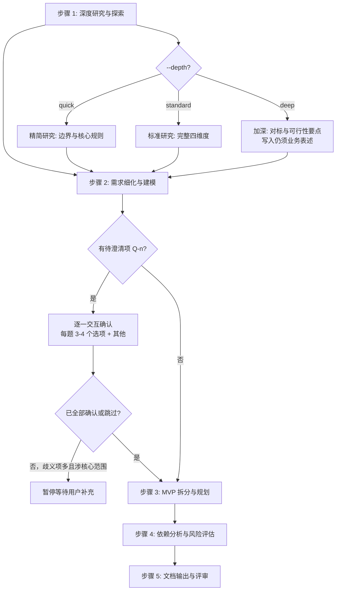

# 五步工作流详细规范

sdx-analysis 技能的核心工作流算法。[SKILL.md](../SKILL.md) 中的工作流为摘要，本文件为完整规范。章节编号与 [../assets/analysis-template.md](../assets/analysis-template.md) **六章**一致。

**文档语言原则**：主要读者为**产品经理与需求分析师**（及业务评审方）。Agent **可以**查阅 `knowledge/`、`knowledge/technical/`、INDEX_GUIDE 等做事实核对；写入 `ANALYSIS-{ID}.md` 时**必须**将工程事实转写为**场景、规则、验收与协作**表述。细则见 [../../sdx-solution/reference/audience-and-language.md](../../sdx-solution/reference/audience-and-language.md)。

---

## 流程总览



---

## 待澄清项交互确认协议

与 **sdx-solution** 技能一致：**不得**对 Q-n 自行假设后继续。交互格式、选项设计、用户回答处理与确认后动作，全文见 [../../sdx-solution/reference/workflow-spec.md](../../sdx-solution/reference/workflow-spec.md) 中「### 待澄清项交互确认协议」一节。

### 本技能中的触发时机与落位

- 步骤 1–2 中凡出现**影响范围、规则、验收或 MVP 边界**的不确定点，均标注 Q-n。
- 提取完本轮 Q-n 列表后，**逐一向用户提问**；全部处理为「已确认」或「用户跳过」后，再进入步骤 3。
- 歧义项 **> 3** 且涉及**核心目标或 MVP 切分**时，须在确认完毕后再继续后续步骤。
- **定稿写入**：模板无单独「待澄清问题」表；澄清结论写入 **§1.3 假设与约束**、**范围与边界**或对应 **FR-n** 描述/规则表，必要时在 **§6.3 变更历史**记一笔。

---

## 步骤 1：深度研究与探索

### 角色

requirements-analyst（面向产品/需求产出）

### 输入

解决方案文档（`system/solutions/SOLUTION-{ID}.md`）+ `knowledge/`（按需加载）

### 算法

1. **通读解决方案**：提取业务目标（G-n）、核心场景、影响面、已知风险（保持业务表述）；在 **§1.1 需求背景** 中引用关联 `solutions/SOLUTION-{ID}.md`。
2. **对齐目标表**：将 G-n 填入 **§1.2 需求目标** 表格，与解决方案一致。
3. **四维度研究**（内部分析可对照技术索引；**写入 §1.3 时仅用业务/协作语言**）：

| 维度 | 研究内容 | 参考来源（内部分析） |
|------|---------|---------------------|
| 领域边界 | 上下游责任划分、核心概念与业务对象 | `knowledge/business/`、INDEX_GUIDE 领域与术语 |
| 核心规则 | 现有业务规则、流程阶段、约束 | `knowledge/business/`、INDEX_GUIDE 状态与流程 |
| 跨域协作 | 信息如何在团队/系统间传递（核对事实用技术材料） | `knowledge/technical/`、INDEX_GUIDE 集成摘要 |
| 行业与对内惯例 | 同类场景的常见做法与陷阱 | 经验、外部参考、解决方案正文 |

4. **落位 §1.3**：**范围与边界**（In/Out，与解决方案差异须说明）；**假设与约束**（与 Q-n 区分）；**研究与分析**（调研结论、核心规则发现、跨域协作要点，不写实现细节）。
5. **现有能力盘点**（写入业务表述）：可复用流程/能力、已知限制、边界场景的用户可见后果。

### depth 参数影响

| depth | 行为 |
|-------|------|
| quick | 仅研究领域边界与核心规则，跳过行业惯例与深度边界列举 |
| standard | 完整四维度研究 |
| deep | 增加对标与可行性要点（内部分析可更细）；**文档仍不写实现栈与表结构** |

### 产出

研究发现（对应文档 **§1**）；Q-n 在步骤 2 汇总后进入交互协议。

---

## 步骤 2：需求细化与建模

### 角色

requirements-analyst

### 输入

步骤 1 产出 + 解决方案文档中的背景、目标与范围

### 算法

1. **功能需求（§2）** — 按模板为每个 **FR-n** 独立成节（`### FR-nnn: {名称}`），每节包含：
   - 描述、输入、**处理逻辑**（含 **BR-n** 规则表）、**涉及的业务对象**表、输出、异常与边界、验收标准；
   - **概览表**（§2 顶部）列出 FR 编号、名称、优先级、所属 MVP、关联 G-n。
2. **非功能需求（§3）** — 按模板 **§3.1–§3.5**：体验与性能、可用性与连续性、安全与合规、可追溯与问题定位、兼容与升级；优先**用户与业务可感知**表述，量化工程指标可写「须与研发共拟」。
3. **业务规则**：以 **BR-n** 形式出现在对应 **FR-n** 的规则表中，可被多个 FR 引用时，在首条 FR 详述、其余 FR 交叉引用说明。
4. **数据/业务对象**：使用各 FR 内「涉及的业务对象」表，**不再单独设「数据需求」章**。

### depth 参数影响

| depth | 行为 |
|-------|------|
| quick | 仅细化 P0/P1 功能需求；非功能以条目列出，少写目标数值 |
| standard | 完整功能与非功能细化 |
| deep | 增加需求间依赖、历史数据影响的**业务说明**；物理表结构、迁移脚本**不写入正文**，可列入 **§6.3 变更历史**并标注「待研发确认」 |

### 产出

细化需求（对应文档 **§2–§3**）。若存在 Q-n，**先执行「待澄清项交互确认协议」**，再进入步骤 3。

---

## 步骤 3：MVP 拆分与规划

### 角色

requirements-analyst

### 输入

步骤 1–2 产出（Q-n 已确认或已标注跳过）

### 算法

1. **拆分原则**：独立业务价值、单向依赖、P0 优先、共性能力随首个依赖它的 MVP 交付。
2. **落位 §4.1**：MVP 总览表（阶段、目标、包含需求、交付价值、工期、前置依赖）。
3. **落位 §4.2**：各 MVP 目标、范围、验收、依赖项（按模板分节）。
4. **落位 §4.3**：MVP 依赖关系图（文本/ASCII），确保无环。

### 产出

MVP 拆分方案（对应文档 **§4**）

---

## 步骤 4：依赖分析与风险评估

### 角色

requirements-analyst（可对照质量视角）

### 输入

步骤 1–3 产出

### 算法

1. **§5.1 依赖关系**：功能/数据/对接与协作/外部；正文写「谁须在何时交付什么结果」，主表避免技术接口名。
2. **§5.2 风险评估**：R-n，类型含技术/业务/进度/质量等；可能性与影响；应对策略面向产品与协作跟进。

### 产出

依赖与风险评估（对应文档 **§5**）

---

## 步骤 5：文档输出与评审

### 角色

requirements-analyst + technical-writer（可选）

### 输入

步骤 1–4 全部产出 + [../assets/analysis-template.md](../assets/analysis-template.md)

### 算法

1. **整合**：按模板**六章**编排；**§6.1** 术语、**§6.2** 参考、**§6.3** 变更历史、**§6.4 质量自查表**。
2. **语言审读**：通读全文，对照 [../../sdx-solution/reference/audience-and-language.md](../../sdx-solution/reference/audience-and-language.md) 去除不当技术术语；确需保留的工程线索集中至 **§6.3** 并标注「待研发确认」。
3. **填充文末文档元数据**（「## 文档元数据」内的 fenced `yaml`；勿在文件开头写 `---`）：
   - `id`: `ANALYSIS-{IDEA-ID}`
   - `title`、`version`、`status`、`created`、`updated`、`author`、`reviewers`、`parent`: `SOLUTION-{IDEA-ID}`、`tags`
4. **质量门禁**：对照 [quality-checklist.md](quality-checklist.md) 与模板 **§6.4** **逐项**判定；**仅当**某条通过标准已满足，方在交付物中将该项由 `- [ ]` 改为 `- [x]`；未满足的保持 `- [ ]`，先修复或记录例外后再勾选。**禁止**未达标而全部勾选。
5. **输出**：将含已勾选 **§6.4** 的终稿写入 `system/analysis/ANALYSIS-{IDEA-ID}.md`

### 输出目录

```
system/analysis/
└── ANALYSIS-{IDEA-ID}.md
```

目录不存在时自动创建。

### 产出

完整需求分析文档 + 质量门禁自查结果。

---

## 步间数据流

```
步骤 1 产出
  ├─→ §1.1 需求背景、§1.2 需求目标、§1.3 范围约束（含研究与分析）
  └─→ [传递到步骤 2]

步骤 2 产出
  ├─→ §2 功能需求（FR-n 节内 BR 与业务对象）
  ├─→ §3 非功能需求
  ├─→ Q-n 澄清结果 → §1.3 / 各 FR
  └─→ [传递到步骤 3]

步骤 3 产出
  └─→ §4 交付计划

步骤 4 产出
  └─→ §5 依赖与风险

步骤 5 整合
  └─→ §1–§6 完整文档 + 文档元数据
```
