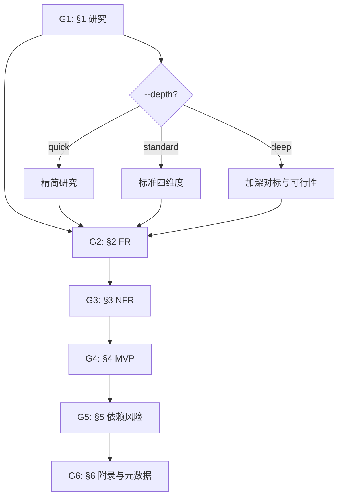

# 工作流规范（sdx-analysis）

SKILL.md 中的**三阶段**流程为主干，本文件补充门禁状态机、精简/全量映射、回跳影响面、Q-n 协议、各 **G{n} 填充要点**（承接原「深度研究 → … → 文档输出」算法）与阶段三 chunk 标志。

章节编号与 [../assets/analysis-template.md](../assets/analysis-template.md) **六章**一致。

**文档语言原则**：主要读者为**产品经理与需求分析师**（及业务评审方）。Agent **可以**查阅 `knowledge/`、`knowledge/technical/`、INDEX_GUIDE 等做事实核对；写入 `ANALYSIS-{ID}.md` 时**必须**将工程事实转写为**场景、规则、验收与协作**表述。细则见 [../../sdx-solution/reference/audience-and-language.md](../../sdx-solution/reference/audience-and-language.md)。

---

## 门禁状态机

```
[阶段一：参数确认]
    ↓ 全部参数确认（或 S/F 跳过）
[阶段二：逐门禁交互]
    全量 6G：G1 → G2 → G3 → G4 → G5 → G6
    精简 4G：G(1–2) → G3 → G4 → G(5–6)
    每门禁：草案呈现 → （可选）多方案对比 → 待确认点逐一确认 → 门禁收口
    多方案对比：见「G{n} 内多方案子循环」与 [brainstorming-integration.md](brainstorming-integration.md)
    ↓ 全部门禁收口（或 S/F 跳过）
[Qclose-1 总确认]
    ↓ C / S（PENDING → CONFIRMED）
[阶段三：文档生成]
    骨架 → chunk 1 → … → chunk 6 → 终检
```

### 全量 6 门禁与模板映射

| 门禁 | 覆盖模板（analysis-template） |
|------|--------------------------------|
| G1 | §1 背景目标 |
| G2 | §2 功能需求 |
| G3 | §3 非功能需求 |
| G4 | §4 交付计划 |
| G5 | §5 依赖与风险 |
| G6 | §6 附录（含 §6.4 质量自查、文末文档元数据） |

### 精简 4 门禁映射

| 精简门禁 | 覆盖全量门禁 | 覆盖模板 |
|---------|-------------|---------|
| G(1–2) | G1、G2 | §1、§2 |
| G3 | G3 | §3 |
| G4 | G4 | §4 |
| G(5–6) | G5、G6 | §5、§6 |

---

## 回跳影响面评估

用户回跳到 G{k} 并修改结论后，评估后续门禁的依赖类型：

| 依赖类型 | 判断标准 | 处理方式 |
|---------|---------|---------|
| 强依赖 | 后续门禁与 G{k} 新结论显式矛盾，或引用同一实体（同一 FR/MVP/R、同一范围边界） | 须重新确认 |
| 弱依赖 | 后续门禁大量引用 G{k} 的术语、范围、优先级或验收表述 | 建议重新确认 |
| 无依赖 | 后续门禁内容与 G{k} 无关联 | 保持已确认状态 |

**分析域示例**：回跳 **G2** 增删 **FR-n** 或改优先级 → **G4** MVP 包含关系、**G5** 依赖与风险往往为**强依赖**；回跳 **G1** 改 In/Out → **G2–G5** 多需重审至少弱依赖。

向用户说明影响面后，由用户选择「仅强依赖重走」或「强弱一并重走」。

---

## G{n} 内多方案子循环

**触发**：当前门禁的结论依赖**两条及以上真实可选路径**（FR 切分、MVP 切法、非功能取舍、风险应对等），需要先取舍再定稿。详见 [brainstorming-integration.md](brainstorming-integration.md)。

**节奏**（仍在同一 G{n} 内，未收口前）：

1. 列出 2–3 套路径，**业务语义命名**（避免空洞的「方案A/B」）。
2. 利弊、适用条件、推荐及理由。
3. 用标准四选项收口，结论写入 spec「本门禁结论」。

**与 Q-n 的分工**：Q-n 解决**信息缺口**；本节解决**信息足够但决策分叉**。若分叉内仍有事实未清，先 Q-n，再回到方案对比。

---

## 待澄清项（Q-n）交互协议

**触发时机**：阶段二任意门禁中出现歧义、矛盾或信息缺失时，立即标注 Q-n。

**交互格式**：

```
Q-{n}：{问题描述}

背景：{为什么需要澄清，影响哪个决策}

选项：
1. {具体业务含义描述}（推荐）
2. {具体业务含义描述}
3. {具体业务含义描述}
4. 其他（请说明）

请选择：
C：确认选项 1（推荐）
M：修改，格式 "M 旧内容 - 新内容"
S：跳过，标注为待澄清
F：跳过门禁，拟定草稿
```

**规则**：

- 每次只提一个 Q-n，等用户回答后再提下一题
- 选项描述具体业务含义，不写「方案A/方案B」等抽象标签
- 澄清结论写入对应门禁的 spec 章节，不单独设「待澄清问题」章
- 用户选 S 时，在 spec 中标注「Q-{n} 待澄清」并说明影响范围

**与全量门禁推进**：在 **G1–G3** 草案中凡出现**影响范围、规则、验收或 MVP 边界**的不确定点，均标注 Q-n；**逐一向用户提问**，全部处理为「已确认」或「用户跳过」后，再收口当前闸或进入下一闸。歧义项 **> 3** 且涉及**核心目标或 MVP 切分**时，须在确认完毕后再继续后续门禁。

**定稿写入**：模板无单独「待澄清问题」表；澄清结论写入 **§1.3**、**范围与边界**或对应 **FR-n** 描述/规则表，必要时在 **§6.3 变更历史**记一笔。

**Q-n 优先模式**（可选）：当同一份 spec 中登记了多条 Q-n 且用户希望先收敛歧义时，可在全部门禁草案完成后，先逐一确认所有 Q-n，再进行分门禁摘要确认，最后进入 Qclose-1。

---

## 阶段三 chunk 完成标志

| Chunk | 覆盖章节 | 完成标志（摘要） |
|-------|---------|------------------|
| 1 | §1 | §1.2 **G-n** 与上游 SOLUTION 对齐或已说明差异；§1.3 范围、假设、研究结论落位 |
| 2 | §2 | 各 **FR-n** 含规则与业务对象；概览表与分节一致 |
| 3 | §3 | §3.1–§3.5 均有落位或已标「不适用」 |
| 4 | §4 | §4.1–§4.3 完整，MVP 依赖图无环（或已说明） |
| 5 | §5 | §5.1–§5.2 完整，**R-n** 有应对策略 |
| 6 | §6（含 §6.4 与文末 yaml） | 质量自查表已逐项判定；元数据字段齐全 |

用户选 F（跳过后续 chunk 轻确认）时，一次性填充至可终检前状态，并说明填充策略。

---

## G1：§1 背景目标（深度研究与探索）

### 角色与输入

requirements-analyst。输入：解决方案文档（`{DOC_DIR}/solutions/SOLUTION-{ID}.md`）+ `knowledge/`（按需加载）。

### 算法

1. **通读解决方案**：提取业务目标（模板 §1.2 用 **G-n** 与上游对齐）、核心场景、影响面、已知风险（保持业务表述）；在 **§1.1 需求背景** 中引用关联 `solutions/SOLUTION-{ID}.md`。
2. **对齐目标表**：将上游目标填入 **§1.2 需求目标** 表格，与解决方案一致。
3. **四维度研究**（内部分析可对照技术索引；**写入 §1.3 时仅用业务/协作语言**）：

| 维度 | 研究内容 | 参考来源（内部分析） |
|------|---------|---------------------|
| 领域边界 | 上下游责任划分、核心概念与业务对象 | `knowledge/business/`、INDEX_GUIDE 领域与术语 |
| 核心规则 | 现有业务规则、流程阶段、约束 | `knowledge/business/`、INDEX_GUIDE 状态与流程 |
| 跨域协作 | 信息如何在团队/系统间传递（核对事实用技术材料） | `knowledge/technical/`、INDEX_GUIDE 集成摘要 |
| 行业与对内惯例 | 同类场景的常见做法与陷阱 | 经验、外部参考、解决方案正文 |

4. **落位 §1.3**：**范围与边界**（In/Out，与解决方案差异须说明）；**假设与约束**（与 Q-n 区分）；**研究与分析**（调研结论、核心规则发现、跨域协作要点，不写实现细节）。
5. **现有能力盘点**（写入业务表述）：可复用流程/能力、已知限制、边界场景的用户可见后果。

### depth 参数影响

| depth | 行为 |
|-------|------|
| quick | 仅研究领域边界与核心规则，跳过行业惯例与深度边界列举 |
| standard | 完整四维度研究 |
| deep | 增加对标与可行性要点（内部分析可更细）；**文档仍不写实现栈与表结构** |

### 产出

研究发现（对应 **§1**）。Q-n 在阶段二后续门禁（尤其 G2）继续处理。

---

## G2：§2 功能需求（需求细化 · 功能部分）

### 角色与输入

requirements-analyst。输入：G1 结论 + 解决方案文档中的背景、目标与范围。

### 算法

1. **功能需求（§2）** — 按模板为每个 **FR-n** 独立成节（`### FR-nnn: {名称}`），每节包含：
   - 描述、输入、**处理逻辑**（含 **BR-n** 规则表）、**涉及的业务对象**表、输出、异常与边界、验收标准；
   - **概览表**（§2 顶部）列出 FR 编号、名称、优先级、所属 MVP、关联 G-n（目标编号）。
2. **业务规则**：以 **BR-n** 形式出现在对应 **FR-n** 的规则表中；可被多个 FR 引用时，在首条 FR 详述、其余 FR 交叉引用说明。
3. **数据/业务对象**：使用各 FR 内「涉及的业务对象」表，**不单独设「数据需求」章**。

### depth 参数影响

| depth | 行为 |
|-------|------|
| quick | 仅细化 P0/P1 功能需求 |
| standard | 完整功能需求细化 |
| deep | 增加需求间依赖、历史数据影响的**业务说明**；物理表结构、迁移脚本**不写入正文**，可列入 **§6.3** 并标注「待研发确认」 |

### 产出

§2 功能需求草案。若存在 Q-n，先按「待澄清项交互确认协议」处理，再收口 G2。

---

## G3：§3 非功能需求（需求细化 · 非功能部分）

### 角色与输入

requirements-analyst。输入：G1 结论与 **G2 已收口**后的 §2 草案（遵循 **Gn 未收口前不展开 G(n+1)**；仅在会话 spec 中暂存跨闸依赖说明时例外）。

### 算法

1. **非功能需求（§3）** — 按模板 **§3.1–§3.5**：体验与性能、可用性与连续性、安全与合规、可追溯与问题定位、兼容与升级；优先**用户与业务可感知**表述，量化工程指标可写「须与研发共拟」。

### depth 参数影响

| depth | 行为 |
|-------|------|
| quick | 非功能以条目列出，少写目标数值 |
| standard | 完整非功能细化 |
| deep | 与 G2 的 deep 协同：工程数值可收敛至 §6.3 |

### 产出

§3 非功能需求草案。

---

## G4：§4 交付计划（MVP 拆分与规划）

### 角色与输入

requirements-analyst。输入：G1–G3 收口内容（Q-n 已确认或已标注跳过）。

### 算法

1. **拆分原则**：独立业务价值、单向依赖、P0 优先、共性能力随首个依赖它的 MVP 交付。
2. **落位 §4.1**：MVP 总览表（阶段、目标、包含需求、交付价值、工期、前置依赖）。
3. **落位 §4.2**：各 MVP 目标、范围、验收、依赖项（按模板分节）。
4. **落位 §4.3**：MVP 依赖关系图（文本/ASCII），确保无环。

### 产出

MVP 拆分方案（**§4**）。

---

## G5：§5 依赖与风险

### 角色与输入

requirements-analyst（可对照质量视角）。输入：G1–G4 产出。

### 算法

1. **§5.1 依赖关系**：功能/数据/对接与协作/外部；正文写「谁须在何时交付什么结果」，主表避免技术接口名。
2. **§5.2 风险评估**：R-n，类型含技术/业务/进度/质量等；可能性与影响；应对策略面向产品与协作跟进。

### 产出

依赖与风险评估（**§5**）。

---

## G6：§6 附录与定稿整合（文档输出与评审）

### 角色与输入

requirements-analyst + technical-writer（可选）。输入：G1–G5 全部产出 + [../assets/analysis-template.md](../assets/analysis-template.md)。

### 算法

1. **整合**：按模板**六章**编排；**§6.1** 术语、**§6.2** 参考、**§6.3** 变更历史、**§6.4 质量自查表**。
2. **语言审读**：通读全文，对照 [../../sdx-solution/reference/audience-and-language.md](../../sdx-solution/reference/audience-and-language.md) 去除不当技术术语；确需保留的工程线索集中至 **§6.3** 并标注「待研发确认」。
3. **填充文末文档元数据**（「## 文档元数据」内的 fenced `yaml`；勿在文件开头写 `---`）：
   - `id`: `ANALYSIS-{IDEA-ID}`
   - `title`、`version`、`status`、`created`、`updated`、`author`、`reviewers`、`parent`: `SOLUTION-{IDEA-ID}`、`tags`
4. **质量门禁**：对照 [quality-checklist.md](quality-checklist.md) 与模板 **§6.4** **逐项**判定；**仅当**某条通过标准已满足，方在交付物中将该项由 `- [ ]` 改为 `- [x]`。**禁止**未达标而全部勾选。

### 输出目录

```
{DOC_DIR}/analysis/
└── ANALYSIS-{IDEA-ID}.md
```

目录不存在时自动创建。

### 产出

完整需求分析文档（阶段三 chunk 6 终检时落盘）。

---

## 门禁间数据流（全量 6G）

```
G1 产出
  └─→ §1.1–§1.3

G2 产出
  ├─→ §2 功能需求（FR-n、BR、业务对象）
  └─→ Q-n 澄清结果 → §1.3 / 各 FR

G3 产出
  └─→ §3 非功能需求

G4 产出
  └─→ §4 交付计划

G5 产出
  └─→ §5 依赖与风险

G6 整合
  └─→ §6 附录 + 文档元数据 + §6.4 勾选
```

---

## 流程总览（与门禁的对应关系）


```mermaid
graph TD
    G1[G1: §1 研究] --> G2[G2: §2 FR]
    G2 --> G3[G3: §3 NFR]
    G3 --> G4[G4: §4 MVP]
    G4 --> G5[G5: §5 依赖风险]
    G5 --> G6[G6: §6 附录与元数据]

    G1 --> D{--depth?}
    D -->|quick| G1Q[精简研究]
    D -->|standard| G1S[标准四维度]
    D -->|deep| G1D[加深对标与可行性]

    G1Q --> G2
    G1S --> G2
    G1D --> G2
```
