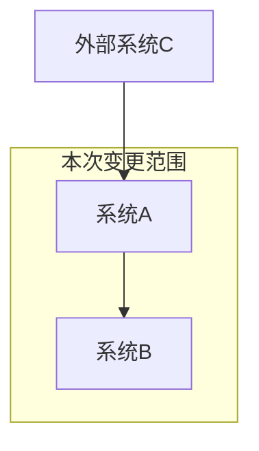
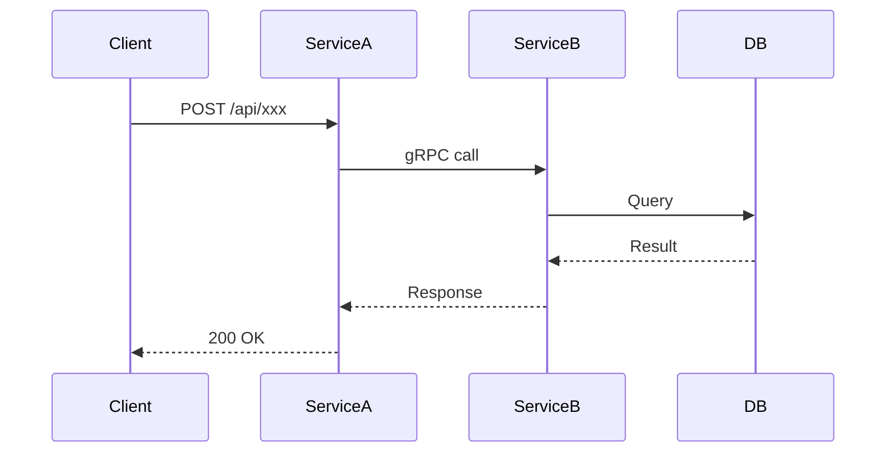
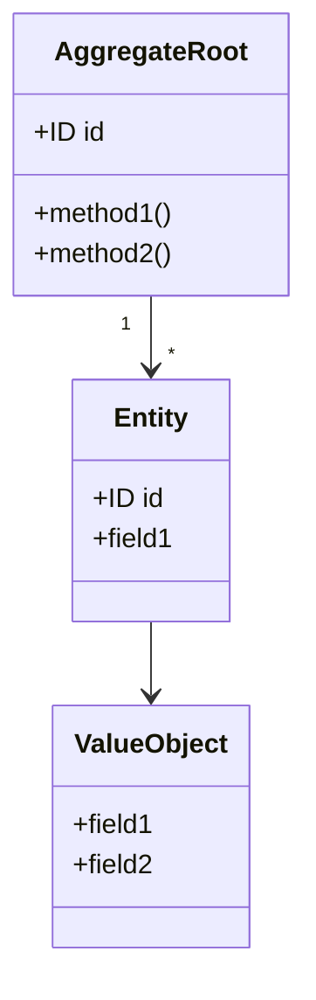
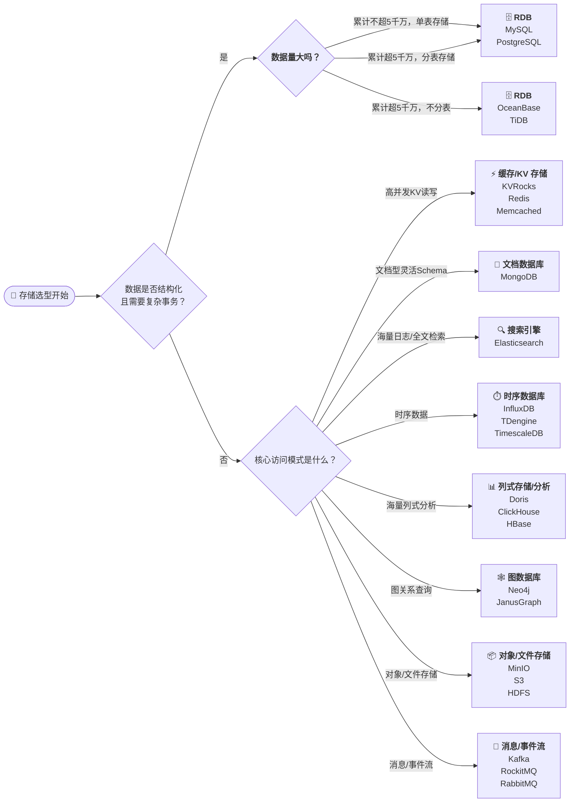
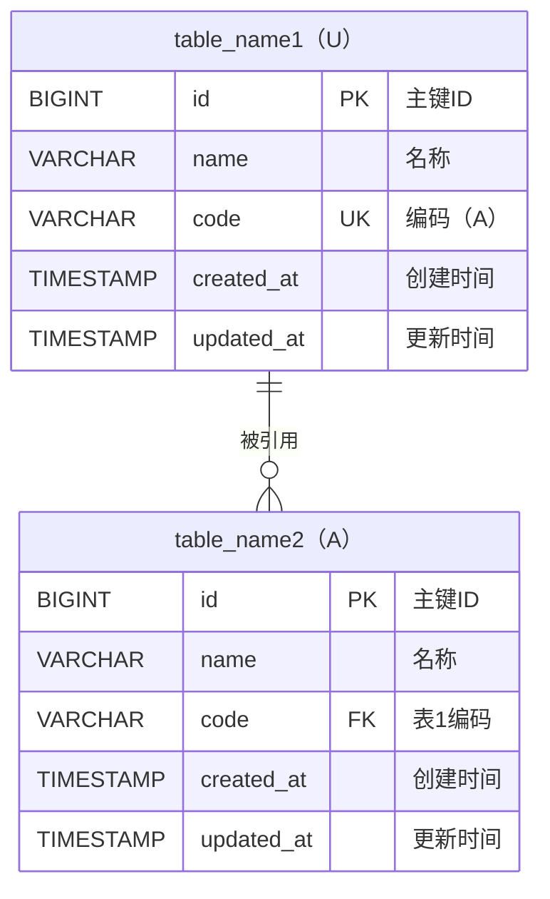
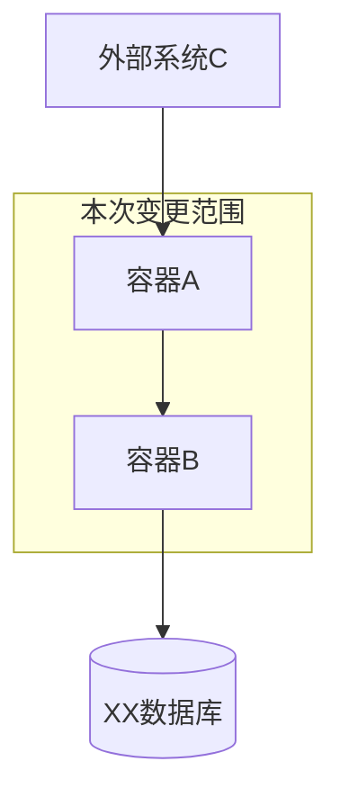
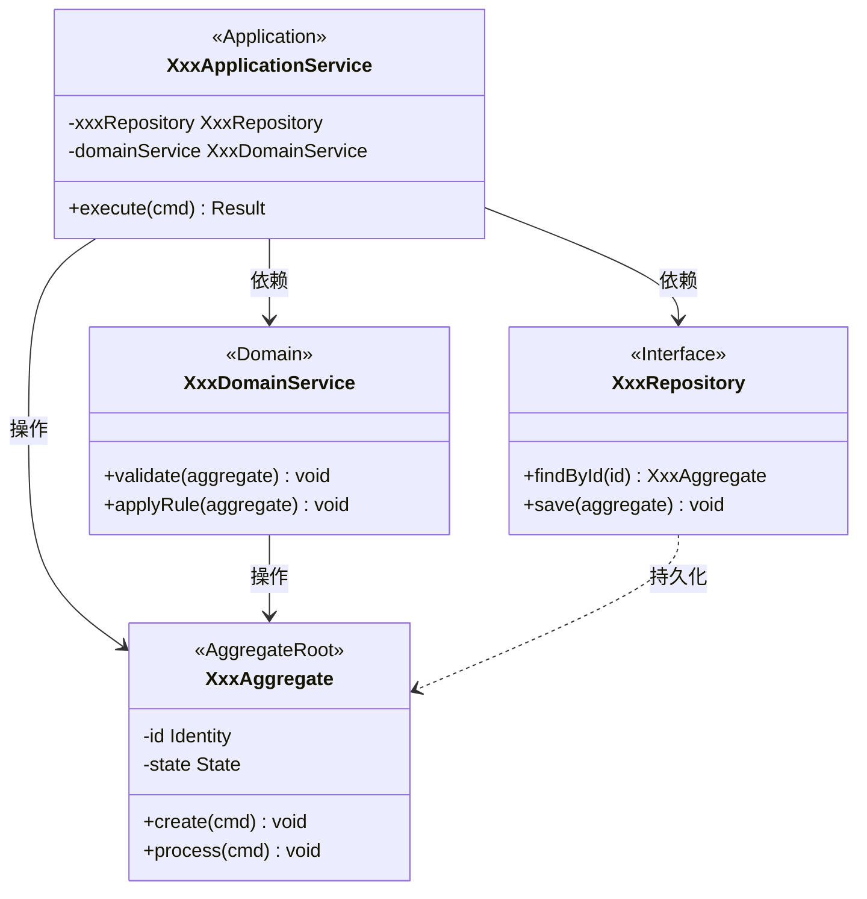
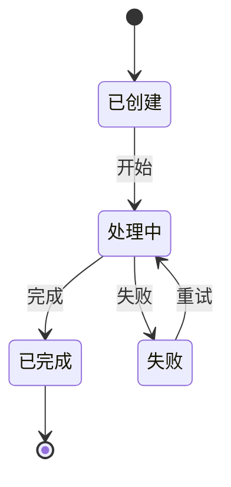
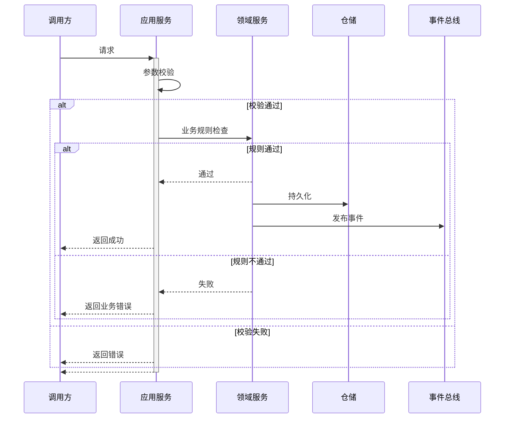

# {架构设计标题}

## 1. 设计概述

### 1.1 设计目标

- 关联需求分析：`system/analysis/ANALYSIS-{IDEA-ID}.md`
- 关联产品需求：`system/requirements/REQUIREMENT-{IDEA-ID}/MVP-Phase-{N}/PRD-{IDEA-ID}-{N}.md`
- MVP阶段：MVP-Phase-{N}

### 1.2 设计约束
<!-- 技术约束、架构约束、兼容性约束等 -->

### 1.3 关键设计决策

| 决策编号 | 决策点 | 决策结果 | 决策理由 | 备选方案 |
| --------- | ------- | --------- | --------- | --------- |
| DD-001 | | | | |

## 2. 架构设计

### 2.1 系统架构设计

#### 系统架构图



#### 服务变更

| 服务名称  | 所属应用   | 变更类型 | 变更说明    |
| ----------- | ------------ | ---------- | ------------- |
| service-a | xx-service | 变更     | 新增xxx功能 |
| service-b | yy-service | 新增     | 新服务      |

#### 服务交互



### 2.2 接口协议设计

| 接口名称 | 所属服务 | 能力说明 | 输入输出 |
| --------------- | -------- | -------- | ------ |
| XX接口 | serivice-a | 提供XX能力 | 输入：XX <br/> 输出：YY |

### 2.3 领域模型设计

#### 领域模型图



#### 领域事件

| 事件名称        | 触发条件 | 携带数据 | 消费者 |
| --------------- | -------- | -------- | ------ |
| XxxCreatedEvent |          |          |        |

### 2.4 数据架构设计

#### 数据存储选型



#### 数据库表设计



#### 数据分片设计

#### 数据迁移方案

### 2.5 发布方案设计

#### 发布步骤

<!-- 明确本次变更涉及的部署与环境变更，按顺序列出操作项（例如：容器/服务升级、数据库迁移、配置/环境变量调整、接口切换等） -->

#### 发布检查

- 变更窗口与影响面通知到位
- 相关服务和依赖是否已完成升级/发布准备
- 回滚/兜底策略是否有预案
- 数据迁移是否有验证脚本
- 三方验证、全链路验证是否已准备好

#### 回滚方案

- 回滚前需备份相关数据库与配置
- 回滚步骤：逐步逆向操作（如数据库还原、容器回滚等），确保服务健康
- 回滚注意事项：做好监控收敛，通知相关人员

## 3. 详细设计

### 3.1 应用架构设计

> 跟外部系统集成的关系，消息队列、异步处理机制，用到的容器



### 3.2 API详细设计

#### API-001：{API名称}

- 能力描述：提供XX能力

**API签名** ：

```text
`POST /api/v1/xxx`
```

**请求参数** :

```json
{
  "field1": "string, required, 描述",
  "field2": "integer, optional, 描述"
}
```

**响应结构**：

```json
{
  "code": 0,
  "message": "success",
  "module": {
    "id": "string",
    "field1": "string"
  }
}
```

**错误码**：

| 错误码 | 错误信息 | 触发条件 | HTTP状态码 |
| ------ | -------- | -------- | ---------- |
| 400001  |          |          | 400        |

**幂等性**：
<!-- 描述幂等性保障方案 -->

### 3.3 业务逻辑设计

#### 核心类图



> 按实际 MVP 补充：应用服务、领域服务、聚合根/实体及仓储接口，并标注依赖与职责。

#### 状态机设计



#### 逻辑-001: {逻辑名称}

**流程图**：



**伪代码**：

```python
function processXxx(request):
    // 1. 参数校验
    validate(request)
    
    // 2. 业务规则检查
    checkBusinessRules(request)
    
    // 3. 执行业务逻辑
    result = executeLogic(request)
    
    // 4. 持久化
    save(result)
    
    // 5. 发布领域事件
    publishEvent(XxxCreatedEvent(result))
    
    return result
```

#### 一致性设计
<!-- 乐观锁/悲观锁/分布式锁方案 -->
<!-- 本地事务/分布式事务/最终一致性方案 -->

### 3.4 数据访问设计

#### 库表DDL

```sql
-- 创建主表
CREATE TABLE table_name1 (
    id BIGINT PRIMARY KEY COMMENT '主键ID',
    name VARCHAR(64) NOT NULL COMMENT '名称',
    code VARCHAR(32) UNIQUE NOT NULL COMMENT '编码（A）',
    created_at TIMESTAMP DEFAULT CURRENT_TIMESTAMP COMMENT '创建时间',
    updated_at TIMESTAMP DEFAULT CURRENT_TIMESTAMP ON UPDATE CURRENT_TIMESTAMP COMMENT '更新时间'
);

-- 创建附属表
CREATE TABLE table_name2 (
    id BIGINT PRIMARY KEY COMMENT '主键ID',
    name VARCHAR(64) NOT NULL COMMENT '名称',
    code VARCHAR(32) NOT NULL COMMENT '表1编码',
    created_at TIMESTAMP DEFAULT CURRENT_TIMESTAMP COMMENT '创建时间',
    updated_at TIMESTAMP DEFAULT CURRENT_TIMESTAMP ON UPDATE CURRENT_TIMESTAMP COMMENT '更新时间',
    CONSTRAINT fk_code FOREIGN KEY (code) REFERENCES table_name1(code)
);
```

#### 查询策略

**索引策略**

```sql
-- 索引
CREATE INDEX idx_table_name1_name ON table_name1(name);
CREATE INDEX idx_table_name2_name ON table_name2(name);
```

- 常用查询字段建议添加二级索引，如 `name`、`code`。
- 联合索引可依据实际查询场景补充设计，避免冗余。

**分页策略**

- 推荐使用主键/唯一索引进行物理分页（如 `where id > ? order by id limit ?`）。
- 大数据量场景下避免 offset 过大的 SQL。

#### 缓存策略

| 缓存Key模式               | 数据类型    | 过期时间 | 更新策略 | 用途               |
|--------------------------|------------|----------|----------|--------------------|
| table_name1:{id}         | hash/object| 1h       | 写后更新 | 单条主数据缓存     |
| table_name2:{id}         | hash/object| 1h       | 写后更新 | 单条附属数据缓存   |
| table_name1:list:page:{n}| list       | 10min    | 定期刷新 | 列表分页缓存       |

- 删除/更新数据时需同步刷新缓存
- 缓存雪崩可加随机抖动过期

### 3.5 非功能性设计

#### 安全设计
<!-- 认证授权、数据脱敏、审计日志等 -->

#### 可观测设计
<!-- 考虑该记录什么日志，增加什么监控，什么情况下报警 -->

**日志** ：

**监控报警策略** ：

<!-- 告警规则、通知渠道、收敛策略等 -->

## 4. 需求规约

<!-- 规约术语：与规约文件名或 OpenAPI/领域名一致的可读简称；应用实体 ID、服务实体 ID 须与 `system/knowledge/KNOWLEDGE_INDEX.md` / `knowledge/technical/` 中 APP-*、MS-* 对齐。 -->

| 应用 | 规约文件 | 规约描述 |
| ---- | -------- | -------- |
| `{APP-ID}` | `./specs/spec-{ID}-{N}-{service-name}.md` | 核心改动点：... |

## 5. 附录

### 5.1 变更历史

| 版本  | 日期 | 变更说明 | 作者      |
| ----- | ---- | -------- | --------- |
| 1.0.0 |      | 初始版本 | architect |

### 5.2 质量自查表 (Self-Check)

<!-- 提交评审前逐项判定：已满足通过标准的条目由 Agent 将 `- [ ]` 改为 `- [x]` 写入终稿；未满足项保持 `- [ ]`。「通过标准」为最低放行条件；执行摘要另见技能 `reference/quality-checklist.md`。 -->

- [ ] **结构与占位**  
  *通过标准*：`## 1`–`## 5` 主章节齐全；模板内 `###` / `####` 若暂无内容，已写「不适用」「待补充」或已填占位；架构图、时序图、类图、ER 图等 **Mermaid** 可渲染；无整章空白未标注。
- [ ] **§1 设计概述**  
  *通过标准*：§1.1 已引用 **ANALYSIS**、**PRD** 路径或 ID，且 **MVP-Phase-{N}** 与 `--mvp` 一致；§1.2 设计约束（技术/兼容/合规等）已落位或标「不适用」；§1.3 每个 **DD-n** 含决策点、结果、理由、备选方案，且可指回 PRD/业务目标。
- [ ] **§2.1–§2.2 系统架构与接口协议**  
  *通过标准*：§2.1 含系统架构图、服务变更表、服务交互时序图（涉及跨服务调用时）；§2.2 每个对外接口有名称、所属服务、能力说明、输入输出概要，与 §3.2 **API-n** 可对应。
- [ ] **§2.3–§2.4 领域与数据架构**  
  *通过标准*：§2.3 领域模型图完整，聚合/实体/值对象关系清晰，**领域事件**表已列出；§2.4 含数据存储选型说明、ER/表设计或逻辑数据模型，分片与迁移（若适用）已描述或标「不适用」。
- [ ] **§2.5 发布与回滚**  
  *通过标准*：发布步骤、检查项、回滚方案齐全，与 §3.5 可观测/告警策略可互证；无「不可回滚」而未说明例外。
- [ ] **§3.1–§3.2 应用架构与 API 详设**  
  *通过标准*：§3.1 容器/部署级架构与外部集成清晰；§3.2 每个 **API-n** 含签名、参数、响应、错误码、幂等性与容错要点，与 §2.2 及 `specs/**/api/` 一致。
- [ ] **§3.3–§3.4 业务逻辑与数据访问**  
  *通过标准*：§3.3 核心类图、状态机、流程或伪代码、一致性（事务/最终一致）已覆盖；§3.4 **DDL** 完整，索引/分页/缓存策略明确，表约束与项目规范（如 `gmt_create`/`gmt_modified`）一致或已说明例外。
- [ ] **§3.5 非功能（安全与可观测）**  
  *通过标准*：认证授权、敏感数据、审计要求已落位；日志、监控、告警策略可执行，与 PRD/ANALYSIS **NFR** 无未说明冲突或已标「待澄清」。
- [ ] **§4 需求规约**  
  *通过标准*：§4 表格列出全部 `specs/` 路径与 **source**（ADD 章节）/ **requirement**（**FR-n**）可核对；磁盘上规约文件与表内路径一致，无遗漏服务或类型目录。
- [ ] **一致性**  
  *通过标准*：与 `parent` 对应 **PRD**、关联 **ANALYSIS** 在范围与优先级上无未说明冲突；与 `knowledge/technical/`、`knowledge/business/` 无矛盾或已写盲区/例外；**DD-n / API-n / LOGIC-n / TBL-n** 编号连续可辨；规约与 ADD 设计条目**双向**对应。
- [ ] **可追溯**  
  *通过标准*：每个 **DD-n** 可指回 PRD **US-n** 或 **FR-n**；每个 **API-n** / **TBL-n** 可指回功能需求或业务流程；每个规约文件可指回 ADD 章节与 PRD 需求；非功能设计可指回 ANALYSIS/PRD **NFR**。
- [ ] **可行性与风险**  
  *通过标准*：性能与容量假设与 **NFR** 对齐或已标待验证；**禁止**循环中 RPC/DB 调用（或已说明重构计划）；关键技术/外部依赖风险有应对或已登记为待办。
- [ ] **术语与引用**  
  *通过标准*：§4 规约表术语与文件名/OpenAPI 一致；§5.1 变更历史已落位；文内缩略词与 `knowledge/` 索引（APP-*、MS-*）对齐或已注释。
- [ ] **格式与元数据**  
  *通过标准*：文末「## 文档元数据」内 fenced `yaml` 含 `id`、`title`、`version`、`status`、`created`、`updated`、`author`、`reviewers`、`parent`、`mvp_phase`、`tags`；**文件第一行不是** `---`；`id` 与 `ADD-{IDEA-ID}-{N}.md` 及目录 **REQUIREMENT-{IDEA-ID}** 一致。

## 文档元数据

<!-- 唯一元数据位置：须为 fenced yaml，且位于全文末尾；禁止在文件开头使用 --- YAML frontmatter -->

```yaml
id: "ADD-{IDEA-ID}"
title: "{技术设计标题}"
version: "1.0.0"
status: "draft"
created: "{YYYY-MM-DD}"
updated: "{YYYY-MM-DD}"
author: "architect"
reviewers: []
parent: "PRD-{IDEA-ID}"
mvp_phase: "MVP-Phase-{N}"
tags: []
```
