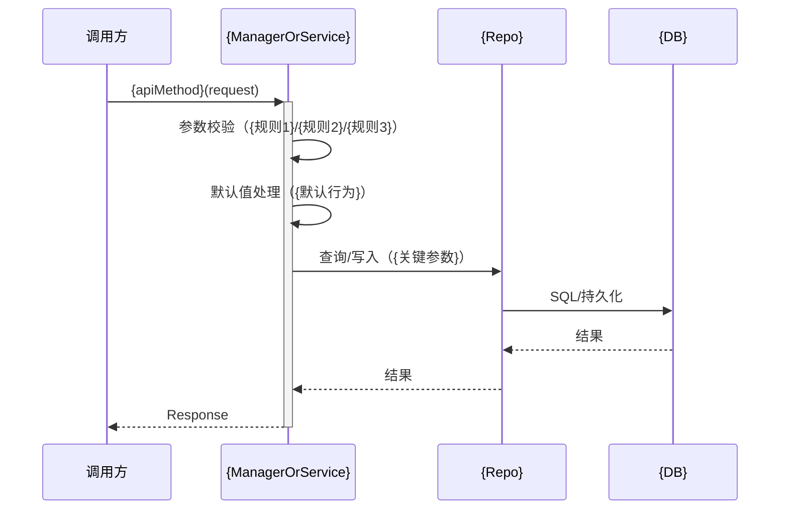

# {MVP-N} 规约摘录（Spec 汇总）

> 来源：`{ADD-FILE}.md` 与 `specs/{service-name}/**`  
> 目标：从规约视角描述 **哪个服务的哪个 API 要做什么改动**，以及对应的领域/数据变更点，供研发实现对照。

---

## 1. 范围与定位

- **需求范围**：{MVP 范围，如 FR-001 ~ FR-00X}
- **变更服务**
  - **`{service-name}` / `{MS-ID service}`**：{本次服务改动概述}

---

## 2. API 规约（{service-name} / {MS-ID}）

### 2.1 {API-ID}：{api-name}（{增强/新增/变更}）

- **所属服务**：`{MS-ID service}`（`{service-name}`）
- **变更类型**：{新增/变更}
- **请求协议**
  - **Method**：{GET/POST/PUT/DELETE}
  - **Path**：`{api-path}`
  - **鉴权**：{鉴权要求，如 needSession=true}

#### 2.1.1 请求 DTO：`{RequestClass}`（变更点）

- **基础筛选与分页**
  - **字段**：`{fieldA}`、`{fieldB}` ...
  - **默认值**：{默认值说明}
  - **校验**：{字段校验规则，如最大数量、必填组合、白名单}

- **新增筛选字段**
  - `{newField1}: {type}`（可选/必填）
    - 取值：{枚举或取值范围}
    - 变更：**新增**
  - `{newField2}: {type}`（可选/必填）
    - 取值：{枚举或取值范围}
    - 变更：**新增**

- **枚举扩展字段（如有）**
  - 字段：`{enumField}`
  - 扩展前：{旧值域}
  - 扩展后：{新值域}

#### 2.1.2 响应 DTO：`{ResponseDto}`（变更点）

在既有字段基础上新增/增强：

- **新增字段**
  - `{respField1}: {type}`（{含义}）
  - `{respField2}: {type}`（{含义}）

- **文案/口径统一（如有）**
  - `{descField}`：{统一文案规则}
  - `{areaOrScopeField}`：{口径规则}

#### 2.1.3 错误码（含新增）

- `{errorCode1}`：{错误信息}（触发条件：`{condition}`）
- `{errorCode2}`：{错误信息}（触发条件：`{condition}`）
- `{errorCodeNew}`：{错误信息}（触发条件：`{condition}`）**★新增**

#### 2.1.4 幂等性与默认行为

- **幂等性**：{查询天然幂等/写操作幂等策略}
- **默认行为**：{默认时间范围/默认分页/默认筛选}

#### 2.1.5 {LOGIC-ID}：{核心逻辑名称}（流程图）



---

### 2.2 {EXPORT-API-ID}：{export-api-name}（增强摘要，可选）

> 复用 `{export-framework}`（如适用）。

- **变更点**
  - 新增导出列：{column1}、{column2}
  - 新增筛选参数：`{param1}`、`{param2}`
  - 权限/范围控制：{服务端限制策略}
- **幂等性**：{幂等说明}

---

## 3. 领域规约（{AggregateName} / {AGG-ID}）

### 3.1 聚合与实体变更

- **聚合**：`{AGG-ID} {AggregateName}`（上下文：`{BC-ID} {BoundedContext}`）
- **聚合根实体**：`{ENT-ID} {EntityName}`
- **新增/变更领域字段（落库字段）**
  - `{fieldA}` → `{columnA}`：{语义，是否允许 NULL，默认值}
  - `{fieldB}` → `{columnB}`：{语义，是否允许 NULL，默认值}

### 3.2 枚举扩展/新增

- **`{EnumName1}`（扩展）**
  - 既有：{旧值}
  - 新增：{新值}
  - 文案规则：{统一口径}

- **`{EnumName2}`（新增）**
  - 值域：{值与文案}
  - 推断规则：{推断逻辑}

### 3.3 约束（Invariants）

- `{invariant-1}`
- `{invariant-2}`
- `{invariant-3}`

---

## 4. 数据规约（{table-name} / {ENT-ID}）

### 4.1 表与字段变更

- **表**：`{table-name}`
- **数据源**：`{DS-ID datasource-name}`
- **新增字段**
  - `{column1} {type} {nullable/default}`
  - `{column2} {type} {nullable/default}`

### 4.2 DDL（摘录）

```sql
-- 示例：按实际需求替换
ALTER TABLE {table-name}
  ADD COLUMN {column1} {type} {default-and-comment},
  ADD COLUMN {column2} {type} {default-and-comment};
```

### 4.3 索引（摘录）

```sql
-- 示例：按查询路径设计
CREATE INDEX {idx_name_1} ON {table-name}({colA});
CREATE INDEX {idx_name_2} ON {table-name}({colB}, {colC});
```

### 4.4 迁移与历史数据策略

- **迁移顺序**：{DDL} → {索引} → {服务部署} → {校验}
- **历史数据策略**：{NULL/默认值兼容、是否补数}
- **注意项**：{已有索引/兼容性/数据量风险}

---

## 5. 同步侧/任务侧规则（可选）

> 若字段由同步任务写入，请描述来源与计算逻辑。

- **字段推断规则**
  - `{sourceField}` 条件 {condition} → `{targetField}={value}`
  - 其他情况 → `{targetField}={value}`
- **预计算规则**
  - 阈值：{config-key}，默认 {default-value}
  - 计算：{expression}

---

## 6. 变更点对照（研发实现检查清单）

- **`{service-name}`**
  - `{API-ID}`：{请求/响应/校验核心改动点}
  - 默认行为：{默认时间范围/分页/策略}
  - 兼容性：{历史数据/空值处理}

- **`{other-service}`**
  - {任务或流程改动点}

- **DB（{db-name}）**
  - 执行 `ALTER TABLE` {字段改动}
  - 执行索引 DDL：{索引列表}
