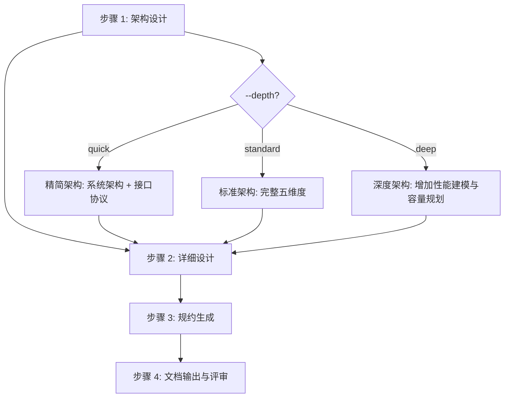

# 四步工作流详细规范

sdx-design 技能的核心工作流算法。[SKILL.md](../SKILL.md) 中的工作流为摘要，本文件为完整规范。

---

## 流程总览



---

## 步骤 1：架构设计

### 角色

architect + system-architect

### 输入

产品需求文档（`application/requirements/REQUIREMENT-{YYMMDD}-{主题slug}/MVP-Phase-{N}/PRD-{YYMMDD}-{主题slug}.md`）+ 需求分析文档（`application/analysis/ANALYSIS-{YYMMDD}-{主题slug}.md`）当前 MVP 章节 + `knowledge/technical/`（按需）+ `knowledge/business/`（按需）

### 算法

1. **通读 PRD**：提取业务流程、用户故事（US-n）、用例、功能模块、业务规则
2. **五维度架构设计**：

| 维度 | 设计内容 | 参考来源 | 输出位置 |
|------|---------|---------|---------|
| 系统架构 | 服务变更（新增/变更）、服务间调用关系、变更范围 Mermaid 图 | `knowledge/technical/`、INDEX_GUIDE.md §3 | §2.1 |
| 接口协议 | 接口名称、所属服务、能力说明、输入输出概要 | PRD 业务流程与用例 | §2.2 |
| 领域模型 | 聚合根/实体/值对象、领域事件（名称、触发条件、携带数据、消费者） | `knowledge/business/`、INDEX_GUIDE.md §4–5 | §2.3 |
| 数据架构 | ER 图、表设计概要（新增/变更）、分片设计、数据迁移方案 | `knowledge/data/`、INDEX_GUIDE.md §6 | §2.4 |
| 发布方案 | 发布步骤、发布检查、回滚方案 | 现有部署文档 | §2.5 |

3. **关键设计决策**：
   - 编号 DD-{NNN}
   - 记录决策点、决策结果、决策理由、备选方案
   - 关联到 PRD 需求（US-n / FR-n）

4. **设计约束提取**：
   - 技术约束（框架、中间件版本）
   - 架构约束（分层规范、DDD 六边形）
   - 兼容性约束（向前/向后兼容）
   - 项目约束（表名前缀、字段规范、锁键前缀等）

### depth 参数影响

| depth | 行为 |
|-------|------|
| quick | 仅设计系统架构 + 接口协议，跳过领域事件细节与发布方案 |
| standard | 完整五维度架构设计 |
| deep | 增加性能建模（QPS/TPS 估算）、容量规划、灾备方案 |

### 产出

架构设计内容（对应文档 §1–§2）。

---

## 步骤 2：详细设计

### 角色

backend-architect

### 输入

步骤 1 产出 + PRD 用户故事与业务规则 + 现有代码结构（按需）

### 算法

1. **应用架构设计**：
   - 绘制容器级架构图（集成与外部系统关系）
   - 标注 MQ、异步处理、定时任务等机制
   - 输出位置：§3.1

2. **API 详细设计**：

| 属性 | 说明 |
|------|------|
| 编号 | API-{NNN} |
| 能力描述 | 提供的业务能力 |
| API 签名 | HTTP 方法 + 路径 |
| 请求参数 | JSON 结构，含类型、必填、描述 |
| 响应结构 | JSON 结构，含 code/message/module |
| 错误码 | 错误码、错误信息、触发条件、HTTP 状态码 |
| 幂等性 | 保障方案（分布式锁键、业务唯一键等） |
| 容错策略 | 超时、重试、降级 |

   - 输出位置：§3.2

3. **业务逻辑设计**：
   - 核心类图（DDD 分层：Application → Domain → Repository）
   - 状态机设计（状态流转 Mermaid 图）
   - 业务逻辑流程图（时序图）+ 伪代码
   - 一致性设计（乐观锁/悲观锁/分布式锁、事务策略）
   - 编号 LOGIC-{NNN}
   - 输出位置：§3.3

4. **数据访问设计**：
   - 库表 DDL（含 `gmt_create` / `gmt_modified`）
   - 索引策略（基于查询场景分析）
   - 分页策略（主键分页 vs offset）
   - 缓存策略（Key 模式、过期时间、更新策略）
   - 输出位置：§3.4

5. **非功能性设计**：
   - 安全设计（认证授权、数据脱敏、审计日志）
   - 可观测设计（日志策略、监控报警规则、链路追踪）
   - 输出位置：§3.5

### depth 参数影响

| depth | 行为 |
|-------|------|
| quick | API 仅签名与参数，跳过伪代码与缓存策略 |
| standard | 完整详细设计 |
| deep | 增加性能基准测试方案、压测策略、全链路追踪设计 |

### 产出

详细设计内容（对应文档 §3）。

---

## 步骤 3：规约生成

### 角色

technical-writer + doc-updater

### 输入

步骤 1–2 全部产出

### 算法

1. **规约目录规划**：

```
application/requirements/REQUIREMENT-{YYMMDD}-{主题slug}/MVP-Phase-{N}/specs/
└── {service-name}/
    ├── api/
    │   └── {api-name}.yaml
    ├── domain/
    │   └── {aggregate-name}.yaml
    ├── data/
    │   └── {table-name}.yaml
    └── integration/
        └── {event-or-mq-name}.yaml
```

2. **API 规约**：从 §3.2 的 API 详设提取，包含路径、方法、参数、响应、错误码
3. **领域规约**：从 §2.3 的领域模型提取，包含聚合、实体、值对象、领域事件
4. **数据规约**：从 §3.4 的数据访问设计提取，包含 DDL、索引、分片规则
5. **集成规约**：从 §2.1 的服务交互提取，包含 MQ 消息格式、RPC 契约

6. **规约追溯标注**：每个规约文件须在头部标注：
   - 关联 ADD 章节（如 `source: ADD §3.2 API-001`）
   - 关联 PRD 需求（如 `requirement: FR-001`）

### 产出

规约文件（`specs/{service-name}/`）。

---

## 步骤 4：文档输出与评审

### 角色

technical-writer + doc-updater

### 输入

步骤 1–3 全部产出 + [../assets/add-template.md](../assets/add-template.md)

### 算法

1. **整合**：将步骤 1–2 产出按模板五章结构编排
2. **填充文末元数据**（模板「## 文档元数据」YAML，**禁止**文件头 frontmatter）：
   - `id`: `ADD-{YYMMDD}-{主题slug}`（与 PRD 同 `{YYMMDD}-{主题slug}`）
   - `status`: `draft`
   - `created` / `updated`: 当前日期
   - `parent`: 关联的 PRD 编号
   - `mvp_phase`: `MVP-Phase-{N}`
3. **补充需求规约与附录**：
   - 参考文档（§4.1）：列出规约文件路径
   - 变更历史（§5.1）
   - 质量自查表（§5.2）
4. **质量门禁**：对照 [quality-checklist.md](quality-checklist.md) 与模板 **§5.2** **逐项**判定（以模板 §5.2 每条下 *通过标准* 为最低放行条件）。**仅当**某条通过标准已满足，方在交付物 **§5.2** 中将该项由 `- [ ]` 改为 `- [x]`；未满足的保持 `- [ ]`，先修复或记录例外后再勾选。**禁止**未达标而全部勾选
5. **输出**：
   - ADD 写入 `application/requirements/REQUIREMENT-{YYMMDD}-{主题slug}/MVP-Phase-{N}/ADD-{YYMMDD}-{主题slug}.md`
   - specs 写入 `application/requirements/REQUIREMENT-{YYMMDD}-{主题slug}/MVP-Phase-{N}/specs/`

### 输出目录

```
application/requirements/REQUIREMENT-{YYMMDD}-{主题slug}/MVP-Phase-{N}/
├── ADD-{YYMMDD}-{主题slug}.md
└── specs/
    └── {service-name}/
        ├── api/
        ├── domain/
        ├── data/
        └── integration/
```

目录不存在时自动创建。

### 产出

完整 ADD 文档 + 规约文件 + 质量门禁自查结果。

---

## 步间数据流

```
步骤 1 产出
  ├─→ §1 设计概述（目标、约束、关键决策）
  ├─→ §2 架构设计（系统、接口、领域、数据、发布）
  └─→ [传递到步骤 2]

步骤 2 产出
  ├─→ §3 详细设计（应用架构、API、业务逻辑、数据访问、非功能）
  └─→ [传递到步骤 3]

步骤 3 产出
  ├─→ specs/ 规约文件
  ├─→ §4.1 参考文档（规约路径列表）
  └─→ [传递到步骤 4]

步骤 4 整合
  └─→ §1–§4 完整 ADD 文档 + specs/
```
