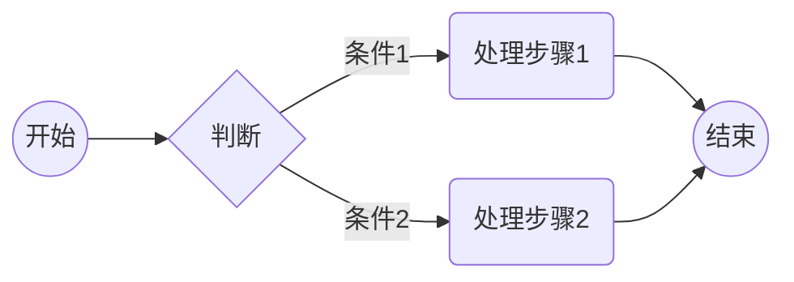
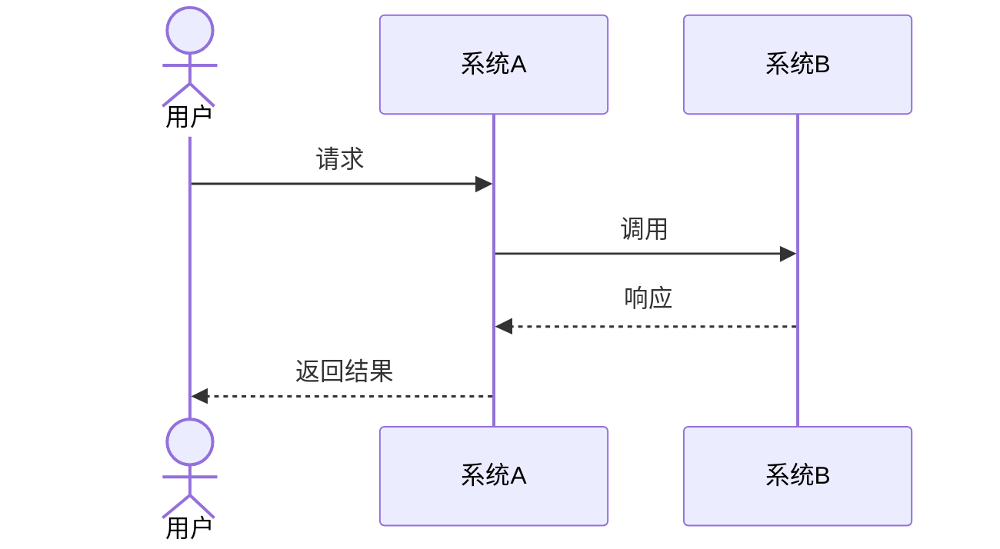
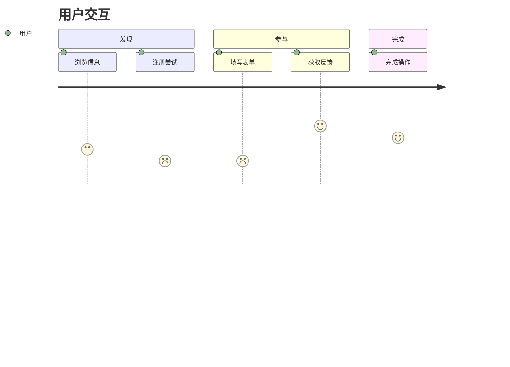
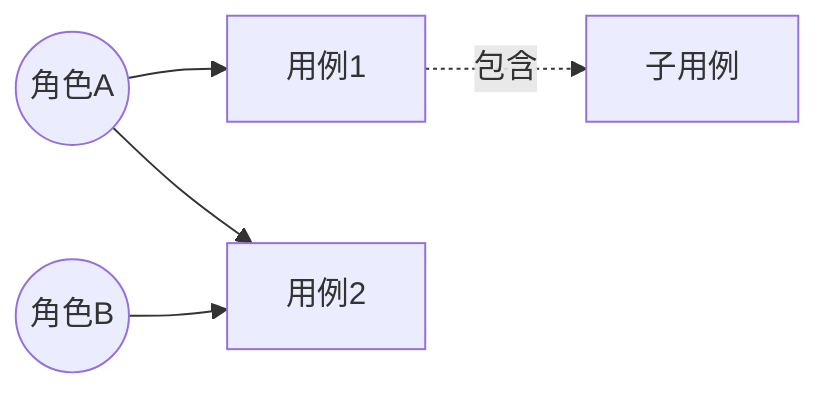
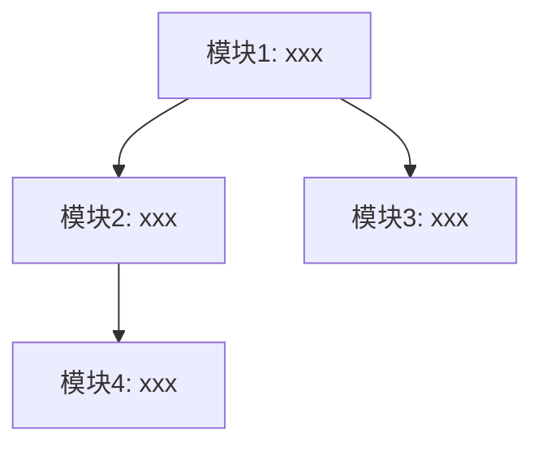

# 产品需求标题

## 1. 产品概述

### 1.1 产品目标

- 关联解决方案：`system/solutions/SOLUTION-{IDEA-ID}.md`
- 关联需求分析：`system/analysis/ANALYSIS-{IDEA-ID}.md`
- MVP阶段：MVP-Phase-{N}

### 1.2 成功标准


| 成功维度 | 指标/目标 | 数据来源（ANALYSIS §） | 备注  |
| ---- | ----- | ---------------- | --- |
|      |       |                  |     |


### 1.3 需求范围

#### 本 MVP 范围

#### 后续阶段（Growth / Vision）


| 阶段          | 范围概要 | 计划/依赖说明 |
| ----------- | ---- | ------- |
| Growth（增长期） |      |         |
| Vision（愿景）  |      |         |


### 1.4 涉及角色


| 角色  | 描述  | 相关用例 |
| --- | --- | ---- |
|     |     |      |


## 2. 业务流程

### 2.1 核心业务流程



#### 流程步骤说明

| 步骤  | 参与角色 | 输入  | 处理逻辑 | 输出  | 业务规则   |
| --- | ---- | --- | ---- | --- | ------ |
| 1   |      |     |      |     | BR-xxx |

### 2.2 分支异常流程

#### 异常场景清单

| 异常编号   | 异常描述 | 触发条件 | 处理方式 | 用户提示 |
| ------ | ---- | ---- | ---- | ---- |
| EX-001 |      |      |      |      |

### 2.3 系统交互流程



## 3. 产品交互

### 3.1 用户交互流程



### 3.2 产品交互设计

交互原型：[XX交互设计](http://www.google.com)

| 交互场景 | 交互方式/控件 | 反馈与提示 | 备注  |
| ---- | ------- | ----- | --- |
|      |         |       |     |

## 4. 用例模型

### 4.1 用例图



### 4.2 用例详述

#### UC-001: {用例名称}

| 项目       | 描述     |
| -------- | ------ |
| **用例编号** | UC-001 |
| **用例名称** |        |
| **参与者**  |        |
| **前置条件** |        |
| **后置条件** |        |
| **触发条件** |        |

**主成功场景**：

**扩展场景**：

- 2a. {异常条件}：

**业务规则**：

- BR-xxx: {规则描述}

## 5. 用户故事

### 5.1 用户故事清单

| 故事编号   | 用户故事                  | 优先级 | 故事点 | 关联需求   |
| ------ | --------------------- | --- | --- | ------ |
| US-001 | 作为{角色}，我希望{功能}，以便{价值} | P0  |     | FR-001 |

### 5.2 用户故事详述

#### US-001: {故事标题}

**用户故事**：

> 作为{角色}，我希望{功能}，以便{价值}

**验收标准**：

```gherkin
场景1: {场景名称}
  假设 {前置条件}
  当 {触发动作}
  那么 {预期结果}

场景2: {异常场景名称}
  假设 {前置条件}
  当 {触发动作}
  那么 {预期结果}
```

**补充说明**：

- 业务规则：BR-xxx
- 界面要求：（如有）
- 性能要求：（如有）

## 6. 功能模块设计

### 6.1 功能模块划分



### 6.2 模块详述

#### 模块1: {模块名称}

- **职责**：
- **包含功能**：US-001, US-002
- **输入**：
- **输出**：
- **依赖模块**：

## 7. 业务规则汇总

| 规则编号   | 规则名称 | 触发条件 | 执行逻辑 | 异常处理 | 优先级 | 关联用例   |
| ------ | ---- | ---- | ---- | ---- | --- | ------ |
| BR-001 |      |      |      |      |     | UC-001 |

## 8. 数据字典

### 8.1 业务术语

| 术语  | 定义  | 示例  | 备注  |
| --- | --- | --- | --- |
|     |     |     |     |

### 8.2 状态定义

| 实体  | 状态  | 说明  | 可流转状态 |
| --- | --- | --- | ----- |
|     |     |     |       |

## 9. 非功能需求

可参考类别（按需勾选，不适用项删行或标「不适用」）：性能、可靠性、可用性、安全、合规、可观测性、兼容性、可维护性、容量、易用性等。

| 类别  | 是否适用 | 指标/阈值 | 度量方法 | 关联 ANALYSIS |
| --- | ---- | ----- | ---- | ----------- |
|     |      |       |      |             |

## 10. 验收标准

### 10.1 功能验收标准（FAC）

| 编号     | 验收项 | 验收条件 | 关联故事   |
| ------ | --- | ---- | ------ |
| AC-001 |     |      | US-001 |

### 10.2 非功能验收标准（NAC）

| 编号      | 验收项 | 验收条件 | 关联 NFR（§9） |
| ------- | --- | ---- | ---------- |
| NAC-001 |     |      |            |

## 11. 附录

### 11.1 原型/线框图

### 11.2 变更历史

| 版本    | 日期  | 变更说明 | 作者               |
| ----- | --- | ---- | ---------------- |
| 1.0.0 |     | 初始版本 | product-designer |

### 11.3 质量自查表 (Self-Check)

<!-- 提交评审前逐项判定：已满足通过标准的条目由 Agent 将 `- [ ]` 改为 `- [x]` 写入终稿；未满足项保持 `- [ ]`。「通过标准」为最低放行条件；执行摘要另见技能 `reference/quality-checklist.md`。 -->

- [ ] **结构与占位**  
*通过标准*：`## 1`–`## 11` 主章节齐全；模板内 `###` / `####` 若暂无内容，已写「不适用」「待补充」或已填占位；主流程与用例图等 **Mermaid** 可渲染；无整章空白未标注。
- [ ] **§1 产品概述**  
*通过标准*：§1.1 已引用 **SOLUTION**、**ANALYSIS** 路径或 ID，且 **MVP-Phase-{N}** 与 `--mvp` 一致；§1.2 成功标准从 ANALYSIS 摘录或标「待澄清」；§1.3 含本 MVP 与 **Growth/Vision** 后续阶段表或已标「不适用」；§1.4 角色与 §4 用例参与者一致。
- [ ] **§2 业务流程**  
*通过标准*：§2.1 主流程步骤表六要素齐全；§2.2 **EX-n** 异常清单与处理方式明确；§2.3 跨系统时序在涉及集成时已给出或标「不适用」。
- [ ] **§3 产品交互**  
*通过标准*：交互旅程或说明覆盖核心任务；关键场景有反馈与校验要点，或与原型链接互证。
- [ ] **§4 用例模型**  
*通过标准*：用例图覆盖 §1.4 角色；每个 **UC-n** 含前后置、主成功场景、扩展场景；与 **US-n** 可双向映射。
- [ ] **§5 用户故事**  
*通过标准*：当前 MVP 内每个 **FR-n** 至少对应一个 **US-n**；每个 US-n 有 **Given-When-Then**，且含正常与异常/边界场景；优先级与 ANALYSIS 无未说明冲突。
- [ ] **§6 功能模块设计**  
*通过标准*：模块按业务能力域划分；模块与 **US-n** 对应关系清晰，无孤立模块或孤立故事。
- [ ] **§7 业务规则汇总**  
*通过标准*：**BR-n** 集中汇总且字段完整；与 §2 / §5 引用一致，无编号冲突或未解释的冲突处理。
- [ ] **§8 数据字典**  
*通过标准*：§8.1 覆盖文内专用术语；§8.2 状态与流转与业务流程一致或已标「待补充」。
- [ ] **§9 非功能需求与 §10 验收**  
*通过标准*：§9 **NFR** 仅写本 MVP 相关类别，可度量或与 ANALYSIS 对齐或标「待澄清」；§10.1 **AC-n** 可关联 **US-n**；§10.2 **NAC-n** 与 §9 可互链；关键验收句可测、无量词堆砌。
- [ ] **业务可读（语言）**  
*通过标准*：正文（§1–§10）以产品/业务表述为主，不以接口名、表名/字段名、中间件名为验收依据；若须保留工程线索，集中在 §11.1 备注或标「待研发确认」，勿散落于需求正文。
- [ ] **一致性**  
*通过标准*：与 `parent` 对应 **ANALYSIS** 及关联 **SOLUTION** 在范围、目标、MVP 上无未说明冲突；与已引用 `knowledge/` 无矛盾或已写盲区说明。
- [ ] **可追溯**  
*通过标准*：**US-n→FR-n**，**UC-n↔US-n**，**BR-n** 与 ANALYSIS 一致；**AC-n / NAC-n** 可指回 US 或 §9；**EX-n** 可指回流程步骤。
- [ ] **术语与引用**  
*通过标准*：§8.1、§11.2 变更历史已落位；对外链接（原型、规约）可访问或已说明待补。
- [ ] **格式与元数据**  
*通过标准*：US/UC/BR/EX/AC/NAC 编号在文内连续可辨；文末「## 文档元数据」内 fenced `yaml` 含 `id`、`title`、`version`、`status`、`created`、`updated`、`author`、`reviewers`、`parent`、`mvp_phase`；**文件第一行不是** `---`；`id` 与 `PRD-{IDEA-ID}.md` 及目录 **REQUIREMENT-{IDEA-ID}** 一致。

## 文档元数据

```yaml
id: "PRD-{IDEA-ID}"
title: "{产品需求标题}"
version: "1.0.0"
status: "draft"
created: "{YYYY-MM-DD}"
updated: "{YYYY-MM-DD}"
author: "product-designer"
reviewers: []
parent: "ANALYSIS-{IDEA-ID}"
mvp_phase: "MVP-Phase-{N}"
```
