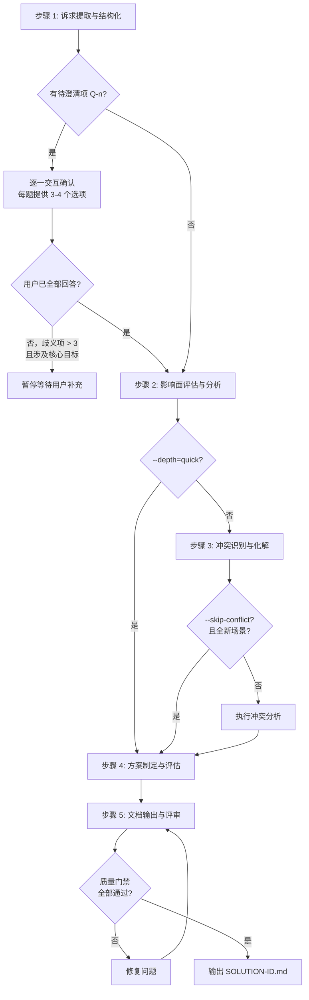

# 五步工作流详细规范

sdx-solution 技能的核心工作流算法。主文件 SKILL.md 中的工作流为摘要，本文件为完整规范。章节编号与 [../assets/solution-template.md](../assets/solution-template.md) **七章**一致。

---

## 流程总览



---

## 步骤 1：诉求提取与结构化

### 输入

业务需求描述（邮件、会议纪要、工单、口头记录等原始来源）

### 算法

1. **通读原始描述**：标记关键词、数字指标、角色提及、时间约束
2. **萃取结构化要素**（与模板 §1–§2 对应）：

| 要素 | 提取规则 | 输出位置 |
|------|---------|---------|
| 业务现状 | 当前业务如何运作（流程与角色行为），不写系统实现 | §1.1 业务现状 |
| 存在问题 | 痛点、效率瓶颈、协作障碍 | §1.2 存在问题 |
| 业务目标 | 可度量目标，建议编号 **G-n** | §1.3 业务目标 |
| 业务价值 | 预期收益，面向业务方 | §1.4 业务价值 |
| 核心场景 | 谁、在什么情况下、做什么、期望结果 | §2.1 核心场景 |
| 涉及角色 | 角色与关注点 | §2.2 涉及角色 |
| 范围边界 | In / Out / 成功标准 | §2.3 范围内、范围外、成功标准 |
| 关键约束 | 业务、资源、技术（以业务后果表述）、交付节点 | §2.4 各子约束 |

3. **歧义标注**：对每个不明确点编号 Q-n；交互确认后，**定稿写入 §5.2 待澄清问题表**（含责任人、期望澄清日期、状态等列）
4. **需求分类**：对每条需求标注类型标签

| 维度 | 分类 |
|------|------|
| 性质 | 功能需求 / 非功能需求 |
| 变更类型 | 新增 / 变更 / 修复 |
| 优先级 | P0（必须）/ P1（重要）/ P2（一般）/ P3（可选） |

5. **待澄清项交互确认**：见下方「待澄清项交互确认协议」

### 待澄清项交互确认协议

提取完 Q-n 列表后，**不得直接假设答案继续执行**，须按以下协议逐一与用户确认：

#### 触发条件

- 存在任意 Q-n 项时，均须执行本协议
- 歧义项 > 3 且涉及核心目标时，须在确认完所有问题后才能继续

#### 交互格式

每次只提一个问题，格式如下：

```
**Q-{N}（{影响范围}）**：{问题描述}

> {背景说明：为什么需要澄清这个问题，以及不同答案对方案的影响}

请选择（也可直接输入您的想法）：

A. {选项A描述}
B. {选项B描述}
C. {选项C描述}
D. {选项D描述，如有必要}
E. 其他（请说明）
```

#### 选项设计原则

- **选项数量**：每题提供 3–4 个选项（+ 「其他」兜底），不超过 5 个
- **选项互斥**：选项之间不重叠，覆盖主要可能性
- **选项具体**：每个选项描述具体的业务含义，不写「方案A/方案B」等无意义标签
- **有推荐项**：在选项后标注 `（推荐）` 表示 Agent 基于现有信息的倾向，但不强制
- **兜底选项**：最后一项始终为「其他（请说明）」，支持用户自由输入

#### 示例

```
**Q-1（影响 MVP 拆分）**：申诉单的审核流程是否需要支持多级审批？

> 当前描述中提到「审核通过后结算」，但未说明是单人审核还是多级审批。
> 若为多级审批，MVP-1 的工作量将显著增加，建议拆分为两个 MVP。

请选择（也可直接输入您的想法）：

A. 单人审核，一票通过即可（推荐，MVP 最简）
B. 两级审核，初审 + 终审
C. 多级审核，审批链可配置
D. 其他（请说明）
```

#### 处理用户回答

| 用户回答类型 | 处理方式 |
|------------|---------|
| 选择 A/B/C/D | 记录答案，更新 Q-n 状态为「已确认」，继续下一题 |
| 选择「其他」并说明 | 将用户说明记录为答案，更新状态，继续下一题 |
| 回答不完整或有新歧义 | 追问一次，仍不清晰则标注「部分确认」并记录已知信息 |
| 明确表示「跳过」 | 标注为「用户跳过，保留待澄清」，继续下一题 |
| 一次性回答多题 | 逐一匹配并记录，对未覆盖的题目继续提问 |

#### 确认完成后

所有 Q-n 处理完毕（已确认 / 用户跳过）后：
1. 输出确认摘要：列出每个 Q-n 的最终状态与答案
2. 将已确认答案更新到 **§5.2** 对应行（状态改为「已确认」或等价表述）
3. 将「用户跳过」项保留为「待澄清」，在文档中标注影响
4. 进入步骤 2

### 决策点

- **所有 Q-n 已确认或跳过** → 进入步骤 2
- **歧义项 > 3 且涉及核心目标，且用户未回答** → 暂停，等待用户补充

### 产出

结构化需求提取报告（对应文档 **§1–§2**）+ Q-n 确认摘要（终稿落 **§5.2**）

---

## 步骤 2：影响面评估与分析

### 输入

步骤 1 产出 + `knowledge/`（按需加载相关视角）

### 算法

1. **识别直接影响**：从核心场景出发，匹配 knowledge 中的 MS-*、API-*、ENT-* 实体（内部分析用，写入文档时转为业务表述）
2. **追踪间接影响**：沿业务流程/协作链追踪，标注传播路径
3. **评估影响程度**：

| 程度 | 判定标准 |
|------|---------|
| 高 | 核心业务流程变更、主要用户角色受影响、数据口径变化 |
| 中 | 分支流程调整、次要角色受影响、配置变更 |
| 低 | 展示调整、辅助功能变更、日志增强 |

4. **分类影响类型**：新增 / 变更 / 依赖（落入 **§3.2** 表格「影响类型」列）
5. **覆盖四个维度**：功能影响、数据影响、接口影响（对外承诺变化）、下游影响（协作方/依赖方）
6. **叙述性总览**：写入 **§3.1 影响面**（谁、在什么环节、如何被影响）
7. **传播路径**：写入 **§3.3**（业务流程/协作链语言，不写系统调用链）

### depth 参数影响

| depth | 行为 |
|-------|------|
| quick | 仅识别直接影响，跳过间接传播追踪，合并入步骤 4；至少列出高影响项 |
| standard | 完整直接+间接影响分析 |
| deep | 增加数据影响分析（字段变化、历史数据处理、向后兼容） |

### 产出

影响面评估报告（对应文档 **§3.1–§3.3**）

---

## 步骤 3：冲突识别与化解

### 输入

步骤 1–2 产出 + 现有规约（`requirements/.../specs/`）+ 架构文档

### 算法

1. **业务冲突扫描**（规则 / 流程 / 数据语义等）
2. **协作与契约影响扫描**（内部分析可对照 API、模型、共享资源；写入 **§3.4** 时**以业务后果表述**，避免纯技术栈/版本话术）
3. **冲突编号**：统一使用 **C-n** 填入 **§3.4 业务冲突**表；若存在模型/接口/资源类影响，在「冲突描述」或「冲突类型」中写清业务后果（可与规则/流程/数据冲突并列说明）
4. **化解方案**：每个冲突给出至少一个化解方案，高严重度提供备选
5. **成本/风险评估**：区分一次性成本与持续成本，评估残余风险

### skip-conflict 参数

`--skip-conflict=true` 时跳过本步骤。**仅在以下条件同时满足时合法使用**：
- 全新业务场景，无已有系统交互
- 用户明确确认无需冲突分析

存在已有系统时，即使传入该参数也须发出警告并执行冲突分析。

### 产出

冲突分析报告（对应文档 **§3.4**）

---

## 步骤 4：方案制定与评估

### 输入

步骤 1–3 全部产出

### 算法

1. **目标可度量化**：为每个 G-n 补充可验证表述（可与 §1.3 呼应）
2. **阐述解决思路**：整体策略（**§4.1**）；可辅以图示说明
3. **方案对比**（若多方案）：使用模板 **§4.2** 对比表（含业务匹配度等列）
4. **关键决策记录**：**§4.3**（推荐方案、备选、理由）
5. **风险登记**：R-n 填入 **§5.1 风险评估**
6. **MVP 与里程碑**：**§6.1**、**§6.2**

### MVP 拆分原则

- 每个 MVP 具备独立的业务交付价值，可独立演示给业务方
- MVP 间依赖单向（MVP-N+1 可依赖 MVP-N，反向禁止）
- 核心/高价值功能优先
- 自问「这个 MVP 能解决什么业务问题」，答不上来则重拆

### 产出

解决方案核心内容（对应文档 **§4–§6**）

---

## 步骤 5：文档输出与评审

### 输入

步骤 1–4 全部产出 + [../assets/solution-template.md](../assets/solution-template.md)

### 算法

1. **整合**：将步骤 1–4 产出按模板**七章**及各级小节标题编排（含 **§7.3 内部参考**、**§7.4 质量自查表**等）
2. **填充文末文档元数据**（模板「## 文档元数据」内 fenced `yaml` 代码块；**禁止**在文件开头写 `---` YAML frontmatter；**唯一元数据位置**在全文末尾）：

| 字段 | 规则 |
|------|------|
| `id` | 格式 `SOLUTION-{IDEA-ID}`，与文件名一致 |
| `title` | 解决方案标题 |
| `version` | 初始为 `1.0.0` |
| `status` | 初始为 `draft` |
| `created` / `updated` | 当前日期（YYYY-MM-DD） |
| `author` | Agent 名称 |
| `parent` | 父文档编号，无则保留占位或空字符串（与模板注释一致） |
| `dependencies` | 依赖文档 id 列表，无则 `[]` |
| `tags` | 标签列表，无则 `[]` |

3. **语言审查**：通读全文，将技术术语转写为业务表述（参照 [audience-and-language.md](audience-and-language.md)）；确需保留的线索集中至 **§7.3** 并标注「待研发确认」
4. **补充附录**：术语表（§7.1）、参考文档（§7.2）；§7.3 按需填写
5. **质量门禁自查**：对照模板 **§7.4** 与 [quality-checklist.md](quality-checklist.md) **逐项**判定；**仅当**某条通过标准已满足，方在交付物中将该项由 `- [ ]` 改为 `- [x]`；未满足的保持 `- [ ]`，先修复或记录例外后再勾选。**禁止**未达标而全部勾选。
6. **输出**：将含已勾选 **§7.4** 的终稿写入 `application/solutions/SOLUTION-{IDEA-ID}.md`

### 输出目录

```
application/solutions/
└── SOLUTION-{IDEA-ID}.md
```

目录不存在时自动创建。

### 产出

完整解决方案文档 + 质量门禁自查结果

---

## 步间数据流

```
步骤 1 产出
  ├─→ §1 背景与目标（1.1–1.4，含 G-n）
  ├─→ §2 范围与约束
  └─→ Q-n 交互摘要 → 定稿 §5.2

步骤 2 产出
  ├─→ §3.1–§3.3 影响与传播
  └─→ [传递到步骤 3]

步骤 3 产出
  ├─→ §3.4 业务冲突（C-n）
  └─→ [传递到步骤 4]

步骤 4 产出
  ├─→ §4 思路与方案
  ├─→ §5.1 风险（R-n）
  └─→ §6 交付计划（MVP、里程碑）

步骤 5 整合
  └─→ §1–§7 完整文档 + 文档元数据（语言审查与质量门禁）
```
