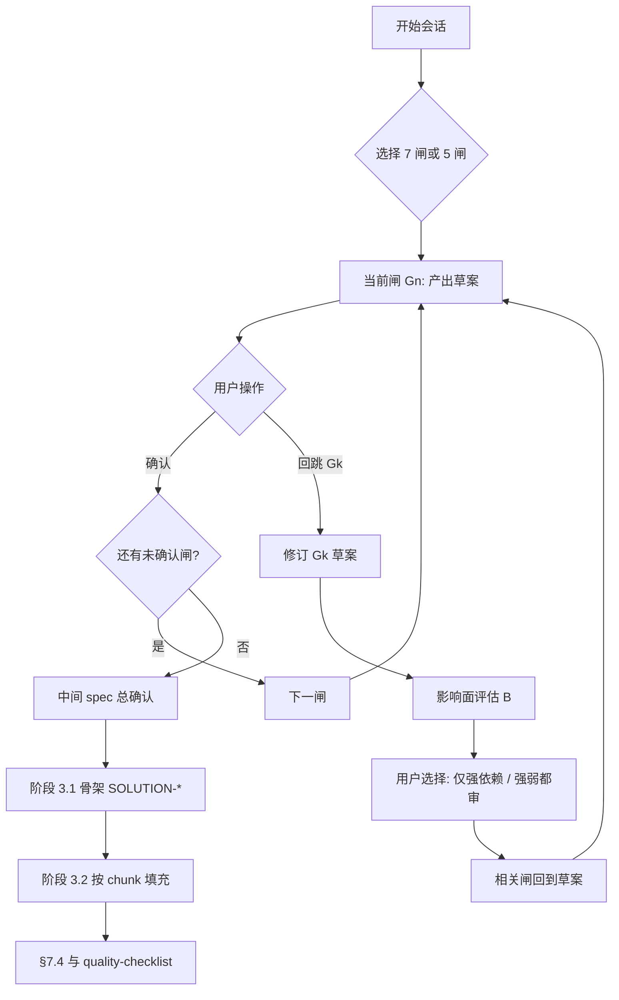
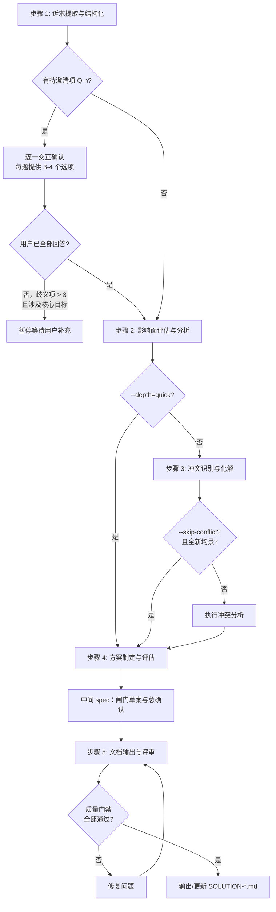

# sdx-solution 工作流详细规范

本文件包含两部分：**（一）闸门工作流** — 主执行路径（中间 spec、`SOLUTION-*` 骨架与 chunk、回跳影响面）；**（二）闸内执行清单（原五步算法）** — 填入各闸门草案时的操作细则。主文件 [../SKILL.md](../SKILL.md) 为摘要。章节编号与 [../assets/solution-template.md](../assets/solution-template.md) **七章**一致。

---

## （一）闸门工作流

### 术语

- **闸门 G{n}**：会话与中间 spec 中的流程步骤编号（含精简模式下的 **G(1–2)**、**G(5–6)**）。
- **业务目标 G-n**：模板 §1.3 业务目标条目编号；与 **闸门 G{n}** 不同。

### 闸门与模板映射（默认 7 闸）

| 闸门 | 模板 |
|------|------|
| G1 | `## 1` 背景与目标 |
| G2 | `## 2` 范围与约束 |
| G3 | `## 3` 影响与冲突 |
| G4 | `## 4` 思路与方案 |
| G5 | `## 5` 风险与待定 |
| G6 | `## 6` 交付计划 |
| G7 | `## 7` 附录与文末 yaml |

### 精简 5 闸

| 闸门 | 模板 |
|------|------|
| G(1–2) | `## 1` + `## 2` |
| G3 | `## 3` |
| G4 | `## 4` |
| G(5–6) | `## 5` + `## 6` |
| G7 | `## 7` + 文档元数据 |

### 阶段 1（会话参数，每次仅一问）

与 [../SKILL.md](../SKILL.md)「阶段 1 问题序列」一致：**禁止**在单条助手消息中并列多道阶段 1 题目；须 **Q1-1 → Q1-4** 逐条发送、逐条等待答复。**IDEA-ID** 中 `{主题}` **以中文为主**，规则见 [core-concepts.md](core-concepts.md)。

每条阶段 1 提问**末尾**须附带四选一；**推荐**收束句见 [../SKILL.md](../SKILL.md)「全阶段交互选项」首段（亦可并列 **C / M / F / S**），定义见同节表格**阶段 1** 行（**S** = 余下 Q1 用默认参数并进入阶段 2）。

### 状态机（总览）


```mermaid
graph TD
  Start[开始会话] --> Pick{选择 7 闸或 5 闸}
  Pick --> Gn[当前闸 Gn: 产出草案]
  Gn --> EndGate{用户操作}
  EndGate -->|确认| Next{还有未确认闸?}
  Next -->|是| Gn2[下一闸]
  Gn2 --> Gn
  Next -->|否| SpecDone[中间 spec 总确认]
  EndGate -->|回跳 Gk| Edit[修订 Gk 草案]
  Edit --> Impact[影响面评估 B]
  Impact --> Sel[用户选择: 仅强依赖 / 强弱都审]
  Sel --> Reopen[相关闸回到草案]
  Reopen --> Gn
  SpecDone --> Sol[阶段 3.1 骨架 SOLUTION-*]
  Sol --> Chunk[阶段 3.2 按 chunk 填充]
  Chunk --> QC[§7.4 与 quality-checklist]
```

### 每闸交互（固定）

**闸门粒度**：**G1–G7 各对应一个闸门**（精简 5 闸时为 **G(1–2)、G3、G4、G(5–6)、G7** 各一个闸门）。**禁止**在单条消息里并行推进多个闸门。

**闸内：内容与待确认点均为「每次一问」**

- **草案**：按小节或论据拆成多轮，**每轮一条助手消息**（一块内容或一个问题），不得把多段独立草案堆在同一条消息里。
- **待确认点**：本闸归纳出的每一条，**独占一条助手消息**逐题确认；**一条消息只含一个待确认点**。
- **每一道**指向用户的提问（草案轮次或待确认点）**末尾**须附 **C / M / F / S**（见 [../SKILL.md](../SKILL.md)「全阶段交互选项」）。**S** = 跳过本闸确认（等同原「跳过本闸门」）；**F** = 跳过后续全部闸门 → 草稿/终稿。

本闸结论全部落定后，**单独一条消息**做闸口收口：写入 spec、标记本闸 **已确认**，再进入下一闸。

**可选：草案已定稿后的「Q-n 优先 + 分闸 C/M/F/S」**

与上款「逐闸草案 → 闸内待确认 → 闸口收口」并列，适用于中间 spec 已落盘且含多条 **Q-n**、需**先消歧再锁闸**的情形：

| 阶段 | 做法 |
|------|------|
| **A. Q-n 全量先行** | 枚举 spec 中全部 **Q-n**（跨闸），**一条消息一题**，按「待澄清项交互确认协议」交互；结束后输出 **Q-n 确认摘要** 并回写 §5.2 等对应处。未完成前**不进入**阶段 B。 |
| **B. 分闸摘要** | 按 **G1→G7**（或精简映射），**每闸一条消息**：该闸结论摘要 + 末尾 **C / M / F / S**（与 [../SKILL.md](../SKILL.md) 一致）。**M** 澄清后仅重跑该闸摘要，除非新增 **Q-n** 须回到阶段 A。 |

阶段 B 各闸均 **C** 或等价处理后，再进入「用户总确认」（是否以中间 spec 为唯一素材生成 `SOLUTION-*.md`）。

**修改 / 回跳**：澄清过程仍 **一次一问**；**回跳到 G{k}** 后从 G{k} 按上款重跑。

**各闸典型待确认点（参考；每项须拆成独立一问）**

| 闸门 | 典型待确认点（各成单独一条消息） |
|------|----------------------------------|
| G1 | 背景与问题陈述；§1.3 业务目标 G-n 可度量性；价值表述共识 … |
| G2 | 范围内/外；角色与场景；约束写实性 … |
| G3 | 影响面完整性；§3.4 冲突 C-n；化解与残余风险；`--skip-conflict` 理由 … |
| G4 | 方案方向与备选；关键取舍；与 G2 一致性 … |
| G5 | 风险 R-n 与应对；待定 Q-n 登记 … |
| G6 | MVP/里程碑可演示性；依赖 … |
| G7 | 附录与术语；文末 yaml 与文件名；§7.4 策略 … |

**用户总确认**（是否以中间 spec 为唯一素材生成 `SOLUTION-*.md`）：**单独一条消息**；末尾 **C / M / F / S**（见 [../SKILL.md](../SKILL.md)「全阶段交互选项」**Qclose-1** 行）。

确认后写入中间 spec 对应节，状态为 **已确认**。

### 回跳影响面（方案 B）

- **强依赖**：对任意 j > k，若已确认闸 j 与闸 k 新结论 **显式矛盾** 或 **同一实体**（流程/角色/范围/MVP/冲突结论）**不一致**，则闸 j **需再确认**。
- **弱依赖**：若闸 j **大量引用**闸 k 的术语、范围、成功标准、C-n、MVP 依赖，标为 **建议再确认**。
- 用户选择 **仅强依赖（默认）** 或 **强+弱一并重走**；未列入的闸保持已确认。

### 中间 spec 路径与总确认

- 默认：`docs/superpowers/specs/YYYY-MM-DD-<topic>-design.md`（`<topic>` 建议含 `sdx-solution` 与 `IDEA-ID`）。
- 须经 **用户总确认** 后方可进入 `SOLUTION-*` 生成。

### `SOLUTION-*` 生成：骨架与 chunk（阶段 3 子步骤）

**阶段 3.1 — 骨架**：新建 `{DOC_DIR}/solutions/SOLUTION-{IDEA-ID}.md`，七章结构对齐 [../assets/solution-template.md](../assets/solution-template.md)，§7.4 保持 `- [ ]`，文末 yaml 占位；标注 **草稿填充中**。

**阶段 3.2 — 分块填充（默认 5 chunk）**

| Chunk | 覆盖 |
|-------|------|
| 1 | `## 1`、`## 2` |
| 2 | `## 3` |
| 3 | `## 4` |
| 4 | `## 5`、`## 6` |
| 5 | `## 7`（含 §7.4 勾选规则执行） |

若选用 **精简 5 闸**，可使 chunk 与闸一一对应（5 次边界确认）。

**每 chunk 结束**：列出已写入要点；末尾 **C / M / F / S**（见 [../SKILL.md](../SKILL.md)「全阶段交互选项」阶段 3 行）；用户亦可明示 **暂停**。

### `--depth` / `--skip-conflict`（闸门视角）

- **`--depth=quick`**：G3 叙述可压缩；G3 **不可省略**；§3.4 无冲突须显写「不适用/待补充」理由。
- **`--skip-conflict=true`**：G3 §3.4 写明跳过原因；中间 spec 扉页记 `skip-conflict: true`（与 [../gotchas.md](../gotchas.md) 一致）。

### 旧「五步」与闸门对照（维护者用）

| 旧步骤 | 主要闸门 |
|--------|----------|
| 1 诉求提取与结构化 | G1、G2 或 G(1–2) |
| 2 影响面 | G3 |
| 3 冲突 | G3 §3.4 |
| 4 方案与风险/MVP 要点 | G4、G5、G6 或 G(5–6) |
| 5 文档输出与评审 | G7 + 终检 |

---

## （二）闸内执行清单：原五步算法（子步骤）

## 流程总览

> **与（一）对齐**：下述「步骤 5」中的 **SOLUTION 落稿**，**仅**在中间 spec 完成 **用户总确认**（见（一）状态机）之后执行；不得从本清单跳过 spec 闸门直接生成 `{DOC_DIR}/solutions/SOLUTION-*.md`。


```mermaid
graph TD
    S1[步骤 1: 诉求提取与结构化] --> Q{有待澄清项 Q-n?}
    Q -->|是| CQ[逐一交互确认\n每题提供 3-4 个选项]
    CQ --> QR{用户已全部回答?}
    QR -->|否，歧义项 > 3\n且涉及核心目标| PAUSE[暂停等待用户补充]
    QR -->|是| S2[步骤 2: 影响面评估与分析]
    Q -->|否| S2

    S2 --> D{--depth=quick?}
    D -->|是| S4[步骤 4: 方案制定与评估]
    D -->|否| S3[步骤 3: 冲突识别与化解]

    S3 --> SC{--skip-conflict?\n且全新场景?}
    SC -->|是| S4
    SC -->|否| S3_EXEC[执行冲突分析]
    S3_EXEC --> S4

    S4 --> SPEC[中间 spec：闸门草案与总确认]
    SPEC --> S5[步骤 5: 文档输出与评审]
    S5 --> QG{质量门禁\n全部通过?}
    QG -->|否| FIX[修复问题]
    FIX --> S5
    QG -->|是| OUT[输出/更新 SOLUTION-*.md]
```

---

## 步骤 1：诉求提取与结构化

### 输入

业务需求描述（邮件、会议纪要、工单、口头记录等原始来源）

### 算法

1. **通读原始描述**：标记关键词、数字指标、角色提及、时间约束
2. **萃取结构化要素**（与模板 §1–§2 对应）：

| 要素 | 提取规则 | 输出位置 |
|------|---------|---------|
| 业务现状 | 当前业务如何运作（流程与角色行为），不写系统实现 | §1.1 业务现状 |
| 存在问题 | 痛点、效率瓶颈、协作障碍 | §1.2 存在问题 |
| 业务目标 | 可度量目标，建议编号 **G-n** | §1.3 业务目标 |
| 业务价值 | 预期收益，面向业务方 | §1.4 业务价值 |
| 核心场景 | 谁、在什么情况下、做什么、期望结果 | §2.1 核心场景 |
| 涉及角色 | 角色与关注点 | §2.2 涉及角色 |
| 范围边界 | In / Out / 成功标准 | §2.3 范围内、范围外、成功标准 |
| 关键约束 | 业务、资源、技术（以业务后果表述）、交付节点 | §2.4 各子约束 |

3. **歧义标注**：对每个不明确点编号 Q-n；交互确认后，**定稿写入 §5.2 待澄清问题表**（含责任人、期望澄清日期、状态等列）
4. **需求分类**：对每条需求标注类型标签

| 维度 | 分类 |
|------|------|
| 性质 | 功能需求 / 非功能需求 |
| 变更类型 | 新增 / 变更 / 修复 |
| 优先级 | P0（必须）/ P1（重要）/ P2（一般）/ P3（可选） |

5. **待澄清项交互确认**：见下方「待澄清项交互确认协议」

### 待澄清项交互确认协议

提取完 Q-n 列表后，**不得直接假设答案继续执行**，须按以下协议逐一与用户确认：

#### 触发条件

- 存在任意 Q-n 项时，均须执行本协议
- 歧义项 > 3 且涉及核心目标时，须在确认完所有问题后才能继续

#### 交互格式

每次只提一个问题，格式如下：

```
**Q-{N}（{影响范围}）**：{问题描述}

> {背景说明：为什么需要澄清这个问题，以及不同答案对方案的影响}

请选择（也可直接输入您的想法）：

A. {选项A描述}
B. {选项B描述}
C. {选项C描述}
D. {选项D描述，如有必要}
E. 其他（请说明）
```

#### 选项设计原则

- **选项数量**：每题提供 3–4 个选项（+ 「其他」兜底），不超过 5 个
- **选项互斥**：选项之间不重叠，覆盖主要可能性
- **选项具体**：每个选项描述具体的业务含义，不写「方案A/方案B」等无意义标签
- **有推荐项**：在选项后标注 `（推荐）` 表示 Agent 基于现有信息的倾向，但不强制
- **兜底选项**：最后一项始终为「其他（请说明）」，支持用户自由输入

#### 示例

```
**Q-1（影响 MVP 拆分）**：申诉单的审核流程是否需要支持多级审批？

> 当前描述中提到「审核通过后结算」，但未说明是单人审核还是多级审批。
> 若为多级审批，MVP-1 的工作量将显著增加，建议拆分为两个 MVP。

请选择（也可直接输入您的想法）：

A. 单人审核，一票通过即可（推荐，MVP 最简）
B. 两级审核，初审 + 终审
C. 多级审核，审批链可配置
D. 其他（请说明）
```

#### 处理用户回答

| 用户回答类型 | 处理方式 |
|------------|---------|
| 选择 A/B/C/D | 记录答案，更新 Q-n 状态为「已确认」，继续下一题 |
| 选择「其他」并说明 | 将用户说明记录为答案，更新状态，继续下一题 |
| 回答不完整或有新歧义 | 追问一次，仍不清晰则标注「部分确认」并记录已知信息 |
| 明确表示「跳过」 | 标注为「用户跳过，保留待澄清」，继续下一题 |
| 一次性回答多题 | 逐一匹配并记录，对未覆盖的题目继续提问 |

#### 确认完成后

所有 Q-n 处理完毕（已确认 / 用户跳过）后：
1. 输出确认摘要：列出每个 Q-n 的最终状态与答案
2. 将已确认答案更新到 **§5.2** 对应行（状态改为「已确认」或等价表述）
3. 将「用户跳过」项保留为「待澄清」，在文档中标注影响
4. 进入步骤 2

### 决策点

- **所有 Q-n 已确认或跳过** → 进入步骤 2
- **歧义项 > 3 且涉及核心目标，且用户未回答** → 暂停，等待用户补充

### 产出

结构化需求提取报告（对应文档 **§1–§2**）+ Q-n 确认摘要（终稿落 **§5.2**）

---

## 步骤 2：影响面评估与分析

### 输入

步骤 1 产出 + `knowledge/`（按需加载相关视角）

### 算法

1. **识别直接影响**：从核心场景出发，匹配 knowledge 中的 MS-*、API-*、ENT-* 实体（内部分析用，写入文档时转为业务表述）
2. **追踪间接影响**：沿业务流程/协作链追踪，标注传播路径
3. **评估影响程度**：

| 程度 | 判定标准 |
|------|---------|
| 高 | 核心业务流程变更、主要用户角色受影响、数据口径变化 |
| 中 | 分支流程调整、次要角色受影响、配置变更 |
| 低 | 展示调整、辅助功能变更、日志增强 |

4. **分类影响类型**：新增 / 变更 / 依赖（落入 **§3.2** 表格「影响类型」列）
5. **覆盖四个维度**：功能影响、数据影响、接口影响（对外承诺变化）、下游影响（协作方/依赖方）
6. **叙述性总览**：写入 **§3.1 影响面**（谁、在什么环节、如何被影响）
7. **传播路径**：写入 **§3.3**（业务流程/协作链语言，不写系统调用链）

### depth 参数影响

| depth | 行为 |
|-------|------|
| quick | 仅识别直接影响，跳过间接传播追踪，合并入步骤 4；至少列出高影响项 |
| standard | 完整直接+间接影响分析 |
| deep | 增加数据影响分析（字段变化、历史数据处理、向后兼容） |

### 产出

影响面评估报告（对应文档 **§3.1–§3.3**）

---

## 步骤 3：冲突识别与化解

### 输入

步骤 1–2 产出 + 现有规约（`requirements/.../specs/`）+ 架构文档

### 算法

1. **业务冲突扫描**（规则 / 流程 / 数据语义等）
2. **协作与契约影响扫描**（内部分析可对照 API、模型、共享资源；写入 **§3.4** 时**以业务后果表述**，避免纯技术栈/版本话术）
3. **冲突编号**：统一使用 **C-n** 填入 **§3.4 业务冲突**表；若存在模型/接口/资源类影响，在「冲突描述」或「冲突类型」中写清业务后果（可与规则/流程/数据冲突并列说明）
4. **化解方案**：每个冲突给出至少一个化解方案，高严重度提供备选
5. **成本/风险评估**：区分一次性成本与持续成本，评估残余风险

### skip-conflict 参数

`--skip-conflict=true` 时跳过本步骤。**仅在以下条件同时满足时合法使用**：
- 全新业务场景，无已有系统交互
- 用户明确确认无需冲突分析

存在已有系统时，即使传入该参数也须发出警告并执行冲突分析。

### 产出

冲突分析报告（对应文档 **§3.4**）

---

## 步骤 4：方案制定与评估

### 输入

步骤 1–3 全部产出

### 算法

1. **目标可度量化**：为每个 G-n 补充可验证表述（可与 §1.3 呼应）
2. **阐述解决思路**：整体策略（**§4.1**）；可辅以图示说明
3. **方案对比**（若多方案）：使用模板 **§4.2** 对比表（含业务匹配度等列）
4. **关键决策记录**：**§4.3**（推荐方案、备选、理由）
5. **风险登记**：R-n 填入 **§5.1 风险评估**
6. **MVP 与里程碑**：**§6.1**、**§6.2**

### MVP 拆分原则

- 每个 MVP 具备独立的业务交付价值，可独立演示给业务方
- MVP 间依赖单向（MVP-N+1 可依赖 MVP-N，反向禁止）
- 核心/高价值功能优先
- 自问「这个 MVP 能解决什么业务问题」，答不上来则重拆

### 产出

解决方案核心内容（对应文档 **§4–§6**）

---

## 步骤 5：文档输出与评审

### 输入

步骤 1–4 全部产出 + [../assets/solution-template.md](../assets/solution-template.md)

### 算法

1. **整合**：将步骤 1–4 产出按模板**七章**及各级小节标题编排（含 **§7.3 内部参考**、**§7.4 质量自查表**等）
2. **填充文末文档元数据**（模板「## 文档元数据」内 fenced `yaml` 代码块；**禁止**在文件开头写 `---` YAML frontmatter；**唯一元数据位置**在全文末尾）：

| 字段 | 规则 |
|------|------|
| `id` | 格式 `SOLUTION-{IDEA-ID}`，与文件名一致 |
| `title` | 解决方案标题 |
| `version` | 初始为 `1.0.0` |
| `status` | 初始为 `draft` |
| `created` / `updated` | 当前日期（YYYY-MM-DD） |
| `author` | Agent 名称 |
| `parent` | 父文档编号，无则保留占位或空字符串（与模板注释一致） |
| `dependencies` | 依赖文档 id 列表，无则 `[]` |
| `tags` | 标签列表，无则 `[]` |

3. **语言审查**：通读全文，将技术术语转写为业务表述（参照 [audience-and-language.md](audience-and-language.md)）；确需保留的线索集中至 **§7.3** 并标注「待研发确认」
4. **补充附录**：术语表（§7.1）、参考文档（§7.2）；§7.3 按需填写
5. **质量门禁自查**：对照模板 **§7.4** 与 [quality-checklist.md](quality-checklist.md) **逐项**判定；**仅当**某条通过标准已满足，方在交付物中将该项由 `- [ ]` 改为 `- [x]`；未满足的保持 `- [ ]`，先修复或记录例外后再勾选。**禁止**未达标而全部勾选。
6. **输出**：将含已勾选 **§7.4** 的终稿写入 `{DOC_DIR}/solutions/SOLUTION-{IDEA-ID}.md`

### 输出目录

```
{DOC_DIR}/solutions/
└── SOLUTION-{IDEA-ID}.md
```

目录不存在时自动创建。

### 产出

完整解决方案文档 + 质量门禁自查结果

---

## 步间数据流

```
步骤 1 产出
  ├─→ §1 背景与目标（1.1–1.4，含 G-n）
  ├─→ §2 范围与约束
  └─→ Q-n 交互摘要 → 定稿 §5.2

步骤 2 产出
  ├─→ §3.1–§3.3 影响与传播
  └─→ [传递到步骤 3]

步骤 3 产出
  ├─→ §3.4 业务冲突（C-n）
  └─→ [传递到步骤 4]

步骤 4 产出
  ├─→ §4 思路与方案
  ├─→ §5.1 风险（R-n）
  └─→ §6 交付计划（MVP、里程碑）

步骤 5 整合
  └─→ §1–§7 完整文档 + 文档元数据（语言审查与质量门禁）
```
