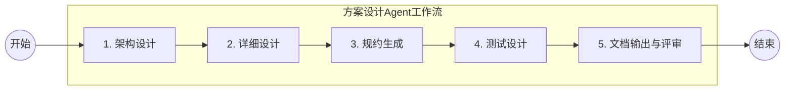

# 方案设计阶段规范

## 1 阶段目标

基于产品需求文档，结合系统架构文档和领域模型文档，进行技术方案设计，输出架构设计文档（ADD）、测试设计文档（TDD）和规约文件（Spec），为后续开发阶段提供完整的技术蓝图。

## 2 输入与输出

**输入**：

- 需求分析文档中当前 MVP 章节（`../analysis/REQUIREMENT-{ID}.md`）
- 产品需求文档（`REQUIREMENT-{ID}/MVP-{N}/PRD-{ID}.md`）
- 系统架构文档（`../instructions/architecture/**`）
- 领域模型文档（`../instructions/domain/**`）
- 现有规约文件（`../../specs/**`）

**输出**：

- 架构设计文档（`REQUIREMENT-{ID}/MVP-{N}/ADD-{ID}.md`）
- 测试计划文档（`REQUIREMENT-{ID}/MVP-{N}/TDD-{ID}.md`）
- 规约文件（`REQUIREMENT-{ID}/MVP-{N}/specs/**`）

## 3 Agent 工作流



### 步骤 1：架构设计

**Agent**：architect + system-architect
> 自动匹配Agent符合的角色和SubAgent，选用相应的Skills

```markdown
## 任务：进行当前MVP的架构设计

### 输入
- 产品需求文档
- 系统架构文档
- 领域模型文档

### 工作要求
1. **系统架构设计**：
   - 确定涉及的应用或服务及其职责
   - 设计应用或服务间的调用关系和通信方式
   - 绘制架构图（使用 Mermaid）

2. **接口协议设计**：
   - API 接口设计（RESTful/Dubbo）
   - 事件/消息设计
   - 接口版本策略

3. **领域模型设计**：
   - 设计/更新领域模型（实体、值对象、聚合根）
   - 定义领域事件，设计领域服务和应用服务
   - 绘制领域模型图（使用 Mermaid的关键类图）

4. **数据架构设计**：
   - 数据库表结构设计/变更
   - 数据分片设计（大数据量如何分片）
   - 数据迁移方案（如需）

5. **发布方案设计**：
   - 发布步骤：部署与环境变更、配置与依赖发布清单
   - Checklist：验证检查点
   - 回滚顺序：回滚预案
```

### 步骤 2：详细设计

**Agent**：backend-architect
> 自动匹配Agent符合的角色和SubAgent，选用相应的Skills

```markdown
## 任务：进行详细技术设计

### 工作要求
1. **系统集成设计**：
   - 外部系统集成方案
   - 消息队列使用方案、异步处理方案
   - 绘制容器级架构图（使用 Mermaid的C4容器架构）

2. **接口详细设计**：
   - 接口设计：API的签名、请求/响应结构
   - 容错性设计：参数校验规则、错误码定义
   - 幂等性设计：一致性、可重试、幂等处理

3. **逻辑详细设计**：
   - 核心类图（对象&属性&关系）、状态机设计（如涉及状态流转）
   - 核心算法/逻辑的伪代码或流程图
   - 并发控制策略、事务边界设计

4. **数据访问设计**：
   - 数据库表DDL
   - 数据库索引策略、分页策略
   - 数据缓存策略（缓存key、过期策略、更新策略）

5. **非功能性设计**：
   - 安全设计：认证授权方案、数据脱敏方案
   - 可观测性：Logging、Tracing、Metric、日志、监控报警
```

### 步骤 3：规约文件生成

**Agent**：technical-writer + doc-updater
> 自动匹配Agent符合的角色和SubAgent，选用相应的Skills

```markdown
## 任务：生成开发所需的规约文件

### 工作要求

根据架构设计和详细设计，按服务聚合，生成以下规约文件：

1. **API规约**（`REQUIREMENT-{ID}/MVP-{N}/specs/{service-name}/api/`）：
   - 每个新增/变更API的规约文件
   - 包含：路径、方法、参数、响应、错误码、示例

2. **领域规约**（`REQUIREMENT-{ID}/MVP-{N}/specs/{service-name}/domain/`）：
   - 新增/变更的领域模型规约
   - 领域事件规约
   - 业务规则规约

3. **数据规约**（`REQUIREMENT-{ID}/MVP-{N}/specs/{service-name}/data/`）：
   - 数据库变更规约（DDL）
   - 数据迁移规约
   - 缓存规约

4. **集成规约**（`REQUIREMENT-{ID}/MVP-{N}/specs/{service-name}/integration/`）：
   - 消息/事件规约
   - 外部接口规约

### 规约文件格式
使用 YAML 格式，遵循项目已有的规约模板
```

### 步骤 4：测试计划制定

**Agent**：quality-guardian | quality-engineer
> 自动匹配Agent符合的角色和SubAgent，选用相应的Skills

```markdown
## 任务：制定当前MVP的测试计划

### 输入
- 产品需求文档
- 技术设计文档
- 规约文件

### 工作要求
1. **测试策略**：
   - 确定测试层次（单元测试、集成测试、端到端测试）
   - 确定测试范围和重点
   - 确定测试环境要求

2. **测试用例设计**：
   - 基于用户故事的验收测试用例
   - 基于API规约的接口测试用例
   - 基于业务规则的规则测试用例
   - 异常场景测试用例
   - 边界条件测试用例

3. **测试数据准备**：
   - 测试数据需求清单
   - 测试数据准备方案

4. **回归测试范围**：
   - 基于影响面分析确定回归范围
   - 回归测试用例清单
```

### 步骤 5：文档输出与评审

**Agent**：technical-writer + doc-updater
> 自动匹配Agent符合的角色和SubAgent，选用相应的Skills

**任务描述**：

```markdown

## 任务：文档输出与评审

### 输入
- 1-4步所有分析结果

### 输出：技术设计方案
- 架构设计方案参考模版 `ADD-TEMPLATE.md`
- 测试设计方案参考模版 `TDD-TEMPLATE.md`
- 需求规约采用yaml格式参考通用模板

```

**质量门禁检查项**：

```yaml
design_quality_gate:
  traceability:
    - "每个API设计可追溯到产品需求中的用户故事"
    - "每个数据变更可追溯到功能需求"
    - "每个规约文件可追溯到技术设计文档"
  completeness:
    - "所有用户故事已有对应的技术实现方案"
    - "所有API已定义完整的规约"
    - "所有数据变更已有DDL和迁移方案"
    - "测试计划覆盖所有功能需求和非功能需求"
  consistency:
    - "技术设计与现有架构文档一致"
    - "领域模型设计与现有领域模型一致"
    - "API设计遵循项目API设计规范"
    - "规约文件格式符合项目规约标准"
  feasibility:
    - "技术方案在现有基础设施上可实现"
    - "性能设计满足非功能需求"
    - "安全设计满足安全需求"
```
