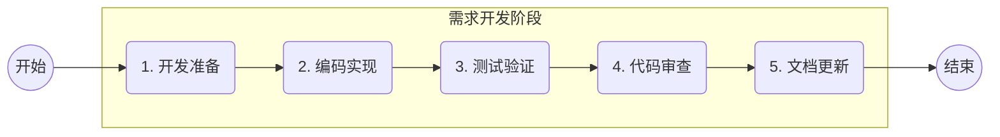

# 需求开发阶段规范

## 1 阶段目标

基于技术设计文档和规约文件，采用SDD开发流程和规范，交付规约的分析、设计、编码实现、测试验证和交付上线。这是将设计转化为可运行代码的核心执行阶段。

## 2 输入与输出

**输入**：

- 架构设计文档（`REQUIREMENT-{ID}/MVP-{N}/ADD-{ID}.md`）
- 测试计划文档（`REQUIREMENT-{ID}/MVP-{N}/TDD-{ID}.md`）
- 变更规约文件（`REQUIREMENT-{ID}/MVP-{N}/specs/**`）
- 现有代码库

**输出**：

- 生产代码、测试代码
- 开发交付文档（`REQUIREMENT-{ID}/MVP-{N}/DEV-{ID}.md`）
- 更新后的系统说明文档（`../instructions/**`）和需求规约文件（`../../specs/**`）

## 3 Agent 工作流



### 步骤 1：开发准备

**Agent**：developer + database-reviewer
> 自动匹配Agent符合的角色和SubAgent，选用相应的Skills

```markdown
## 任务：进行开发前的准备工作

### 工作要求

1. **规约转SDD Spec**
   - 将需求规约文件中的工作提交给SDD工具，转成SDD的Spec
   - 如果有前一个MVP的遗留问题或经验教训纳入当前MVP规划
   
2. **确认需求和设计** 
   - 确认SDD Spec开发的需求、设计

3. **任务拆解**
   - 根据Spec拆分任务Task
   - 明确任务间的依赖关系和执行顺序

```

---

### 步骤 2：编码实现

**Agent**：developer + code-reviewer + tdd-guide
> 自动匹配Agent符合的角色和SubAgent，选用相应的Skills

```markdown
## 任务：按任务清单进行编码实现

### 工作要求

1. **代码质量要求**：
   - 严格遵循项目编码规范和架构约定
   - 代码必须通过现有 linter 检查
   - 新增代码必须有对应的单元测试
   - 关键业务逻辑必须有注释说明

2. **每个任务的执行流程**：
   a. 阅读任务关联的设计文档章节和规约文件
   b. 阅读相关的现有代码，理解上下文
   c. 编写实现代码
   d. 编写/更新单元测试
   e. 本地运行测试确保通过
   f. 提交代码（遵循 Conventional Commits）

3. **编码顺序原则**：
   - 先基础设施层（数据库、配置）
   - 再领域层（实体、值对象、领域服务）
   - 然后应用层（应用服务、API控制器）
   - 最后集成层（消息处理、外部调用）

```

---

### 步骤 3：测试验证

**Agent**：developer + quality-engineer  
> 自动匹配Agent符合的角色和SubAgent，选用相应的Skills

```markdown
## 任务：执行测试验证

### 工作要求

1. **自动化测试执行**：
   - 运行全量单元测试，确保全部通过
   - 运行集成测试，确保全部通过
   - 检查测试覆盖率报告

2. **测试计划用例验证**：
   - 逐一验证测试计划中的测试用例
   - 对于自动化覆盖的用例，确认自动化测试存在且通过
   - 对于需要手工验证的用例，执行手工验证

3. **回归测试**：
   - 运行回归测试套件
   - 确认现有功能未受影响

4. **测试报告**：
   - 参考通用的测试报告模板
   - 报告内容写入 `REQUIREMENT-{ID}/MVP-{N}/DEV-{ID}.md`

```

---

### 步骤 4：代码审查

**Agent**：code-reviewer + security-reviewer
> 自动匹配Agent符合的角色和SubAgent，选用相应的Skills

```markdown
## 任务：进行代码审查

### 审查维度

1. **架构一致性**：
   - 代码实现是否符合技术设计文档
   - 是否遵循项目架构约定（分层、依赖方向等）
   - 是否正确使用了项目的基础设施组件

2. **代码质量**：
   - 代码是否清晰可读
   - 命名是否规范且有意义
   - 是否存在代码重复
   - 错误处理是否完善
   - 是否有潜在的性能问题

3. **安全性**：
   - 是否存在安全漏洞（SQL注入、XSS等）
   - 敏感数据是否正确处理
   - 权限控制是否正确

4. **测试质量**：
   - 测试用例是否充分
   - 测试断言是否准确
   - 是否覆盖了异常场景

5. **可维护性**：
   - 是否有必要的注释和文档
   - 配置是否外部化
   - 是否便于后续扩展

### 审查结果
   - 参考通用的代码审查结果格式
   - 报告内容写入 `REQUIREMENT-{ID}/MVP-{N}/DEV-{ID}.md`

```

---

### 步骤 5：文档更新

**Agent**：doc-updater + developer  
> 自动匹配Agent符合的角色和SubAgent，选用相应的Skills

```markdown
## 任务：更新文档并完成交付

### 工作要求

1. **系统说明文档更新**（如本次变更影响了系统级文档）
   - 更新架构文档（如有架构变更）
   - 更新领域模型文档（如有领域模型变更）
   - 更新API文档（如有API变更）

2. **需求规约文件更新**
   - 将交付规约中的内容同步到系统级规约（`../../specs/**`）
   - 确保规约文件与实际代码一致

3. **自动化变更日志**
   - 生成变更记录（如CHANGELOG/需求变更日志）
   - 分类标记（新增、修复、变更、弃用等）

4. **MVP阶段总结**
   - 记录交付总结、日期、内容、质量、遗留问题、下一步计划
   - 前一个 MVP 遗留问题和经验教训纳入下一个 MVP 阶段的规划

```

**质量门禁检查项**：

```yaml
delivery_checklist:
    code_quality:
        - "所有代码通过 linter 检查"
        - "无编译错误和警告"
        - "代码审查通过"
    test_quality:
        - "单元测试覆盖率 ≥ 80%"
        - "所有单元测试通过"
        - "所有集成测试通过"
        - "所有回归测试通过"
    delivery_quality:
        - "所有P0用户故事已实现并验证"
        - "无未解决的P0/P1缺陷"
        - "文档和规约已更新"
        - "部署方案已确认"
    documentation:
       - "技术设计文档已更新为最终版本"
       - "测试报告已生成"
       - "系统文档已同步更新"
       - "规约文件已同步更新"
    deployment:
       - "数据库迁移脚本已准备"
       - "配置变更已准备"
       - "部署文档已更新"
       - "回滚方案已确认"
```
