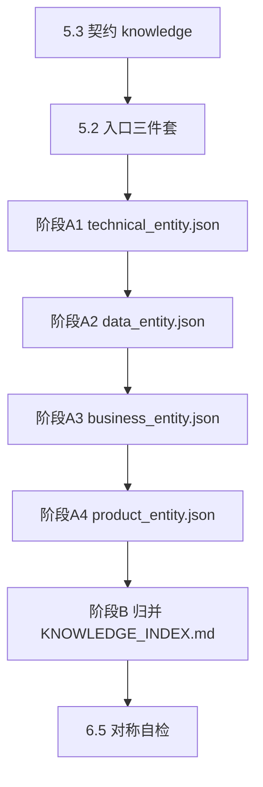

# 知识提取（knowledge-extract）

## 1. 何时使用

| 场景 | 是否使用本 Skill |
|------|------------------|
| 需要生成或刷新四视角链上实体 ID，并写入 `KNOWLEDGE_INDEX.md` | ✅ |
| 仅需结构化中间 JSON（`*_entity.json`）供人工校对后再归并 | ✅（完成阶段 A 后可暂停） |
| 已有人工维护完整 `KNOWLEDGE_INDEX.md` 且无需重抽 | ❌（可跳过） |
| 物化 `knowledge/**` 下 BD-/AGG- 等锚点 `.md`、跑 CHANGELOG、验收门禁 | ❌ → **knowledge-build** |

---

## 2. 产出物（本 Skill 的唯一写入范围）

| 产物 | 路径（相对 `{Doc Root}/knowledge/`） | 说明 |
|------|-----------------------------------------------|------|
| 技术实体 JSON | `technical/technical_entity.json` | 阶段 A-1；含 `system`、`applications`、`apis`、`services`、`dependencies` |
| 数据实体 JSON | `data/data_entity.json` | 阶段 A-2 |
| 业务实体 JSON | `business/business_entity.json` | 阶段 A-3；**勿**将同目录下物化出的锚点 `.md` 当作本阶段输入 |
| 产品实体 JSON | `product/product_entity.json` | 阶段 A-4 |
| 链上 ID 索引（Markdown） | `KNOWLEDGE_INDEX.md` | 阶段 B；**仅**在归并步骤写入；前缀与排除项以 `knowledge_meta.yaml` → `ssot.four_perspective_index` 为准 |

**两阶段顺序（强制）**

- **阶段 A（步骤 1～4）**：只读基线与按需代码/文档，**只写**上述四份 `*_entity.json`。**不得**在本阶段修改 `KNOWLEDGE_INDEX.md`。
- **阶段 B（步骤 5～6）**：读取已落盘的四 JSON + 主 INDEX + `AGENTS` 等，校验 **§4** 后**仅此时**更新 `KNOWLEDGE_INDEX.md`，并完成 **§4.5** 对称自检。

---

## 3. 本 Skill 明确不做（与下游分界）

以下各项**不属于**本 Skill；**禁止**在本会话/本工作流内代为执行：

- 运行或嵌套 **knowledge-build**（含其阶段三/四及任何「物化」「CHANGELOG」「验收」描述）。
- 创建或批量更新各视角 **锚点 `.md`**、`directory_patterns` 物化树、子目录 README 导航工程。
- 替换或生成 **主 Index Guide**（**document-indexing**）、根 **README** / **AGENTS**（**agent-guide**），除非用户**单独**要求并引用对应 Skill。
- 将 **`knowledge/business/**`** 下已物化的 `BD-*`/`BC-*`/锚点内容作为阶段 3 的**取证来源**（避免循环论证）。

下游若需从 ID 到目录树，由用户在**另一次任务**中引用 **knowledge-build**；本 Skill 正文**不**展开其步骤编号或算法。

---

## 4. 核心原则

| 原则 | 执行要点 |
|------|----------|
| **契约优先** | 先读 `{Doc Root}/knowledge/knowledge_meta.yaml` → `knowledge`；`ssot`、`evidence`、`symmetry`、`cross_perspective` 为硬约束；与正文冲突以 YAML 为准。 |
| **入口基线** | **存在则读**：根 `README.md` → `AGENTS.md` → 主 Index Guide（路径 **§5.1**）；禁止未读基线即臆测模块或实现。 |
| **证据优先** | 每条登记或关键 ID 至少一条可复核证据（主 INDEX 约定节、`pom.xml`、`AGENTS.md`、类路径/Mapper 等，以 `evidence` 为准）；禁止 invent。 |
| **按需打开** | 仅打开当前视角涉及的包、配置、文档片段；禁止为「完整」通读 `docs/**` 或全仓 `src/**`。 |
| **四段顺序** | 技术 → 数据 → 业务 → 产品；后段应引用前段 JSON 与同一套基线。 |
| **MS 与 Maven 分离** | `MS-*`**仅**由入口宿主类按 **§7.1.1** 聚类；任意 Maven 模块不映射为 `MS-*`（**§7.1.2**）。 |
| **产品与技术对齐** | `PL-*`↔`SYS-*`，`PM-*`↔`MS-*`，`UC-*`↔`apis[]`/`API-*`；`FT-*` 来自 UI 或 Job/MQ 等后台语义提炼，不等于单条 HTTP（**§8.4.1**）。 |
| **Markdown SSOT** | 四视角链上 ID 的**权威 Markdown 登记表**仅为归并后的 `KNOWLEDGE_INDEX.md`；`DIR-*` 等联邦 ID 留在主 INDEX 约定位置，不写入本表（**§6.2**）。 |

---

## 5. 先决条件与入口基线

### 5.1 Doc Root 与主 Index Guide

1. 按 `knowledge.doc_root` 解析 Doc Root；可借助根 `README.md` 与主 INDEX 落盘声明推断。  
2. 主 Index Guide 路径与 **agent-guide** §3.1 一致，**命中即停**：根目录 `PROJECT_INDEX.md`、`INDEX.md`、`INDEX-GUIDE.md` → `docs/INDEX_GUIDE.md`、`docs/INDEX-GUIDE.md`。  
3. `AGENTS.md` 中「参考」指针须与实际主 INDEX 路径一致。

### 5.2 入口基线（必读顺序）

| 顺序 | 文件 | 作用 |
|------|------|------|
| 1 | 根 **`README.md`** | Doc Root、文档导航、与 Index 交叉链接 |
| 2 | 根 **`AGENTS.md`** | 文档分流、Agent 约束与锁表、会话约定；技术栈与模块树见 **README**；主 INDEX 路径见 §5.1 |
| 3 | **主 Index Guide**（§5.1） | API/Job/数据等取证节、`[未索引]` |

### 5.3 加载 `knowledge` 契约

1. 读取 `{Doc Root}/knowledge/knowledge_meta.yaml`，定位 `knowledge`（`schema_version: "1.0"`）。  
2. 载入 `ssot.four_perspective_index`、`federal_index_pointer`、`evidence`、`symmetry`、`cross_perspective`。  
3. 若无 `knowledge` 块：补全模板或中止；禁止无契约盲写 ID。

---

## 6. 链上 ID 规则（与 YAML 对齐）

### 6.1 允许写入 `KNOWLEDGE_INDEX.md` 的前缀

**仅**登记 `ssot.four_perspective_index.contains_prefixes` 中的前缀（以落盘 YAML 为准）。摘要：

| 视角 | 前缀（示例） | 命名细则 |
|------|----------------|----------|
| technical | `SYS-`, `APP-`, `MS-`, `API-` | `constitution/standards/NAMING-CONVENTIONS.md` + `technical_meta.yaml` |
| data | `DS-`, `ENT-` | 同上 + `data_meta.yaml` |
| business | `BD-`, `BSD-`, `BC-`, `AGG-`, `AB-`, … | 同上 + `business_meta.yaml` |
| product | `PL-`, `PM-`, `FT-`, `UC-`, … | 同上 + `product_meta.yaml` |

### 6.2 排除项

不得将 `ssot.four_perspective_index.excludes.items` 所列类别写入四视角 INDEX（如 `DIR-*`、`DIR-KNOWLEDGE-*`、ADR 文号模式等）。

### 6.3 `application_only_policy`

若 `forbid_foreign_template_rows: true`：禁止以非本应用模板 ID 充填；缺口用 `allowed_gap_marker`（如 `[实体 ID 待补充]`），不用假 ID。

### 6.4 取证来源

与 `evidence` 一致：主 INDEX 约定节（如 §1 快速导航、§2 项目结构、§3 对外接口、§7 配置等，以落盘为准）；`evidence.repo_facts` 如 `pom.xml`、`AGENTS.md`、`manifest.yaml`、已读范围内 Mapper/XML。

### 6.5 对称与跨视角

遵守 `symmetry.rules`；`cross_perspective` 与各界 `integration` 对齐，缺字段时从 §6.4 补证。

---

## 7. 工作流程（执行清单）



| 步骤 | 动作 |
|------|------|
| 0 | 完成 **§5**（契约 + 入口三件套）。 |
| 1 | **技术** **§8.1**：先 `apis` 宿主类全名与路径事实，再 `services`/`MS-*`；**落盘** `technical/technical_entity.json`。**不改** `KNOWLEDGE_INDEX.md`。 |
| 2 | **数据** **§8.2**：**落盘** `data/data_entity.json`。 |
| 3 | **业务** **§8.3**：禁止读 `knowledge/business/**` 下锚点 `.md` 作为输入；**落盘** `business/business_entity.json`；推断须 `confidence` + `rationale`。 |
| 4 | **产品** **§8.4**：**落盘** `product/product_entity.json`。 |
| 5 | **归并** **§9**：从四 JSON + 主 INDEX + `AGENTS` + 用户输入提取 ID → **§6** 校验 → **写入** `KNOWLEDGE_INDEX.md`。 |
| 6 | **对称**：**§6.5** 自检（可与步骤 5 同轮完成）。 |

**收束条件**：四 JSON 已落盘，且 `KNOWLEDGE_INDEX.md` 已按契约更新。**本 Skill 在此结束**。

**子集运行**：若仅执行部分阶段，归并时不得为未执行视角编造 ID；该视角用 **§6.3** 缺口标记或跳过对应前缀。

---

## 8. 分视角：输入、方法、产物结构

### 8.1 技术视角（系统 → 应用 → API 事实 → MS 推理）

| 维度 | 内容 |
|------|------|
| **映射 ID** | `SYS-`, `APP-`, `MS-`, `API-` |
| **输入** | **基线**：`AGENTS.md`、主 INDEX API/Job 节；**增量**：`@GatewayApi`/Controller、Dubbo 接口与实现、MQ 宿主类、Job 入口类、配置等 |
| **方法** | 自上而下：边界与 `APP-*` → 入口清单（`apis`）→ **仅**据宿主类与 **§8.1.1** 聚类 `MS-*` |
| **注意** | 每条 API 含类全名、包名、路径或签名证据；MQ/Job 标明 Topic/调度类 |

**MS 抽取子序（强制）**

1. **先** 按类型逐条写入 `apis`（HTTP、Dubbo、MQ、Job…），含 **宿主类 FQCN**。  
2. **再** 在 `apis` 完备后，按 **§8.1.1** 得主词，聚类 `services[]` / `MS-*`。**不得**用 `artifactId`、`pom.xml` 的 `<module>`、模块目录名作为聚类轴或 `MS-*` 命名核心。  
3. **禁止**：无宿主类先写 `services[]`；单 Maven 模块一条 `MS-*`；用包尾段 `impl`/`service` 代替类名主词。

#### 8.1.1 服务显示名（类名优先）

**目标**：`services[].name` / `display_name` 与 `MS-*` 说明稳定可复核（字段约定以 `technical_entity.json` 为准）。

**优先级**：① 宿主类 SimpleName 去后缀后的业务主词 ② Dubbo **接口**简单名（当 `*ServiceImpl` 过泛时）③ 包名仅用于聚类与消歧，**不**单独作显示名；**禁止**用 Maven 模块名顶替。

**简单名 → 主词（后缀从长到短剥离，命中即停）**

| 模式 | 示例 |
|------|------|
| `…ApiImpl` | `FeeAppealDetailApiImpl` → **FeeAppealDetail** |
| `…Api` | `PolicyAppealApi` → **PolicyAppeal** |
| `…Controller` / `…Resource` | `FeeAppealTaskController` → **FeeAppealTask** |
| `…Consumer` / `…Listener` | `PolicyAppealDealConsumer` → **PolicyAppealDeal** |
| `…Sender` / `…Publisher` | `ChangeMqSend` → **ChangeMq**（或团队约定词干） |
| `…Job` / `…Processor` | `SpotCheckDataSyncJob` → **SpotCheckDataSync** |

**防误并**：`PolicyAppeal*`、`FeeAppealDetail*`、`AppealSpotCheck*` 等**已**由类名区分时，禁止把 `FeeAppeal*` 并入「政策申诉」类服务名，除非 AGENTS/主 INDEX 有明确文字证据并在 `rationale` 引用。

**自检**：每个 `MS-*` 可从至少一条 `apis[].host_class` 用本节规则复现；每条 `services[]` 含非空 `api_ids` 和/或 `host_classes`。

#### 8.1.2 Maven 模块 **一律** 不是 `MS-*`

`artifactId`、`<module>`、`*-service`/`*-gateway`/`*-api`/`*-application`/`*-schedule`/`*-infrastructure` 等：**不得**单独成为一条 `MS-*` 或聚类轴。模块 → `APP-*`、`applications[].module`、`dependencies`、`apis[].host_module`。

```json
{
  "system": {},
  "applications": [],
  "services": [],
  "apis": [],
  "dependencies": []
}
```

**建议填充顺序**：`system` → `applications` → **`apis`** → **`services`（仅 apis 聚类）** → `dependencies`。

---

### 8.2 数据视角

| 维度 | 内容 |
|------|------|
| **映射 ID** | `DS-`, `ENT-` |
| **输入** | `AGENTS.md` 数据源、主 INDEX 数据节；Entity/`@Table`、MyBatis XML、多数据源配置 |
| **方法** | 数据源 → 表 → 字段/关系/索引 → `domain_grouping`（与 `BD-*` 对齐时交叉引用） |

```json
{
  "datasources": [],
  "tables": [],
  "relationships": [],
  "indexes": [],
  "domain_grouping": []
}
```

---

### 8.3 业务视角

| 维度 | 内容 |
|------|------|
| **映射 ID** | `BD-`, `BSD-`, `BC-`, `AGG-`, `AB-` |
| **输入** | **基线**：README、主 INDEX、`AGENTS`；**增量**：§8.1 的 `apis`/`services`、§8.2 的 `domain_grouping`；可选 domain/Manager 源码补证。**禁止**：`knowledge/business/**` 锚点树与已物化 `BD-*`/`BC-*` 目录作为证据源。 |
| **方法** | **§8.3.1** FQCN 形态对齐包语义；**§8.3.2** 从 MS/API 派生 `BC`/`AGG`/`AB`，从包段派生 `BD`/`BSD` |
| **输出** | 每项推断须 `confidence`（high/medium/low）+ `rationale`（含 FQCN 或 `api_id`） |

#### 8.3.1 FQCN 理想形态（推理锚点）

```text
com|org.<公司>.<业务域>.<业务子域>.<上下文>.<聚合或实体>.<API|Service|Job|MessageConsumer>.<简单名>
```

#### 8.3.2 业务 ID 派生（与 MS/API 对齐）

| ID | 依据 | 规则摘要 |
|----|------|----------|
| `AB-*` | `apis[]` | 入口 → 零条或一条 `AB-*`；证据：`host_class` + 路径/签名 |
| `AGG-*` | `services[]`/`MS-*` | 与规范化主词对齐；合并须在 `rationale` 说明 |
| `BC-*` | 宿主类包路径 | 服务类目段 = 宿主类直接父包名；BC = 其上业务语境段（跳过 `impl`/`mq`/`service` 等技术尾段直至业务段） |
| `BD-*` | 公司域后首段 | 例 `com.zto.policy.charging.appeal…` → 常取 **policy**；多段组合以 NAMING-CONVENTIONS / YAML 为准 |
| `BSD-*` | BD 与 BC 之间包段 | 无则省略或 **§6.3** |

```json
{
  "business_domains": [],
  "bounded_contexts": [],
  "aggregates": [],
  "capabilities": [],
  "context_map": [],
  "domain_events": []
}
```

---

### 8.4 产品视角

| 维度 | 内容 |
|------|------|
| **映射 ID** | `PL-`, `PM-`, `FT-`, `UC-` |
| **输入** | README、`AGENTS`、主 INDEX；可选前端/OpenAPI/测试；**必引** §8.1 的 `system`/`services`/`apis` |
| **方法** | `PL` → `PM` → `FT` → `UC`；`UC-*` 绑定一条或多条 `apis[]` |
| **输出** | 建议含 `linked_sys_id`、`linked_ms_id`、`linked_api_ids` 便于 **§6.5** 自检 |

#### 8.4.1 产品 ID 与技术对齐

| 产品 ID | 技术侧 | 规则 |
|---------|--------|------|
| `PL-*` | `SYS-*` / `system` | 一一对应；无 SYS 事实则禁止单独 invent `PL` |
| `PM-*` | `MS-*` | 一一对应；`rationale` 须含 `ms_id` 或 `host_classes` |
| `FT-*` | — | 从 UI 操作或 Job/MQ/批处理**用户可感知结果**提炼；≠ 单条 HTTP |
| `UC-*` | `apis[]` | 至少绑定一条 `apis[]`；正文业务语言，证据列写 `api_id`/路径 |

```json
{
  "products": [],
  "modules": [],
  "features": [],
  "use_cases": [],
  "user_roles": []
}
```

---

## 9. 归并至 `KNOWLEDGE_INDEX.md`

**前置**：§7 步骤 1～4 的四份 `*_entity.json` 已落盘（或会话中等价完整附件）。

**本节的职责**：把链上实体 ID 与证据**登记**到 `KNOWLEDGE_INDEX.md`。路径以 `knowledge_meta.yaml` → `ssot.four_perspective_index.path` 为准（本仓库惯例为 `knowledge/KNOWLEDGE_INDEX.md`）。

1. 仅从**已落盘**四 JSON、主 INDEX、`AGENTS`、已读代码提取 ID；禁止 invent。  
2. 前缀 ∈ **§6.1**，∉ **§6.2**；满足 **§6.3**。  
3. 每条 ID 至少一条 **§6.4** 证据；可与 JSON 内 `code_location`/`evidence` 对应。  
4. 不擅自改写已有 ID 语义、不断裂 Markdown/YAML 引用。  
5. **不**在本节创建视角锚点 `.md` 或批量目录；**不**更新 CHANGELOG；此类工作**不属于**本 Skill。

---

## 10. 反模式与自检

| 反模式 | 纠正 |
|--------|------|
| 跳过入口三件套直接扫代码 | **§5.2** |
| 先写 `MS-*`/`services[]` 再补 `apis` 宿主类 | **§8.1 MS 子序** |
| 用模块名或 `…service.impl` 当 `MS-*` 标签 | **§8.1.1 / §8.1.2** |
| 四段顺序倒置或从产品反推技术事实 | **§7** 技术→数据→业务→产品 |
| 阶段 A 修改 `KNOWLEDGE_INDEX.md` 或边抽边写 INDEX | **§2 两阶段** |
| 无四 JSON 支撑批量臆写 INDEX | **§9**；**§6.3** |
| 读 `knowledge/business/**` 锚点反推 `BD-*`/`BC-*` | **§8.3 输入** |
| `UC-*` 正文只有 URL | **§8.4.1** |
| `PM-*`/`PL-*` 脱离 `MS-*`/`SYS-*` | **§8.4.1** |
| **在本 Skill 内执行 knowledge-build 或物化锚点** | **§3** |

**自检清单**

- [ ] **§5** 契约 + 入口基线已读  
- [ ] **§2**：四 JSON 落盘后**再**写 `KNOWLEDGE_INDEX.md`  
- [ ] **§8.1**：`MS-*` 仅来自 `apis` 聚类，符合 **§8.1.1 / §8.1.2**  
- [ ] **§6.1～§6.4** 与 **§6.5** 已核对  
- [ ] **§3**：未执行 knowledge-build、未物化锚点树、未写 CHANGELOG  

---

## 11. 参考

| 类型 | 路径 |
|------|------|
| 契约示例 | `docs/knowledge/knowledge_meta.yaml` → `knowledge` |
| 主 Index 产出 | `.cursor/skills/document-indexing/SKILL.md` |
| Agent 与 README | `.cursor/skills/agent-guide/SKILL.md` |
| **下游**：目录物化与 CHANGELOG（本 Skill **不**执行） | `.cursor/skills/knowledge-build/SKILL.md` |
| 命名规范 | `{Doc Root}/knowledge/constitution/standards/NAMING-CONVENTIONS.md` |
