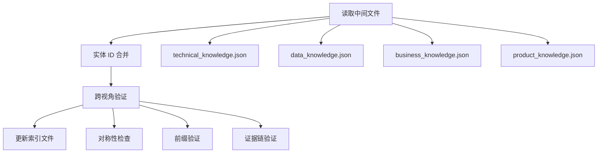

# 归并阶段规范

阶段三是 knowledge-extract 的收口阶段。读取四视角 `*_knowledge.json`（schema 2.1）中间文件，执行前缀验证、跨视角对称性检查，最终更新 `knowledge/KNOWLEDGE_INDEX.md`。

---

## 归并流程



## 归并规则

### 1. 前缀验证

仅包含内置 `contains_prefixes` 定义的前缀：

| 视角 | 允许前缀 |
|------|---------|
| technical | SYS-、APP-、MS-、API- |
| data | DS-、ENT- |
| business | BD-、BSD-、BC-、AGG-、AB- |
| product | PL-、PM-、FT-、UC- |

### 2. 唯一性约束

- `层级+ID` 全知识库唯一
- `层级+别名（英文名）` 全知识库唯一
- `full_id` 全知识库唯一

### 3. 对称性检查

遵守内置 `symmetry.rules`：

| 规则 ID | 说明 |
|---------|------|
| `same_round_four_sections` | `KNOWLEDGE_INDEX.md` 的 §1～§4 同一轮维护 |
| `no_template_only` | 禁止以非本应用模板 ID 作为 INDEX/README 唯一内容 |
| `index_over_template` | 可登记 ID 时优先主 INDEX §3/§3.2/§六/§七 与工程事实 |
| `bc_agg_linkage` | §1 已登记 BC/AGG 时，§3 或 §4 至少一类有证据行，或显式待补充与原因 |

---

## 各视角 JSON 结构差异

四个视角共享 `schema_version: "2.1"` 和 `metadata` 节，但 `entities` 结构有差异：

| 视角 | entities 结构 | 说明 |
|------|-------------|------|
| technical | **分类对象**：`{ systems: [], applications: [], services: [], apis: [] }` | 按层级分组，便于索引 |
| data | **扁平数组**：`[...]` | DS 和 ENT 通过 `parent_id` 关联 |
| business | **扁平数组**：`[...]` | BD→BSD→BC→AGG→AB 通过 `parent_id`/`children` 关联 |
| product | **扁平数组**：`[...]` | PL→PM→FT→UC 通过 `parent_id` 关联 |

### technical_knowledge.json

```json
{
  "schema_version": "2.1",
  "perspective": "technical",
  "generated_at": "ISO-8601",
  "entities": {
    "systems": [{
      "hierarchy": "SYS", "id": "001", "full_id": "SYS-{NAME}",
      "alias": "...", "name": "...", "description": "...",
      "architecture": {
        "apps": [{ "id": "APP-...", "name": "...", "startup_class": "...", "role": "..." }],
        "external_dependencies": [{ "system": "...", "integration": "...", "purpose": "..." }],
        "ddd_layers": ["Gateway", "Application", "Domain", "Infrastructure"]
      },
      "evidence_chain": [{ "source": "...", "confidence": "high|medium|low", "type": "document|code_location|config" }],
      "cross_references": { "business": [...], "product": [...] }
    }],
    "applications": [{
      "hierarchy": "APP", "id": "001", "full_id": "APP-{NAME}",
      "parent_sys_id": "SYS-{NAME}",
      "alias": "...", "name": "...", "description": "...",
      "startup_class": "...", "maven_module": "...",
      "service_ids": ["MS-001", ...],
      "mq_consumers": ["..."],
      "jobs": ["..."], "jobs_count": 0,
      "evidence_chain": [...], "cross_references": { ... }
    }],
    "services": [{
      "hierarchy": "MS", "id": "001",
      "alias": "...", "name": "...",
      "host_class": "...", "host_module": "...", "protocol": "HTTP|Dubbo|HTTP+Dubbo",
      "merge_note": "...",
      "evidence_chain": [...],
      "cross_references": { "business": [...], "product": [...], "apis": [...] }
    }],
    "apis": [{
      "hierarchy": "API", "id": "001",
      "alias": "{MS别名}.{method}", "name": "...",
      "service_id": "MS-001",
      "host_class": "...", "host_module": "...",
      "method_signature": "methodName(ParamType param)",
      "evidence_chain": [{ "source": "Class#method:line", "confidence": "high", "type": "code_location" }]
    }]
  },
  "metadata": {
    "total_systems": 0, "total_applications": 0, "total_services": 0, "total_apis": 0, "total_entities": 0,
    "extraction_basis": "...", "schema_notes": "...", "changes_from_previous": "..."
  }
}
```

### data_knowledge.json

```json
{
  "schema_version": "2.1",
  "perspective": "data",
  "generated_at": "ISO-8601",
  "entities": [
    {
      "hierarchy": "DS", "id": "001", "full_id": "DS-{NAME}",
      "alias": "...", "name": "...", "description": "...",
      "type": "TiDB / MySQL 8.0+",
      "config_key": "...",
      "owned_by_app_id": ["APP-..."],
      "notes": ["..."],
      "evidence_chain": [...],
      "cross_references": { "business": [...] }
    },
    {
      "hierarchy": "ENT", "id": "001", "full_id": "ENT-001",
      "parent_id": "DS-{NAME}",
      "alias": "...", "name": "...",
      "logical_name": "JavaClassName",
      "physical_table": "table_name",
      "evidence_chain": [...],
      "cross_references": { "datasource": "DS-001", "business": [...], "technical": [...] }
    }
  ],
  "metadata": {
    "total_datasources": 0, "total_entities": 0, "total_items": 0,
    "extraction_basis": "...", "schema_notes": "...", "changes_from_previous": "..."
  }
}
```

### business_knowledge.json

```json
{
  "schema_version": "2.1",
  "perspective": "business",
  "generated_at": "ISO-8601",
  "confidence": "high",
  "entities": [
    { "hierarchy": "BD", "full_id": "BD-{NAME}", "strategic_classification": "core_domain", "children": ["BSD-..."], ... },
    { "hierarchy": "BSD", "full_id": "BSD-{NAME}", "parent_id": "BD-{NAME}", "bounded_contexts": ["BC-..."], ... },
    { "hierarchy": "BC", "full_id": "BC-{NAME}", "parent_id": "BSD-{NAME}", "implemented_by_app_id": "APP-...", "aggregates": ["AGG-..."], "ubiquitous_language": { ... }, ... },
    { "hierarchy": "AGG", "full_id": "AGG-{NAME}", "parent_id": "BC-{NAME}", "root_entity": "...", "entities": [...], "invariants": [...], "persisted_as_entity_ids": [...], "implemented_by_service_ids": [...], "abilities": ["AB-..."], ... },
    { "hierarchy": "AB", "full_id": "AB-{NAME}", "parent_id": "AGG-{NAME}", "capability": "...", "apis": [{ "id": "API-...", "method": "...", "description": "..." }], ... }
  ],
  "metadata": {
    "total_business_domains": 0, "total_business_subdomains": 0, "total_bounded_contexts": 0, "total_aggregates": 0, "total_abilities": 0, "total_entities": 0,
    "extraction_basis": "...", "schema_notes": "...", "changes_from_previous": "..."
  }
}
```

### product_knowledge.json

```json
{
  "schema_version": "2.1",
  "perspective": "product",
  "generated_at": "ISO-8601",
  "confidence": "high",
  "entities": [
    { "hierarchy": "PL", "full_id": "PL-{NAME}", "target_users": [...], ... },
    { "hierarchy": "PM", "full_id": "PM-{NAME}", "parent_id": "PL-{NAME}", ... },
    { "hierarchy": "FT", "full_id": "FT-{NAME}", "parent_id": "PM-{NAME}", "invokes_api_ids": [...], "acceptance_criteria": [...], "realizes_use_case_ids": [...], ... },
    { "hierarchy": "UC", ... }
  ],
  "metadata": {
    "total_products": 0, "total_modules": 0, "total_features": 0, "total_use_cases": 0, "total_entities": 0,
    "extraction_basis": "...", "schema_notes": "...", "changes_from_previous": "..."
  }
}
```

完整示例模板见 [../assets/knowledge-schema-template.json](../assets/knowledge-schema-template.json)。

---

## KNOWLEDGE_INDEX.md 表头规范

### 语义说明

| 列名 | 含义 |
|------|------|
| **层级** | 实体在知识库中的层次位置 |
| **ID** | 数字编码，同一层级下按数字序列管理，格式如 001、002 |
| **Full ID** | 目录风格规范 ID（如 `SYS-POLICY-APPEAL`），全知识库唯一 |
| **别名（英文名）** | 英文编码，机器可读标识 |
| **名称** | 中文名称，面向业务/阅读的可理解名称 |
| **能力概述** | 聚合边界对外暴露的核心业务能力（仅 AB 层级，其余用 `-`） |
| **证据链** | 分号分隔的多个证据来源 |

### 证据链填写规范

每个 ID 的证据链应包含至少一个可验证来源：

| 证据类型 | 格式 | 示例 |
|----------|------|------|
| 文档章节 | `{文件} §{章节}` | `INDEX_GUIDE.md §3.2` |
| 代码位置 | `{类}#{行号}` 或 `{类}:{方法}` | `PolicyAppealApiImpl#create:111` |
| 配置文件 | `{路径}:{键}` | `application.yml:spring.datasource` |
| 工程事实 | `{文件}` | `pom.xml`、`AGENTS.md` |
| 技术实体引用 | `{前缀}-{ID} {名称}` | `MS-001 PolicyAppeal` |
| API 引用 | `{API-ID} {别名}` | `API-002 PolicyAppeal.create` |

完整输出模板见 [../assets/knowledge-index-template.md](../assets/knowledge-index-template.md)。
