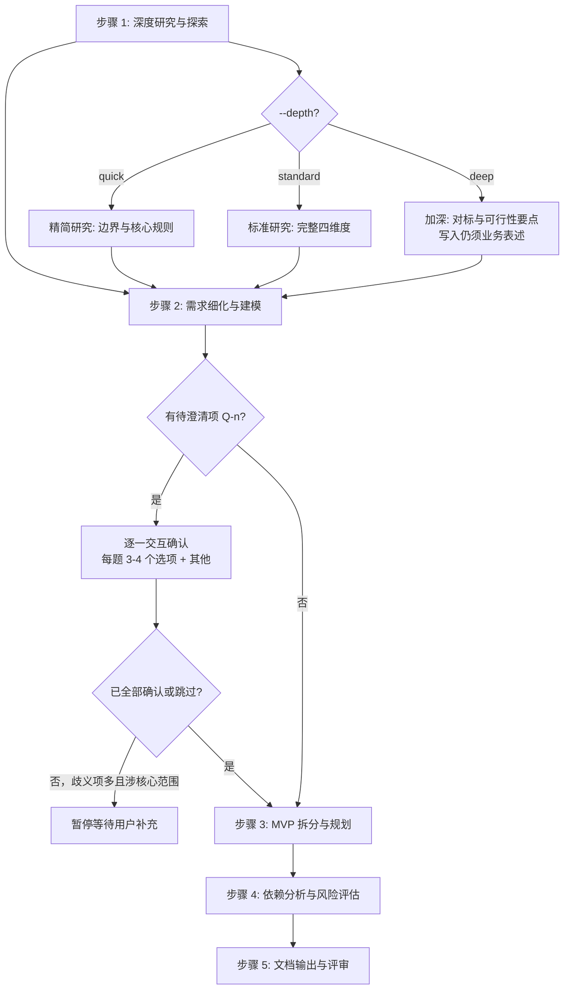

# 五步工作流详细规范

sdx-analysis 技能的核心工作流算法。主文件 SKILL.md 中的工作流为摘要，本文件为完整规范。

**文档语言原则**：主要读者为**产品经理与需求分析师**（及业务评审方）。Agent **可以**查阅 `knowledge/`、`knowledge/technical/`、INDEX_GUIDE 等做事实核对；写入 `ANALYSIS-{ID}.md` 时**必须**将工程事实转写为**场景、规则、验收与协作**表述。细则见 [../../sdx-solution/reference/audience-language-spec.md](../../sdx-solution/reference/audience-language-spec.md)。

---

## 流程总览



---

## 待澄清项交互确认协议

与 **sdx-solution** 技能一致：**不得**对 Q-n 自行假设后继续。交互格式、选项设计、用户回答处理与确认后动作，全文见 [../../sdx-solution/reference/workflow-spec.md](../../sdx-solution/reference/workflow-spec.md) 中「### 待澄清项交互确认协议」一节。

### 本技能中的触发时机

- 步骤 1–2 中凡出现**影响范围、规则、验收或 MVP 边界**的不确定点，均标注 Q-n。
- 提取完本轮 Q-n 列表后，**逐一向用户提问**；全部处理为「已确认」或「用户跳过」后，再进入步骤 3。
- 歧义项 **> 3** 且涉及**核心目标或 MVP 切分**时，须在确认完毕后再继续后续步骤。

---

## 步骤 1：深度研究与探索

### 角色

requirements-analyst（面向产品/需求产出）

### 输入

解决方案文档（`system/solutions/SOLUTION-{ID}.md`）+ `knowledge/`（按需加载）

### 算法

1. **通读解决方案**：提取业务目标（G-n）、核心场景、影响面、已知风险（保持业务表述）
2. **四维度研究**（内部分析可对照技术索引；**写入 §1.3 时仅用业务/协作语言**）：

| 维度 | 研究内容 | 参考来源（内部分析） |
|------|---------|---------------------|
| 领域边界 | 上下游责任划分、核心概念与业务对象 | `knowledge/business/`、INDEX_GUIDE 领域与术语 |
| 核心规则 | 现有业务规则、流程阶段、约束 | `knowledge/business/`、INDEX_GUIDE 状态与流程 |
| 跨域协作 | 信息如何在团队/系统间传递（核对事实用技术材料） | `knowledge/technical/`、INDEX_GUIDE 集成摘要 |
| 行业与对内惯例 | 同类场景的常见做法与陷阱 | 经验、外部参考、解决方案正文 |

3. **现有能力盘点**（内部分析）：
   - 可延续的流程、规则或能力（写入时称「可复用能力/流程」，不罗列模块/类名）
   - 已知限制与历史约束（写入时表述为**对业务或协作的影响**）
   - 边界场景：从**用户可见后果、结算/合规影响**等角度记录，避免以「幂等、一致性」等实现词代替业务句

### depth 参数影响

| depth | 行为 |
|-------|------|
| quick | 仅研究领域边界与核心规则，跳过行业惯例与深度边界列举 |
| standard | 完整四维度研究 |
| deep | 增加对标与可行性要点（内部分析可更细）；**文档仍不写实现栈与表结构** |

### 产出

研究发现（对应文档 §1.3），可直接进入步骤 2；Q-n 在步骤 2 末或本步末汇总后进入「待澄清项交互确认协议」。

---

## 步骤 2：需求细化与建模

### 角色

requirements-analyst

### 输入

步骤 1 产出 + 解决方案文档中的需求概述

### 算法

1. **功能需求细化**：

| 属性 | 说明 |
|------|------|
| 编号 | FR-{NNN}，连续编号 |
| 描述 | 角色与场景；**输入—处理—输出**均用业务语义 |
| 优先级 | P0（必须）/ P1（重要）/ P2（一般）/ P3（可选） |
| 业务规则 | 关联 BR-{NNN} |
| 异常与边界 | 对用户/业务的含义与可选补救 |
| 验收标准 | 可观察、可验证的条件 |

2. **非功能需求明确**（正文优先业务可感知描述；量化指标可写「与研发共拟」）：

| 类别 | 关注点（写入文档时） |
|------|---------------------|
| 体验与性能 | 等待感知、高峰可用、批量完成时限等业务话术 |
| 可用性与连续性 | 可用时段、故障恢复期望（RTO/RPO 可作「由研发共拟」附录） |
| 安全与合规 | 权限范围、敏感数据、审计与合规要求 |
| 运维与问题定位 | 业务侧关心的可追溯与排障诉求，不写具体监控栈 |
| 兼容与升级 | 对既有流程、数据与对接方的兼容 |

3. **业务规则提取**：
   - 从解决方案与知识库提取触发条件、执行逻辑、例外情况
   - 编号 BR-{NNN}，关联到 FR-{NNN}
   - 标注优先级与冲突时的业务决策口径

4. **数据需求分析**（业务对象视角）：
   - 新增或变更的**业务对象/信息**、含义与生命周期（阶段用语对齐业务）
   - 一致性与时效期望用业务话术（如「审核与结算结果须一致」）

### depth 参数影响

| depth | 行为 |
|-------|------|
| quick | 仅细化 P0/P1 功能需求；非功能以条目列出，少写目标数值 |
| standard | 完整功能/非功能/规则/数据对象细化 |
| deep | 增加需求间依赖关系梳理、历史数据与迁移的**业务影响**说明；物理表结构、迁移脚本**不写入正文**，可列入模板 §8.4 |

### 产出

细化需求（对应文档 §2–§5）。若存在 Q-n，**先执行「待澄清项交互确认协议」**，再进入步骤 3。

---

## 步骤 3：MVP 拆分与规划

### 角色

requirements-analyst

### 输入

步骤 1–2 产出（Q-n 已确认或已标注跳过）

### 算法

1. **拆分原则**：
   - 每个 MVP 具备独立的业务交付价值
   - MVP 间依赖单向（MVP-N+1 可依赖 MVP-N，反向禁止）
   - 核心/高价值功能（P0）优先
   - 必要的共性能力随**首个依赖它的 MVP** 一并交付（正文写业务价值，不写「基建里程碑」式技术清单）

2. **MVP 定义**：

| 属性 | 说明 |
|------|------|
| 名称 | MVP-{N}: {描述性名称} |
| 核心目标 | 本 MVP 要达成的业务价值 |
| 包含需求 | FR-{NNN} 列表 |
| 验收标准 | 业务可验证的交付条件 |
| 预估工期 | 粗粒度（人天/人周） |
| 依赖 | 前序 MVP 或**外部团队/环节**的交付节点（业务表述） |

3. **排序策略**：
   - 第一维：业务价值（高→低）
   - 第二维：被依赖程度（被依赖多的优先）
   - 第三维：风险（对里程碑影响大的提前验证）

4. **依赖关系图**：绘制 MVP 间有向无环图，确保无循环依赖

### 产出

MVP 拆分方案（对应文档 §6）。

---

## 步骤 4：依赖分析与风险评估

### 角色

requirements-analyst（可对照质量视角）

### 输入

步骤 1–3 产出

### 算法

1. **依赖分析**（正文写「谁须在何时交付什么结果」；内部分析可查 API/MQ 等，**不写入 §7.1 主表的技术名**）：

| 依赖类型 | 分析内容（文档表述） |
|----------|---------------------|
| 功能依赖 | MVP 或流程间的先后与包含关系 |
| 数据依赖 | 共享业务对象、信息传递节奏 |
| 对接与协作 | 与内外部团队在节点、规则、数据口径上的对齐 |
| 外部依赖 | 第三方、监管或基础设施节奏 |

2. **风险评估**：

| 风险维度 | 评估要点 |
|----------|---------|
| 技术风险 | 复杂度或未验证点对**交付与体验**的影响（正文避免栈名） |
| 业务风险 | 规则变更、口径冲突 |
| 进度风险 | 依赖阻塞、资源与并行度 |
| 质量风险 | 验收难度、回归影响面 |

3. **风险编号与应对**：
   - 编号 R-{N}，标注可能性（高/中/低）与影响（高/中/低）
   - 高风险须给出**产品与协作侧**可执行的应对与跟进行动
   - 中风险须有应对策略；低风险记录备案

### 产出

依赖与风险评估（对应文档 §7）。

---

## 步骤 5：文档输出与评审

### 角色

requirements-analyst + technical-writer（可选）

### 输入

步骤 1–4 全部产出 + [../assets/analysis-template.md](../assets/analysis-template.md)

### 算法

1. **整合**：按模板八章结构编排，字段与表格遵循模板中的**业务语言**提示
2. **语言审读**：通读全文，对照 [../../sdx-solution/reference/audience-language-spec.md](../../sdx-solution/reference/audience-language-spec.md) 去除不当技术术语；确需保留的工程线索集中至模板 §8.4
3. **填充 frontmatter**：
   - `id`: `ANALYSIS-{YYYYMMDD}-{SEQ}`
   - `status`: `draft`
   - `created` / `updated`: 当前日期
   - `parent`: 关联的解决方案编号 `SOL-{ID}`
4. **补充附录**：术语表（§8.1）、参考文档（§8.2）、变更历史（§8.3）；§8.4 按需
5. **质量门禁自查**：逐项检查 [../assets/quality-gate-checklist.md](../assets/quality-gate-checklist.md) 与模板 §8.5
6. **输出**：写入 `system/analysis/ANALYSIS-{ID}.md`

### 输出目录

```
system/analysis/
└── ANALYSIS-{YYYYMMDD}-{SEQ}.md
```

目录不存在时自动创建。

### 产出

完整需求分析文档 + 质量门禁自查结果。

---

## 步间数据流

```
步骤 1 产出
  ├─→ §1.3 研究发现
  └─→ [传递到步骤 2]

步骤 2 产出
  ├─→ §2 功能需求
  ├─→ §3 非功能需求
  ├─→ §4 业务规则
  ├─→ §5 数据需求
  ├─→ Q-n 列表 → [待澄清项交互确认协议]（若有）
  └─→ [传递到步骤 3]

步骤 3 产出
  ├─→ §6 MVP 拆分方案
  └─→ [传递到步骤 4]

步骤 4 产出
  └─→ §7 依赖与风险

步骤 5 整合
  └─→ §1–§8 完整文档
```
