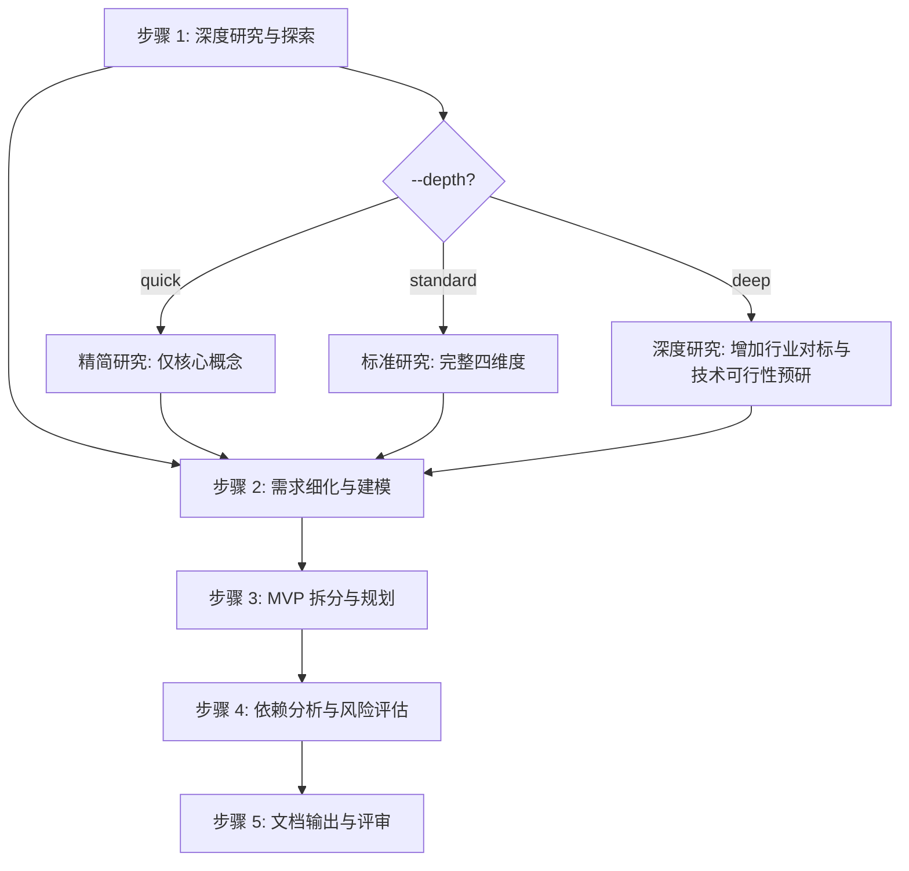

# 五步工作流详细规范

sdx-analysis 技能的核心工作流算法。主文件 SKILL.md 中的工作流为摘要，本文件为完整规范。

---

## 流程总览



---

## 步骤 1：深度研究与探索

### 角色

requirements-analyst

### 输入

解决方案文档（`docs/solutions/SOLUTION-{ID}.md`）+ `knowledge/`（按需加载）

### 算法

1. **通读解决方案**：提取业务目标（G-n）、核心场景、影响面、已知风险
2. **四维度研究**：

| 维度 | 研究内容 | 参考来源 |
|------|---------|---------|
| 领域边界 | 上下游限界上下文、核心概念与聚合关系 | `knowledge/business/`、INDEX_GUIDE.md §4 |
| 核心规则 | 现有业务规则、状态机、约束条件 | `knowledge/business/`、INDEX_GUIDE.md §5.1 |
| 跨域交互 | 服务间调用、MQ 消息、数据流转 | `knowledge/technical/`、INDEX_GUIDE.md §3 |
| 行业实践 | 同类场景的通用模式与已知陷阱 | 经验知识、外部参考 |

3. **现有实现探索**：
   - 识别可复用组件（服务、模块、工具类）
   - 标记技术债务与已知限制
   - 记录边界场景关注点（高并发、一致性、幂等性等）

### depth 参数影响

| depth | 行为 |
|-------|------|
| quick | 仅研究领域边界与核心规则，跳过行业实践与深度边界探索 |
| standard | 完整四维度研究 |
| deep | 增加行业对标分析、技术可行性预研、性能基线调研 |

### 产出

深度研究报告（对应文档 §1.3 研究发现）。

---

## 步骤 2：需求细化与建模

### 角色

requirements-analyst

### 输入

步骤 1 产出 + 解决方案文档中的需求概述

### 算法

1. **功能需求细化**：

| 属性 | 说明 |
|------|------|
| 编号 | FR-{NNN}，连续编号 |
| 描述 | 输入 → 处理逻辑 → 输出 |
| 优先级 | P0（必须）/ P1（重要）/ P2（一般）/ P3（可选） |
| 业务规则 | 关联 BR-{NNN} |
| 异常处理 | 异常场景与处理策略 |
| 验收标准 | 可度量的验收条件 |

2. **非功能需求明确**：

| 类别 | 关注点 |
|------|--------|
| 性能 | 响应时间（P99）、吞吐量、并发数 |
| 可用性 | SLA、RTO、RPO |
| 安全 | 认证、授权、数据保护 |
| 可观测性 | 日志、监控、告警、链路追踪 |
| 兼容性 | 向前/向后兼容要求 |

3. **业务规则提取**：
   - 从解决方案与知识库提取触发条件、执行逻辑、异常处理
   - 编号 BR-{NNN}，关联到功能需求 FR-{NNN}
   - 标注规则优先级与冲突处理策略

4. **数据需求分析**：
   - 新增/变更数据实体、操作类型、变更说明
   - 数据生命周期（创建→状态流转→归档/删除）
   - 一致性要求（强一致性 vs 最终一致性）

### depth 参数影响

| depth | 行为 |
|-------|------|
| quick | 仅细化 P0/P1 功能需求，非功能需求仅列指标不定目标值 |
| standard | 完整功能/非功能需求细化 |
| deep | 增加需求间依赖矩阵、数据影响分析（表结构、迁移策略） |

### 产出

细化需求清单（对应文档 §2–§5）。

---

## 步骤 3：MVP 拆分与规划

### 角色

requirements-analyst

### 输入

步骤 1–2 产出

### 算法

1. **拆分原则**：
   - 每个 MVP 具备独立的业务交付价值
   - MVP 间依赖单向（MVP-N+1 可依赖 MVP-N，反向禁止）
   - 核心/高价值功能（P0）优先
   - 技术基础设施类工作随首个消费 MVP 一并交付

2. **MVP 定义**：

| 属性 | 说明 |
|------|------|
| 名称 | MVP-{N}: {描述性名称} |
| 核心目标 | 本 MVP 要达成的业务价值 |
| 包含需求 | FR-{NNN} 列表 |
| 验收标准 | 可度量的交付验收条件 |
| 预估工期 | 粗粒度估算（人天/人周） |
| 依赖 | 对前序 MVP 或外部系统的依赖 |

3. **排序策略**：
   - 第一维：业务价值（高→低）
   - 第二维：技术依赖（被依赖多的优先）
   - 第三维：风险程度（高风险提前验证）

4. **依赖关系图**：绘制 MVP 间有向无环图，确保无循环依赖

### 产出

MVP 拆分方案（对应文档 §6）。

---

## 步骤 4：依赖分析与风险评估

### 角色

requirements-analyst + quality-engineer

### 输入

步骤 1–3 产出

### 算法

1. **依赖分析**：

| 依赖类型 | 分析内容 |
|----------|---------|
| 功能依赖 | MVP 间功能模块调用关系 |
| 数据依赖 | 共享数据实体、数据流转 |
| 接口依赖 | API / MQ / RPC 契约 |
| 外部依赖 | 第三方服务、基础设施 |

2. **风险评估**：

| 风险维度 | 评估要点 |
|----------|---------|
| 技术风险 | 技术方案复杂度、未验证技术、性能瓶颈 |
| 业务风险 | 需求变更可能性、业务规则冲突 |
| 进度风险 | 依赖阻塞、资源不足、并行度限制 |
| 质量风险 | 测试覆盖难度、回归影响范围 |

3. **风险编号与应对**：
   - 编号 R-{N}，标注可能性（高/中/低）与影响（高/中/低）
   - 高风险（可能性×影响 ≥ 高）须制定具体应对策略与监控指标
   - 中风险须有应对策略
   - 低风险记录备案

### 产出

依赖与风险评估报告（对应文档 §7）。

---

## 步骤 5：文档输出与评审

### 角色

technical-writer + doc-updater

### 输入

步骤 1–4 全部产出 + [analysis-template.md](../../../rules/analysis/analysis-template.md)

### 算法

1. **整合**：将步骤 1–4 产出按模板八章结构编排
2. **填充 frontmatter**：
   - `id`: 按 `ANALYSIS-{YYYYMMDD}-{SEQ}` 格式
   - `status`: `draft`
   - `created` / `updated`: 当前日期
   - `parent`: 关联的解决方案编号 `SOL-{ID}`
3. **补充附录**：术语表（§8.1）、参考文档（§8.2）、变更历史（§8.3）
4. **质量门禁自查**：逐项检查 [quality-gate-checklist.md](../assets/quality-gate-checklist.md)
5. **输出**：写入 `docs/analysis/ANALYSIS-{ID}.md`

### 输出目录

```
docs/analysis/
└── ANALYSIS-{YYYYMMDD}-{SEQ}.md
```

目录不存在时自动创建。

### 产出

完整需求分析文档 + 质量门禁自查结果。

---

## 步间数据流

```
步骤 1 产出
  ├─→ §1.3 研究发现
  └─→ [传递到步骤 2]

步骤 2 产出
  ├─→ §2 功能需求
  ├─→ §3 非功能需求
  ├─→ §4 业务规则
  ├─→ §5 数据需求
  └─→ [传递到步骤 3]

步骤 3 产出
  ├─→ §6 MVP 拆分方案
  └─→ [传递到步骤 4]

步骤 4 产出
  └─→ §7 依赖与风险

步骤 5 整合
  └─→ §1–§8 完整文档
```
