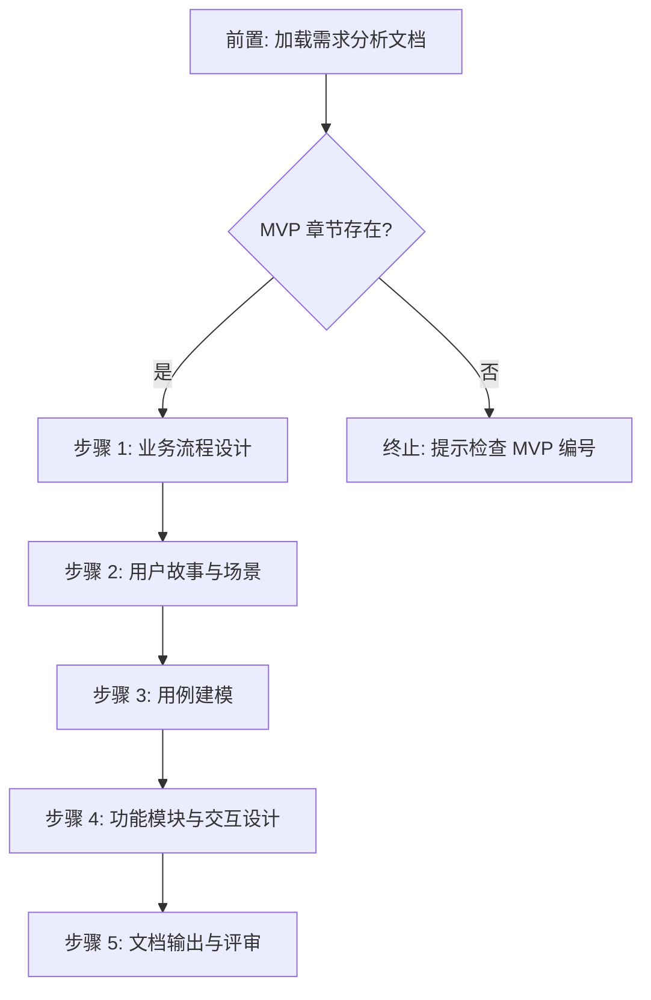

# 五步工作流详细规范

sdx-prd 技能的核心工作流算法。主文件 SKILL.md 中的工作流为摘要，本文件为完整规范。

---

## 流程总览



---

## 前置：加载需求分析文档

### 算法

1. **定位需求分析文档**：按 `--requirement` 参数或最新 `system/analysis/REQUIREMENT-*.md` 定位
2. **提取 MVP 范围**：从文档 §6 MVP 拆分方案中提取目标 MVP（`--mvp` 参数指定）的功能需求列表
3. **加载基线数据**：
   - 功能需求清单（FR-n）及其优先级、验收标准
   - 业务规则清单（BR-n）及其触发条件与执行逻辑
   - 非功能需求（§3）中与当前 MVP 相关的约束
   - 涉及角色列表

### 决策点

- **目标 MVP 章节不存在** → 终止，提示检查 MVP 编号
- **MVP 章节无功能需求列表** → 发出警告，基于全文档 FR-n 继续并标注风险

---

## 步骤 1：业务流程设计

### 角色

product-designer / ux-designer

### 输入

需求分析文档中当前 MVP 的功能需求（FR-n）、业务规则（BR-n）、核心场景描述

### 算法

1. **主流程绘制**：
   - 从 FR-n 的核心场景出发，识别主干流程步骤
   - 使用 Mermaid flowchart 绘制端到端流程
   - 每个步骤标注六要素：

| 要素 | 说明 | 输出位置 |
|------|------|---------|
| 步骤序号 | 流程中的顺序位置 | §2.1 流程步骤说明表 |
| 参与角色 | 执行该步骤的用户角色 | §2.1 |
| 输入 | 步骤所需的数据或前提 | §2.1 |
| 处理逻辑 | 步骤执行的核心操作 | §2.1 |
| 输出 | 步骤产出的数据或状态变更 | §2.1 |
| 业务规则 | 关联的 BR-n 编号 | §2.1 |

2. **分支与异常流程**：
   - 识别判断节点与分支条件
   - 编制异常场景清单（EX-n）：

| 属性 | 说明 |
|------|------|
| 编号 | EX-{NNN}，连续编号 |
| 异常描述 | 异常的业务含义 |
| 触发条件 | 何种情况下触发 |
| 处理方式 | 系统如何响应 |
| 用户提示 | 给用户的反馈信息 |

3. **跨系统交互**：
   - 识别涉及外部系统/服务的步骤
   - 使用 Mermaid sequenceDiagram 绘制交互时序
   - 标注同步/异步、超时处理、回调机制

### 决策点

- **FR-n 涉及多条独立业务流程** → 每条流程独立绘制，在 §2 中分小节呈现
- **跨系统交互复杂度高** → 主流程与交互流程分开绘制，避免单图过载

### 产出

业务流程设计（对应文档 §2）。

---

## 步骤 2：用户故事与场景

### 角色

product-designer

### 输入

步骤 1 产出 + 需求分析文档的 FR-n 清单与 BR-n 清单

### 算法

1. **用户故事编写**：
   - 为当前 MVP 范围内的每个 FR-n 编写至少一个用户故事
   - 格式：「作为 {角色}，我希望 {功能}，以便 {价值}」
   - 每个故事编号 US-{NNN}，关联 FR-n

| 属性 | 说明 |
|------|------|
| 编号 | US-{NNN}，连续编号 |
| 用户故事 | 作为…我希望…以便… |
| 优先级 | 继承 FR-n 的 P0–P3 |
| 故事点 | 参考团队历史速率估算 |
| 关联需求 | FR-{NNN} |

2. **验收标准编写**：
   - 每个 US-n 至少一个正常场景 + 一个异常场景
   - 使用 Given-When-Then（Gherkin）格式：

```gherkin
场景: {场景名称}
  假设 {前置条件}
  当 {触发动作}
  那么 {预期结果}
```

3. **INVEST 校验**：

| 原则 | 检查项 |
|------|--------|
| Independent | 故事间无强耦合，可独立开发 |
| Negotiable | 实现细节可协商，非技术规格 |
| Valuable | 对用户或业务有明确价值 |
| Estimable | 团队可估算工作量 |
| Small | 可在单迭代内完成 |
| Testable | 验收标准可自动化或手动验证 |

4. **补充说明**：关联业务规则（BR-n）、界面要求、性能要求

### 决策点

- **单个 FR-n 粒度过大** → 拆分为多个 US-n，确保每个可独立交付
- **跨角色故事** → 按角色视角拆分，避免单个故事涉及多角色

### 产出

用户故事与场景清单（对应文档 §4）。

---

## 步骤 3：用例建模

### 角色

product-designer

### 输入

步骤 1–2 产出

### 算法

1. **用例图绘制**：
   - 使用 Mermaid graph 绘制参与者与用例关系
   - 标注包含（include）与扩展（extend）关系
   - 确保所有角色（§1.3）均出现在用例图中

2. **用例描述编写**：

| 属性 | 说明 |
|------|------|
| 用例编号 | UC-{NNN}，连续编号 |
| 用例名称 | 动词短语（如「创建申诉单」） |
| 参与者 | 主要参与者与辅助参与者 |
| 前置条件 | 执行前必须满足的条件 |
| 后置条件 | 成功执行后的系统状态 |
| 触发条件 | 启动用例的事件 |

3. **主成功场景**：
   - 按步骤编号描述正常流程（不超过 9 步）
   - 每步格式：`{序号}. {参与者} {动作} → {系统响应}`

4. **扩展场景**：
   - 格式：`{步骤号}a. {异常条件}：{处理步骤}`
   - 聚焦业务异常，技术异常留给 ADD

5. **用例-故事映射**：
   - 确保每个 UC-n 可映射到至少一个 US-n
   - 确保每个 US-n 至少被一个 UC-n 覆盖

### 决策点

- **用例数量过多（>15）** → 按功能模块分组，使用子用例图
- **存在孤立用例（无 US 映射）** → 检查是否遗漏用户故事或用例超出 MVP 范围

### 产出

用例模型（对应文档 §5）。

---

## 步骤 4：功能模块与交互设计

### 角色

product-designer / ux-designer

### 输入

步骤 1–3 全部产出

### 算法

1. **功能模块划分**：
   - 按业务职责划分模块，使用 Mermaid graph 绘制模块关系图
   - 每个模块记录：

| 属性 | 说明 |
|------|------|
| 模块名称 | 描述性名称 |
| 职责 | 模块的核心职责 |
| 包含功能 | US-n 列表 |
| 输入/输出 | 模块的数据接口 |
| 依赖模块 | 被依赖与依赖的模块 |

2. **交互设计**：
   - 信息架构：从用户任务目标出发组织功能入口
   - 操作流程：使用 Mermaid journey 或 flowchart 描绘用户操作路径
   - 校验与反馈：列出关键校验节点、成功/失败反馈方式
   - 原型链接：如有交互设计稿，附上链接

3. **业务规则汇总**：
   - 将步骤 1–3 中散落的业务规则集中汇总到 §7
   - 每条规则包含：

| 属性 | 说明 |
|------|------|
| 规则编号 | BR-{NNN}（继承自需求分析） |
| 规则名称 | 描述性名称 |
| 触发条件 | 何时触发该规则 |
| 执行逻辑 | 规则的具体处理 |
| 异常处理 | 规则不满足时的处理 |
| 优先级 | 规则间冲突时的优先级 |
| 关联用例 | UC-{NNN} |

4. **数据字典**：
   - 业务术语定义（§8.1）
   - 状态定义与状态流转（§8.2）

5. **验收标准汇总**：
   - 功能验收标准（AC-n）：关联 US-n
   - 非功能验收标准（NAC-n）：关联非功能需求

### 产出

功能模块与交互设计 + 业务规则汇总 + 数据字典 + 验收标准（对应文档 §3、§6–§9）。

---

## 步骤 5：文档输出与评审

### 角色

technical-writer + doc-updater

### 输入

步骤 1–4 全部产出 + [.ai/skills/sdx-prd/assets/prd-template.md](../assets/prd-template.md)

### 算法

1. **整合**：将步骤 1–4 产出按模板十章结构编排
2. **填充 frontmatter**：
   - `id`: 按 `PRD-{ID}-{N}` 格式（{ID} 为需求分析编号中的 ID 部分，{N} 为 MVP 序号）
   - `status`: `draft`
   - `created` / `updated`: 当前日期
   - `parent`: 关联的需求分析编号
   - `mvp_phase`: `MVP-{N}`
3. **补充附录**（§10）：
   - 原型/线框图链接（§10.1）
   - 变更历史（§10.2）
   - 质量自查表（§10.3）
4. **质量门禁自查**：逐项检查 [.ai/skills/sdx-prd/assets/quality-gate-checklist.md](../assets/quality-gate-checklist.md)
5. **输出**：写入 `system/requirements/REQUIREMENT-{ID}/MVP-{N}/PRD-{ID}-{N}.md`

### 输出目录

```
system/requirements/
└── REQUIREMENT-{ID}/
    └── MVP-{N}/
        └── PRD-{ID}-{N}.md
```

目录不存在时自动创建。

### 产出

完整 PRD 文档 + 质量门禁自查结果。

---

## 步间数据流

```
前置: 加载需求分析
  ├─→ FR-n 清单（当前 MVP 范围）
  ├─→ BR-n 清单
  ├─→ 非功能需求
  └─→ 角色列表

步骤 1 产出
  ├─→ §2 业务流程（主流程、分支异常、系统交互）
  └─→ [传递到步骤 2]

步骤 2 产出
  ├─→ §4 用户故事（US-n + 验收标准）
  └─→ [传递到步骤 3]

步骤 3 产出
  ├─→ §5 用例模型（UC-n + 用例图）
  └─→ [传递到步骤 4]

步骤 4 产出
  ├─→ §1 产品概述
  ├─→ §3 产品交互
  ├─→ §6 功能模块设计
  ├─→ §7 业务规则汇总
  ├─→ §8 数据字典
  └─→ §9 验收标准汇总

步骤 5 整合
  └─→ §1–§10 完整文档
```
