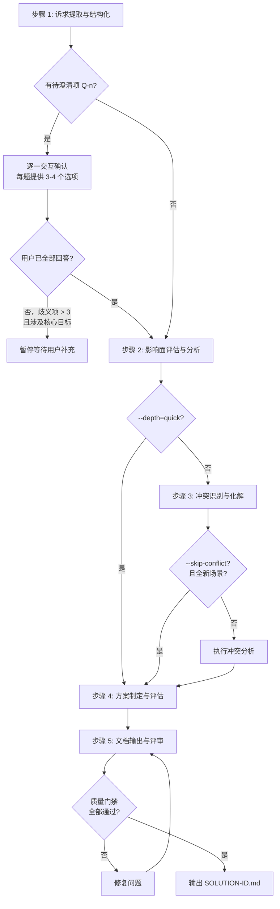

# 五步工作流详细规范

sdx-solution 技能的核心工作流算法。主文件 SKILL.md 中的工作流为摘要，本文件为完整规范。

---

## 流程总览



---

## 步骤 1：诉求提取与结构化

### 输入

业务需求描述（邮件、会议纪要、工单、口头记录等原始来源）

### 算法

1. **通读原始描述**：标记关键词、数字指标、角色提及、时间约束
2. **萃取六要素**：

| 要素 | 提取规则 | 输出位置 |
|------|---------|---------|
| 业务背景与动机 | 回答「为什么要做」，提取问题/痛点 | §1 业务背景 |
| 业务目标与期望价值 | 提取可度量指标（KPI、OKR），编号 G-n | §2 业务目标 |
| 核心业务场景 | 提取用户操作主流程 | §3.1 核心业务场景 |
| 涉及用户角色 | 提取角色及其关注点 | §3.2 涉及用户角色 |
| 关键约束条件 | 提取业务/技术/资源约束 | §3.3 关键约束条件 |
| 时间与优先级 | 提取里程碑、截止日期 | §3.4 交付排期要求 |

3. **歧义标注**：对每个不明确点编号 Q-n，填入 §3.5
4. **需求分类**：对每条需求标注类型标签

| 维度 | 分类 |
|------|------|
| 性质 | 功能需求 / 非功能需求 |
| 变更类型 | 新增 / 变更 / 修复 |
| 优先级 | P0（必须）/ P1（重要）/ P2（一般）/ P3（可选） |

5. **待澄清项交互确认**：见下方「待澄清项交互确认协议」

### 待澄清项交互确认协议

提取完 Q-n 列表后，**不得直接假设答案继续执行**，须按以下协议逐一与用户确认：

#### 触发条件

- 存在任意 Q-n 项时，均须执行本协议
- 歧义项 > 3 且涉及核心目标时，须在确认完所有问题后才能继续

#### 交互格式

每次只提一个问题，格式如下：

```
**Q-{N}（{影响范围}）**：{问题描述}

> {背景说明：为什么需要澄清这个问题，以及不同答案对方案的影响}

请选择（也可直接输入您的想法）：

A. {选项A描述}
B. {选项B描述}
C. {选项C描述}
D. {选项D描述，如有必要}
E. 其他（请说明）
```

#### 选项设计原则

- **选项数量**：每题提供 3–4 个选项（+ 「其他」兜底），不超过 5 个
- **选项互斥**：选项之间不重叠，覆盖主要可能性
- **选项具体**：每个选项描述具体的业务含义，不写「方案A/方案B」等无意义标签
- **有推荐项**：在选项后标注 `（推荐）` 表示 Agent 基于现有信息的倾向，但不强制
- **兜底选项**：最后一项始终为「其他（请说明）」，支持用户自由输入

#### 示例

```
**Q-1（影响 MVP 拆分）**：申诉单的审核流程是否需要支持多级审批？

> 当前描述中提到「审核通过后结算」，但未说明是单人审核还是多级审批。
> 若为多级审批，MVP-1 的工作量将显著增加，建议拆分为两个 MVP。

请选择（也可直接输入您的想法）：

A. 单人审核，一票通过即可（推荐，MVP 最简）
B. 两级审核，初审 + 终审
C. 多级审核，审批链可配置
D. 其他（请说明）
```

#### 处理用户回答

| 用户回答类型 | 处理方式 |
|------------|---------|
| 选择 A/B/C/D | 记录答案，更新 Q-n 状态为「已确认」，继续下一题 |
| 选择「其他」并说明 | 将用户说明记录为答案，更新状态，继续下一题 |
| 回答不完整或有新歧义 | 追问一次，仍不清晰则标注「部分确认」并记录已知信息 |
| 明确表示「跳过」 | 标注为「用户跳过，保留待澄清」，继续下一题 |
| 一次性回答多题 | 逐一匹配并记录，对未覆盖的题目继续提问 |

#### 确认完成后

所有 Q-n 处理完毕（已确认 / 用户跳过）后：
1. 输出确认摘要：列出每个 Q-n 的最终状态与答案
2. 将已确认答案更新到 §3.5 对应行（状态改为「已确认」）
3. 将「用户跳过」项保留为「待澄清」，在文档中标注影响
4. 进入步骤 2

### 决策点

- **所有 Q-n 已确认或跳过** → 进入步骤 2
- **歧义项 > 3 且涉及核心目标，且用户未回答** → 暂停，等待用户补充

### 产出

结构化需求提取报告（对应文档 §1–§3）+ Q-n 确认摘要

---

## 步骤 2：影响面评估与分析

### 输入

步骤 1 产出 + `knowledge/`（按需加载相关视角）

### 算法

1. **识别直接影响**：从核心业务场景出发，匹配 knowledge 中的 MS-*、API-*、ENT-* 实体（内部分析用，写入文档时转为业务表述）
2. **追踪间接影响**：沿业务流程/协作链追踪，标注传播路径
3. **评估影响程度**：

| 程度 | 判定标准 |
|------|---------|
| 高 | 核心业务流程变更、主要用户角色受影响、数据口径变化 |
| 中 | 分支流程调整、次要角色受影响、配置变更 |
| 低 | 展示调整、辅助功能变更、日志增强 |

4. **分类影响类型**：新增 / 变更 / 依赖
5. **覆盖四个维度**：功能影响、数据影响、接口影响（对外承诺变化）、下游影响（协作方/依赖方）

### depth 参数影响

| depth | 行为 |
|-------|------|
| quick | 仅识别直接影响，跳过间接传播追踪，合并入步骤 4；至少列出高影响项 |
| standard | 完整直接+间接影响分析 |
| deep | 增加数据影响分析（字段变化、历史数据处理、向后兼容） |

### 产出

影响面评估报告（对应文档 §4）

---

## 步骤 3：冲突识别与化解

### 输入

步骤 1–2 产出 + 现有规约（`requirements/.../specs/`）+ 架构文档

### 算法

1. **业务冲突扫描**：

| 冲突类型 | 检查对象 |
|----------|---------|
| 规则冲突 | 新需求 vs 现有业务规则（knowledge/business/） |
| 流程冲突 | 新流程 vs 现有流程步骤或审批链 |
| 数据冲突 | 新数据语义 vs 现有数据口径（knowledge/data/） |

2. **系统冲突扫描**（内部分析，写入文档时转为业务表述）：

| 冲突类型 | 检查对象 |
|----------|---------|
| 模型冲突 | 新实体 vs 现有领域模型 |
| 接口冲突 | 新接口 vs 现有 API 契约（API-*） |
| 资源冲突 | 新需求 vs 共享资源（数据库、MQ、缓存） |

3. **冲突编号**：业务冲突 C-n，系统冲突 C-Tn
4. **化解方案**：每个冲突给出至少一个化解方案，高严重度提供备选
5. **成本/风险评估**：区分一次性成本与持续成本，评估残余风险

### skip-conflict 参数

`--skip-conflict=true` 时跳过本步骤。**仅在以下条件同时满足时合法使用**：
- 全新业务场景，无已有系统交互
- 用户明确确认无需冲突分析

存在已有系统时，即使传入该参数也须发出警告并执行冲突分析。

### 产出

冲突分析报告（对应文档 §5）

---

## 步骤 4：方案制定与评估

### 输入

步骤 1–3 全部产出

### 算法

1. **目标可度量化**：为每个 G-n 补充度量指标与目标值
2. **阐述解决思路**：整体策略（§6.1）
3. **关键决策记录**：推荐方案 + 备选方案 + 决策理由（§6.2）
4. **方案对比**（若多方案）：至少四维度——实现复杂度、影响范围、风险程度、可扩展性（§6.3）
5. **范围界定**：明确 In Scope / Out of Scope 及排除原因（§6.4）
6. **可行性评估**：技术可行性（业务语言表述）+ 资源评估 + 风险登记 R-n（§7）
7. **MVP 拆分建议**：按独立业务价值拆分，标注依赖关系（§8）

### MVP 拆分原则

- 每个 MVP 具备独立的业务交付价值，可独立演示给业务方
- MVP 间依赖单向（MVP-N+1 可依赖 MVP-N，反向禁止）
- 核心/高价值功能优先
- 自问「这个 MVP 能解决什么业务问题」，答不上来则重拆

### 产出

解决方案核心内容（对应文档 §6–§8）

---

## 步骤 5：文档输出与评审

### 输入

步骤 1–4 全部产出 + [../assets/solution-template.md](../assets/solution-template.md)

### 算法

1. **整合**：将步骤 1–4 产出按模板九章结构编排
2. **填充 frontmatter**：

| 字段 | 规则 |
|------|------|
| `id` | 格式 `SOLUTION-{YYYYMMDD}-{SEQ}`，如 `SOLUTION-20260327-001` |
| `title` | 解决方案标题 |
| `version` | 初始为 `1.0.0` |
| `status` | 初始为 `draft` |
| `created` / `updated` | 当前日期（YYYY-MM-DD） |
| `author` | Agent 名称 |

3. **语言审查**：通读全文，将技术术语转写为业务表述（参照 [audience-language-spec.md](audience-language-spec.md)）
4. **补充附录**：术语表（§9.1）、参考文档（§9.2）
5. **质量门禁自查**：逐项检查 [../assets/quality-gate-checklist.md](../assets/quality-gate-checklist.md)
6. **输出**：写入 `system/solutions/SOLUTION-{ID}.md`

### 输出目录

```
system/solutions/
└── SOLUTION-{YYYYMMDD}-{SEQ}.md
```

目录不存在时自动创建。

### 产出

完整解决方案文档 + 质量门禁自查结果

---

## 步间数据流

```
步骤 1 产出
  ├─→ §1 业务背景
  ├─→ §2 业务目标（G-n 初稿）
  ├─→ §3 需求概述（含 Q-n 确认摘要）
  └─→ [传递到步骤 2]

步骤 2 产出
  ├─→ §4 影响面评估
  └─→ [传递到步骤 3]

步骤 3 产出
  ├─→ §5 冲突分析（C-n / C-Tn）
  └─→ [传递到步骤 4]

步骤 4 产出
  ├─→ §2 业务目标（G-n 补充度量指标）
  ├─→ §6 解决方案
  ├─→ §7 可行性评估（R-n）
  └─→ §8 MVP 拆分建议

步骤 5 整合
  └─→ §1–§9 完整文档（含语言审查与质量门禁）
```
