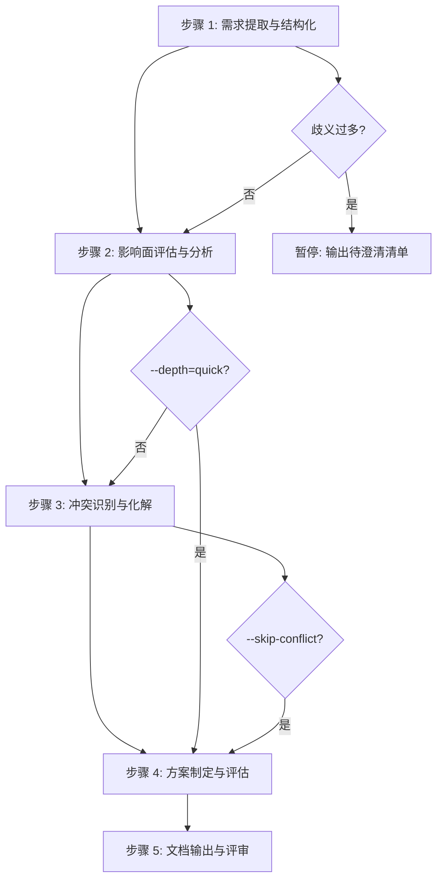

# 五步工作流详细规范

sdx-solution 技能的核心工作流算法。主文件 SKILL.md 中的工作流为摘要，本文件为完整规范。

---

## 流程总览



---

## 步骤 1：需求提取与结构化

### 角色

solution-analyst 或 requirements-analyst

### 输入

业务需求描述（邮件、会议纪要、工单、口头记录等原始来源）

### 算法

1. **通读原始描述**：标记关键词、数字指标、角色提及、时间约束
2. **萃取六要素**：

| 要素 | 提取规则 | 输出位置 |
|------|---------|---------|
| 业务背景与动机 | 回答「为什么要做」，提取问题/痛点 | §1 业务背景 |
| 业务目标与期望价值 | 提取可度量指标（KPI、OKR），编号 G-n | §2 业务目标 |
| 核心业务场景 | 提取用户操作主流程 | §3.1 核心业务场景 |
| 涉及用户角色 | 提取角色及其关注点 | §3.2 涉及用户角色 |
| 关键约束条件 | 提取业务/技术/资源约束 | §3.3 关键约束条件 |
| 时间与优先级 | 提取里程碑、截止日期 | §3.4 交付排期要求 |

3. **歧义标注**：对每个不明确点编号 Q-n，填入 §3.5
4. **需求分类**：对每条需求标注类型标签

| 维度 | 分类 |
|------|------|
| 性质 | 功能需求 / 非功能需求 |
| 变更类型 | 新增 / 变更 / 修复 |
| 领域 | 业务需求 / 技术需求 |

### 决策点

- **歧义项 > 3 且涉及核心目标** → 暂停，输出已提取结构化信息与待澄清清单
- **歧义项 ≤ 3 且不涉及核心目标** → 继续，在 §3.5 标注后进入步骤 2

### 产出

结构化需求提取报告（对应文档 §1–§3）。

---

## 步骤 2：影响面评估与分析

### 角色

solution-analyst / requirements-analyst + quality-guardian / quality-engineer

### 输入

步骤 1 产出 + `knowledge/`（按需加载相关视角）

### 算法

1. **识别直接影响**：从核心业务场景出发，匹配 knowledge 中的 MS-*、API-*、ENT-* 实体
2. **追踪间接影响**：沿调用链/数据流追踪，标注传播路径
3. **评估影响程度**：

| 程度 | 判定标准 |
|------|---------|
| 高 | 核心流程变更、数据模型修改、接口契约变更 |
| 中 | 分支流程调整、配置变更、非核心字段修改 |
| 低 | 展示调整、日志增强、辅助功能变更 |

4. **分类影响类型**：新增 / 变更 / 依赖
5. **绘制传播路径**：`[直接影响服务] → [间接影响服务] → [可能波及服务]`

### depth 参数影响

| depth | 行为 |
|-------|------|
| quick | 仅识别直接影响，跳过间接传播追踪，合并入步骤 4 |
| standard | 完整直接+间接影响分析 |
| deep | 增加数据影响分析（表结构、数据迁移、向后兼容） |

### 产出

影响面评估报告（对应文档 §4）。

---

## 步骤 3：冲突识别与化解

### 角色

solution-analyst 或 requirements-analyst

### 输入

步骤 1–2 产出 + 现有规约（`requirements/.../specs/`）+ 架构文档

### 算法

1. **业务冲突扫描**：

| 冲突类型 | 检查对象 |
|----------|---------|
| 规则冲突 | 新需求 vs 现有业务规则（knowledge/business/） |
| 流程冲突 | 新流程 vs 现有流程步骤或审批链 |
| 数据冲突 | 新数据模型 vs 现有实体关系（knowledge/data/） |

2. **系统冲突扫描**：

| 冲突类型 | 检查对象 |
|----------|---------|
| 模型冲突 | 新实体 vs 现有领域模型 |
| 接口冲突 | 新接口 vs 现有 API 契约（API-*） |
| 资源冲突 | 新需求 vs 共享资源（数据库、MQ、缓存） |

3. **冲突编号**：业务冲突 C-n，系统冲突 C-Tn
4. **化解方案**：每个冲突给出至少一个化解方案，高严重度提供备选
5. **成本/风险评估**：区分一次性成本与持续成本

### skip-conflict 参数

`--skip-conflict=true` 时跳过本步骤。仅在以下条件同时满足时建议使用：
- 全新业务场景，无已有系统交互
- 用户明确确认无需冲突分析

### 产出

冲突分析报告（对应文档 §5）。

---

## 步骤 4：方案制定与评估

### 角色

solution-analyst 或 requirements-analyst

### 输入

步骤 1–3 全部产出

### 算法

1. **目标可度量化**：为每个 G-n 补充度量指标与目标值
2. **阐述解决思路**：整体策略（§6.1）
3. **关键决策记录**：推荐方案 + 备选方案 + 决策理由（§6.2）
4. **方案对比**（若多方案）：至少四维度——实现复杂度、影响范围、风险程度、可扩展性（§6.3）
5. **范围界定**：明确 In Scope / Out of Scope 及排除原因（§6.4）
6. **可行性评估**：技术可行性 + 资源评估 + 风险登记 R-n（§7）
7. **MVP 拆分建议**：按独立业务价值拆分，标注依赖关系（§8）

### MVP 拆分原则

- 每个 MVP 具备独立的业务交付价值
- MVP 间依赖单向（MVP-N+1 可依赖 MVP-N，反向禁止）
- 核心/高价值功能优先
- 技术基础设施类工作随首个消费 MVP 一并交付

### 产出

解决方案核心内容（对应文档 §6–§8）。

---

## 步骤 5：文档输出与评审

### 角色

technical-writer + doc-updater

### 输入

步骤 1–4 全部产出 + [solution-template.md](../../../rules/solution/solution-template.md)

### 算法

1. **整合**：将步骤 1–4 产出按模板九章结构编排
2. **填充 frontmatter**：
   - `id`: 按 `SOLUTION-{YYYYMMDD}-{SEQ}` 格式
   - `status`: `draft`
   - `created` / `updated`: 当前日期
   - `dependencies`: 引用的已有文档编号
3. **补充附录**：术语表（§9.1）、参考文档（§9.2）
4. **质量门禁自查**：逐项检查 [quality-gate-checklist.md](../assets/quality-gate-checklist.md)
5. **输出**：写入 `docs/solutions/SOLUTION-{ID}.md`

### 输出目录

```
docs/solutions/
└── SOLUTION-{YYYYMMDD}-{SEQ}.md
```

目录不存在时自动创建。

### 产出

完整解决方案文档 + 质量门禁自查结果。

---

## 步间数据流

```
步骤 1 产出
  ├─→ §1 业务背景
  ├─→ §2 业务目标
  ├─→ §3 需求概述
  └─→ [传递到步骤 2]

步骤 2 产出
  ├─→ §4 影响面评估
  └─→ [传递到步骤 3]

步骤 3 产出
  ├─→ §5 冲突分析
  └─→ [传递到步骤 4]

步骤 4 产出
  ├─→ §6 解决方案
  ├─→ §7 可行性评估
  └─→ §8 MVP 拆分建议

步骤 5 整合
  └─→ §1–§9 完整文档
```
