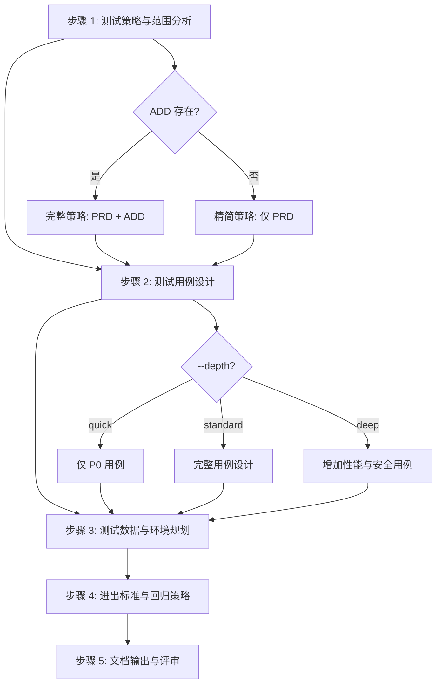

# 五步工作流详细规范

sdx-test 技能的核心工作流算法。主文件 SKILL.md 中的工作流为摘要，本文件为完整规范。

---

## 流程总览



---

## 步骤 1：测试策略与范围分析

### 角色

quality-engineer

### 输入

产品需求文档（`PRD-{ID}.md`）+ 架构设计文档（`ADD-{ID}.md`，如存在）

### 算法

1. **通读 PRD**：提取用户故事清单（US-n）、验收标准、业务规则（BR-n）、非功能需求
2. **通读 ADD**（如存在）：提取 API 规约、组件设计、数据模型变更、影响面分析
3. **确定测试层次**：

| 测试层次 | 适用范围 | 覆盖目标 |
|----------|---------|---------|
| 单元测试 | 核心业务逻辑、领域模型、工具方法 | 行覆盖率 ≥ 80% |
| 集成测试 | API 接口、数据库操作、MQ 消费、RPC 调用 | 接口覆盖率 100% |
| 端到端测试 | 核心业务流程（主流程 + 关键分支） | 核心场景覆盖率 100% |

4. **划定测试范围**：

| 范围类型 | 识别方法 |
|----------|---------|
| 新增功能 | PRD 中新增的用户故事（无对应现有功能） |
| 变更功能 | PRD 中变更的用户故事（有对应现有功能） |
| 回归范围 | ADD 影响面分析中标注的受影响功能 |

5. **识别测试风险**：

| 风险维度 | 关注点 |
|----------|--------|
| 复杂度 | 业务规则复杂、多分支逻辑 |
| 数据一致性 | 跨数据源操作、分布式事务 |
| 并发安全 | 分布式锁、幂等性 |
| 外部依赖 | 第三方 RPC、MQ 消息 |
| 性能瓶颈 | 大批量操作、复杂查询 |

### 产出

测试策略与范围（对应文档 §1）。

---

## 步骤 2：测试用例设计

### 角色

quality-engineer

### 输入

步骤 1 产出 + PRD 用户故事详述 + ADD API 规约 + 业务规则

### 算法

1. **功能测试用例**（§2.1）：

| 设计维度 | 来源 | 编号前缀 |
|----------|------|---------|
| 用户故事验收标准 | PRD US-n 的 Given-When-Then | TC-{NNN} |
| 正常场景 | 主成功流程 | TC-{NNN} |
| 备选场景 | 备选流程 | TC-{NNN} |

   每个用例包含：用例编号、测试场景、前置条件、测试步骤、预期结果、优先级、关联故事。

2. **接口测试用例**（§2.2）：

| 测试维度 | 用例场景 |
|----------|---------|
| 正常请求 | 必填参数齐全、数据合法 |
| 参数缺失 | 必填字段缺失 |
| 参数非法 | 类型错误、超长、特殊字符 |
| 权限校验 | 未认证、无权限、跨租户 |
| 幂等性 | 重复请求同一操作 |
| 并发控制 | 同一资源并发操作 |

   每个用例包含：用例编号、API、测试场景、请求数据、预期响应、优先级。

3. **业务规则测试用例**（§2.3）：

   对每个 BR-n 设计：
   - 规则触发条件的等价类划分
   - 边界值分析
   - 规则组合/冲突场景

   每个用例包含：用例编号、业务规则、测试场景、输入条件、预期结果、优先级。

4. **异常场景测试用例**（§2.4）：

| 异常类型 | 典型场景 |
|----------|---------|
| 系统异常 | 服务不可用、超时、网络中断 |
| 数据异常 | 数据不一致、脏数据、空值 |
| 并发异常 | 死锁、竞态条件 |
| 依赖异常 | 外部服务降级、MQ 积压 |

5. **性能测试用例**（§2.5，`--depth=deep` 或非功能需求要求时）：

   每个用例包含：用例编号、测试场景、并发量、预期指标（响应时间、吞吐量、资源占用）。

6. **回归测试用例**（§2.6）：

   基于步骤 1 的回归范围，从现有功能中提取关键用例，标注回归原因与影响路径。

### depth 参数影响

| depth | 行为 |
|-------|------|
| quick | 仅设计 P0 功能用例与核心接口用例，跳过性能与详细异常用例 |
| standard | 完整功能/接口/规则/异常/回归用例设计 |
| deep | 增加性能测试用例、安全测试用例、详细并发场景 |

### 产出

测试用例清单（对应文档 §2）。

---

## 步骤 3：测试数据与环境规划

### 角色

quality-engineer

### 输入

步骤 1–2 产出 + ADD 数据模型

### 算法

1. **测试数据需求**（§3）：

| 分析维度 | 内容 |
|----------|------|
| 数据类型 | 枚举测试用例所需的数据类型 |
| 数据量 | 功能测试（少量）、性能测试（批量） |
| 数据关联 | 多实体间的关联数据 |
| 特殊数据 | 边界值、极端值、异常数据 |

2. **数据准备方式**：

| 方式 | 适用场景 |
|------|---------|
| 脚本生成 | 批量数据、格式化数据、性能测试数据 |
| 手工准备 | 少量特殊数据、业务场景数据 |
| 生产脱敏 | 需真实数据分布、敏感数据场景 |

3. **测试环境要求**（§4）：

| 环境项 | 分析内容 |
|--------|---------|
| 服务版本 | 被测服务及依赖服务版本 |
| 数据库 | 类型、版本、分片配置 |
| 中间件 | MQ、缓存、注册中心 |
| 外部依赖 | 第三方服务 Mock / Stub 策略 |

### 产出

测试数据与环境说明（对应文档 §3–§4）。

---

## 步骤 4：进出标准与回归策略

### 角色

quality-engineer

### 输入

步骤 1–3 产出

### 算法

1. **进入标准**（§5.1）：

| 标准项 | 说明 |
|--------|------|
| 代码就绪 | 开发完成并通过代码审查 |
| 单测达标 | 单元测试通过且覆盖率达到目标 |
| 环境就绪 | 测试环境部署完成且可用 |
| 数据就绪 | 测试数据准备完成 |
| 文档就绪 | PRD / ADD / 规约可参考 |

2. **退出标准**（§5.2）：

| 标准项 | 说明 |
|--------|------|
| 用例通过 | 所有 P0/P1 测试用例通过 |
| 缺陷清零 | 无未解决的 P0/P1 缺陷 |
| 回归通过 | 回归测试全部通过 |
| 性能达标 | 性能测试达标（如适用） |
| 覆盖达标 | 测试覆盖率满足策略目标 |

3. **回归策略**：

   - 从 ADD 影响面分析确定直接和间接回归范围
   - 核心业务流程的回归用例优先级设为 P0
   - 制定回归执行顺序：核心流程 → 直接影响 → 间接影响

### 产出

进出标准与回归策略（对应文档 §5 + §2.6 回归用例细化）。

---

## 步骤 5：文档输出与评审

### 角色

technical-writer + doc-updater

### 输入

步骤 1–4 全部产出 + [tdd-template.md](../../../rules/requirement/tdd-template.md)

### 算法

1. **整合**：将步骤 1–4 产出按模板六章结构编排
2. **填充 frontmatter**：
   - `id`: 按 `TDD-{REQUIREMENT-ID}-MVP{N}` 格式
   - `status`: `draft`
   - `created` / `updated`: 当前日期
   - `parent`: 关联的 PRD 编号 `PRD-{ID}`
   - `mvp_phase`: `MVP-{N}`
3. **补充附录**：变更历史（§6.1）
4. **质量门禁自查**：逐项检查 [quality-gate-checklist.md](../assets/quality-gate-checklist.md)
5. **输出**：写入 `docs/requirements/REQUIREMENT-{ID}/MVP-{N}/TDD-{ID}-{N}.md`

### 输出目录

```
docs/requirements/REQUIREMENT-{ID}/
└── MVP-{N}/
    └── TDD-{REQUIREMENT-ID}-MVP{N}.md
```

目录不存在时自动创建。

### 产出

完整测试设计文档 + 质量门禁自查结果。

---

## 步间数据流

```
步骤 1 产出
  ├─→ §1.1 测试目标
  ├─→ §1.2 测试范围
  ├─→ §1.3 测试策略
  └─→ [传递到步骤 2]

步骤 2 产出
  ├─→ §2.1 功能测试用例
  ├─→ §2.2 接口测试用例
  ├─→ §2.3 业务规则测试用例
  ├─→ §2.4 异常场景测试用例
  ├─→ §2.5 性能测试用例
  ├─→ §2.6 回归测试用例
  └─→ [传递到步骤 3]

步骤 3 产出
  ├─→ §3 测试数据
  ├─→ §4 测试环境
  └─→ [传递到步骤 4]

步骤 4 产出
  ├─→ §5.1 进入标准
  └─→ §5.2 退出标准

步骤 5 整合
  └─→ §1–§6 完整文档
```
