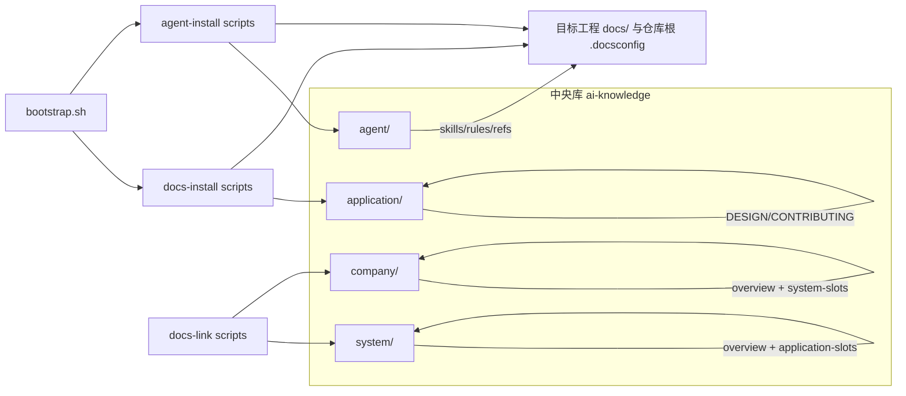
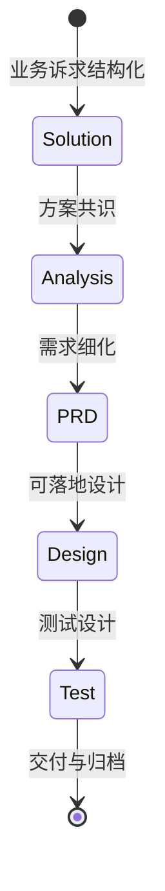

# ai-knowledge INDEX-GUIDE

> **最后更新**: 2026-09-11  
> **扫描**: `full` · `depth=3` · 输出根单元  
> **文档定位**: 面向 AI Agent 与维护者的仓库根九章索引指南；目录索引页见 [index.md](index.md)，与 [application/index.md](application/index.md)、[system/index.md](system/index.md)、[company/index.md](company/index.md) 互为补充。

---

## 一、项目概览（Project Overview）

### 1.1 速查表

| 组件 | 路径 | 描述 |
| ------ | ------ | ------ |
| 九章索引指南 | [INDEX-GUIDE.md](INDEX-GUIDE.md) | 仓库根唯一九章地图与路径索引 |
| 目录索引页 | [index.md](index.md) | 仓库根目录索引与导航入口 |
| 人类入口 | [README.md](README.md) | 克隆、bootstrap、`docs-install`/`agent-install` 与协作总览 |
| 从零落地 | [quick-start.md](quick-start.md) | 场景 A–D 选型与逐步操作（canonical SSOT） |
| Agent 契约 | [AGENTS.md](AGENTS.md) | 角色、索引查阅顺序、提交闸门与禁止事项 |
| 应用侧知识主库 | [application/README.md](application/README.md) | SDD 主线、五视角、实现登记与应用层实体主库 |
| 应用侧目录索引 | [application/index.md](application/index.md) | 应用目录索引与 OKF 渐进披露入口 |
| 应用侧九章索引 | [application/INDEX-GUIDE.md](application/INDEX-GUIDE.md) | `application/` 文档根九章索引指南 |
| 系统知识库 | [system/README.md](system/README.md) | `knowledge/`（五视角 + overview）、`application-slots/application-{NAME}/` 联邦槽位、SDD |
| 系统侧目录索引 | [system/index.md](system/index.md) | `system/` 树内目录索引与 OKF 渐进披露入口 |
| 系统侧九章索引 | [system/INDEX-GUIDE.md](system/INDEX-GUIDE.md) | `system/` 文档根九章索引指南 |
| 公司知识库 | [company/README.md](company/README.md) | `knowledge/`（五视角企业架构）、`system-slots/system-{NAME}/` 联邦槽位、SDD 上游 |
| 公司侧目录索引 | [company/index.md](company/index.md) | `company/` 树内目录索引与 OKF 渐进披露入口 |
| 公司侧九章索引 | [company/INDEX-GUIDE.md](company/INDEX-GUIDE.md) | `company/` 文档根九章索引指南 |
| 初始化编排 | [bootstrap.sh](bootstrap.sh)、[agent/skills/README.md](agent/skills/README.md) | `/docs-install`、`/agent-install`、`/docs-link`；升级 `/docs-upgrade`；生态 skills 追新 `/skill-upgrade` |
| 规范与 Slash | [agent/rules/CONVENTIONS.md](agent/rules/CONVENTIONS.md)、[agent/skills/README.md](agent/skills/README.md) | 全局约定与 Skill 清单（**25** 个） |
| 共享推进契约 | [agent/references/](agent/references/) | 意图澄清 / 单元推进 / 烤干 / 轻流程 / 布局 / 会话路径 |
| 根索引运行日志 | [changelogs/INDEXING-LOG.md](changelogs/INDEXING-LOG.md) | 根输出组增量基线（本单元） |
| OKF bundle 与校验 | [agent/skills/docs-okf/SKILL.md](agent/skills/docs-okf/SKILL.md) | OKF refresh、validate-okf、viz；与九章 INDEX 双索引并存 |

### 1.2 元信息

- **项目名称**: `ai-knowledge`
- **核心定位**: 企业级全局知识底座（Markdown/YAML + Bash 初始化链）；**无业务应用运行时**
- **技术栈**: Markdown、YAML；Bash 5+；Git；可选 `curl`、`rsync`（脚本可回退 `cp`）；Python 3（Skill 辅助脚本）
- **语言/构建**: 不适用传统应用「启动类」；可运行项为 Bash 脚本与 `agent/scripts/tests/run.sh`、各 Skill `tests/run.sh`
- **仓库规模（git 已跟踪）**: 共 **773** 个文件；扩展名约 **588** `.md`、**99** `.sh`、**48** `.json`、**26** `.py`、**6** `.yaml`、**3** `.html`（统计来源：`git ls-files`，2026-09-11）
- **顶层文件分布**: `agent/` 496 · `system/` 122 · `company/` 83 · `application/` 62 · `changelogs/` 2 · 根跟踪文件 6（含 `.gitignore` / `.githooks` 各 1）
- **本仓 `.docsconfig`**: `DOC_DIR=docs`、`KNOWLEDGE_TYPE=company`；磁盘上 **无** `docs/` 目录（会话稿根约定，通常未入库）

---

## 二、架构视图（Architecture View）

### 2.1 模块结构

```text
./
├── README.md / AGENTS.md / INDEX-GUIDE.md / index.md / quick-start.md
├── changelogs/                 # 根输出组 INDEXING-LOG
├── application/                # 应用层 SSOT + SDD
│   ├── knowledge/              # 五视角实体（含 MS/DS/MW 等 EXAMPLE）
│   ├── solutions/ · analysis/ · requirements/ · adr/
│   ├── knowledge-links.yaml · viz.html · docs-meta.md
│   └── changelogs/
├── system/                     # 系统层 + overview + 联邦槽位
│   ├── knowledge/ · overview/
│   ├── application-slots/           # 应用联邦槽位根
│   │   ├── application-{NAME}/      # 软链 → 应用 DOC_ROOT（当前未挂载）
│   │   └── changelogs/
│   ├── knowledge-links.yaml · viz.html
│   └── solutions/ · analysis/ · requirements/ · adr/ · changelogs/
├── company/                    # 公司层 + overview + 联邦槽位
│   ├── knowledge/ · overview/
│   ├── system-slots/           # 系统联邦槽位根
│   │   ├── system-{NAME}/      # 软链 → 系统 DOC_ROOT（当前未挂载）
│   │   └── changelogs/
│   ├── knowledge-links.yaml · viz.html
│   └── solutions/ · analysis/ · adr/ · changelogs/
├── bootstrap.sh                # 远程/本地双轨装机编排
├── agent/                      # Agent 树：skills / rules / knowledge / references / scripts
│   ├── skills/                 # 25 个 Slash Skill（装机脚本亦在对应 skills/*/scripts/）
│   ├── scripts/                # 共享 Bash 库 + 回归 tests/
│   ├── rules/ · knowledge/ · references/
│   ├── hooks.json              # preToolUse 为空；旧 gate 已移除
│   └── hooks/                  # hooks 说明
└── .docsconfig                 # DOC_DIR=docs（目录可缺席）· KNOWLEDGE_TYPE=company
```

> **布局变更（相对 2026-07-20）**：根目录 `scripts/` **已移除**；`docs-install` / `agent-install` / `docs-link` 等脚本迁入 `agent/skills/<name>/scripts/`；共享库在 `agent/scripts/`。

### 2.2 依赖关系



### 2.3 包结构

本仓库非 JVM 工程；以**目录职责**代替包分层：

| 职责 | 落点 |
| ------ | ------ |
| 应用五视角实体 SSOT | `application/knowledge/{business,product,application,data,technical}/` |
| 系统/公司架构 + overview | `system/knowledge/`、`company/knowledge/`（含 `overview/`） |
| 治理与命名 / OKF 规范 | `agent/knowledge/`（`glossary`、`naming-conventions`、`okf-spec`、`knowledge-governance` 等） |
| 共享推进契约 | `agent/references/`（见 §9.1） |
| 可执行初始化 | `agent/skills/docs-install/scripts/`、`agent/skills/agent-install/scripts/`、`bootstrap.sh` + `agent/scripts/*.sh` |
| Slash 工作流 | `agent/skills/<name>/SKILL.md` |

### 2.4 文档目录

- **仓库根九章索引指南**: 本文件 [INDEX-GUIDE.md](INDEX-GUIDE.md)
- **根目录索引页**: [index.md](index.md)
- **根索引运行日志**: [changelogs/INDEXING-LOG.md](changelogs/INDEXING-LOG.md)
- **应用知识库**: [application/](application/) — [README](application/README.md) · [index](application/index.md) · [INDEX-GUIDE](application/INDEX-GUIDE.md) · [DESIGN](application/DESIGN.md) · [CONTRIBUTING](application/CONTRIBUTING.md)
- **系统知识库树**: [system/](system/) — [README](system/README.md) · [index](system/index.md) · [INDEX-GUIDE](system/INDEX-GUIDE.md) · [DESIGN](system/DESIGN.md)
- **公司知识库树**: [company/](company/) — [README](company/README.md) · [index](company/index.md) · [INDEX-GUIDE](company/INDEX-GUIDE.md) · [DESIGN](company/DESIGN.md)
- **子域运维日志**: `application|system|company/changelogs/`（各域自管 `INDEXING-LOG`）；变更溯源用 `git log` / `git diff`
- **会话工作稿根**（`.docsconfig` `DOC_DIR=docs`）: 约定 `docs/superpowers/specs/`；**当前工作树无 `docs/`**（通常未跟踪）
- **布局 SSOT**: [agent/references/knowledge-layout.md](agent/references/knowledge-layout.md)

---

## 三、接口清单（Interface Catalog）

本仓库为**文档与脚本型**仓库，**不提供** HTTP/RPC/消息等运行时接口。对外「契约」体现为文档、Slash Skill 与 Bash CLI。

### 3.1 服务接口

| 小节 | 状态 | 说明 |
| ------ | ------ | ------ |
| 3.1 服务接口 | [未索引] | 无 Dubbo/gRPC 类服务接口 |
| 3.2 HTTP 接口 | [未索引] | 无 REST 路由 |
| 3.3 定时任务 | [未索引] | 无内嵌调度；CI 若存在由外部平台配置 |
| 3.4 消息队列 | [未索引] | 无 Topic/消费者 |

### 3.2 CLI / Slash 入口

| 入口 | 类型 | 路径/命令 | 说明 |
| ------ | ------ | ----------- | ------ |
| `/docs-install` 脚本 | Bash | [agent/skills/docs-install/scripts/docs-install.sh](agent/skills/docs-install/scripts/docs-install.sh) | 知识库同步 + `.docsconfig` |
| `/agent-install` 脚本 | Bash | [agent/skills/agent-install/scripts/agent-install.sh](agent/skills/agent-install/scripts/agent-install.sh) | Agent 树安装 |
| `/docs-link` 脚本 | Bash | [agent/skills/docs-link/scripts/docs-link.sh](agent/skills/docs-link/scripts/docs-link.sh) | `knowledge-links.yaml` 登记 |
| `bootstrap.sh` | Bash | [bootstrap.sh](bootstrap.sh) | 远程 curl 后 clone；按 `--components` 编排 install |
| `/docs-upgrade` 脚本 | Bash | [agent/skills/docs-upgrade/scripts/docs-upgrade.sh](agent/skills/docs-upgrade/scripts/docs-upgrade.sh) | 已有库对齐元库清单/骨架（不清空） |
| `/skill-upgrade` | Skill | [agent/skills/skill-upgrade/SKILL.md](agent/skills/skill-upgrade/SKILL.md) | 已装 Agent 树 + 生态 skills 追新 |
| `/docs-*` · `/sdx-*` | Slash | [agent/skills/README.md](agent/skills/README.md) | 见 §9.3（25 个） |
| 共享库 / 回归 | Bash | [agent/scripts/](agent/scripts/) · [agent/scripts/tests/run.sh](agent/scripts/tests/run.sh) | `docs-core` / `config-bootstrap` / `test-core` 等 |

---

## 四、领域模型（Domain Model）

### 4.1 业务术语

| 术语 | 定义 | 使用场景 |
| ------ | ------ | ---------- |
| SSOT | 单一事实源；`application/` 为应用知识稳定事实中枢 | 与联邦镜像、目标工程对齐 |
| 五视角 | 业务 / 产品 / 应用 / 数据 / 技术 知识分层与映射字段 | [application/DESIGN.md](application/DESIGN.md) |
| 联邦治理 | `system/`、`company/` 槽位与迁移叙事；`system/application-slots/application-{NAME}/`、`company/system-slots/system-{NAME}/` | docs-link / docs-pull / distill |
| SDD | 方案 → 分析 → PRD/设计/测试 阶段交付链 | `sdx-*` Skill 与各层 `solutions/` 等 |
| 中央知识库挂载建联 | `docs-install --mode=central` 等约定 | [README.md](README.md)、[agent/skills/docs-install/SKILL.md](agent/skills/docs-install/SKILL.md) |
| 五架构视角 | 业务 / 产品 / 应用 / 技术 / 数据；`system\|company/knowledge/` 均按此组织 | docs-distill、docs-archive、overview |
| 语义族 / 轻流程 | 语义族绑意图澄清+烤干；轻流程用 `C/M/S/F`（无 `G`） | [agent/skills/README.md](agent/skills/README.md)、[light-flow-actions.md](agent/references/light-flow-actions.md) |
| OKF | 开放知识格式；concept / index / viz 与九章 INDEX 职责分离 | [agent/knowledge/okf-spec.md](agent/knowledge/okf-spec.md)、`/docs-okf` |

### 4.2 聚合根（知识组织）

| 聚合 | 职责 | 关键落点 |
| ------ | ------ | ---------- |
| 治理规则 | 三层边界；术语、原则、命名、ADR | [agent/knowledge/knowledge-governance.md](agent/knowledge/knowledge-governance.md)、[agent/knowledge/README.md](agent/knowledge/README.md) |
| 应用五视角实体 | BC/AGG、PL/PM/FT/UC、SYS/APP/MS/API、DS/ENT/TBL、MW/CMP 等 | [application/knowledge/](application/knowledge/)（[index](application/knowledge/index.md)）；现盘 EXAMPLE：`MS-EXAMPLE`、`DS-EXAMPLE`、`MW-EXAMPLE` |
| 系统/公司架构实体 | 视角章节 + overview 第三列 | `system/knowledge/`、`company/knowledge/`、`*/overview/` |
| 阶段产物 | SOLUTION / ANALYSIS / REQUIREMENT 包 | 各层 `solutions/` · `analysis/` · `requirements/`（company 无 `requirements/`） |
| Skill 契约 | 参数向导 → 澄清 → 生成 → 烤干（语义族） | `agent/skills/*/SKILL.md` + `agent/references/` |

### 4.3 领域服务（协作能力）

| 能力 | 功能 | 依赖 |
| ------ | ------ | ------ |
| Slash Skills（25） | 索引、变更、SDD、归档、OKF、联邦 push/pull、装机与升级等 | `agent/skills/*/SKILL.md` |
| 初始化链 | 拷贝知识库、写 `.docsconfig`、安装 Agent 文件 | `agent/skills/docs-install/scripts/`、`agent/skills/agent-install/scripts/`、`agent/scripts/docs-core.sh` |
| 联邦同步 | link 登记、pull 槽位、push 规约、distill overview | `knowledge-links.yaml` + 对应 Skill |

### 4.4 领域事件

无运行时领域事件；**维护性事件**：

| 日志 | 路径 | 维护方 |
| ------ | ------ | -------- |
| 根索引运行 | [changelogs/INDEXING-LOG.md](changelogs/INDEXING-LOG.md) | docs-indexing（本单元） |
| 应用变更溯源 | `git log` / `git diff`（application 仓） | git |
| 应用索引运行 | [application/changelogs/INDEXING-LOG.md](application/changelogs/INDEXING-LOG.md) | docs-indexing（application 单元） |
| 系统/公司索引 | `system|company/changelogs/INDEXING-LOG.md` | docs-indexing（对应单元） |

---

## 五、业务逻辑（Business Logic）

### 5.1 状态流转（SDD 阶段）



推进协议与写作约束见各 `sdx-*` Skill 与 [application/CONTRIBUTING.md](application/CONTRIBUTING.md)。

### 5.2 核心流程

1. **从零选型与落地**: [quick-start.md](quick-start.md) 场景 A–D → [bootstrap.sh](bootstrap.sh) 或 `/docs-install` + `/agent-install`。
2. **目标工程接入知识库**: `git clone` 或 `bootstrap.sh` → `agent/skills/docs-install/scripts/docs-install.sh --target=...`（可选 `--mode=central`、`--scope`、`--type`）。
3. **仅安装 Agent 配置**: `agent/skills/agent-install/scripts/agent-install.sh`（`--target`、`--agents`、`--scope` 等）。
4. **联邦登记**: `docs-link.sh` 维护 `system|company/knowledge-links.yaml`（当前三层 `links: []`）。
5. **维护索引与变更**: `/docs-indexing` 更新对应 `INDEX-GUIDE.md` + `changelogs/INDEXING-LOG.md`；变更溯源用 `git log` / `git diff`（联邦同步见 `/docs-pull` 的 `SYNC_OK` commit）。
6. **OKF refresh 与校验**: `/docs-okf`（须 `.docsconfig` 的 `DOC_DIR`+`KNOWLEDGE_TYPE`）。
7. **知识工程**: `/docs-build`、`/docs-distill`、`/docs-extract`、`/docs-merge`、`/docs-archive`、`/docs-revise`、`/docs-simplify` 等按 [agent/skills/README.md](agent/skills/README.md)。

### 5.3 业务规则（协作）

| 规则来源 | 描述 |
| ---------- | ------ |
| [AGENTS.md](AGENTS.md) | 禁止擅自改实体 ID、未确认不 `git commit`、文档产出闸门、会话启动 `/caveman` |
| [application/CONTRIBUTING.md](application/CONTRIBUTING.md) | 贡献流程与阶段规则 |
| [agent/rules/CONVENTIONS.md](agent/rules/CONVENTIONS.md) | 全局命名与交付约定；artifact gates；禁止库外引用 superpowers 具名文件 |
| [intent-clarify.md](agent/references/intent-clarify.md) / [unit-cycle-protocol.md](agent/references/unit-cycle-protocol.md) / [audience-and-language.md](agent/references/audience-and-language.md) | 语义族写前澄清、`C/M/G/S/F`、烤干受众维 |
| [light-flow-actions.md](agent/references/light-flow-actions.md) | 轻流程 `C/M/S/F`（无 `G`） |

### 5.4 枚举与模式（初始化）

| 名称 | 取值 | 说明 |
| ------ | ------ | ------ |
| `docs-install --mode` | `standalone` / `central` | 见 [agent/skills/docs-install/SKILL.md](agent/skills/docs-install/SKILL.md) |
| `docs-install --scope` | `config` / `knowledge` | 默认 knowledge |
| `docs-install --type` | `application` / `system` / `company` | 与 scope 组合 |
| `docs-indexing --mode` | `full` / `incremental` | 增量须有效 LOG 基线 |
| `docs-indexing --depth` | `1` / `2` / `3` | 3 = 应读尽读 |
| Skill 族 | 语义族 / 轻流程 | 见 §9.3 |

---

## 六、数据映射（Data Mapping）

### 6.1 数据源

| 数据源 | 类型 | 用途 |
| -------- | ------ | ------ |
| `{ID}.md`（OKF concept） | Markdown + YAML frontmatter | 五视角实体 SSOT；各 bundle `knowledge/index.md` |
| `*-meta.md` / `docs-meta.md` | Markdown | 视角/目录机器契约 |
| `knowledge-links.yaml` | YAML | 联邦 path / repository / doc_dir / app_name（application/system/company 各一；当前 `links: []`） |
| `viz.html` | HTML | OKF 可视化（application/system/company） |
| Git 仓库 | 文本与脚本 | 版本与协作真相源 |

### 6.2 实体映射（应用演示链摘录）

| 视角 | 示例 ID 链 | 路径前缀 |
| ------ | ----------- | ---------- |
| application | MS → API | `application/knowledge/application/MS-EXAMPLE/` |
| data | DS → TBL | `application/knowledge/data/DS-EXAMPLE/` |
| technical | MW → CMP | `application/knowledge/technical/MW-EXAMPLE/` |
| business / product | [未索引样例目录] | 现盘无 `*-EXAMPLE` 实体目录；术语与前缀见 DESIGN / glossary |

映射字段 SSOT：[application/DESIGN.md](application/DESIGN.md)、[agent/knowledge/glossary.md](agent/knowledge/glossary.md)。**禁止**未同步引用链时改实体 ID。

系统侧样例含 `APP-EXAMPLE`、`BSD-EXAMPLE`、`DS-EXAMPLE`、`PM-EXAMPLE` 等；公司侧含 `BD-EXAMPLE`、`PL-EXAMPLE` 等（路径在对应 `knowledge/`）。

### 6.3 关系映射

跨视角引用通过 **ID 与 YAML 字段**维护；详 [application/knowledge/README.md](application/knowledge/README.md)。系统/公司 overview 第三列由 distill/extract 写入，归档进视角章节（docs-archive）。联邦链路见 [knowledge-layout.md](agent/references/knowledge-layout.md)。

### 6.4 SQL 索引

[未索引] 本仓库不包含应用数据库表结构；数据持久化指**文件化知识实体**，非 RDBMS 表。演示实体含 `TBL-EXAMPLE.md` 作字段形状样例，非真实 DDL。

---

## 七、配置中心（Configuration Hub）

### 7.1 配置项（节选）

| 配置项/参数 | 所在位置 | 说明 |
| ------------- | ---------- | ------ |
| `GIT_REPO_URL` / `GIT_REF` | [bootstrap.sh](bootstrap.sh) / [agent/scripts/docs-core.sh](agent/scripts/docs-core.sh) | bootstrap 克隆地址与引用 |
| `REPO_ROOT`（环境变量） | `docs-install.sh` 等 | 指向本中央库根 |
| `--target` / `--mode` / `--scope` / `--type` / `--force` / `--dry-run` | `docs-install.sh` | 见 [agent/skills/docs-install/SKILL.md](agent/skills/docs-install/SKILL.md) |
| `.docsconfig` 键 | 目标工程或本仓根 | `DOC_ROOT`、`REPO_ROOT`、`DOC_DIR`、`KNOWLEDGE_TYPE`；可选 `AGENT_*` |
| 本仓 `.docsconfig` | `.docsconfig` | 当前：`DOC_DIR=docs`、`KNOWLEDGE_TYPE=company`（**索引根单元**仍写仓根 `INDEX-GUIDE.md`，勿与 DOC_DIR 默认输出混淆） |
| Hooks SSOT | [agent/hooks.json](agent/hooks.json) | `preToolUse` 为空；旧 gate 脚本已删 |
| OKF 路径解析 | `agent/skills/docs-okf/scripts/` | 依赖 `.docsconfig` |

### 7.2 环境差异

| 维度 | standalone | central（中央知识库挂载建联） |
| ------ | ------------ | ------------------------------- |
| 同步范围 | 按 type 全量或组织/公司模板 | `application/` 子集为主 |
| system/company + central | 不支持（报错） | — |
| 登记行为 | 标准拷贝；system/company 可装 link 脚本 | 另见脚本说明 |

### 7.3 敏感信息

`.docsconfig` 与密钥**不应**提交到公开仓库；文档只描述**键名与语义**，不写真实密钥。根 `.gitignore` 以 `.*` 忽略点文件（例外 `.gitignore` / `.githooks/**`），故本仓 `.docsconfig` 通常不入库。

---

## 八、索引边界（Index Boundary）

### 8.1 覆盖范围

| 类型 | 数量（已跟踪） | 描述 |
| ------ | ---------------- | ------ |
| 全库文件 | 773 | `git ls-files` 2026-09-11 |
| Markdown | 588 | 主体文档、OKF concept 与 Skill |
| Shell | 99 | 初始化、OKF、测试与辅助 |
| JSON | 48 | 评测 evals 等 |
| Python | 26 | OKF、indexing_log、校验等 |
| YAML | 6 | knowledge-links ×3、openai.yaml ×3（跟踪集） |
| HTML | 3 | application/system/company `viz.html` |

| 顶层 | 文件数 | 备注 |
| ------ | -------- | ------ |
| agent/ | 496 | 其中 `agent/skills/` 426 · `agent/scripts/` 42 |
| system/ | 122 | `system/knowledge/` 84 |
| company/ | 83 | `company/knowledge/` 57 |
| application/ | 62 | `application/knowledge/` 26 |
| changelogs/ | 2 | 根 INDEXING-LOG 等 |
| 根 | 6 | README/AGENTS/INDEX/index/quick-start + ignore/hooks 跟踪项 |

精读口径：`scan-spec` depth=3；本索引整合自**全树枚举** + 入口/契约/README/Skill 清单/脚本说明/三层 knowledge 实勘等**已读正文**；未对全部 588 个 `.md` 做逐文件全文摘录处，不伪称已读内容（见 §8.2）。

### 8.2 排除列表

| 模式 | 原因 |
| ------ | ------ |
| `.git/` | 版本控制元数据 |
| `node_modules/`、`target/`、`build/` | 依赖与构建产物（scan-spec） |
| `.pytest_cache/`、`.serena/`、`.claude/`、`.worktrees/`、`.vscode/`、`.code-improver/` | 本地缓存/工具目录（未入库或不作知识 SSOT） |
| `docs/`（含约定 `docs/superpowers/**`） | 会话工作稿根；**当前工作树缺席**；通常未跟踪 |
| 根 `scripts/` | **已删除**；勿再索引为装机入口 |
| 被 `.gitignore` 忽略的路径 | 以 `git ls-files` 为准 |

### 8.3 维护规则

- **触发**: 大目录调整、Skill/脚本契约变更、联邦路径变更后执行 `/docs-indexing`。
- **本单元增量基线**: [changelogs/INDEXING-LOG.md](changelogs/INDEXING-LOG.md) 主表**第一行** `indexing_finished_ms`；显式 `--since` 优先。
- **子域单元**: 各自 `{DOC_DIR}/changelogs/INDEXING-LOG.md`（application/system/company），与根 LOG **分文件**。
- **注意**: 辅助脚本 `indexing.sh` 默认跟 `.docsconfig` 的 `DOC_DIR`（本仓为 `docs/`）；根单元须显式 `--output INDEX-GUIDE.md` 并把 LOG 落到根 `changelogs/`，勿静默写到不存在的 `docs/`。
- **联动**: 变更溯源见 `git log` / `git diff`；索引后建议按需 `/docs-okf` refresh（非阻断）。

---

## 九、扩展资源（Extended Resources）

### 9.1 核心文档

| 文档 | 路径 | 描述 |
| ------ | ------ | ------ |
| 全局查阅顺序 | [INDEX-GUIDE.md](INDEX-GUIDE.md)（本文件） | 根目录九章地图 |
| 根目录索引页 | [index.md](index.md) | 根目录导航 |
| 从零落地 | [quick-start.md](quick-start.md) | 场景 A–D 操作 SSOT |
| 应用侧九章 | [application/INDEX-GUIDE.md](application/INDEX-GUIDE.md) | application 文档根 |
| 系统侧九章 | [system/INDEX-GUIDE.md](system/INDEX-GUIDE.md) | system 文档根 |
| 公司侧九章 | [company/INDEX-GUIDE.md](company/INDEX-GUIDE.md) | company 文档根 |
| 设计原则 | [application/DESIGN.md](application/DESIGN.md) | 应用元模型 |
| 贡献流程 | [application/CONTRIBUTING.md](application/CONTRIBUTING.md) | 阶段与模板指针 |
| 布局契约 | [agent/references/knowledge-layout.md](agent/references/knowledge-layout.md) | 三层路径 / 联邦 / overview |
| OKF 规范 | [agent/knowledge/okf-spec.md](agent/knowledge/okf-spec.md) | OKF SSOT |
| 术语表 | [agent/knowledge/glossary.md](agent/knowledge/glossary.md) | 统一语言 |
| 意图澄清 / 推进 / 烤干 | [intent-clarify.md](agent/references/intent-clarify.md) · [unit-cycle-protocol.md](agent/references/unit-cycle-protocol.md) · [grilling-skill.md](agent/references/grilling-skill.md) | 语义族闸门 |
| 轻流程动作 | [light-flow-actions.md](agent/references/light-flow-actions.md) | `C/M/S/F` |

### 9.2 相关项目

| 项目 | 关系 | 描述 |
| ------ | ------ | ------ |
| oleewen/ai-knowledge | 上游/本仓 | 中央库 |
| 目标工程 `docs/` | 下游 | 由 `docs-install` 注入 |

### 9.3 工具链与 Skill 清单

| 工具 | 版本/说明 | 用途 |
| ------ | ----------- | ------ |
| Bash | 5+ | 脚本运行环境 |
| Git | 当前环境 | 版本控制；`git ls-files` 枚举 |
| Python 3 | 辅助脚本 | indexing_log、OKF、校验 |
| Slash Skills | **25** 个（见下） | Agent 工作流 |

<!-- §9.3：仅路径/命令索引（命令 | 目录）；不写 Skill 长描述。用法 SSOT：agent/skills/README.md -->

**语义族**（意图澄清 + `C/M/G/S/F`）：

| 命令 | 目录 |
| ------ | ------ |
| `/docs-indexing` | [agent/skills/docs-indexing/SKILL.md](agent/skills/docs-indexing/SKILL.md) |
| `/docs-agent` | [agent/skills/docs-agent/SKILL.md](agent/skills/docs-agent/SKILL.md) |
| `/docs-build` | [agent/skills/docs-build/SKILL.md](agent/skills/docs-build/SKILL.md) |
| `/docs-revise` | [agent/skills/docs-revise/SKILL.md](agent/skills/docs-revise/SKILL.md) |
| `/docs-simplify` | [agent/skills/docs-simplify/SKILL.md](agent/skills/docs-simplify/SKILL.md) |
| `/docs-distill` | [agent/skills/docs-distill/SKILL.md](agent/skills/docs-distill/SKILL.md) |
| `/docs-extract` | [agent/skills/docs-extract/SKILL.md](agent/skills/docs-extract/SKILL.md) |
| `/docs-merge` | [agent/skills/docs-merge/SKILL.md](agent/skills/docs-merge/SKILL.md) |
| `/docs-archive` | [agent/skills/docs-archive/SKILL.md](agent/skills/docs-archive/SKILL.md) |
| `/sdx-solution` | [agent/skills/sdx-solution/SKILL.md](agent/skills/sdx-solution/SKILL.md) |
| `/sdx-analysis` | [agent/skills/sdx-analysis/SKILL.md](agent/skills/sdx-analysis/SKILL.md) |
| `/sdx-prd` | [agent/skills/sdx-prd/SKILL.md](agent/skills/sdx-prd/SKILL.md) |
| `/sdx-architect` | [agent/skills/sdx-architect/SKILL.md](agent/skills/sdx-architect/SKILL.md) |
| `/sdx-design` | [agent/skills/sdx-design/SKILL.md](agent/skills/sdx-design/SKILL.md) |
| `/sdx-test` | [agent/skills/sdx-test/SKILL.md](agent/skills/sdx-test/SKILL.md) |

**轻流程**（`C/M/S/F`，无 `G`；`docs-okf` 自有 workflow）：

| 命令 | 目录 |
| ------ | ------ |
| `/docs-tag` | [agent/skills/docs-tag/SKILL.md](agent/skills/docs-tag/SKILL.md) |
| `/docs-pull` | [agent/skills/docs-pull/SKILL.md](agent/skills/docs-pull/SKILL.md) |
| `/docs-push` | [agent/skills/docs-push/SKILL.md](agent/skills/docs-push/SKILL.md) |
| `/docs-install` | [agent/skills/docs-install/SKILL.md](agent/skills/docs-install/SKILL.md) |
| `/agent-install` | [agent/skills/agent-install/SKILL.md](agent/skills/agent-install/SKILL.md) |
| `/docs-link` | [agent/skills/docs-link/SKILL.md](agent/skills/docs-link/SKILL.md) |
| `/docs-upgrade` | [agent/skills/docs-upgrade/SKILL.md](agent/skills/docs-upgrade/SKILL.md) |
| `/skill-upgrade` | [agent/skills/skill-upgrade/SKILL.md](agent/skills/skill-upgrade/SKILL.md) |
| `/docs-okf` | [agent/skills/docs-okf/SKILL.md](agent/skills/docs-okf/SKILL.md) |

---

**索引元数据**: full d3 根单元刷新 **2026-09-11**；基线见 [changelogs/INDEXING-LOG.md](changelogs/INDEXING-LOG.md)。
