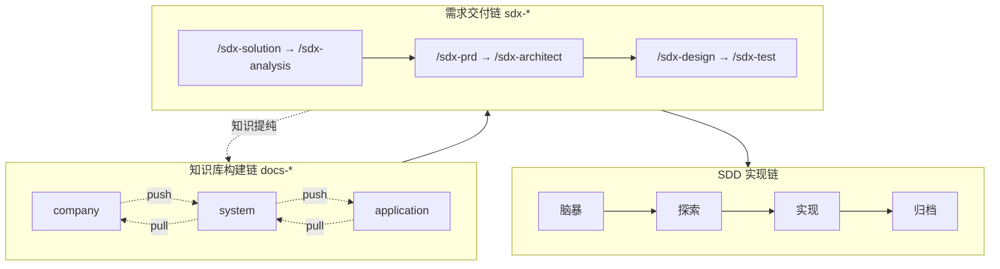

# AI Knowledge Base Framework

> **企业级元知识底座**：SSOT + 联邦治理，为 AI Agent 提供结构化知识与协作规范。

[](LICENSE)
[](https://github.com/oleewen/ai-knowledge/graphs/commit-activity)
[](CONTRIBUTING.md)

**结论**：纯文档型底座——无业务运行时；用 Bash 注入任意工程，建立 SDD 协作环境。Agent 契约见 [AGENTS.md](AGENTS.md)；九章地图 [INDEX-GUIDE.md](INDEX-GUIDE.md)；目录索引 [index.md](index.md)。

---

## 简介

| 价值 | 要点 |
| --- | --- |
| SSOT | 五视角唯一事实源，跨文件仅 **ID** 引用 |
| Skills 链 | `docs-*` 构建 × `sdx-*` 交付；产物上行归并 |
| 联邦 | 公司 → 系统 → 应用；link / pull / distill 对齐 |
| Agent 友好 | Rules + Skills；Markdown + YAML + Git |

### 为何需要

Agent = LLM + Harness。平台给模型与工具，**工程知识**须由团队以 SSOT + Skills 供给；否则知识缺失/散落/冲突/老化会逼 Agent 靠猜。本仓用契约 + 索引按需下钻，替代碰运气检索。细节与约束见 [AGENTS.md](AGENTS.md)。

---

## 三层联邦架构

| 层级 | 目录 | 职责 |
| --- | --- | --- |
| **公司** | [company/](company/README.md) | 顶层架构；`system-{name}/` 镜像槽位 |
| **系统** | [system/](system/README.md) | 五架构视角；`application-{name}/` 联邦槽位 |
| **应用** | [application/](application/README.md) | 实现细节与实体 SSOT |

- **SSOT**：实体一处定义，跨文件 **ID** 引用。
- **联邦**：公司管划分、系统管边界、应用管实现并上行对齐。
- **闭环**：knowledge ← 归档；solutions → analysis → requirements。

元模型：[application/DESIGN.md](application/DESIGN.md)、[system/DESIGN.md](system/DESIGN.md)、[company/DESIGN.md](company/DESIGN.md)。

---

## 从零选型

**口诀**：有应用仓 → bootstrap + build；有多应用 → 中央 link + pull/distill；只有 legacy → extract → archive → build。

场景 A–D 逐步操作见 [quick-start.md](quick-start.md)。

---

## 快速开始

**预备**：Bash 5.0+、Git；推荐 `rsync`（脚本可回退 `cp`）。

### 1. 手动安装（克隆后执行）

```bash
git clone https://github.com/oleewen/ai-knowledge.git
cd ai-knowledge
./scripts/docs-bootstrap.sh --doc-target=/path/to/your-project/docs
```

### 2. 远程 Bootstrap（无需克隆）

```bash
cd /path/to/your-project
curl -sL "https://raw.githubusercontent.com/oleewen/ai-knowledge/main/scripts/docs-bootstrap.sh" | bash -s -- --doc-target /path/to/your-project/docs --agents cursor,trae
```

### 3. Agent 自动化安装

> 根据 [ai-knowledge README](https://github.com/oleewen/ai-knowledge) 的说明，初始化知识库到当前工程 `./docs`。

技术栈与仓库元信息见 [INDEX-GUIDE.md](INDEX-GUIDE.md) §1.2。

---

## 项目结构

> 与 [INDEX-GUIDE.md](INDEX-GUIDE.md) §2.1 一致（目录树唯一起源）。

```text
./
├── README.md / AGENTS.md / INDEX-GUIDE.md / index.md / quick-start.md
├── changelogs/           # 根输出组 INDEXING-LOG
├── application/          # 应用层 SSOT + SDD（knowledge、阶段产物、changelogs）
├── system/               # 系统库：knowledge/ + overview、application-{name}/ 槽位、SDD
├── company/              # 公司库：knowledge/ + overview、system-{name}/ 槽位
├── scripts/              # docs-install、agent-install、docs-link、docs-bootstrap + tests/
├── agent/                # skills/（18）、rules/、knowledge/、references/、scripts/、hooks.json
├── docs/                 # .docsconfig 的 DOC_DIR；会话稿 superpowers/（通常未入库）
└── .gitignore
```

---

## Agent 工作流

`docs-*` 维护知识库，`sdx-*` 产出规约；OKF 见 `/docs-okf`。推进口径与禁止事项见 [AGENTS.md](AGENTS.md)；Skill 清单仅 [agent/skills/README.md](agent/skills/README.md)。场景分步 [quick-start.md](quick-start.md)。



---

## 文档导航

| 需求 | 文档 |
| --- | --- |
| 从零落地（场景 A–D） | [quick-start.md](quick-start.md) |
| 九章地图 / 目录索引 | [INDEX-GUIDE.md](INDEX-GUIDE.md) · [index.md](index.md) |
| Agent 契约与查阅顺序 | [AGENTS.md](AGENTS.md) |
| 三层元模型 | [application/DESIGN.md](application/DESIGN.md)、[system/DESIGN.md](system/DESIGN.md)、[company/DESIGN.md](company/DESIGN.md) |
| 初始化脚本 | [scripts/README.md](scripts/README.md) |
| 共享推进契约 | [agent/references/](agent/references/) |
| 根索引运行日志 | [changelogs/INDEXING-LOG.md](changelogs/INDEXING-LOG.md) |
| OKF / Skill 清单 | [docs-okf/SKILL.md](agent/skills/docs-okf/SKILL.md) · [agent/skills/README.md](agent/skills/README.md) |

---

## 参与贡献

1. [INDEX-GUIDE.md](INDEX-GUIDE.md) — 路径地图  
2. [application/DESIGN.md](application/DESIGN.md) — 五视角元模型  
3. [application/CONTRIBUTING.md](application/CONTRIBUTING.md) — 贡献流程与门禁  

**许可**：[Apache-2.0](LICENSE)。
