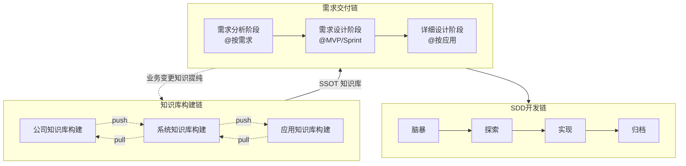
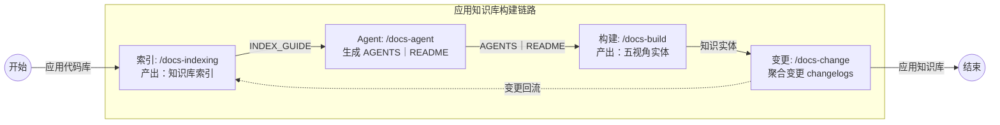
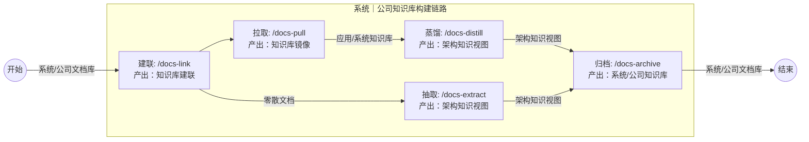
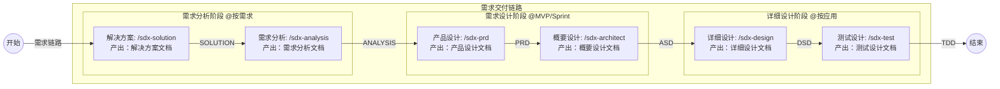
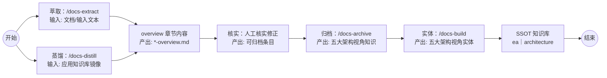
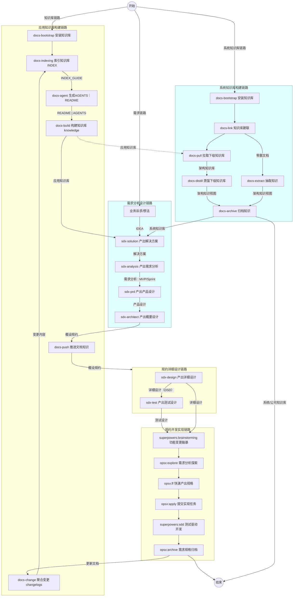

# AI Knowledge Base Framework

> **企业级元知识底座**：基于 SSOT（单一事实源）与联邦治理模式，为 AI Agent 提供结构化知识供给与协作规范。

[](LICENSE)
[](https://github.com/oleewen/ai-knowledge/graphs/commit-activity)
[](CONTRIBUTING.md)

---
## 目录

- [AI Knowledge Base Framework](#ai-knowledge-base-framework)
  - [目录](#目录)
  - [📖 简介](#-简介)
    - [核心价值](#核心价值)
  - [为什么需要元知识底座](#为什么需要元知识底座)
  - [三层联邦架构](#三层联邦架构)
  - [从零选型](#从零选型)
  - [🚀 快速开始](#-快速开始)
    - [预备环境](#预备环境)
    - [1. 手动安装（克隆后执行）](#1-手动安装克隆后执行)
    - [2. 远程 Bootstrap（无需克隆）](#2-远程-bootstrap无需克隆)
    - [3. Agent 自动化安装](#3-agent-自动化安装)
  - [📂 项目结构](#-项目结构)
  - [🤖 Agent 工作流与推荐流程](#-agent-工作流与推荐流程)
    - [执行主链路](#执行主链路)
    - [执行子流程](#执行子流程)
    - [常用流程速查](#常用流程速查)
  - [🛠️ 技术指标与架构](#️-技术指标与架构)
  - [文档导航](#文档导航)
  - [🤝 参与贡献](#-参与贡献)
  - [📜 许可说明](#-许可说明)

## 📖 简介

`ai-knowledge` 是一个**纯文档型**元知识平台。它不提供业务逻辑，而是为 AI 原生开发提供一套可植入的「骨架」。通过内置的一系列 Bash 脚本，您可以将其注入任何工程，建立符合 SDD（基于文档的开发）原则的 AI 协作环境。

### 核心价值

- **SSOT 驱动**：消除知识冗余、混淆与冲突；维护**业务 / 产品 / 应用 / 数据 / 技术**五视角唯一事实源，跨文件仅 **ID 引用**。
- **Skills 链闭环**：`docs-*` 构建链 × `sdx-*` 交付链双链路——知识底座支撑规约交付，交付产物再上行归并。
- **联邦治理**：公司 → 系统 → 应用三层分治，各守其位；link / pull / distill 联邦挂载与上行对齐。
- **Agent 友好**：Rules + Skills + Hooks + Gate 闸门；Markdown + YAML + Git 纯文架构，天然版本化与变更追溯。

---

## 为什么需要元知识底座

| 分工 | 谁提供 | 提供什么 |
| --- | --- | --- |
| Agent 能力 | AI Agent 平台 | 上下文、工具、权限 |
| DevOps 能力 | 云平台 | 可观测、行动能力 |
| **工程知识** | **工程团队** | **知识 — SSOT + Skills** |

业界共识：**Agent = LLM + Harness**。模型提供智能，Harness 提供上下文、知识、工具、权限与可观测——决定 Agent 能否在真实工程里稳定交付。

企业落地 AI 时，瓶颈往往不在「模型不够聪明」，而在**知识的黑洞**：

| 现象 | 后果 |
| --- | --- |
| **知识缺失**：规则只存在于硬编码、同事脑中，AI 无法获取 | 边界靠猜，产出不稳定 |
| **知识散落**：碎片存于 Wiki、协作文档、邮件、代码注释 | 噪声大，上下文不全，RAG 碰运气 |
| **知识混淆**：PRD、接口文档、数据字典术语各说各话 | 通用语言约束失效，Agent 读了也猜 |
| **知识冲突**：不同文档对同一件事表述矛盾，不知谁对 | 产出对错难料，人工兜底成本高 |
| **知识老化**：文档写完就不更新，代码早变了文档还是旧的 | 越用越偏，错误知识比没有更危险 |
| **知识孤岛**：各团队/系统自有一套，跨团队无法互通引用 | 重复建设，上下游对不齐，治理无从落地 |

| 优势 | 混沌知识库 | SSOT 知识库 |
| --- | --- | --- |
| **知识集中** | Wiki、文档、代码中散落，知识碎片化，RAG 碰运气 | 一处定义，他处引用，精确导航，RAG 有依据 |
| **术语统一** | 各项文档术语各说各话，术语对不齐理不清 | 多视角 + 角色契约，跨团队通用语言 |
| **职责清晰** | 业务范围、规则靠猜，不知谁对谁错 | 清晰的职责边界定义，作用上下文约束 |
| **联邦互通** | 各系统/团队独立成库，上下游对不齐，重复建设 | 公司→系统→应用分层挂载，跨团队引用，联邦治理落地 |
| **易更新可溯源** | 代码改了，文档没人更新，或不知谁什么时候改了 | Git 版本管理 + 变更日志 + 更新/抽取/蒸馏闭环 |

Agent 读 [AGENTS.md](AGENTS.md) 作为契约，读 [INDEX_GUIDE.md](INDEX_GUIDE.md) 作为地图，再按需深入各层知识库——而非「碰运气检索」。

---

## 三层联邦架构

| 层级 | 目录 | 职责 |
| --- | --- | --- |
| **公司** | [company/](company/README.md) | 公司级顶层架构视角；`system-{name}/` 系统镜像槽位 |
| **系统** | [system/](system/README.md) | 五架构视角；边界与多应用聚合；`application-{name}/` 应用联邦槽位 |
| **应用** | [application/](application/README.md) | 四架构视角；实现细节与实体 SSOT |

- **SSOT**：实体只在一处定义；跨文件仅 **ID 字符串** 引用，正文不冗余同步。
- **联邦治理**：公司库管业务划分；系统库管边界与索引；应用库管实现并 **上行对齐**。
- **闭环**：knowledge ← 归档回写；阶段上 solutions → analysis → requirements。

元模型与实体「首次定义层级」见各层 [DESIGN.md](application/DESIGN.md)（应用）、[system/DESIGN.md](system/DESIGN.md)（系统）、[company/DESIGN.md](company/DESIGN.md)（公司）。

---

## 从零选型

**口诀**：有应用仓 → 先 bootstrap + build；有多应用 → 中央 link + pull/distill；只有 legacy → extract → archive → build。

| 场景 | 适用 | 说明 |
| --- | --- | --- |
| **A** | 单一应用 | standalone 应用库 + 按需 SDD |
| **B** | 新系统 + 中央库 | 系统库先需求/概设，应用库后详设与开发 |
| **C** | 老系统 + 中央库 | 各应用先 SSOT，中央 pull/distill/archive |
| **D** | 仅有 legacy 文档 | overview 缓冲区 → archive → build |

完整步骤见 **[quick-start.md](quick-start.md)**。

---

## 🚀 快速开始

### 预备环境
- **Bash** 5.0+
- **Git**
- **rsync**（推荐，用于高效文件同步）

### 1. 手动安装（克隆后执行）
```bash
git clone https://github.com/oleewen/ai-knowledge.git
cd ai-knowledge

# 将知识库 Bootstrap 至目标工程的 ./docs 目录
./scripts/docs-bootstrap.sh --doc-target=/path/to/your-project/docs
```

### 2. 远程 Bootstrap（无需克隆）
```bash
cd /path/to/your-project
curl -sL "https://raw.githubusercontent.com/oleewen/ai-knowledge/main/scripts/docs-bootstrap.sh" | bash -s -- --doc-target /path/to/your-project/docs --agents cursor,trae
```

### 3. Agent 自动化安装
直接向您的开发代理（如 Claude Code / Cursor）发送指令：
> “根据 https://github.com/oleewen/ai-knowledge 的 README 规范，初始化知识库架构到当前工程的 ./docs 路径。”

---

## 📂 项目结构

```text
ai-knowledge/
├── README.md               # 人类入口（本文件）
├── AGENTS.md               # AI Agent 契约、约束与关键路径
├── quick-start.md          # 从零落地指南（场景 A–D）
├── INDEX_GUIDE.md          # 全库路径地图与检索精要（权威索引）
├── scripts/                # 初始化脚本链（Bash 5+）
├── agent/                  # AI 协作规范与 Slash 技能
│   ├── hooks/              # Hooks 配置（Cursor/Claude/Bing 等）
│   ├── knowledge/          # 知识治理 SSOT：命名、术语、原则、ADR
│   ├── rules/              # 编码、设计、测试、文档协作规范
│   ├── skills/             # Slash 技能（docs-indexing、sdx-* 等）
│   └── scripts/            # 共享 Bash 库（config-bootstrap、validate-agent-md-links）
├── company/                # 公司知识库壳
│   ├── knowledge/          # 企业架构：业务、产品、应用、数据、技术五视角
│   ├── solutions/          # 公司级跨系统解决方案
│   ├── analysis/           # 公司级跨系统需求分析
│   ├── changelogs/         # 变更记录与索引运维日志
│   ├── DESIGN.md           # 元模型、映射与演进原则
│   └── README.md           # 公司知识库入口（索引见根 INDEX_GUIDE §9）
├── system/                 # 系统知识库壳
│   ├── architecture/       # 系统架构：业务、产品、应用、技术、数据架构
│   ├── solutions/          # 解决方案产物
│   ├── analysis/           # 需求分析产物
│   ├── requirements/       # 需求交付产物
│   ├── changelogs/         # 变更记录与索引运维日志
│   ├── DESIGN.md           # 元模型、映射与演进原则
│   └── INDEX_GUIDE.md      # system/ 树内九章索引
├── application/            # 应用知识库：实现登记与应用层实体 SSOT
│   ├── knowledge/          # 五视角知识实体（业务/产品/应用/数据/技术）
│   ├── solutions/          # 解决方案产物
│   ├── analysis/           # 需求分析产物
│   ├── requirements/       # 需求交付产物
│   ├── specs/              # 需求规格产物
│   ├── changelogs/         # 变更记录与索引运维日志
│   ├── INDEX_GUIDE.md      # application/ 树内九章索引
│   ├── DESIGN.md           # 元模型、映射与演进原则
│   └── CONTRIBUTING.md     # 贡献流程与阶段规则
├── docs/                   # 设计备忘、分享材料（会话 spec 见 docs/superpowers/specs/）
└── .gitignore
```

---

## 🤖 Agent 工作流与推荐流程

项目内置了针对不同复杂度的协作链路，建议按需组合使用：

### 构建链与交付链闭环



### 应用知识库构建



### 系统｜公司知识库构建



### 需求交付链

`sdx-*` 负责把业务想法逐步收敛为可评审、可实现、可测试的规约。


---

### 知识提纯：萃取 + 蒸馏

知识 Overview 缓冲区：`overview/*-overview.md` = **散落知识 → 结构化章节的缓冲区**



### 执行全流程



### 常用流程速查
| 链路分类 | 核心命令 | 核心产出 |
| :--- | :--- | :--- |
| 知识库构建 | `scripts/docs-bootstrap.sh` | 远程 clone 并串联执行 docs-install（知识库）+ agent-install（Agent） |
| 知识库构建 | `/docs-indexing`  | 生成或更新根 `INDEX_GUIDE.md`  |
| 知识库构建 | `/docs-agent`    | 同步 `AGENTS.md` 与 `README.md` 协作约束 |
| 知识库构建 | `/docs-build`     | 维护知识实体与视角索引（`application/knowledge/`） |
| 知识库构建 | `/docs-change`    | 聚合变更到 `application/changelogs/` |
| 知识库构建 | `/docs-pull`     | 拉取下游应用侧文档到中央库镜像 |
| 知识库构建 | `/docs-distill`   | 将应用侧已核实内容蒸馏到系统知识库 |
| 知识库构建 | `/docs-extract`   | 从任意文件或目录按段落级关键词筛选，提炼业务知识写入指定 `XX-overview.md` |
| 知识库构建 | `/docs-archive`   | 从指定 overview 文件各视角归档知识到架构视角表各行副标题文件链接对应章节；探索 → 澄清 → 方案确认书 → 落盘，补充后做一致性检查与冲突处理 |
| 需求设计  | `/sdx-solution`    | 产出解决方案文档（SOLUTION） |
| 需求设计  | `/sdx-analysis`    | 产出需求分析文档（ANALYSIS） |
| 需求设计  | `/sdx-prd`         | 产出产品需求文档（PRD） |
| 需求设计  | `/sdx-architect`   | 产出架构设计说明书（ASD） |
| 需求设计  | `/sdx-design`      | 产出详细设计说明书（DSD）；概设 **`spec-asd`** 位于 `{DOC_DIR}/specs/`（`/sdx-architect`） |
| 需求设计  | `/sdx-test`        | 产出测试设计文档（TDD） |

---

## 🛠️ 技术指标与架构

- **数据载体**：UTF-8 Markdown (Content) + Frontmatter YAML (Metadata)。
- **版本控制**：Git，强制遵循 [Conventional Commits](agent/rules/coding/git-guidelines.md)。
- **SSOT 设计**：跨文件引用仅限 `ID` 字符串，严禁正文冗余同步。

---

## 文档导航

| 需求 | 文档 |
| --- | --- |
| 从零落地（场景 A–D） | [quick-start.md](quick-start.md) |
| 全库路径地图 | [INDEX_GUIDE.md](INDEX_GUIDE.md) |
| Agent 契约 | [AGENTS.md](AGENTS.md) |
| 应用元模型 | [application/DESIGN.md](application/DESIGN.md) |
| 系统元模型（overview、五视角） | [system/DESIGN.md](system/DESIGN.md) |
| 公司元模型 | [company/DESIGN.md](company/DESIGN.md) |
| 初始化脚本 | [scripts/README.md](scripts/README.md) |
| Skill 清单 | [agent/skills/README.md](agent/skills/README.md) |

---

## 🤝 参与贡献

在进行任何修改前，请务必阅读以下文档以确保符合元模型一致性：
1. [INDEX_GUIDE.md](INDEX_GUIDE.md) — 了解当前知识登记表。
2. [application/DESIGN.md](application/DESIGN.md) — 理解五视角元模型设计逻辑。
3. [application/CONTRIBUTING.md](application/CONTRIBUTING.md) — 熟悉贡献流程与质量门禁。

---

---

> AI 的上限是模型，AI 的下限是知识。  
> **SSOT + Skills 链，让下限撑起上限。**

## 📜 许可说明

本项目采用 [Apache-2.0](LICENSE) 开源协议。
