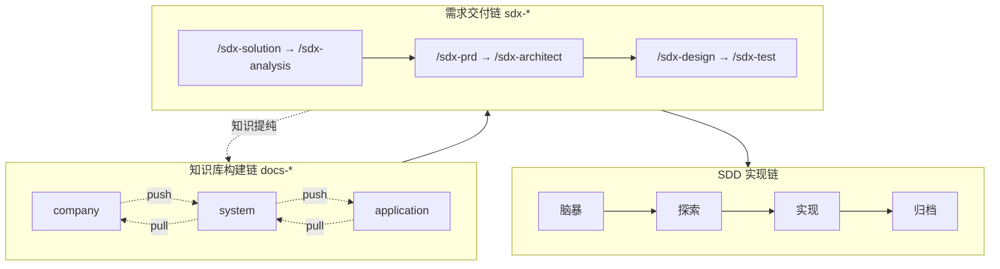

# AI Knowledge Base Framework

> **企业级元知识底座**：基于 SSOT（单一事实源）与联邦治理模式，为 AI Agent 提供结构化知识供给与协作规范。

[](LICENSE)
[](https://github.com/oleewen/ai-knowledge/graphs/commit-activity)
[](CONTRIBUTING.md)

---

## 目录

- [AI Knowledge Base Framework](#ai-knowledge-base-framework)
  - [目录](#目录)
  - [📖 简介](#-简介)
    - [核心价值](#核心价值)
  - [为什么需要元知识底座](#为什么需要元知识底座)
  - [三层联邦架构](#三层联邦架构)
  - [从零选型](#从零选型)
  - [🚀 快速开始](#-快速开始)
    - [预备环境](#预备环境)
    - [1. 手动安装（克隆后执行）](#1-手动安装克隆后执行)
    - [2. 远程 Bootstrap（无需克隆）](#2-远程-bootstrap无需克隆)
    - [3. Agent 自动化安装](#3-agent-自动化安装)
  - [📂 项目结构](#-项目结构)
  - [🤖 Agent 工作流与推荐流程](#-agent-工作流与推荐流程)
  - [文档导航](#文档导航)
  - [🤝 参与贡献](#-参与贡献)
  - [📜 许可说明](#-许可说明)

## 📖 简介

`ai-knowledge` 是**纯文档型**元知识平台：无业务运行时，通过 Bash 脚本注入任意工程，建立符合 SDD 原则的 AI 协作环境。

### 核心价值

- **SSOT 驱动**：五视角唯一事实源，跨文件仅 **ID 引用**。
- **Skills 链闭环**：`docs-*` 构建链 × `sdx-*` 交付链，规约产物上行归并。
- **联邦治理**：公司 → 系统 → 应用三层分治；link / pull / distill 对齐。
- **Agent 友好**：Rules + Skills + Hooks + Gate；Markdown + YAML + Git 版本化。

---

## 为什么需要元知识底座

| 分工 | 谁提供 | 提供什么 |
| --- | --- | --- |
| Agent 能力 | AI Agent 平台 | 上下文、工具、权限 |
| DevOps 能力 | 云平台 | 可观测、行动能力 |
| **工程知识** | **工程团队** | **SSOT + Skills** |

**Agent = LLM + Harness**：模型提供智能，Harness 提供上下文、知识、工具与权限——决定 Agent 能否在真实工程里稳定交付。

企业落地 AI 的瓶颈常在**知识黑洞**：

| 现象 | 后果 |
| --- | --- |
| **缺失**：规则在代码或脑中，AI 读不到 | 边界靠猜 |
| **散落**：Wiki、邮件、注释各一处 | RAG 碰运气 |
| **混淆**：PRD、接口、字典术语不一 | 读了也猜 |
| **冲突**：同一件事多种说法 | 人工兜底成本高 |
| **老化**：代码已变、文档未改 | 错误知识更危险 |
| **孤岛**：各团队库不互通 | 重复建设、对不齐 |

| 优势 | 混沌知识库 | SSOT 知识库 |
| --- | --- | --- |
| **集中** | 碎片化，RAG 碰运气 | 一处定义，他处引用 |
| **术语** | 各说各话 | 多视角 + 角色契约 |
| **职责** | 靠猜 | 边界清晰 |
| **联邦** | 独立成库 | 分层挂载、跨团队引用 |
| **溯源** | 不知谁改了什么 | Git + 变更日志 + 抽取/蒸馏闭环 |

Agent 读 [AGENTS.md](AGENTS.md) 作契约、[index.md](index.md) 作地图，按需下钻——而非碰运气检索。

---

## 三层联邦架构

| 层级 | 目录 | 职责 |
| --- | --- | --- |
| **公司** | [company/](company/README.md) | 顶层架构；`system-{name}/` 镜像槽位 |
| **系统** | [system/](system/README.md) | 五架构视角；`application-{name}/` 联邦槽位 |
| **应用** | [application/](application/README.md) | 实现细节与实体 SSOT |

- **SSOT**：实体一处定义，跨文件 **ID** 引用，正文不冗余同步。
- **联邦**：公司管划分、系统管边界、应用管实现并 **上行对齐**。
- **闭环**：knowledge ← 归档；阶段 solutions → analysis → requirements。

元模型见各层 [DESIGN.md](application/DESIGN.md)（应用）、[system/DESIGN.md](system/DESIGN.md)（系统）、[company/DESIGN.md](company/DESIGN.md)（公司）。

---

## 从零选型

**口诀**：有应用仓 → bootstrap + build；有多应用 → 中央 link + pull/distill；只有 legacy → extract → archive → build。

场景 A–D 逐步操作见 **[quick-start.md](quick-start.md)**。

---

## 🚀 快速开始

### 预备环境

- **Bash** 5.0+
- **Git**
- **rsync**（推荐；脚本可回退 `cp`）

### 1. 手动安装（克隆后执行）

```bash
git clone https://github.com/oleewen/ai-knowledge.git
cd ai-knowledge
./scripts/docs-bootstrap.sh --doc-target=/path/to/your-project/docs
```

### 2. 远程 Bootstrap（无需克隆）

```bash
cd /path/to/your-project
curl -sL "https://raw.githubusercontent.com/oleewen/ai-knowledge/main/scripts/docs-bootstrap.sh" | bash -s -- --doc-target /path/to/your-project/docs --agents cursor,trae
```

### 3. Agent 自动化安装

> 根据 [ai-knowledge README](https://github.com/oleewen/ai-knowledge) 的说明，初始化知识库到当前工程 `./docs`。

技术栈与仓库元信息见 [index.md](index.md) §1.2。

---

## 📂 项目结构

> 与 [index.md](index.md) §2.1 一致。

```text
./
├── README.md / AGENTS.md / index.md / quick-start.md
├── application/          # 应用知识主库：knowledge、阶段产物、changelogs
├── system/               # 系统库：architecture/、application-{name}/ 槽位
├── company/              # 公司库：knowledge/、system-{name}/ 槽位
├── scripts/              # docs-install、agent-install、bootstrap、OKF（validate-okf、okf-migrate）
├── agent/                # rules/、skills/（含 docs-okf）、hooks/、scripts/
├── docs/                 # 设计备忘（会话 spec 见 docs/superpowers/specs/）
└── .gitignore
```

---

## 🤖 Agent 工作流与推荐流程

`docs-*` 维护 SSOT 知识库，`sdx-*` 产出可评审规约；OKF bundle 迁移与校验见 `/docs-okf`（与 [index.md](index.md) 九章地图、`index.md` 渐进披露双索引并存）。场景分步见 [quick-start.md](quick-start.md)。



Skill 清单见 [agent/skills/README.md](agent/skills/README.md)。

---

## 文档导航

| 需求 | 文档 |
| --- | --- |
| 从零落地（场景 A–D） | [quick-start.md](quick-start.md) |
| 全库路径地图 | [index.md](index.md) |
| Agent 契约 | [AGENTS.md](AGENTS.md) |
| 应用 / 系统 / 公司元模型 | [application/DESIGN.md](application/DESIGN.md)、[system/DESIGN.md](system/DESIGN.md)、[company/DESIGN.md](company/DESIGN.md) |
| 初始化脚本 | [scripts/README.md](scripts/README.md) |
| OKF refresh 与校验 | [agent/skills/docs-okf/SKILL.md](agent/skills/docs-okf/SKILL.md)（入口：`/docs-okf`） |
| Skill 清单 | [agent/skills/README.md](agent/skills/README.md) |

---

## 🤝 参与贡献

修改前请阅读：

1. [index.md](index.md) — 知识登记与路径地图
2. [application/DESIGN.md](application/DESIGN.md) — 五视角元模型
3. [application/CONTRIBUTING.md](application/CONTRIBUTING.md) — 贡献流程与门禁

---

> AI 的上限是模型，AI 的下限是知识。  
> **SSOT + Skills 链，让下限撑起上限。**

## 📜 许可说明

本项目采用 [Apache-2.0](LICENSE) 开源协议。
