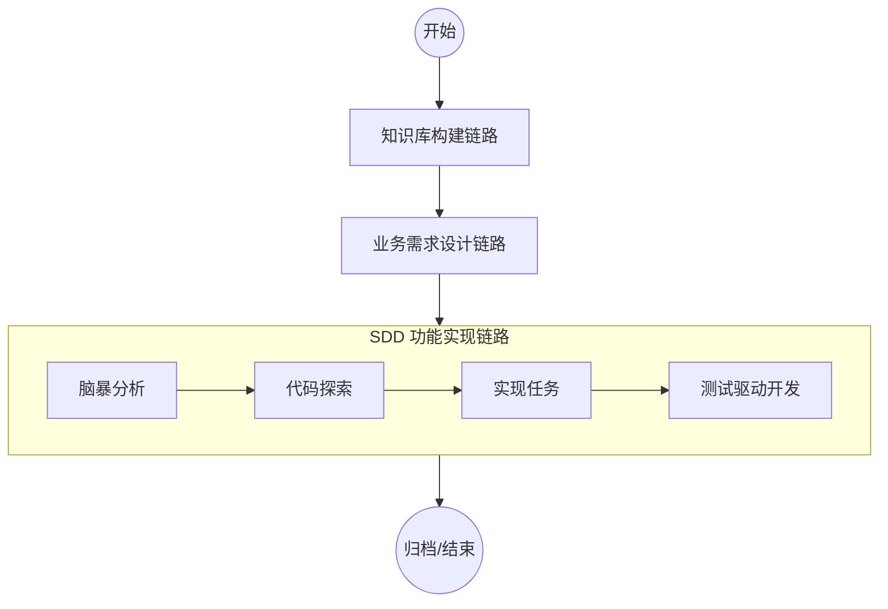
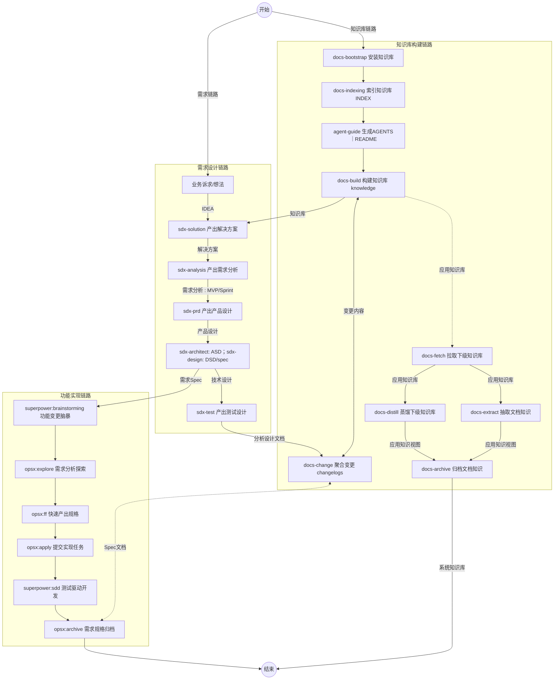

# AI Knowledge Base Framework

> **企业级元知识底座**：基于 SSOT（单一事实源）与联邦治理模式，为 AI Agent 提供结构化知识供给与协作规范。

[](LICENSE)
[](https://github.com/oleewen/ai-knowledge/graphs/commit-activity)
[](CONTRIBUTING.md)

---
## 目录

- [简介](#简介)
- [快速开始](#快速开始)
- [项目结构](#项目结构)
- [常见 Skill 与推荐流程](#常见-skill-与推荐流程)
- [技术架构](#技术架构)
- [文档导航](#文档导航)
- [开发指南](#开发指南)
- [贡献指南](#贡献指南)

## 📖 简介

`ai-knowledge` 是一个**纯文档型**元知识平台。它不提供业务逻辑，而是为 AI 原生开发提供一套可植入的「骨架」。通过内置的一系列 Bash 脚本，您可以将其注入任何工程，建立符合 SDD（基于文档的开发）原则的 AI 协作环境。

### 核心价值
- **SSOT 驱动**：消除冗余信息，维护产品、技术、数据的唯一事实源。
- **Agent 友好**：内置一套完善的协作规范（Rules）与 Slash 技能（Skills），提升 AI 编码的确定性。
- **联邦治理**：自顶向下支持「公司—系统—应用」的多层级知识挂载与隔离。
- **纯文架构**：完全基于 Markdown 与 YAML，天然支持版本控制与低带宽传输。

---

## 🚀 快速开始

### 预备环境
- **Bash** 5.0+
- **Git**
- **rsync**（推荐，用于高效文件同步）

### 1. 手动安装（克隆后执行）
```bash
git clone https://github.com/oleewen/ai-knowledge.git
cd ai-knowledge

# 将知识库 Bootstrap 至目标工程的 ./docs 目录
./scripts/docs-bootstrap.sh --doc-target=/path/to/your-project/docs
```

### 2. 远程 Bootstrap（无需克隆）
```bash
cd /path/to/your-project
curl -sL "https://raw.githubusercontent.com/oleewen/ai-knowledge/main/scripts/docs-bootstrap.sh" | bash -s -- --doc-target /path/to/your-project/docs --agents cursor,trae
```

### 3. Agent 自动化安装
直接向您的开发代理（如 Claude Code / Cursor）发送指令：
> “根据 https://github.com/oleewen/ai-knowledge 的 README 规范，初始化知识库架构到当前工程的 ./docs 路径。”

---

## 📂 项目结构

```text
ai-knowledge/
├── README.md               # 人类入口（本文件）
├── AGENTS.md               # AI Agent 契约、约束与关键路径
├── INDEX_GUIDE.md          # 全库路径地图与检索精要（权威索引）
├── scripts/                # 初始化脚本链（Bash 5+）
├── agent/                  # AI 协作规范与 Slash 技能
│   ├── hooks/              # Hooks 配置（Cursor/Claude/Bing 等）
│   ├── rules/              # 编码、设计、测试、文档规范
│   ├── skills/             # Slash 技能（docs-indexing、sdx-* 等）
│   └── scripts/            # 共享 Bash 库（config-bootstrap、validate-agent-md-links）
├── company/                # 公司知识库壳
│   ├── constitution/       # 宪法层：术语、原则、ADR 模板
│   ├── architecture/       # 企业架构：业务、产品、应用、技术、数据架构
│   ├── solutions/          # 解决方案产物
│   ├── analysis/           # 需求分析产物
│   ├── changelogs/         # 变更记录与索引运维日志
│   ├── DESIGN.md           # 元模型、映射与演进原则
│   └── INDEX_GUIDE.md      # 全库路径权威索引
├── system/                 # 系统知识库壳
│   ├── constitution/       # 宪法层：术语、原则、ADR 模板
│   ├── architecture/       # 系统架构：业务、产品、应用、技术、数据架构
│   ├── solutions/          # 解决方案产物
│   ├── analysis/           # 需求分析产物
│   ├── requirements/       # 需求交付产物
│   ├── specs/              # 需求规格产物
│   ├── changelogs/         # 变更记录与索引运维日志
│   ├── DESIGN.md           # 元模型、映射与演进原则
│   └── INDEX_GUIDE.md      # 全库路径权威索引
├── application/            # 应用知识库 SSOT
│   ├── constitution/       # 宪法层：术语、原则、ADR 模板
│   ├── knowledge/          # 四视角知识实体（业务/产品/技术/数据）
│   ├── solutions/          # 解决方案产物
│   ├── analysis/           # 需求分析产物
│   ├── requirements/       # 需求交付产物
│   ├── specs/              # 需求规格产物
│   ├── changelogs/         # 变更记录与索引运维日志
│   ├── DESIGN.md           # 元模型、映射与演进原则
│   └── CONTRIBUTING.md     # 贡献流程与阶段规则
└── .gitignore
```

---

## 🤖 Agent 工作流与推荐流程

项目内置了针对不同复杂度的协作链路，建议按需组合使用：

### 执行主链路


### 执行子流程


### 常用流程速查
| 链路分类 | 核心命令 | 核心产出 |
| :--- | :--- | :--- |
| 知识库构建 | `scripts/docs-bootstrap.sh` | 远程 clone 并串联执行 docs-install（知识库）+ agent-install（Agent） |
| 知识库构建 | `/docs-indexing`  | 生成或更新 `INDEX_GUIDE.md` 索引地图 |
| 知识库构建 | `/agent-guide`    | 同步 `AGENTS.md` 与 `README.md` 协作约束 |
| 知识库构建 | `/docs-build`     | 维护知识实体与视角索引（`application/knowledge/`） |
| 知识库构建 | `/docs-change`    | 聚合变更到 `application/changelogs/` |
| 知识库构建 | `/docs-fetch`     | 拉取下游应用侧文档到中央库镜像 |
| 知识库构建 | `/docs-distill`   | 将应用侧已核实内容蒸馏到系统知识库 |
| 知识库构建 | `/docs-extract`   | 从任意文件或目录按段落级关键词筛选，提炼业务知识写入指定 `XX-overview.md` |
| 知识库构建 | `/docs-archive`   | 从指定 overview 文件各视角归档知识到架构视角表各行副标题文件链接对应章节；探索 → 澄清 → 方案确认书 → 落盘，补充后做一致性检查与冲突处理 |
| 需求设计  | `/sdx-solution`    | 产出解决方案文档（SOLUTION） |
| 需求设计  | `/sdx-analysis`    | 产出需求分析文档（ANALYSIS） |
| 需求设计  | `/sdx-prd`         | 产出产品需求文档（PRD） |
| 需求设计  | `/sdx-architect`   | 产出架构设计说明书（ASD） |
| 需求设计  | `/sdx-design`      | 产出详细设计说明书（DSD）与 `specs/` |
| 需求设计  | `/sdx-test`        | 产出测试设计文档（TDD） |

---

## 🛠️ 技术指标与架构

- **数据载体**：UTF-8 Markdown (Content) + Frontmatter YAML (Metadata)。
- **版本控制**：Git，强制遵循 [Conventional Commits](agent/rules/coding/git-guidelines.md)。
- **SSOT 设计**：跨文件引用仅限 `ID` 字符串，严禁正文冗余同步。

---

## 🤝 参与贡献

在进行任何修改前，请务必阅读以下文档以确保符合元模型一致性：
1. [INDEX_GUIDE.md](INDEX_GUIDE.md) — 了解当前知识登记表。
2. [application/DESIGN.md](application/DESIGN.md) — 理解四视角元模型设计逻辑。
3. [application/CONTRIBUTING.md](application/CONTRIBUTING.md) — 熟悉贡献流程与质量门禁。

---

## 📜 许可说明

本项目采用 [Apache-2.0](LICENSE) 开源协议。

🤖 *Generated by [Antigravity](https://github.com/oleewen/ai-knowledge) Framework*
