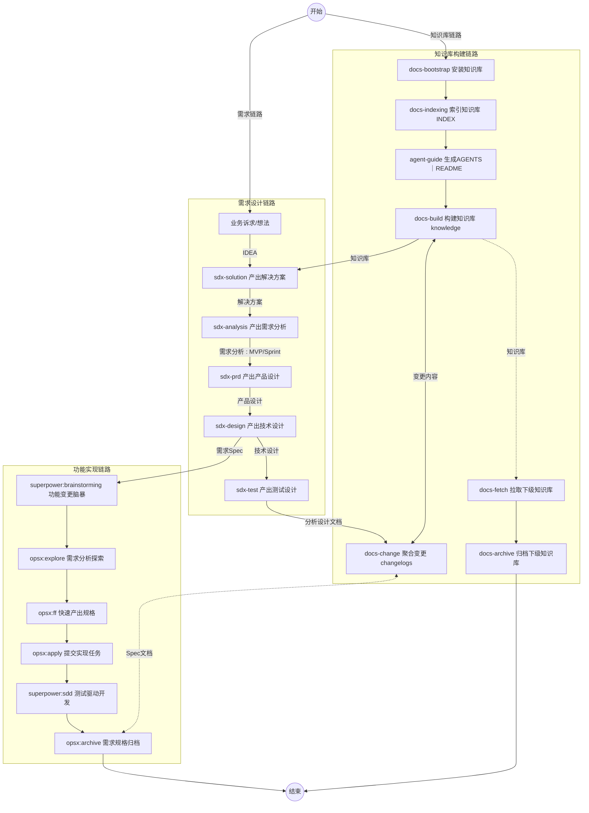
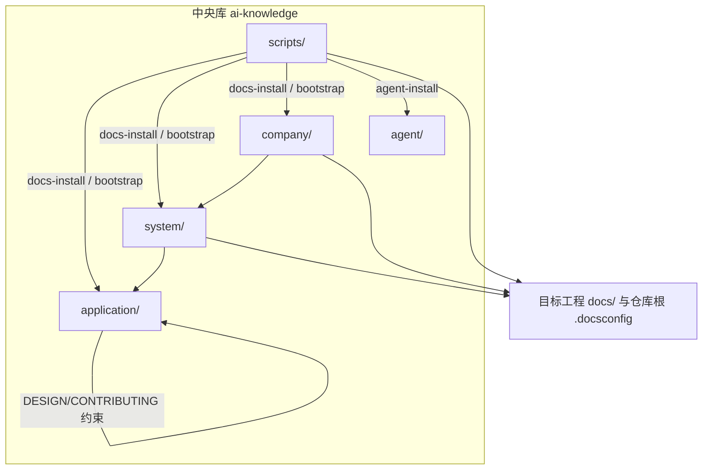

# ai-knowledge

> 企业级元知识底座：以 SSOT（单一事实源）与联邦治理组织架构与交付文档。

`ai-knowledge` 是**纯文档型**元知识库，提供 Markdown/YAML 知识库骨架与 Bash 初始化脚本，用于向任意工程注入 SDD 文档与 Agent 配置。

---

## 目录

- [简介](#简介)
- [快速开始](#快速开始)
- [项目结构](#项目结构)
- [常见 Skill 与推荐流程](#常见-skill-与推荐流程)
- [技术架构](#技术架构)
- [文档导航](#文档导航)
- [开发指南](#开发指南)
- [贡献指南](#贡献指南)

---

## 简介

本仓库提供三类核心资产：

| 资产 | 路径 | 说明 |
|------|------|------|
| 应用元知识库 SSOT | `application/` | 四视角知识实体、阶段文档、changelogs |
| 组织与公司级槽位骨架 | `system/` / `company/` | 联邦治理骨架，按需挂载 |
| 规范与 Slash 技能 | `agent/` | 协作规范（rules）与 Agent 工作流（skills） |
| 初始化脚本链 | `scripts/` | `docs-install` / `agent-install` / `docs-link` / `docs-bootstrap` |

业务细节、路径级精要与检索字段以 [INDEX_GUIDE.md](INDEX_GUIDE.md) 为权威地图；人类协作入口以本文件为准；Agent 行为约束见 [AGENTS.md](AGENTS.md)。

---

## 快速开始

### 环境要求

- **Bash** 5+
- **Git**
- **curl**（可选，用于远程 bootstrap）
- **rsync**（可选，脚本可回退为 `cp`）

### 安装方式

**方式一：Agent 初始化（推荐）**

将以下意图交给 Agent，按其中「方式二或三」完成初始化：

```text
按 https://github.com/oleewen/ai-knowledge README.md 的快速开始中方式二或三，初始化知识库到 ./docs
```

**方式二：本地初始化（克隆后执行）**

```bash
cd /path/to/your-workspaces
git clone https://github.com/oleewen/ai-knowledge
cd ai-knowledge

# 初始化知识库到目标工程
./scripts/docs-install.sh [--选项] --target=/path/to/your-project/docs

# 仅安装 Agent 配置
./scripts/agent-install.sh [--scope=...] [--target=...] [--dry-run]
```

**方式三：远程 bootstrap（无需先 clone）**

```bash
cd /path/to/your-project
curl -sL "https://raw.githubusercontent.com/oleewen/ai-knowledge/main/scripts/docs-bootstrap.sh" \
  | bash -s -- [选项] --target ./docs
```

### 安装参数说明

| 参数 | 默认值 | 说明 |
|------|--------|------|
| `--target` | 必填 | 目标工程文档目录 |
| `--scope` | `knowledge`（可简写 `k`） | `knowledge` 写入 `.docsconfig` 含 `KNOWLEDGE_TYPE`；`config` 不写 `KNOWLEDGE_TYPE` |
| `--mode` | `standalone` | `central` 用于中央知识库挂载建联模式 |
| `--type` | `application` | `application` / `system` / `company` |
| `--dry-run` | — | 预览变更，不实际写入 |

详细参数与落地产物见 [scripts/README.md](scripts/README.md)。

---

## 项目结构

```text
ai-knowledge/
├── README.md               # 人类入口（本文件）
├── AGENTS.md               # AI Agent 契约、约束与关键路径
├── INDEX_GUIDE.md          # 全库路径地图与检索精要（权威索引）
├── scripts/                # 初始化脚本链（Bash 5+）
├── agent/                  # AI 协作规范与 Slash 技能
│   ├── hooks/              # Hooks 配置（Cursor/Claude/Bing 等）
│   ├── rules/              # 编码、设计、测试、文档规范
│   ├── skills/             # Slash 技能（docs-indexing、sdx-* 等）
│   └── scripts/            # 共享 Bash 库（config-bootstrap、validate-agent-md-links）
├── company/                # 公司知识库壳（architecture、system-{name}/）
├── system/                 # 系统知识库壳（architecture、application-{name}/）
├── application/            # 应用知识库 SSOT
│   ├── constitution/       # 宪法层：术语、原则、ADR 模板
│   ├── knowledge/          # 四视角知识实体（业务/产品/技术/数据）
│   ├── solutions/          # 解决方案产物
│   ├── analysis/           # 需求分析产物
│   ├── requirements/       # 需求交付产物
│   ├── specs/              # 需求规格产物
│   ├── changelogs/         # 变更记录与索引运维日志
│   ├── DESIGN.md           # 元模型、映射与演进原则
│   └── CONTRIBUTING.md     # 贡献流程与阶段规则
└── .gitignore
```

---

## 常见 Skill 与推荐流程

### 场景组合

| 场景 | 说明 |
|------|------|
| 单应用开发 | 推荐 **知识库构建链路** + **功能实现链路** |
| 多应用开发 | 推荐 **知识库构建链路** + **需求设计链路** + **功能实现链路** |

### 推荐执行顺序



### Skill 速查表

| 链路      | 命令              | 说明                   |
|----------|-------------------|------------------------|
| 知识库构建 | `/docs-bootstrap` | 初始化目标工程文档骨架与配置 |
| 知识库构建 | `/docs-indexing`  | 生成或更新 `INDEX_GUIDE.md` 索引地图 |
| 知识库构建 | `/agent-guide`    | 同步 `AGENTS.md` 与 `README.md` 协作约束 |
| 知识库构建 | `/docs-build`     | 维护知识实体与视角索引（`application/knowledge/`） |
| 知识库构建 | `/docs-change`    | 聚合变更到 `application/changelogs/` |
| 知识库构建 | `/docs-fetch`     | 拉取下游应用侧文档到中央库镜像 |
| 知识库构建 | `/docs-archive`   | 将应用侧已核实内容归档到系统知识库 |
| 需求设计  | `/sdx-solution`    | 产出解决方案文档（SOLUTION） |
| 需求设计  | `/sdx-analysis`    | 产出需求分析文档（ANALYSIS） |
| 需求设计  | `/sdx-prd`         | 产出产品需求文档（PRD） |
| 需求设计  | `/sdx-design`      | 产出架构设计文档（ADD/spec） |
| 需求设计  | `/sdx-test`        | 产出测试设计文档（TDD） |

---

## 技术架构

| 维度 | 说明 |
|------|------|
| 主要格式 | Markdown、YAML（知识实体与各视角元数据） |
| 脚本 | Bash 5+（`docs-install`、`agent-install`、`docs-bootstrap` 等初始化链） |
| 协作 | Git，遵循 Conventional Commits（见 [agent/rules/coding/git-guidelines.md](agent/rules/coding/git-guidelines.md)） |
| 运行时 | 本仓库不包含服务端或业务应用运行时；构建/启动命令以向目标工程注入文档为准 |

架构依赖关系：



---

## 文档导航

| 文档 | 用途 |
|------|------|
| [AGENTS.md](AGENTS.md) | AI Agent 契约、约束与关键路径 |
| [INDEX_GUIDE.md](INDEX_GUIDE.md) | 全库路径地图与检索精要（权威索引） |
| [application/README.md](application/README.md) | 应用知识库 |
| [system/README.md](system/README.md) | 系统知识库 |
| [company/README.md](company/README.md) | 公司知识库 |
| [agent/README.md](agent/README.md) | Agent Rules 规范与 Slash Skills |
| [scripts/README.md](scripts/README.md) | 初始化脚本参数、模式与落地产物；`.docsconfig` 键说明 |

---

## 开发指南

- **规范索引**：[agent/rules/CONVENTIONS.md](agent/rules/CONVENTIONS.md)
- **系统设计与元模型**：[application/DESIGN.md](application/DESIGN.md)
- **贡献流程**：[application/CONTRIBUTING.md](application/CONTRIBUTING.md)
- **提交信息**：遵循 Conventional Commits，格式为 `<类型>: <描述>`

  ```
  docs: 更新 application/INDEX_GUIDE 登记
  feat: 新增 sdx-test Skill 模板
  fix: 修复 docs-install --mode=central 路径计算
  ```

---

## 贡献指南

新增或修改知识实体、阶段文档与索引前，请先阅读：

1. [application/CONTRIBUTING.md](application/CONTRIBUTING.md) — 贡献流程与阶段规则
2. [agent/rules/CONVENTIONS.md](agent/rules/CONVENTIONS.md) — 全局命名与交付约定
3. 相关子目录 README

**注意事项：**

- 禁止随意修改 `application/knowledge/` 已有实体 ID 或破坏跨视角 ID 引用，除非同步更新全部引用
- 禁止未读 [application/DESIGN.md](application/DESIGN.md) 即新增 knowledge 实体或 ADR
- 禁止未经用户确认即执行 `git commit` / `git push`
- 避免破坏跨文档 ID 引用与导航表一致性
