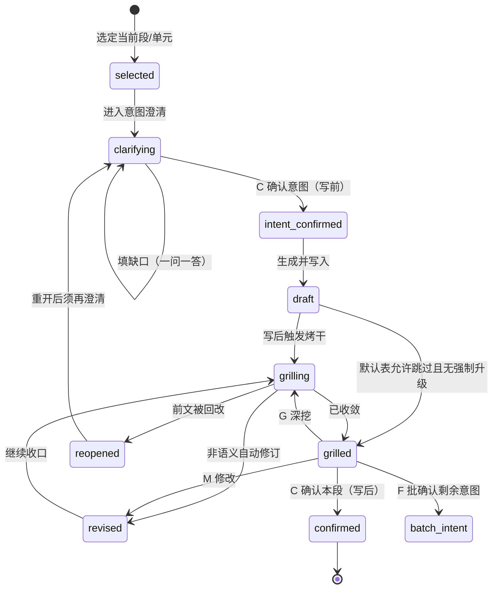

# 意图澄清契约（Agent SSOT）

> **定位**：跨 skill 复用的**写前意图澄清**唯一真源；与写后 [grilling-skill.md](grilling-skill.md) 分工，不得混名。
> **主线口令**：`澄清 → 生成 → 烤干`（意图澄清 → 写入当前段/单元 → 条件或默认自动 grilling 至收敛）。
> **边界**：本文定义公共字段、收口方式、共享状态机片段、写后触发规则与 `C/M/G/F` 阶段语义；各 skill 只补技能特有字段与默认表行，不复制全文。

**最后更新**: 2026-07-17

**落地状态**：全部 `/sdx-*` 与语义族 docs-*（`docs-agent` / `docs-extract` / `docs-distill` / `docs-archive` / `docs-upgrade` / `docs-indexing` / `docs-build`）已绑定意图澄清。**未绑定（按约定维持轻流程）**：`docs-okf` / `docs-change` / `docs-pull` / `docs-push` / `docs-tag`。

---

## 与 grilling 的边界

| 能力 | 时机 | 目的 | 形态 |
| --- | --- | --- | --- |
| **意图澄清**（本文） | 写入前 | 挡臆测、收口本段目标/范围/路径 | 六项清单门禁；有缺口才一问一答 |
| **grilling / 烤干** | 写入后 | 成品缺口、冲突、可评审性 | [grilling-skill.md](grilling-skill.md) 或已安装 grilling Skill |

禁止：

- 把写前步骤称作「写前 grilling」或要求跑完整 grilling Skill 当默认写前门禁
- 用动作 `G` 表示意图澄清（`G` 仅写后深挖）

---

## 适用范围（目标语义族）

启用本契约的技能：

- 全部 `/sdx-*`
- `docs-agent` / `docs-extract` / `docs-distill` / `docs-archive` / `docs-upgrade`
- `docs-indexing` / `docs-build`

**未启用**（维持既有轻流程）：`docs-okf` / `docs-change` / `docs-pull` / `docs-push` / `docs-tag`。

---

## 公共六项清单

写前必须输出（技能可追加字段，不可删减公共项）：

1. **本段/单元目标** — 本轮要写清什么
2. **范围 / 非范围** — 写什么、明确不写什么
3. **已知缺口** — 未知/冲突；无则写「无」
4. **禁止臆测项** — 不得编造的事实、数字、路径、ID、承诺
5. **写后烤干预判** — 按下文「写后触发」给出默认或强制升级说明
6. **写入路径/容器** — 仓库根相对路径或终稿锚点（章节标题/表位等）

输出时须标明：**当前阶段：意图澄清**。

---

## 收口到「可以写」

混合协议：

1. **无缺口**（第 3 项为「无」，且无未决冲突）：一屏列出六项（含推荐填空）→ 用户 `C` 确认后写入。
2. **有缺口/冲突**：先按 [grilling-skill.md](grilling-skill.md) fallback 形态**一次一问**填缺口（每问须推荐答案与数字选项）→ 缺口收齐后再一屏确认 → 用户 `C` 后写入。
3. 未获写前 `C`，**不得**写入当前段/单元正文。

---

## 写后「烤干」触发（默认表 + 启发式升级）

1. 各 skill 在本地 workflow 维护**默认表**（是否默认写后 grilling）。
2. 出现以下任一情况时，**强制升级为必须烤干**（不可降级跳过）：
   - 未确认决策写入正文
   - 跨段/跨单元依赖或前文前提变更
   - 实体 ID、导航路径、索引路径变更
   - 冲突消解、范围/目标/承诺口径变更
3. 启发式只可升级为必须，不可把默认「必须」降为跳过。
4. 烤干阶段输出须标明：**当前阶段：烤干（grilling）**。

`sdx-*` 与已启用 docs-* 默认表：各章节/当前单元**默认必须烤干**（analysis 含单个 `FR`；design 含 §2 内 API/DDL 等块；prd 含 US/UC/AC；indexing 含 INDEX-GUIDE+LOG 输出组；build 含视角/实体批次）。

---

## 共享状态机片段

状态含义：

| 状态 | 含义 |
| --- | --- |
| `clarifying` | 写前意图澄清中；尚未授权写入 |
| `intent_confirmed` | 写前 `C` 已过；即将或正在生成 |
| `draft` | 已写入目标容器的初稿 |
| `grilling` | 写后自动烤干中 |
| `grilled` | 烤干收敛（或合法跳过烤干）后待写后动作 |
| `revised` / `reopened` / `confirmed` | 与既有段落协议同义；`reopened` 后必须回到 `clarifying` |

---

## 用户动作与 `C` 复用

动作字母仍为 `C/M/G/F`。**`C` 同符异义，靠阶段横幅区分**：

| 阶段横幅 | `C` 含义 |
| --- | --- |
| **当前阶段：意图澄清** | 确认六项清单，授权生成本段/单元 |
| **当前阶段：烤干** / 写后动作 | 确认本段/单元已可接受，推进下一段或收尾 |

其他动作：

- `M`：修改当前对象（意图清单或已写正文）；修改后按所在阶段重入澄清或烤干
- `G`：仅写后；在已收敛基础上追加深挖 grilling
- `F`：见下节；不得跳过意图澄清总控

每轮等待用户时，必须显式打印阶段横幅，禁止无横幅裸发 `C/M/G/F`。

---

## `F`：批量补齐前的意图批确认

1. 进入 `F` 前，汇总**剩余未完成段/单元**的意图表（每行至少含公共六项摘要）。
2. 用户一次确认（写前语境下的 `C`）后，才连续生成。
3. 批确认后，段间**不再**单独停意图澄清；但每段写入后仍按默认表 + 强制升级执行烤干。
4. 烤干中遇语义性问题或前文回改：立即停下；前文回改后受影响段 `reopened` → 回到意图澄清。

---

## 技能 Binding 要求

启用本契约的 skill 须在本地 `workflow.md` / `gates.md`：

1. 引用本文，不复制全文
2. 声明默认表（写后是否默认烤干）
3. 将 Section/Unit Cycle 改为：`澄清 → 生成 → 烤干`
4. 状态机与本文对齐，并补技能特有字段（如有）
5. 更新 SKILL.md 描述与 evals 中推进协议断言

---

## 非目标

- 不取代参数向导（参数向导在首轮容器创建前；意图澄清在每段写入前）
- 不取代 [grilling-skill.md](grilling-skill.md)
- 不规定具体业务模板章节内容
- 不自动授予跨段前文回改权限（仍须用户确认）
