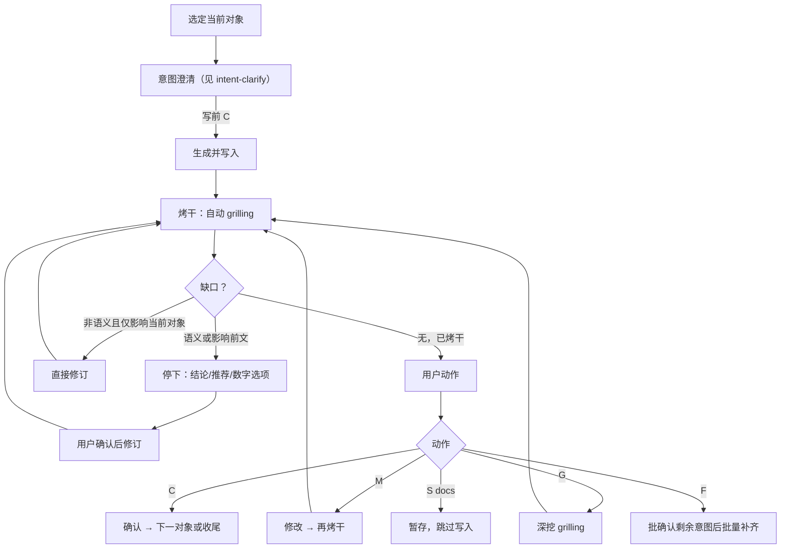
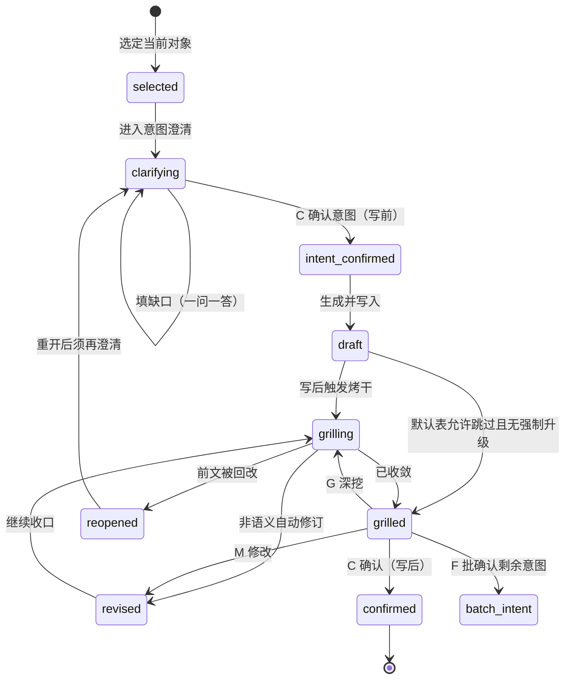

# 单元/段落推进协议（Agent SSOT）

> **定位**：跨 skill 复用的 **Section/Unit Cycle**（生成 → 烤干 → 用户动作 → 重开）唯一真源。  
> **分工**：写前意图澄清见 [intent-clarify.md](intent-clarify.md)；写后提问能力见 [grilling-skill.md](grilling-skill.md)；受众质检见 [audience-and-language.md](audience-and-language.md)。  
> **主线口令**：`澄清 → 生成 → 烤干`。

**最后更新**: 2026-07-29

**适用**：全部 `/sdx-*` 与语义族 docs-*（与 intent-clarify 启用名单一致）。轻流程技能不绑本文。

**生成步写作原则**：进入「生成并写入」前，须读并遵循 [docs-simplify.md](docs-simplify.md)（A 结构 / B 简明 / C 真源），除非用户明示「跳过精简 / 草稿优先」等豁免。原则正文只维护于该契约；各 Skill 仅短链。

---

## 术语

| 词 | 含义 |
| --- | --- |
| **当前段** | `sdx-*`：章节、子章节或单一设计块 |
| **当前单元** | `docs-*`：目标块、路径组、实体批次、归档块、范围确认块等 |
| **对象** | 当前段或当前单元的统称 |

本地 gates/workflow 只声明本技能用「段」还是「单元」，不复制本文协议正文。

---

## 推进总览

---

## 共享状态机

| 状态 | 含义 |
| --- | --- |
| `clarifying` | 写前意图澄清中；尚未授权写入 |
| `intent_confirmed` | 写前 `C` 已过 |
| `draft` | 初稿已写入目标容器 |
| `grilling` | 写后自动烤干中 |
| `grilled` | 已收敛（或合法跳过烤干），待写后动作 |
| `revised` / `reopened` / `confirmed` | 修订中 / 须回澄清 / 写后已确认 |

---

## 写后完成条件（共通）

对象进入 `confirmed` 前至少：

1. 已通过写前意图澄清并完成写入（或技能允许的 dry-run 预览）
2. 已按本地**写后默认表**进入烤干（或合法跳过）
3. 烤干已收敛，或语义问题经用户确认修订后再次收敛
4. 烤干中已通过受众维 **A/B/C/E**（见 [audience-and-language.md](audience-and-language.md)）；未过不得进入 `grilled`
5. 用户在「当前阶段：烤干」下给出写后 `C`

---

## 自动 grilling 默认授权

进入烤干后，默认仅可做**非语义性修订**（错别字、编号、排版、同对象微调）。

语义性问题（目标/范围/承诺/口径/取舍/风险/术语/路径/ID 等）必须先输出结论、推荐与数字选项；用户选择前不得修订。

- **适用**：当前对象及其直接容器内微调  
- **不适用**：前文章节、其他未打开对象、全文级结构重排（须走前文回改）

---

## 用户动作

每轮等待用户时必须打印阶段横幅：`当前阶段：意图澄清` 或 `当前阶段：烤干`。禁止无横幅裸发动作字母。

| 动作 | 阶段 | 含义 |
| --- | --- | --- |
| **C** | 意图澄清 | 确认六项清单，授权写入 |
| **C** | 烤干 | 确认当前对象，推进下一对象或收尾 |
| **M** | 两阶段 | 修改意图清单或已写正文；之后按阶段重入澄清或烤干 |
| **G** | 仅烤干 | 已收敛后追加深挖；**不是**意图澄清 |
| **F** | 烤干后 | 先批确认剩余对象意图，再连续生成（见下） |
| **S** | docs 语义族 | **暂存**：不落盘当前单元 / 结束或切换；`sdx-*` **无** `S` |

### `F`：批量补齐前的意图批确认

1. 汇总剩余未完成对象的意图表（每行至少公共六项摘要）。
2. 用户一次确认（写前语境 `C`）后才连续生成。
3. 批确认后，对象间不再单独停意图澄清；每对象写入后仍按默认表 + 强制升级烤干。
4. 烤干遇语义问题或前文回改：立即停下；回改后受影响对象 `reopened` → 回意图澄清。

`F` 不是整篇重生成，不覆盖已确认前文，不得跳过剩余意图批确认。

### 整体验证（`F` 或全部对象完成后）

至少检查：跨对象矛盾、编号连续、术语一致、frontmatter/约定元数据、与已确认前文自洽。重大问题可重开对应对象。

---

## 前文回改

涉及前文设定错误、范围漂移、目标/术语冲突等时：

1. 先给受影响前提、推荐方案、数字选项；确认前不执行回改。  
2. 回改后：当前对象 → `reopened` → 必须回到意图澄清 → 写前 `C` → 修订/重写 → 再烤干。  
3. **前文回改 ≠ 当前对象自动通过**。

---

## 重开规则

导致重开：前文被改且影响前提；`M` 后未再收敛；用户显式重审；`F` 过程中后续对象打穿前提。

重开后：不得沿用旧 `confirmed`；须重新完成「澄清 → 生成/修订 → 烤干 → 用户动作」。

---

## 技能 Binding 要求

本地 `gates.md` / `workflow.md` **只保留**：

1. 链到本文 + [intent-clarify.md](intent-clarify.md) + [grilling-skill.md](grilling-skill.md)（不复制全文）
2. 对象定义（段 vs 单元）与产物路径
3. **写后默认表**（建议只写在 `workflow.md`）
4. 技能追加澄清字段、语义问题清单、高风险场景、失败停顿/原子性
5. 参数向导与脚本/I-O（`workflow.md`）

禁止在本地复述：状态机、动作字母全文、`F` 批确认细则、共通 mermaid 环。
