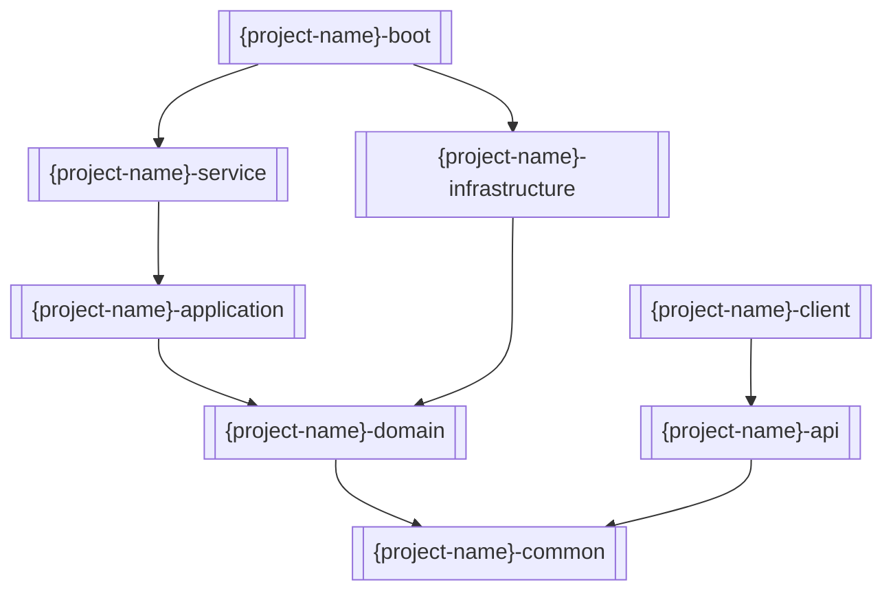

# 项目结构规范指南

> **按需启用**：目标工程采用 DDD/六边形时使用；**非本仓（Markdown/YAML 知识库）默认约束**。

**结论**：八模块固定分层；依赖只向内（boot/service → application → domain ← infrastructure；api/common 为契约与共享）。按聚合根组织代码；每层只暴露本层对象。

## 模块总览

```text
{project-name}/
├── {project-name}-api/             # 用户接口层 · 契约
├── {project-name}-service/         # 用户接口层 · 适配
├── {project-name}-application/     # 应用层
├── {project-name}-domain/          # 领域层
├── {project-name}-infrastructure/  # 基础设施层
├── {project-name}-common/          # 共享
├── {project-name}-client/          # 富客户端
└── {project-name}-boot/            # 启动
```



包根模板：`com.{company}.{business}.{businessdomain}.{context}`（common 无 `{context}`，落在 `...common`）。

## 分层规范

每层格式：**职责 / 边界 → 目录 → 命名 → 约束**。

### 1. api（用户接口 · 契约）

| 项 | 内容 |
| --- | --- |
| 职责 | 服务接口、公共常量、通用定义 |
| 边界 | 只定契约，无实现 |
| 命名 | `{Aggregate}Service`；`{Aggregate}{Action}Request/Response`；`{Aggregate}{Entity}DTO` |
| 包 | `...{context}.api` |

```text
{project-name}-api/
└── .../{context}/api/
    ├── request/ | response/ | dto/
    └── {Aggregate}Service.java
```

**约束**：禁止直接暴露领域对象；接口须完整 JavaDoc；POJO 可用 `@Data`；参数用 Bean Validation。

### 2. service（用户接口 · 适配）

| 项 | 内容 |
| --- | --- |
| 职责 | I/O 转换、全局异常、状态码封装 |
| 边界 | 外请求 → 内部命令；不承载核心业务规则 |
| 命名 | RPC `{Aggregate}Provider`；HTTP `{Aggregate}Controller`；`{Aggregate}ProviderFactory` |
| 包 | `...{context}`（provider/mq/job/factory/config） |

```text
{project-name}-service/
└── .../{context}/
    ├── provider/rpc|{Aggregate}Provider.java
    ├── provider/web/controller|{Aggregate}Controller.java · filter/
    ├── mq/consumer|listener · job/task|handler
    ├── factory|{Aggregate}ProviderFactory.java
    └── config/
```

**转换**：MapStruct；逻辑集中 Factory；`Request→Command`，`Result→Response`。

### 3. application（应用层）

| 项 | 内容 |
| --- | --- |
| 职责 | 用例编排、事务边界、流程控制 |
| 边界 | 协调领域对象完成用例；不实现领域规则细节 |
| 命名 | `{Aggregate}ApplicationService`；`{Aggregate}{Action}Command`；`{Aggregate}{Query}Query`；`{Aggregate}{Action}Result`；`{Aggregate}CommandFactory` |
| 包 | `...{context}.application` |

```text
{project-name}-application/
└── .../{context}/application/
    ├── service|{Aggregate}ApplicationService.java
    ├── action/ · command/ · query/ · result/
    └── factory|{Aggregate}CommandFactory.java
```

**约束**：只收 Command/Query、返回 Result；事务注解控边界；不直接改领域对象内部状态。

### 4. domain（领域层）

| 项 | 内容 |
| --- | --- |
| 职责 | 核心业务逻辑、领域模型、业务规则 |
| 边界 | 含全部业务逻辑；不依赖技术细节 |
| 命名 | 聚合 `{Aggregate}`；实体 `{Entity}`；值对象 `{ValueObject}`；`{Aggregate}DomainService` / `QueryFacade` / `Repository` |
| 包 | `...{context}.domain` |

```text
{project-name}-domain/
└── .../{context}/domain/
    ├── model|{Aggregate}|{Entity}|{ValueObject}
    ├── service|{Aggregate}DomainService.java
    ├── facade|{Aggregate}QueryFacade.java
    ├── repository|{Aggregate}Repository.java
    ├── event/ · specification/
```

**模型要点**：聚合根管生命周期；实体有唯一标识；值对象无标识靠属性；领域服务跨聚合；仓储接口只定持久化契约。

### 5. infrastructure（基础设施层）

| 项 | 内容 |
| --- | --- |
| 职责 | 技术实现、持久化、外部集成 |
| 边界 | 实现领域层定义的技术接口 |
| 命名 | `{Aggregate}Dao` / `Entity` / `Mapper` / `EntityFactory` |
| 包 | `...{context}.infrastructure` |

```text
{project-name}-infrastructure/
└── .../{context}/infrastructure/
    ├── dao/ · entity/ · mapper/ · factory/ · config/ · message/
```

**技术**：MyBatis + tk.mybatis；实体可用 JPA 注解映表；工厂 MapStruct；事务用 Spring `@Transactional`。

### 6. common（共享）

| 项 | 内容 |
| --- | --- |
| 职责 | 常量、枚举、工具、异常 |
| 边界 | 无业务逻辑，只通用能力 |
| 命名 | `{Business}Constants` / `Status|Type`；`{Utility}Utils`；`{Business}Exception` |
| 包 | `...common`（consts/enums/utils/exception） |

### 7. boot（启动）

| 项 | 内容 |
| --- | --- |
| 职责 | Spring Boot 入口与环境配置 |
| 边界 | 只启动，无业务逻辑 |
| 命名 | `Application`；包 `...boot` |
| 配置 | `application.yml` + `application-{dev|prod|test}.yml`；`spring.profiles.active` |

### 8. client（富客户端）

依赖 `api`；本规范不另定目录骨架（与 api 契约对齐即可）。

## 按聚合组织（推荐）

同上下文内按聚合根切目录，跨层镜像同名聚合：

```text
order/
├── api/ · application/
├── domain/
│   ├── model/Order.java · OrderItem.java · OrderId.java · OrderStatus.java
│   ├── service/OrderDomainService.java
│   ├── repository/OrderRepository.java
│   └── event/
└── infrastructure/
```

## 质量门禁

**结构**

- [ ] 包结构符合 DDD 分层
- [ ] 命名一致
- [ ] 依赖方向正确（不向外/跨层违规）
- [ ] 接口与实现分离

**边界**

- [ ] API 不直接依赖领域对象
- [ ] 领域层不依赖技术框架
- [ ] 基础设施实现领域接口
- [ ] 应用层协调但不实现领域业务逻辑

**质量**

- [ ] 每类职责单一
- [ ] 方法圈复杂度 ≤ 10
- [ ] 包内聚高、模块耦合低
