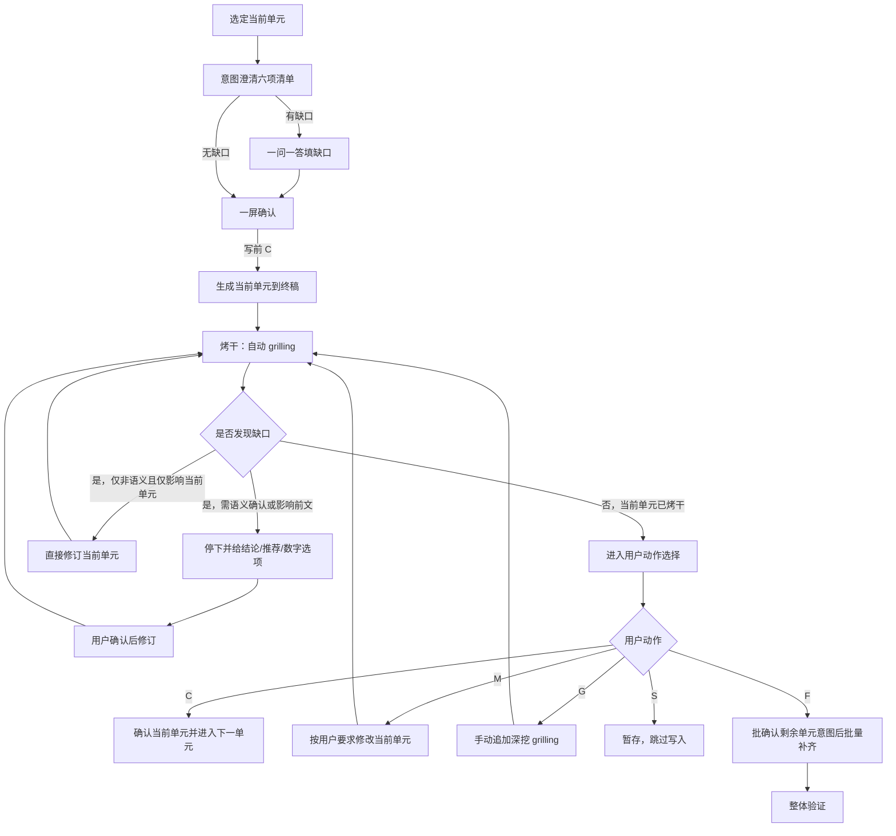

# docs-agent 推进协议

主干：[SKILL.md](../SKILL.md)。流程：[workflow.md](workflow.md)。

## 定位

本文件定义 `docs-agent` 的**单元推进协议**，用于约束：

- 写前**意图澄清**何时完成、方可生成
- 当前单元何时可推进
- 自动 `grilling`（烤干）如何持续收口
- 用户动作 `C/M/G/S/F` 的阶段语义（`C` 同符异义）
- 前文回改后，当前单元如何重开
- `F` 如何批确认意图后批量补齐

契约：

- [intent-clarify.md](../../../references/intent-clarify.md) — 写前意图澄清 SSOT
- [grilling-skill.md](../../../references/grilling-skill.md) — 写后烤干能力

本文只定义 `docs-agent` 的 binding。

---

## 单元推进总览

---

## 参数确认

参数向导至少收口以下内容：

- `output`: `readme` / `agents` / `both`
- `mode`: `create` / `update`
- 当前轮是否涉及覆盖已有内容

满足任一时，先澄清再写：

- 未说明输出范围
- 未说明 `create` / `update`
- 指令过宽，可能越出根入口双文件

---

## 意图澄清完成条件（写前）

进入生成前，至少满足：

1. 已输出公共六项清单（目标 / 范围·非范围 / 缺口 / 禁臆测 / 写后烤干预判 / 路径容器）
2. 已标明「当前阶段：意图澄清」
3. 缺口已填完（或明确为「无」）
4. 用户明确给出写前 `C`

缺任一项，不得写入当前单元正文。

技能特有字段（追加，不可删减公共项）：

- **写入策略**：`merge` / `overwrite` / 待确认
- **INDEX 锚点**：本轮依赖的 `INDEX-GUIDE.md` 相对路径

---

## 单元完成条件（写后）

一个当前单元进入 `confirmed` 前，至少满足：

1. 已通过写前意图澄清并生成到终稿对应位置
2. 已进入自动 `grilling`（本技能默认必须烤干）
3. 自动 `grilling` 已收敛，或遇到必须等待用户确认的语义性问题后完成修订并再次收敛
4. 用户在「当前阶段：烤干」下明确给出写后 `C`

若缺少以上任一项，不视为当前单元完成。

---

## 风险确认

以下情况属于语义性或高风险写入，必须先给出结论、推荐方案与动作选项，再等待用户确认：

- `update` 与覆盖边界不清
- README 与 AGENTS 职责边界需要调整
- 已有内容是否保留存在歧义
- `output=both` 但用户只明确了一个文件

---

## 自动 grilling 默认授权

进入 `grilling` 阶段后，默认授权仅用于**非语义性修订**（不改变含义的错别字、编号、排版、同单元微调等）。

若涉及**语义性问题**（改变职责边界、覆盖策略、保留口径、INDEX 对齐口径等），必须先给出：

- 结论（或缺口）
- 推荐修订
- 快捷数字选项

在用户明确选择前，不得修订当前单元或另一入口文件。

适用范围：

- 当前正在处理的 `README.md` 或 `AGENTS.md`
- 与当前单元直接相邻、但仍属于同一当前单元容器的微调

不适用范围：

- 另一入口文件（除非触发前文回改协议）
- 全文级结构重排

---

## 用户动作

每轮等待用户时必须打印阶段横幅：`当前阶段：意图澄清` 或 `当前阶段：烤干`。

### C：确认（同符异义）

**意图澄清阶段**：

- 六项清单已可接受
- 授权生成并写入当前单元
- 状态经 `intent_confirmed` 进入 `draft`

**烤干阶段**：

- 当前单元内容已可接受
- 当前单元状态切换为 `confirmed`
- 若仍有下一单元，则进入下一单元（新单元从意图澄清开始）
- 若无下一单元，则进入整体验证

### M：修改

- 用户直接指出当前单元需要调整的内容
- 格式可为：`M 旧内容 - 新内容`
- 修改完成后，当前单元必须重新进入自动 `grilling`
- 未重新收敛前，不得直接写后 `C`

### G：继续 grill

- 自动 `grilling` 已收敛后，用户仍希望继续深挖当前单元
- 保持当前单元打开状态
- 追加一轮或多轮更深入的 `grilling`
- **不得**用 `G` 表示意图澄清

### S：暂存

- 保留本轮分析与意图清单
- 不落盘当前单元
- 结束当前单元或切换其他目标

### F：全部生成

- 保留已确认或已收敛的前文
- **先**输出剩余未完成入口文件意图表（公共六项摘要），用户一次确认（意图澄清语境 `C`）
- 再从当前单元之后按模板连续补齐剩余入口文件
- 每个后续单元写入后都要自动 `grilling` 到收敛
- 中途若遇到语义性问题或前文回改，立即停下等待用户确认

### F 的边界

- `F` 不是整篇重生成
- `F` 不覆盖已确认前文
- `F` 不得跳过剩余单元意图批确认
- `F` 过程中若遇到语义性问题或前文回改，必须停下等待用户确认

---

## 前文回改规则

当 `grilling` 发现的问题涉及另一入口文件设定错误、职责漂移、术语冲突时，允许回改该文件。

### 回改前的必做动作

涉及另一入口文件时，必须先给出：

- 受影响前提
- 推荐方案
- 快捷数字选项

在用户明确选择前，不得直接执行前文回改。

### 回改后的强制协议

一旦另一入口文件被修改：

1. 当前单元状态切换为 `reopened`
2. 当前单元不得直接写后 `C`
3. 必须回到**意图澄清**，基于新前提再确认
4. 写前 `C` 后重新检查/重写当前单元
5. 必须重新进入自动 `grilling`
6. 再次收口后，才能接受用户确认或继续批量补齐

---

## 与 INDEX 的关系

- INDEX 须已落盘；无 INDEX 不编造
- 本技能不替代 `docs-indexing`
- INDEX 落盘约束见 [execution-spec.md](execution-spec.md)，独立生效

---

## 状态映射

| 状态 | 含义 | 进入方式 | 离开方式 |
| --- | --- | --- | --- |
| `clarifying` | 写前意图澄清中 | 选定当前单元 / 重开 | 写前 `C` → `intent_confirmed` |
| `intent_confirmed` | 已授权写入 | 写前 `C` | 生成 → `draft` |
| `draft` | 当前单元初稿已写入终稿 | 生成当前单元 | 进入 `grilling` |
| `grilling` | 当前单元处于烤干中 | 开始自动 `grilling` | 收敛、修订或暂停确认 |
| `grilled` | 当前单元已烤干，可等待写后动作 | 自动 `grilling` 完成 | `C/M/G/S/F` |
| `revised` | 当前单元刚被修改 | `M` 或本单元修订 | 重新进入 `grilling` |
| `reopened` | 因前文回改或重审重新打开 | 另一入口文件变更 / 显式重开 | 回到 `clarifying` |
| `confirmed` | 当前单元已确认 | 写后 `C` | 被后续回改影响时可重开 |
