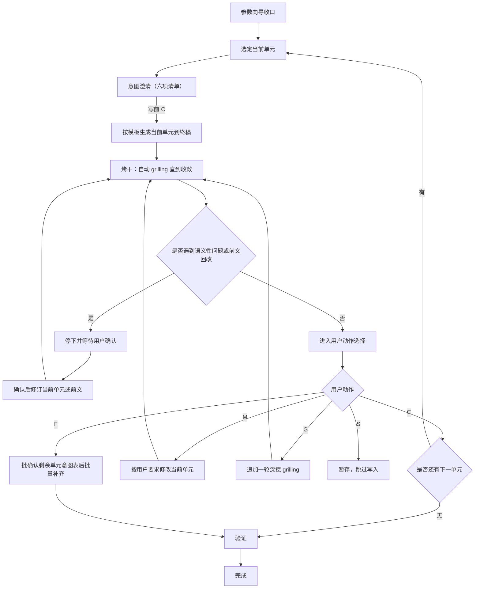
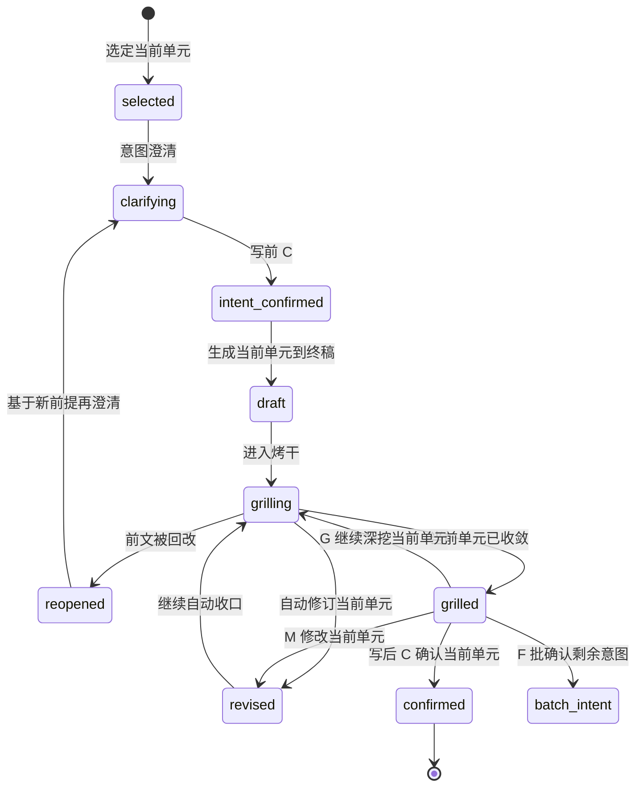

# docs-agent 工作流

主干：[SKILL.md](../SKILL.md)。推进协议：[gates.md](gates.md)。

契约分工：

- 写前**意图澄清**：[intent-clarify.md](../../../references/intent-clarify.md)
- 写后**烤干** `grilling`：[grilling-skill.md](../../../references/grilling-skill.md)

本文只定义二者在 `docs-agent` Unit Cycle 中的绑定。

## 输入输出

| 类型 | 内容 |
| ---- | ---- |
| 硬输入 | 落盘 `INDEX-GUIDE.md`；无则不编造 |
| 必需参数 | `output`、`mode` |
| 固定输出 | `{REPO_ROOT}/README.md`、`AGENTS.md` |
| 不产出 | 不替代 `INDEX-GUIDE.md`；不把索引指南全文并入 AGENTS |

## 参数

| 参数 | 默认 | 说明 |
| ---- | ---- | ---- |
| `--output` | `both` | `readme` / `agents` / `both` |
| `--mode` | `update` | `create` 初始化；`update` 合并 |

## 参数向导

按以下顺序收口参数；用户已明确时可跳过对应项：

1. `output`
2. `mode`
3. 覆盖还是合并策略
4. 当前轮起始单元（默认 `README.md`；若 `output=agents` 则直接从 `AGENTS.md` 开始）

参数未收口前，不进入执行。

## 步骤 1：Index 解析

`source` `agent/scripts/config-bootstrap.sh`，`validate_bootstrap_docsconfig` 指向本技能 `scripts/`，解析 `.docsconfig` 得 **`REPO_ROOT`**、**`DOC_ROOT`**（及可选 `AGENT_*`）。

```bash
REPO_ROOT="$(git rev-parse --show-toplevel 2>/dev/null || pwd)"
source "$REPO_ROOT/agent/scripts/config-bootstrap.sh"
validate_bootstrap_docsconfig "$REPO_ROOT/agent/skills/docs-agent/scripts"
DOC_ROOT="$(resolve_repo_doc_root)"
```

按序查找落盘 Index Guide，命中即停并记录相对路径：`REPO_ROOT/INDEX-GUIDE.md`，再 `DOC_ROOT/INDEX-GUIDE.md`。未命中 → 终止并提示 `/docs-indexing`。细则与降级见 [execution-spec.md](execution-spec.md)。

## 步骤 2：探索

以 INDEX 为地图，最小阅读集；禁止为 AGENTS 通读全仓。章节 → 去向见 [execution-spec.md](execution-spec.md) §2。

## 当前单元

一个当前单元就是单个根入口文档：

- `README.md`
- `AGENTS.md`

`output=both` 时，默认顺序：

1. `README.md`
2. `AGENTS.md`

一次只处理一个当前单元，不并行推进两个入口文件。

## Unit Cycle（澄清 → 生成 → 烤干）

### 写后默认表

`docs-agent`：**各入口文档当前单元默认必须烤干**（启发式只可升级、不可降级跳过）。

### 固定循环



1. 选定当前单元
2. **意图澄清**：输出公共六项清单，标明「当前阶段：意图澄清」；有缺口则一问一答；用户写前 `C` 后方可写入
3. 按模板生成当前单元，直接写入终稿对应位置
   - README：`assets/readme-skeleton.md`；30 秒内「是什么、下一步」；目录树唯一起源 INDEX §2
   - AGENTS：`assets/agents-skeleton.md`；去重 [three-file-spec.md](three-file-spec.md)；概述 ≤3 行；命令块只在 README
4. **烤干**：对当前单元执行自动 `grilling`，直到收敛；标明「当前阶段：烤干」
5. 若打出语义性问题或前文回改，暂停等待用户确认
6. 当前单元收敛后，用户用 `C/M/G/S/F` 做写后动作选择
7. 收口后再进入下一单元，或在用户选 `F` 后先批确认剩余意图再批量补齐

### 约束

- 未完成写前意图澄清（无写前 `C`），不得写入当前单元正文
- `grilling` 默认只拷当前单元，不跨多单元发散
- 若环境未安装 `grilling` Skill，则按 [grilling-skill.md](../../../references/grilling-skill.md) 的 fallback 协议执行
- 进入 `grilling` 阶段，默认授权仅用于**非语义性修订**
- `grilling` 打出**语义性问题**时，必须先输出结论、推荐修订与数字选项并等待用户确认
- 自动 `grilling` 收敛前，不默认推进到下一入口文件
- `G` 不是每轮必选动作，只在自动收敛后由用户手动追加深挖
- 若本单元依赖另一入口文件结论，则该文件变更会触发本单元重开（重开后须再意图澄清）

## 前文回改规则

若当前单元 `grilling` 打出的问题仅影响当前单元，则只修当前单元。
若问题涉及另一入口文件设定错误、职责漂移、术语冲突等，则允许回改该文件。

### 回改后的强制动作

一旦另一入口文件被改，当前单元必须：

1. 重新读取受影响前提
2. 状态 `reopened`，回到**意图澄清**
3. 写前 `C` 后重写或修订当前单元
4. 重新进入自动 `grilling`
5. 再进入用户确认或批量补齐

## 段落状态



## 验证

```bash
bash agent/skills/docs-agent/scripts/validate-guide.sh --root .
```

清单与反模式：[quality-standards.md](quality-standards.md)。

## 约束摘要

| 项 | 要求 |
| -- | ---- |
| 零幻觉 | 无落盘 INDEX 不编造；未读不写死 |
| 单单元推进 | 一次只处理一个入口文档，收敛后再进入下一文档 |
| 单一事实 | 命令在 README；AGENTS ≤3 行；不复制 INDEX §3 表 |
| INDEX | 本技能内不调 docs-indexing；只消费已落盘 `INDEX-GUIDE.md` |
| update | `update` 合并，不全量覆盖 |
