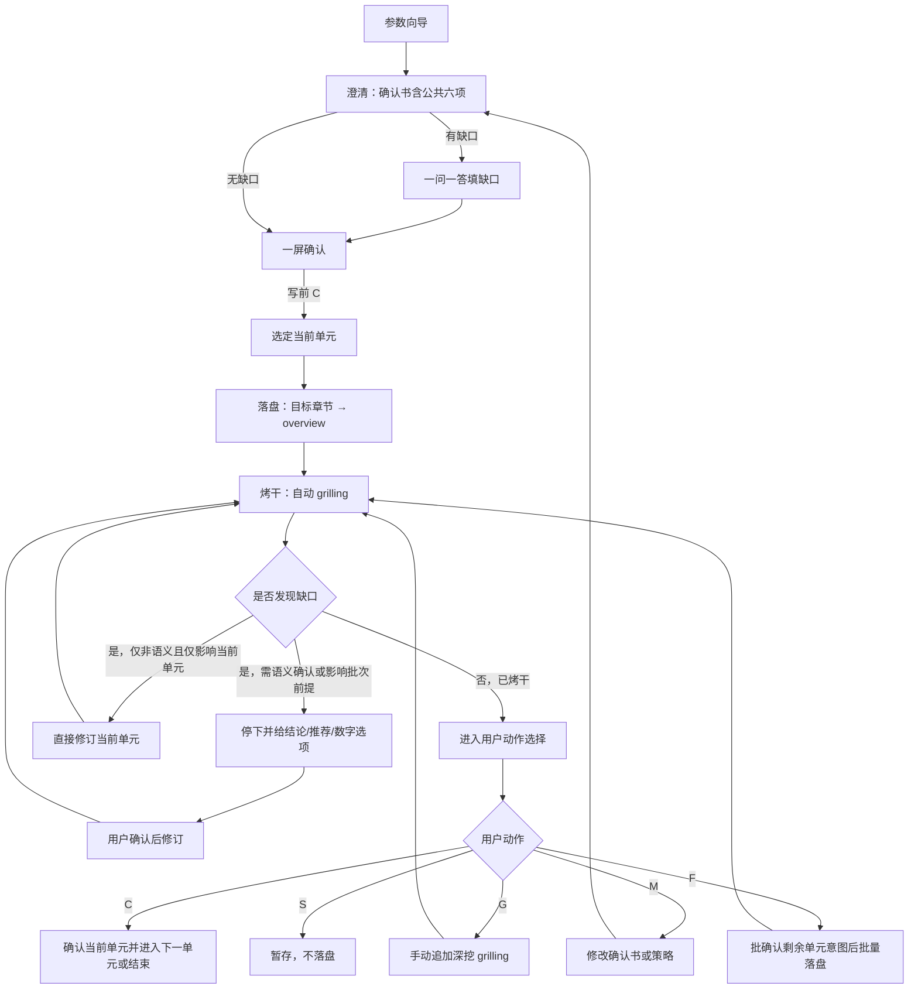

# docs-archive 推进协议

主干：[SKILL.md](../SKILL.md)。流程：[workflow.md](workflow.md)。

## 定位

本文件定义 `docs-archive` 的**单元推进协议**，用于约束：

- **确认书 = 写前意图澄清门禁**（公共六项并入，避免两套停顿）
- 当前单元何时可落盘
- 自动 `grilling`（烤干）如何持续收口
- 用户动作 `C/M/G/S/F` 的阶段语义（`C` 同符异义）
- 确认书或策略变更后如何重开
- `F` 如何批确认意图后批量补齐

本技能默认采用**「澄清 → 落盘 → 烤干」**模式。

契约：

- [intent-clarify.md](../../../references/intent-clarify.md) — 写前意图澄清 SSOT（经确认书 binding）
- [grilling-skill.md](../../../references/grilling-skill.md) — 写后烤干能力

操作层易错：[gotchas.md](../gotchas.md)。路径与链接：[links-and-index.md](links-and-index.md)。

---

## 单元推进总览

---

## 确认书 = 意图澄清完成条件（写前）

**当前确认书即写前意图澄清门禁**，并入公共六项后，进入落盘前至少满足：

1. 已输出公共六项（目标 / 范围·非范围 / 缺口 / 禁臆测 / 写后烤干预判 / 路径容器），映射到确认书各节
2. 已标明「当前阶段：意图澄清」
3. archive 特有项已明确：来源清单、目标清单、映射、冲突策略、来源清理策略
4. 缺口已填完（或明确为「无」）
5. 用户明确给出写前 `C`

缺任一项，不得落盘目标章节或回写 overview。

**批次确认书收口后**，各当前单元落盘前**不再**重复六项全清单；仅须摘取本单元目标与写入路径（映射表一行即可）。

---

## 当前单元完成条件（写后）

一个当前单元进入 `confirmed` 前，至少满足：

1. 批次确认书已通过写前意图澄清
2. 已按顺序落盘（目标章节 → overview 回写）
3. 已进入自动 `grilling`（本技能默认必须烤干）
4. 自动 `grilling` 已收敛，或遇到语义性问题并完成修订后再次收敛
5. 用户在「当前阶段：烤干」下明确给出写后 `C`

若缺少以上任一项，不视为当前单元完成。

---

## 写后默认表

`docs-archive`：**各当前单元默认必须烤干**。

出现以下任一情况时，**强制升级为必须烤干**（不可降级跳过）：

- 未确认决策写入正文
- 跨单元依赖或批次前提变更
- overview 行内链接、目标章节路径、索引路径变更
- 冲突消解、来源清理策略变更

---

## 高风险场景

以下情形必须先给出结论、推荐方案与数字选项，待用户确认后再执行：

- 来源与目标冲突，无法自动消解
- overview 行内链接缺失或断链
- 用户要求直接全量归档多个视角
- 用户要求直接删 overview 而不保留索引壳
- 目标章节体例与来源结构差异很大

---

## 当前单元原子性

- 当前单元必须先落目标章节，再回写 overview
- 目标章节落盘失败时，禁止回写 overview
- 若 overview 回写后发现断链或悬空半句，当前单元视为未收敛，必须继续修复或暂存
- 当前单元未收敛前，不得自动推进下一章节或下一行块

---

## 自动 grilling 默认授权

进入 `grilling` 阶段后，默认授权仅用于**非语义性修订**：

- 错别字
- 标题级别微调
- 编号
- 排版

若涉及语义性问题，必须先确认。典型语义问题包括：

- 来源范围变化
- 目标章节变化
- 冲突策略变化
- 来源清理策略变化
- 索引壳与否

---

## 用户动作

每轮等待用户时必须打印阶段横幅：`当前阶段：意图澄清` 或 `当前阶段：烤干`。

### C：确认（同符异义）

**意图澄清阶段**（确认书收口）：

- 确认书含六项且可接受
- 授权进入当前单元落盘
- 状态经 `intent_confirmed` 进入落盘

**烤干阶段**：

- 当前单元内容已可接受
- 进入下一单元或结束
- 若无下一单元，则进入收尾摘要

### M：修改

- 修改确认书、冲突策略、回写策略或当前单元内容
- 若修改影响批次前提，须回到澄清并重获写前 `C`
- 修改后必须重新进入自动 `grilling`
- 未重新收敛前，不得直接写后 `C`

### G：继续 grill

- 自动 `grilling` 已收敛后，用户仍希望继续深挖当前单元
- **仅写后**；不得用 `G` 表示意图澄清

### S：暂存

- 保留当前确认书与分析结果
- 不落盘当前单元或停止后续同批处理

### F：批量补齐

- 仅在当前单元已收敛后使用
- **先**汇总剩余单元意图表（六项摘要），用户一次写前语境 `C` 确认
- 再按已确认策略连续落盘；每单元仍须烤干，段间不再单独停意图澄清
- 中途若触发语义问题或批次前提变更，必须再次停下确认

---

## 重开规则

以下情况会导致当前单元或批次重开：

- 确认书被 `M` 修改且影响批次前提
- 当前单元被 `M` 修改后尚未重新烤干收敛
- 烤干中发现需变更冲突策略或来源清理策略
- `F` 批量过程中反向打穿已确认前提

重开后：批次前提变更 → 回到**澄清**（确认书）并重获写前 `C`；仅当前单元内容变更 → 重新**烤干**。

---

## 状态映射

| 状态 | 含义 | 进入方式 | 离开方式 |
| --- | --- | --- | --- |
| `clarifying` | 写前意图澄清中（确认书形成） | 参数向导后 / 重开 | 写前 `C` → `intent_confirmed` |
| `intent_confirmed` | 确认书已授权落盘 | 写前 `C` | 选定单元并落盘 → `draft` |
| `draft` | 当前单元已落盘 | 落盘完成 | 进入 `grilling` |
| `grilling` | 当前单元烤干中 | 开始自动 `grilling` | 收敛、修订或暂停确认 |
| `grilled` | 当前单元已烤干，可等待写后动作 | 自动 `grilling` 完成 | `C/M/G/S/F` |
| `revised` | 当前单元刚被修改 | `M` 或本单元修订 | 重新进入 `grilling` |
| `reopened` | 因批次前提变更重开 | 确认书/策略变更 | 回到 `clarifying` |
| `confirmed` | 当前单元已确认 | 写后 `C` | 进入下一单元或收尾 |
