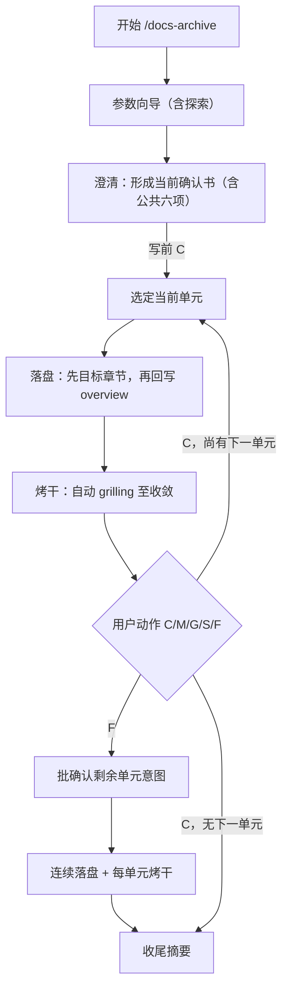

# docs-archive 工作流

交付主线：**参数向导 → 澄清（确认书 = 意图澄清）→ 当前单元落盘 → 烤干 → 用户动作推进**。

契约分工：

- 写前**意图澄清**：[intent-clarify.md](../../../references/intent-clarify.md)（经确认书承载，不重复停顿）
- 写后**烤干** `grilling`：[grilling-skill.md](../../../references/grilling-skill.md)

## 前置

- 路径：[knowledge-layout.md](../../../references/knowledge-layout.md)
- overview 路径（`system/knowledge/overview/` 或 `company/knowledge/overview/`，可选 `#锚点`）；目标由**表格行链接**解析
- 若环境未安装 `grilling` Skill，则按 [grilling-skill.md](../../../references/grilling-skill.md) 的 fallback 协议执行

## 总流程

## 步骤 1：参数向导（含探索）

先完成必要探索，再分步澄清；未明则问，**每次一维**；用户已说清则跳过。

1. 「来源 {符} 目标」简写 → 先解析两端（陷阱见 [core-concepts.md](core-concepts.md)、[gotchas.md](../gotchas.md)）
2. **读**来源（文件/目录/章标题/锚点）
3. **读**目标及同级体例（标题级、表、术语表）；标准路径下目标仅由 overview **行内副标题链接**定
4. 按需读 [gates.md](gates.md)、[links-and-index.md](links-and-index.md)

| 维度 | 内容 |
| ---- | ---- |
| 来源范围 | 单文件 / 目录 / 指定章；附件、脚注、历史版 |
| 目标形态 | 单文件节 / 多文件 / 新建+索引（overview 驱动时目标清单多已由当前轮探索得出） |
| 抽象层级 | 摘录 / 要点 / 可对外 |
| 术语风格 | 术语表、禁用词、语体 |
| 冲突策略 | 以来源 / 以目标 / 并列待裁 |
| 产出 | 仅 MD？是否更目录或 changelog |
| 来源清理 | 删已归档 / **仅索引壳**（推荐）/ 不动 |

## 步骤 2：澄清（确认书 = 意图澄清门禁）

**当前确认书即写前意图澄清容器**，须并入 [intent-clarify.md](../../../references/intent-clarify.md) 公共六项，并标明「**当前阶段：意图澄清**」：

| 公共六项 | 在确认书中的落点 |
| --- | --- |
| 本段/单元目标 | 会话主题 + 本轮归档要达成什么 |
| 范围 / 非范围 | 来源清单 + 不落盘清单 |
| 已知缺口 | 探索中未决项；无则写「无」 |
| 禁止臆测项 | 不得编造的路径、ID、冲突裁决、清理承诺 |
| 写后烤干预判 | 按下文默认表；当前单元**默认必须烤干** |
| 写入路径/容器 | 目标清单 + 映射表中的路径/节位 |

archive 特有字段见 [../assets/archive-template.md](../assets/archive-template.md)：来源清单、目标清单、映射、冲突与术语、来源清理策略、方案候选与推荐。

收口协议（混合，与 intent-clarify 一致）：

1. **无缺口**：一屏列出确认书（含六项摘要 + 推荐填空）→ 用户写前 `C` 后进入落盘。
2. **有缺口/冲突**：先按 grilling fallback **一次一问**填缺口 → 再一屏确认 → 写前 `C` 后落盘。
3. 未获写前 `C`，**不得**写目标章节或回写 overview。

**批次确认书收口后**，处理各当前单元时**不再**重复六项全清单停顿；落盘前仅摘取本单元目标与写入路径（可从映射表一行带出）。

## 步骤 3：当前单元落盘

提取业务含义，去噪；多出处同一事实只留主述；**句式与层级服从目标**；最小 diff。  
**来源不入正文**（无 `(来源：…)` 等；追溯留在确认书/冲突清单）。  
**回写 overview（按行）**：本行归档并自检后删片段，或换「索引壳」占位，**保留行内副标题链接**。

落盘顺序固定为：

1. 先落目标章节
2. 再回写 overview

目标章节失败时，禁止回写 overview。

## 步骤 4：烤干（自动 grilling）

当前单元落盘或预览后，立即进入「**当前阶段：烤干**」并执行自动 `grilling`：

- 检查目标章节是否服从目标体例
- 检查 overview 回写后是否断链、悬空、只剩标题
- 检查索引壳是否只保留导航，不承载业务事实
- 检查冲突是否已按确认书处理

### 写后默认表

`docs-archive`：**各当前单元默认必须烤干**（启发式只可升级、不可降级跳过）。出现未确认决策落盘、跨单元依赖变更、导航/索引路径变更、冲突策略变更时，强制升级为必须烤干。

若发现语义性问题，先停下给结论、推荐方案和数字选项；仅非语义修订可在当前单元默认授权下直改并继续烤干。

## 步骤 5：用户动作

当前单元烤干收敛后，停下等待 `C/M/G/S/F`（须标明「当前阶段：烤干」）：

- `C`：确认当前单元并进入下一个章节/行块或结束
- `M`：修改确认书或当前单元策略；修改后若影响批次前提，须回到澄清并重获写前 `C`
- `G`：继续深挖当前单元（仅写后；不得表示意图澄清）
- `S`：暂存当前单元，停止落盘
- `F`：先汇总剩余单元意图表（六项摘要），用户一次写前语境 `C` 后，按已确认策略连续落盘；每单元仍须烤干，段间不再单独停意图澄清

## 收尾摘要

列：**改动的文件**、**每文件一句**、**待用户事**。写 `CHANGE-LOG.md` 则**新条插最前**。不自动 `git commit` / `push`（[links-and-index.md](links-and-index.md)）。

## 临时文件（可选）

映射表、冲突清单可放用户于当前确认书指定的路径；无固定文件名要求。
