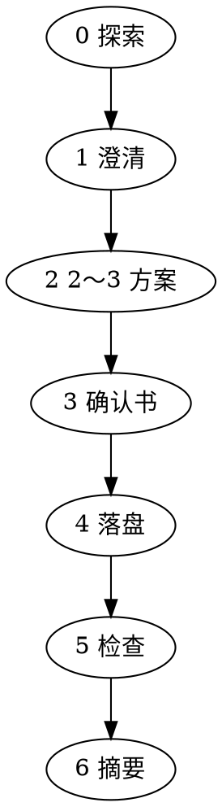

# 工作流（步骤 0～6）

交付主线：**方案确认书 → 目标增补**；澄清节奏可与 brainstorming 对齐，但以本会话确认书与落盘为准。

**流程**（须顺序；澄清一般**一次一问**）：

## 步骤 0：探索

1. 「来源 {符} 目标」简写 → 先解析两端（陷阱见 [core-concepts.md](core-concepts.md)、[gotchas.md](../gotchas.md)）。
2. **读**来源（文件/目录/章标题/锚点）。
3. **读**目标及同级体例（标题级、表、术语表）。标准路径下目标仅由 overview **行内副标题链接**定；解析结果写入确认书。
4. 按需 [gates.md](gates.md)、[links-and-index.md](links-and-index.md)。
5. 用一两句向用户确认「从哪来、到哪去」；**不续问**，进入步骤 1。

## 步骤 1：澄清（分步，选择题优先）

未明则问，**每次一维**；用户已说清则跳过。

| 维度 | 内容 |
| ---- | ---- |
| 来源范围 | 单文件 / 目录 / 指定章；附件、脚注、历史版 |
| 目标形态 | 单文件节 / 多文件 / 新建+索引（overview 驱动时目标清单多已由步骤 0 得出） |
| 抽象层级 | 摘录 / 要点 / 可对外 |
| 术语风格 | 术语表、禁用词、语体 |
| 冲突策略 | 以来源 / 以目标 / 并列待裁 |
| 产出 | 仅 MD？是否更目录或 changelog |
| 来源清理 | 删已归档 / **仅索引壳**（推荐）/ 不动 |

## 步骤 2：2～3 种方案

至少两种（第三种可选：最小补丁 / 重组 / 先附录再并入）。每项：**做法、利弊、风险**；**推荐 + 理由**。

## 步骤 3：方案确认书

字段见 [../assets/archive-template.md](../assets/archive-template.md)。必备：来源清单；目标清单；映射；冲突与术语；**不落盘清单**。用户肯定（「确认 / 按方案执行」等）后 → 步骤 4；改方案则更新确认书再确认。

## 步骤 4：落盘

提取业务含义，去噪；多出处同一事实只留主述；**句式与层级服从目标**；最小 diff。  
**来源不入正文**（无 `(来源：…)` 等；追溯留在确认书/冲突清单）。  
**回写 overview（按行）**：本行归档并自检后删片段，或换「索引壳」占位，**保留行内副标题链接**。

## 步骤 5：检查

[quality-checklist.md](quality-checklist.md)。若已清理 overview，复查无断链、半句悬空。

## 步骤 6：摘要

列：**改动的文件**、**每文件一句**、**待用户事**。写 `CHANGE-LOG.md` 则**新条插最前**。不自动 `git commit` / `push`（[links-and-index.md](links-and-index.md)）。

## 临时文件（可选）

映射表、冲突清单可放用户于确认书指定的路径；无固定文件名要求。
