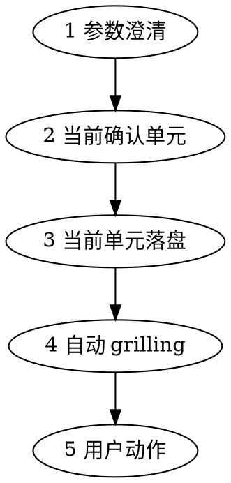

# docs-archive 工作流

交付主线：**参数向导 -> 当前确认单元 -> 当前单元 -> 自动 grilling -> 用户动作推进**。

## 前置

- 路径：[knowledge-layout.md](../../../references/knowledge-layout.md)
- overview 路径（`system/knowledge/overview/` 或 `company/knowledge/overview/`，可选 `#锚点`）；目标由**表格行链接**解析
- 若环境未安装 `grilling` Skill，则按 [grilling-skill.md](../../../references/grilling-skill.md) 的 fallback 协议执行

## 总流程

## 步骤 1：参数澄清（含探索）

先完成必要探索，再分步澄清；未明则问，**每次一维**；用户已说清则跳过。

1. 「来源 {符} 目标」简写 → 先解析两端（陷阱见 [core-concepts.md](core-concepts.md)、[gotchas.md](../gotchas.md)）
2. **读**来源（文件/目录/章标题/锚点）
3. **读**目标及同级体例（标题级、表、术语表）；标准路径下目标仅由 overview **行内副标题链接**定
4. 按需读 [gates.md](gates.md)、[links-and-index.md](links-and-index.md)

| 维度 | 内容 |
| ---- | ---- |
| 来源范围 | 单文件 / 目录 / 指定章；附件、脚注、历史版 |
| 目标形态 | 单文件节 / 多文件 / 新建+索引（overview 驱动时目标清单多已由当前轮探索得出） |
| 抽象层级 | 摘录 / 要点 / 可对外 |
| 术语风格 | 术语表、禁用词、语体 |
| 冲突策略 | 以来源 / 以目标 / 并列待裁 |
| 产出 | 仅 MD？是否更目录或 changelog |
| 来源清理 | 删已归档 / **仅索引壳**（推荐）/ 不动 |

## 步骤 2：当前确认单元

至少两种（第三种可选：最小补丁 / 重组 / 先附录再并入）。每项：**做法、利弊、风险**；**推荐 + 理由**。
字段见 [../assets/archive-template.md](../assets/archive-template.md)。必备：来源清单；目标清单；映射；冲突与术语；**不落盘清单**。用户肯定（「确认 / 按方案执行」等）后 → 步骤 3；改方案则更新当前确认单元再确认。

## 步骤 3：当前单元落盘

提取业务含义，去噪；多出处同一事实只留主述；**句式与层级服从目标**；最小 diff。  
**来源不入正文**（无 `(来源：…)` 等；追溯留在确认书/冲突清单）。  
**回写 overview（按行）**：本行归档并自检后删片段，或换「索引壳」占位，**保留行内副标题链接**。

当前单元落盘顺序固定为：

1. 先落目标章节
2. 再回写 overview

目标章节失败时，禁止回写 overview。

## 步骤 4：自动 grilling

当前单元落盘或预览后，立即做自动 `grilling`：

- 检查目标章节是否服从目标体例
- 检查 overview 回写后是否断链、悬空、只剩标题
- 检查索引壳是否只保留导航，不承载业务事实
- 检查冲突是否已按确认书处理

若发现语义性问题，先停下给结论、推荐方案和数字选项。

## 步骤 5：用户动作

当前单元收敛后，停下等待 `C/M/G/S/F`：

- `C`：确认当前单元并进入下一个章节/行块或结束
- `M`：修改当前确认单元或回写策略，再重新 grill
- `G`：继续深挖当前单元
- `S`：暂存当前单元，停止落盘
- `F`：按已确认策略补齐剩余同批范围

## 收尾摘要

列：**改动的文件**、**每文件一句**、**待用户事**。写 `CHANGE-LOG.md` 则**新条插最前**。不自动 `git commit` / `push`（[links-and-index.md](links-and-index.md)）。

## 临时文件（可选）

映射表、冲突清单可放用户于当前确认单元指定的路径；无固定文件名要求。
