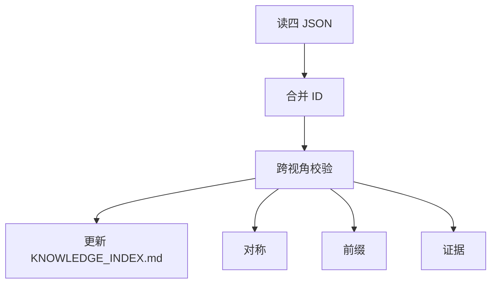

# 归并规范（阶段 4）

[readme-fill-spec.md](readme-fill-spec.md) 之后收口：读四 `*_knowledge.json`（2.1），前缀/对称校验，写 **`KNOWLEDGE_INDEX.md`**。

## 流程

**前置**：各视角 README 已与 JSON 同步（[readme-fill-spec.md](readme-fill-spec.md)）。

## 规则

### 1. 前缀

仅 `contains_prefixes`：

| 视角 | 前缀 |
|------|------|
| technical | SYS- APP- MS- API- |
| data | DS- ENT- |
| business | BD- BSD- BC- AGG- AB- |
| product | PL- PM- FT- UC- |

### 2. 唯一

- 层级+ID、层级+别名、`full_id` 全库唯一

### 3. 对称

见 [builtin-config.md](builtin-config.md) `symmetry.rules`：

| ID | 要点 |
|----|------|
| same_round_four_sections | INDEX §1–§4 同轮 |
| no_template_only | 勿仅模板 ID |
| index_over_template | 能登记则优先 INDEX §3/§3.2/§六/§七 与工程事实 |
| bc_agg_linkage | §1 有 BC/AGG 则 §3 或 §4 须有证据行或待补充说明 |

## entities 形状

| 视角 | entities |
|------|----------|
| technical | `{systems, applications, services, apis}` |
| data / business / product | 扁平数组；父子用 `parent_id` 等 |

详 [knowledge-schema-template.json](../assets/knowledge-schema-template.json)。

## KNOWLEDGE_INDEX 列

| 列 | 含义 |
|----|------|
| 层级 | 层次 |
| ID | 层级内序号 001… |
| Full ID | 如 `SYS-*` |
| 别名 | 机器可读 |
| 名称 | 中文 |
| 能力概述 | 仅 AB；他层 `-` |
| 证据链 | 多来源分号隔 |

### 证据示例

| 类型 | 格式例 |
|------|--------|
| 文档 | `INDEX_GUIDE.md §3.2` |
| 代码 | `FooApiImpl#create:111` |
| 配置 | `application.yml:key` |
| 工程 | `pom.xml` |
| 实体/API | `MS-001 Name`、`API-002 alias` |

表头模板：[knowledge-index-template.md](../assets/knowledge-index-template.md)。
