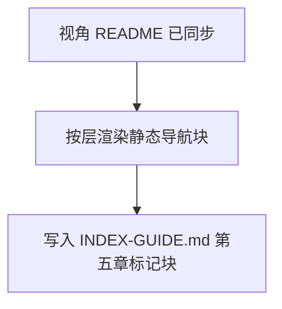

# 归并规范（阶段 4）

[readme-fill-spec.md](readme-fill-spec.md) 之后收口：写入 **`{DOC_DIR}/INDEX-GUIDE.md` 第五章**（`docs-build:entity-index` 标记块）为**视角导航**——短注 + 链到各视角 README / `knowledge/index.md`。**不扫** concept、不贴实体表；实体台账 SSOT ∈ 各视角 README「实体」节。

## 流程

**前置**：各视角 README 已与实体 concept 同步（[readme-fill-spec.md](readme-fill-spec.md)）。

**生成脚本**：`agent/skills/docs-build/scripts/generate_knowledge_index.py`（按 `--bundle` 写入层范围短注 + 固定视角入口链）。

## 规则

### 1. 前缀 / 唯一 / 对称

实体 ID 前缀、唯一性、跨视角对称仍在 **per-entity + 视角 README** 侧维护（见 [readme-fill-spec.md](readme-fill-spec.md)、[builtin-config.md](builtin-config.md)）。本阶段第五章**不再**承载扫描表或证据行列。

### 2. 导航块内容

| 段 | 要点 |
|----|------|
| 导语 | docs-build 写入；台账 ∈ README；正文 ∈ per-entity；骨架 ∈ docs-indexing |
| 范围短注 | 按 company / system / application 各写一层边界 |
| 视角入口 | Markdown 链：`knowledge/README.md`、`knowledge/index.md`、五视角 `README.md` |

模板：[knowledge-index-template.md](../assets/knowledge-index-template.md)。

### 3. concept 文件形状

每个实体 concept 为独立 `{ID}.md`，frontmatter 至少含 `id`、`perspective`、`hierarchy`、`type`、`title`；跨视角引用写在 `# Cross-perspective` 与 bundle-relative 链接。跨 `DOC_DIR` 守 [knowledge-governance.md](../../../knowledge/knowledge-governance.md) 引用边界。路径规则见 [naming-conventions.md](../../../knowledge/naming-conventions.md) §OKF concept 路径与 type 映射。

| 视角 | 落盘 |
|------|------|
| application | SYS/APP/MS/API 各一 concept；锚点目录见 naming-conventions |
| data / business / product | 锚点目录 + 叶子 `{ID}.md` |
| technical | 扁平 `technical/{ID}.md` |

详 [knowledge-schema-template.json](../assets/knowledge-schema-template.json)（字段语义仍适用，载体改为 per-entity 文件）。

**生成方式**：调用 `python3 agent/skills/docs-build/scripts/generate_knowledge_index.py --bundle {application|system|company}`。产物：`{DOC_DIR}/INDEX-GUIDE.md` 第五章标记块（九章骨架由 `/docs-indexing` 维护）。目录导航仍是 `knowledge/index.md`；实体台账仍是各视角 README。
