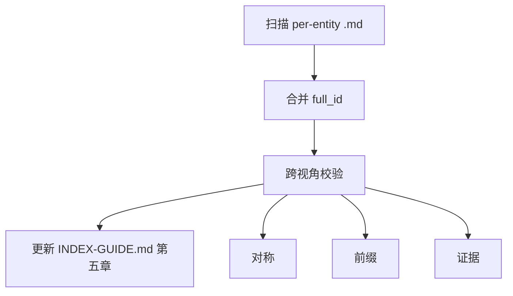

# 归并规范（阶段 4）

[readme-fill-spec.md](readme-fill-spec.md) 之后收口：**扫描**五视角 per-entity concept 文件（含 frontmatter `full_id`），前缀/对称校验，写入 **`{DOC_DIR}/INDEX-GUIDE.md` 第五章**（`docs-build:entity-index` 标记块）。

## 流程

**前置**：各视角 README 已与实体 concept 同步（[readme-fill-spec.md](readme-fill-spec.md)）。

**扫描范围**：`{DOC_DIR}/knowledge/{perspective}/` 下所有 `.md`，排除 `index.md`、`*-meta.md`、`*-entities.md`、`INDEX-GUIDE.md`；仅纳入 frontmatter 含非空 `full_id` 的 concept 文件。生成脚本：`agent/skills/docs-build/scripts/generate_knowledge_index.py`。

## 规则

### 1. 前缀

仅 `contains_prefixes`：

| 视角 | 前缀 |
|------|------|
| application | SYS- APP- MS- API- |
| data | DS- ENT- |
| business | BD- BSD- BC- AGG- AB- |
| product | PL- PD- PM- FT- UC- |
| technical | MW- CMP- |

### 2. 唯一

- 层级+ID、层级+别名、`full_id` 全库唯一

### 3. 对称

见 [builtin-config.md](builtin-config.md) `symmetry.rules`：

| ID | 要点 |
|----|------|
| same_round_four_sections | INDEX §1–§4 同轮 |
| no_template_only | 勿仅模板 ID |
| index_over_template | 能登记则优先 INDEX §3/§3.2/§六/§七 与工程事实 |
| bc_agg_linkage | §1 有 BC/AGG 则 §3 或 §4 须有证据行或待补充说明 |

## concept 文件形状

每个实体 concept 为独立 `{ID}.md`，frontmatter 至少含 `full_id`、`perspective`、`hierarchy`、`type`、`title`；跨视角引用写在 `# Cross-perspective` 与 bundle-relative 链接。跨 `DOC_DIR` 守 [knowledge-governance.md](../../../knowledge/knowledge-governance.md) 引用边界（有 parent 则 HTTP SSOT，否则纯 ID）。路径规则见 [naming-conventions.md](../../../knowledge/naming-conventions.md) §OKF concept 路径与 type 映射。

| 视角 | 落盘 |
|------|------|
| application | SYS/APP/MS/API 各一 concept；锚点目录见 naming-conventions |
| data / business / product | 锚点目录 + 叶子 `{ID}.md` |
| technical | 扁平 `technical/{ID}.md` |

详 [knowledge-schema-template.json](../assets/knowledge-schema-template.json)（字段语义仍适用，载体改为 per-entity 文件）。

## 实体表列

| 列 | 含义 |
|----|------|
| 层级 | hierarchy（如 `BU` / `API`） |
| ID | 完整实体 ID（如 `BU-EXAMPLE`） |
| 别名（英文名） | 机器可读英文名 |
| 名称 | 中文标题 |
| 证据链 | concept 相对 `knowledge/` 路径（可多来源分号隔） |

### 证据示例

| 类型 | 格式例 |
|------|--------|
| 文档 | `index.md §3.2` |
| concept | `business/BD-EXAMPLE/BD-EXAMPLE.md` |
| 代码 | `FooApiImpl#create:111` |
| 配置 | `application.yml:key` |
| 工程 | `pom.xml` |
| 实体/API | `MS-001 Name`、`API-002 alias` |

表头模板：[knowledge-index-template.md](../assets/knowledge-index-template.md)。

**生成方式**：调用 `python3 agent/skills/docs-build/scripts/generate_knowledge_index.py --bundle {application|system|company}`。产物：`{DOC_DIR}/INDEX-GUIDE.md` 第五章标记块（九章骨架由 `/docs-indexing` 维护）。目录导航仍是 `knowledge/index.md`。
