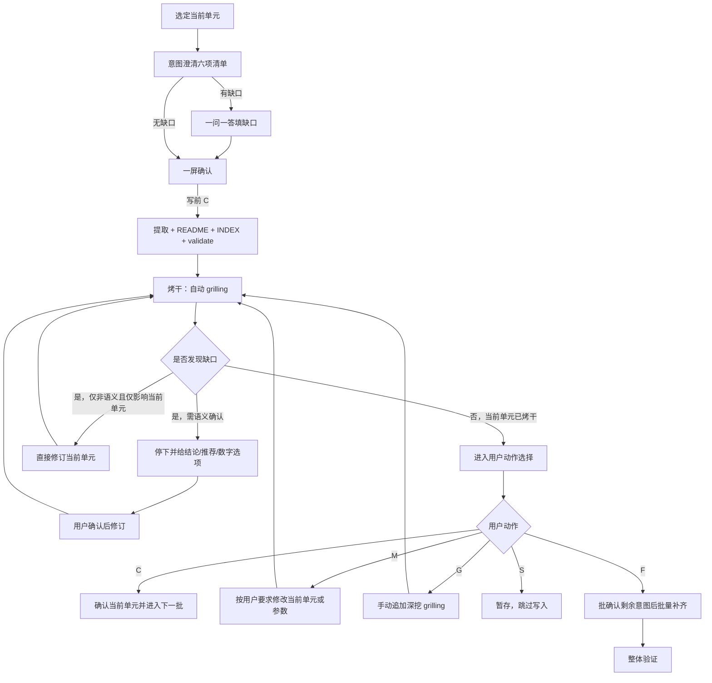

# docs-build 推进协议

主干：[SKILL.md](../SKILL.md)。流程：[workflow.md](workflow.md)。

## 定位

本文件定义 `docs-build` 的**单元推进协议**，用于约束：

- 写前**意图澄清**何时完成、方可生成
- 当前单元何时可推进
- 自动 `grilling`（烤干）如何持续收口
- 用户动作 `C/M/G/S/F` 的阶段语义（`C` 同符异义）
- 参数或范围回改后，当前单元如何重开
- `F` 如何批确认意图后批量补齐

本技能默认采用**分段「澄清 → 生成 → 烤干」**模式。

契约：

- [intent-clarify.md](../../../references/intent-clarify.md) — 写前意图澄清 SSOT
- [grilling-skill.md](../../../references/grilling-skill.md) — 写后烤干能力

本文只定义 `docs-build` 的 binding。

---

## 单元推进总览

---

## 意图澄清完成条件（写前）

进入生成前，至少满足：

1. 已输出公共六项清单（目标 / 范围·非范围 / 缺口 / 禁臆测 / 写后烤干预判 / 路径容器）
2. 第 6 项「写入路径/容器」**必须**写明：
   - 当前单元类型：视角批次 / 路径组 / 实体批次（如「technical 视角批次」）
   - 本轮将写入的 `{DOC_DIR}/knowledge/` 下仓库根相对路径（如 `application/knowledge/technical/` 下 `{ID}.md`、`README.md`、`KNOWLEDGE_INDEX.md`）
3. 已标明「当前阶段：意图澄清」
4. 缺口已填完（或明确为「无」）
5. 用户明确给出写前 `C`

缺任一项，不得写入当前单元正文。

### 技能追加字段（可选）

- `--perspectives` / `--skip-existing` / `--confidence-threshold` / `--emit-report` 摘要
- 预计新增/变更实体 ID 列表摘要
- 校验策略或修复预案摘要

---

## 单元完成条件（写后）

一个当前单元进入 `confirmed` 前，至少满足：

1. 已通过写前意图澄清并生成到终稿对应路径
2. `validate-extraction.sh` 已通过（或用户确认例外策略）
3. 已进入自动 `grilling`（本技能默认必须烤干）
4. 自动 `grilling` 已收敛，或遇到必须等待用户确认的语义性问题后完成修订并再次收敛
5. 用户在「当前阶段：烤干」下明确给出写后 `C`

若缺少以上任一项，不视为当前单元完成。

---

## 写后默认表

| 对象 | 默认烤干 | 强制升级 |
| --- | --- | --- |
| 单个视角批次 / 路径组 / 实体批次 | **必须** | 实体 ID 变更或重命名；未确认决策写入；跨批次依赖变更 |

启发式只可升级为必须，不可把默认「必须」降为跳过。

---

## 当前单元执行条件

参数向导收口后，进入 Unit Cycle 前至少满足：

1. 主 Index Guide 可用
2. `{DOC_DIR}` 可解析
3. 当前视角范围或当前批次已明确
4. `--skip-existing`、`--confidence-threshold`、`--emit-report` 等策略已收口

---

## 高风险场景

以下情形必须先给出结论、推荐方案与数字选项，待用户确认后再执行：

- 主 Index Guide 缺失
- `{DOC_DIR}` 或知识输出路径不明
- 视角范围过大或需跨多批次重建
- 校验失败，且存在多种修复策略
- 用户要求跳过意图澄清或参数确认直接批量重建 knowledge
- 涉及实体 ID 变更、重命名或跨引用链更新

---

## 当前单元原子性

- 当前单元写入失败时，不得继续写后续批次
- 当前单元校验失败时，不得继续归并或生成 `KNOWLEDGE_INDEX`
- 当前单元未收敛前，不得自动推进下一视角或下一批实体

---

## 自动 grilling 默认授权

进入 `grilling` 阶段后，默认授权仅用于**非语义性修订**（不改变含义的错别字、编号、排版、同单元微调等）。

若涉及**语义性问题**，必须先给出结论、推荐修订与数字选项；在用户明确选择前，不得修订当前单元。

典型语义问题包括：

- 视角范围变化
- 输出路径变化
- 跳过策略变化
- 置信度策略变化
- 实体 ID 变更或重命名
- 是否生成 README / `KNOWLEDGE_INDEX`

---

## 用户动作

每轮等待用户时必须打印阶段横幅：`当前阶段：意图澄清` 或 `当前阶段：烤干`。

### C：确认（同符异义）

**意图澄清阶段**：

- 六项清单已可接受
- 授权生成并写入当前单元
- 状态经 `intent_confirmed` 进入 `draft`

**烤干阶段**：

- 当前单元内容已可接受
- 当前单元状态切换为 `confirmed`
- 若仍有下一批，则进入下一单元（新单元从意图澄清开始）
- 若无下一批，则进入整体验证

### M：修改

- 用户直接指出当前单元或参数需要调整
- 修改完成后，当前单元必须重新进入自动 `grilling`（或若改参数/范围/ID，回到意图澄清）
- 未重新收敛前，不得直接写后 `C`

### G：继续 grill

- 自动 `grilling` 已收敛后，用户仍希望继续深挖当前单元
- **不得**用 `G` 表示意图澄清

### S：暂存

- 保留当前分析结果
- 不写当前单元
- 结束或切换其他批次

### F：补齐剩余范围

- 仅在当前单元已收敛后使用
- **先**输出剩余未完成批次的意图表（公共六项摘要，含 knowledge 路径），用户一次确认（意图澄清语境 `C`）
- 确认后再连续处理剩余批次
- 每个后续单元写入后仍执行自动 `grilling` 与 validate，但**不再逐单元停下等待写后动作选择**，也**不再逐单元停意图澄清**
- 中途若触发语义性问题或实体 ID 变更，必须再次停下确认

---

## 重开规则

以下情况会导致当前单元重开：

- 参数、范围或实体 ID 被 `M` 修改且影响当前单元成立前提
- 当前单元被 `M` 修改后尚未重新收敛
- 用户显式要求重审当前单元
- `F` 批量补齐过程中，后续批次反向打穿了当前单元前提

重开后必须重新完成「澄清 → 生成/修订 → 烤干 → 用户动作」闭环。

---

## 状态映射

| 状态 | 含义 | 进入方式 | 离开方式 |
| --- | --- | --- | --- |
| `clarifying` | 写前意图澄清中 | 选定当前单元 / 重开 | 写前 `C` → `intent_confirmed` |
| `intent_confirmed` | 已授权写入 | 写前 `C` | 生成 → `draft` |
| `draft` | 当前单元初稿已写入 | 生成当前单元 | 进入 `grilling` |
| `grilling` | 当前单元处于烤干中 | 开始自动 `grilling` | 收敛、修订或暂停确认 |
| `grilled` | 当前单元已烤干，可等待写后动作 | 自动 `grilling` 完成 | `C/M/G/S/F` |
| `revised` | 当前单元刚被修改 | `M` 或本单元修订 | 重新进入 `grilling` |
| `reopened` | 因参数/ID/范围回改重新打开 | 参数变更 / 显式重开 | 回到 `clarifying` |
| `confirmed` | 当前单元已确认 | 写后 `C` | 被后续回改影响时可重开 |
