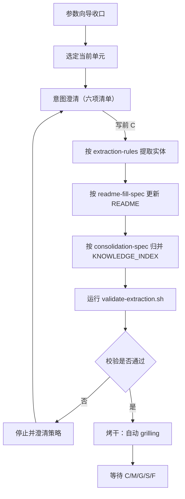

# docs-build 工作流

主干：[SKILL.md](../SKILL.md)。推进协议：[gates.md](gates.md)。

契约分工：

- 写前**意图澄清**：[intent-clarify.md](../../../references/intent-clarify.md)
- 写后**烤干** `grilling`：[grilling-skill.md](../../../references/grilling-skill.md)

本文只定义二者在 `docs-build` Unit Cycle 中的 binding。

## 前置

- 主 Index Guide 可用（否则先 `/docs-indexing`）
- `{DOC_DIR}/knowledge/` 可写
- 若环境未安装 `grilling` Skill，则按 [grilling-skill.md](../../../references/grilling-skill.md) 的 fallback 协议执行

## 术语

**应用知识库**：`.docsconfig` 的 `DOC_DIR` → `{DOC_DIR}/`。

## I/O

| 类型 | 内容 |
| --- | --- |
| 必需 | 主 Index Guide（否则停，先 `/docs-indexing`） |
| 可选 | README、AGENTS、PRD、源码 |
| 固定输出 | `{DOC_DIR}/knowledge/{p}/` 下 per-entity `{ID}.md`、`README`、`KNOWLEDGE_INDEX.md`（扫描生成） |
| `--emit-report` | `{DOC_DIR}/knowledge/{p}/extraction_report.md` |
| 不产出 | 锚点文档、CHANGELOG、目录树 |

## 参数向导

| 参数 | 默认 | 说明 |
| --- | --- | --- |
| `--perspectives` | `application,data,business,product` | 逗号分隔 |
| `--skip-existing` | `true` | 未变跳过；变更文件仍重提 |
| `--confidence-threshold` | `medium` | high / medium / low |
| `--emit-report` | `false` | 提取报告 |

默认不逐项问。仅在：用户改参数或视角、`DOC_DIR` 不明、校验失败要选策略、规则未覆盖 — **每次只澄清一点**。

参数未收口前，不进入 Unit Cycle。

## 当前单元

一个当前单元可以是：

- 单个视角批次（如 technical / data / business / product）
- 单个路径组
- 单批实体集合

一次只处理一个当前单元，不并行推进多个批次。

### 视角顺序

| 序 | 视角 | 前缀 | 输入概要 |
| --- | --- | --- | --- |
| 1 | 技术 | SYS/APP/MS/API | INDEX、源码、接口 |
| 2 | 数据 | DS、ENT | INDEX、数据源、实体、Mapper XML |
| 3 | 业务 | BD→AB | INDEX、FQCN、MS-* |
| 4 | 产品 | PL→UC | INDEX、README、PRD、前述 ID |

API：**Dubbo / HTTP / MQ Consumer / Job**，`api_type` 必填。

## Unit Cycle（澄清 → 生成 → 烤干）

### 写后默认表

`docs-build`：**各视角批次 / 实体批次默认必须烤干**（启发式只可升级、不可降级跳过）。

强制升级（本就默认必须，仍须显式标注）：

- 涉及实体 ID 变更、重命名或跨批次 ID 对齐
- 未确认决策写入正文
- 跨单元依赖或前文前提变更

### 固定循环



1. 选定当前单元（视角批次 / 路径组 / 实体批次）
2. **意图澄清**：输出公共六项清单，标明「当前阶段：意图澄清」
   - 第 6 项须写明：当前批次类型（视角/路径/实体）与 `{DOC_DIR}/knowledge/` 下本轮将写入的仓库根相对路径
   - 可追加技能字段：视角范围、`--skip-existing`、置信度策略、预计实体 ID 列表摘要
   - 有缺口则一问一答；用户写前 `C` 后方可写入
3. 按 [extraction-rules.md](extraction-rules.md) 提取实体
4. 按 [readme-fill-spec.md](readme-fill-spec.md) 更新 README
5. 按 [consolidation-spec.md](consolidation-spec.md) 归并 KNOWLEDGE_INDEX
6. 运行校验：

```bash
agent/skills/docs-build/scripts/validate-extraction.sh
```

7. **烤干**：对当前单元执行自动 `grilling` 直到收敛；标明「当前阶段：烤干」
8. 若打出语义性问题，暂停等待用户确认
9. 当前单元收敛后，用户用 `C/M/G/S/F` 做写后动作选择

## 校验

若校验失败：

- 当前单元停止
- 不得继续写后续批次
- 必须先澄清修复策略或改参数

## 核心约束（摘要）

| 约束 | 含义 |
| --- | --- |
| 证据优先 | ID 有可核来源 |
| 零幻觉 | 仅已读文件 |
| 前缀唯一 | 层级+ID、层级+别名 |
| 对称 | INDEX §1–§4 同轮；README 与 per-entity 一致 |
| 幂等 | 可断点续跑 |
| API 四类 | 见上 |
| 边界 | 无锚点/CHANGELOG |

全文：[builtin-config.md](builtin-config.md)。

## 命令示例

```bash
/docs-build
/docs-build --perspectives application,data
/docs-build --skip-existing false
/docs-build --confidence-threshold high --emit-report
```
