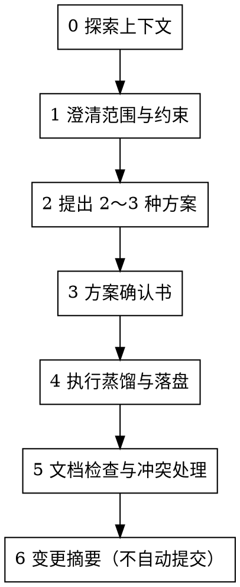

# 工作流细则（步骤 0～6）

与独立 `/brainstorming` 的关系：本技能**默认交付**为「方案确认书 → 目标文档增补」；交互节奏（单题澄清、2～3 套方案对比）与 brainstorming **对齐**，但以本会话的**方案确认书**与**目标路径写入**为主线。

## 流程图

必须按顺序完成；**一次只向用户提一个澄清问题**（除非用户一次性给出完整规格）。

---

## 步骤 0：探索上下文

在开始分步提问前：

1. **读**用户给出的来源路径（文件/目录）；若为「第几章」「某小节标题」，在来源文件中定位对应标题层级或锚点。  
2. **读**目标文档或目标目录下的索引/README/模板说明，弄清标题层级、表格/列表惯例、术语表位置、是否要求「导语 + 三级小节」等（可参考同级文件）。  
3. 按需查阅 [gates-and-links.md](gates-and-links.md) 中的 INDEX 与闸门说明。  
4. 用简短摘要向用户确认你已理解「从哪来、到哪去」——**不接续追问**，进入步骤 1。

---

## 步骤 1：澄清范围与约束（分步提问）

从下列维度中**挑选尚未明确项**，每次只问**一个**（选择题优先）：

| 维度 | 需要弄清的内容 |
|------|----------------|
| 来源范围 | 单文件 / 整个目录 / 指定章节或标题范围；是否包含附件、脚注、历史版本 |
| 目标形态 | 单文件追加或重写某节 / 多文件按目录规则拆分 / 新建文件并更新索引 |
| 抽象层级 | 摘录级 / 要点级 / 可对外宣讲级；是否保留出处引用 |
| 术语与风格 | 必须对齐的术语表或禁用词；正式/内部备忘 |
| 冲突策略 | 与目标已有内容不一致时：以来源为准 / 以目标为准 / 并列保留待裁决 |
| 产出物 | 仅 Markdown / 是否同步更新目录或 changelog |

用户若已在首轮说清，跳过对应问题。

---

## 步骤 2：提出 2～3 种方案

至少两种可行路径，第三种可选（如「最小改动补丁」vs「重组章节」vs「先附录汇总再择要并入正文」）。

每种方案写清：

- **做法**：如何切块来源、如何映射到目标结构；  
- **优点 / 缺点**；  
- **风险**：信息丢失、重复、与 `docs-build`/SDD 流程冲突等。  

**给出推荐项及理由**，由用户选择或组合。

---

## 步骤 3：方案确认书

在用户确认前输出一页**方案确认书**。字段与占位见 [assets/distill-scheme-template.md](../assets/distill-scheme-template.md)。

必备内容：

1. **来源清单**：路径 + 章节/范围（目录则写包含/排除规则）。  
2. **目标清单**：精确到文件路径；目录场景写明命名规则与索引是否更新。  
3. **映射规则**：来源主题 → 目标章节/文件（可用表格）。  
4. **冲突策略**与**术语约定**。  
5. **不落盘清单**：明确不写入的范围。  

用户以「确认 / 按方案执行 / 可以改」等肯定表述确认后，方可进入步骤 4。若用户修改方案，更新确认书并再次请求确认。

---

## 步骤 4：执行蒸馏与落盘

1. **蒸馏**：从来源提取业务含义（流程、角色、规则、边界、指标），去掉与目标载体无关的噪声；同一事实多出处只保留一处主述，必要时脚注或「参见」链到来源路径。  
2. **改写**：句式与标题层级**服从目标文档**，不强行保留来源章节顺序（若目标模板另有规定）。  
3. **写入**：优先最小 diff；大块重组时说明替换区间，避免误删相邻约定。  
4. **引用**：若仓库要求证据链，在段落末或脚注给出可点击的相对路径与章节标题。

---

## 步骤 5：文档检查与冲突处理

按 [quality-checklist.md](quality-checklist.md) 执行结构检查与三类一致性检查；冲突处理节奏见同文件。

---

## 步骤 6：变更摘要

在回复末尾列出：**修改了哪些文件**、**每文件一句话意图**、**待用户后续确认事项**（若有）。不自动执行 Git 提交（见 [gates-and-links.md](gates-and-links.md)）。

---

## 临时工作文件（可选）

复杂任务可将「来源→目标映射表」「冲突清单」存为用户在方案确认书中指定的临时路径；本技能不强制固定文件名。
