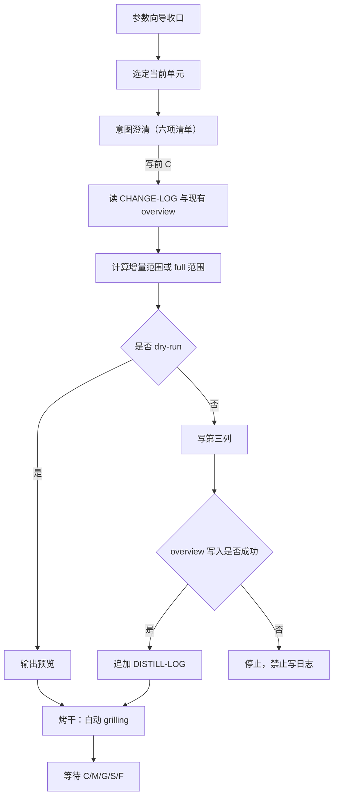

# docs-distill 工作流

主干：[SKILL.md](../SKILL.md)。推进协议：[gates.md](gates.md)。

契约分工：

- 写前**意图澄清**：[intent-clarify.md](../../../references/intent-clarify.md)
- 写后**烤干** `grilling`：[grilling-skill.md](../../../references/grilling-skill.md)

本文只定义二者在 `docs-distill` Unit Cycle 中的 binding。

## 目标

通过**参数向导 + 分段「澄清 → 生成 → 烤干」**，
把单个应用的已核实变更蒸馏进 `system/knowledge/overview/{APPNAME}-overview.md` 第三列，
并在 overview 成功写入后追加 `system/changelogs/DISTILL-LOG.md`。

## 前置

- 路径：[knowledge-layout.md](../../../references/knowledge-layout.md)
- 可读 `system/application-{name}/changelogs/CHANGE-LOG.md`
- overview 目标路径可解析
- `system/changelogs/DISTILL-LOG.md` 可写
- 若环境未安装 `grilling` Skill，则按 [grilling-skill.md](../../../references/grilling-skill.md) 的 fallback 协议执行

## 两日志

| 文件 | 职责 | 本技能写入 |
| ---- | ----- | --------- |
| `system/application-{name}/changelogs/CHANGE-LOG.md` | 增量候选来源 | **否** |
| `system/changelogs/DISTILL-LOG.md` | 蒸馏记录与下次锚点 | **是**（overview 成功后） |

不得把这两份日志混用。`CHANGE-LOG` 负责提供应用增量来源；`DISTILL-LOG` 负责记录蒸馏完成点。

## 参数向导

按以下顺序收口参数；用户已明确时可跳过对应项：

1. `--app`
2. `--since` 或自动锚点
3. 是否 `--full`
4. 是否 `--dry-run`
5. 当前 overview 是新建还是更新

参数未收口前，不进入执行。

## 当前单元

一个当前单元由两部分组成：

1. 单个 `{APPNAME}-overview.md`
2. 单次增量范围或单次 `--full` 范围

一次只处理一个当前单元，不并行推进多个应用。

## Unit Cycle（澄清 → 生成 → 烤干）

### 写后默认表

`docs-distill`：**各 overview 当前单元默认必须烤干**（含 `--dry-run` 预览结果；启发式只可升级、不可降级跳过）。

### 固定循环



1. 选定当前单元
2. **意图澄清**：输出公共六项清单，标明「当前阶段：意图澄清」；有缺口则一问一答；用户写前 `C` 后方可执行或预览
3. 读 `CHANGE-LOG` 与现有 overview，计算增量或 `--full` 范围
4. `--dry-run` → 输出预览（不写 overview，不写 `DISTILL-LOG`）
5. 正式写入 → 写第三列；成功后追加 `DISTILL-LOG`；失败则停止，禁止写日志
6. **烤干**：对当前单元（含预览结果）执行自动 `grilling`，直到收敛；标明「当前阶段：烤干」
7. 若打出语义性问题，暂停等待用户确认
8. 当前单元收敛后，用户用 `C/M/G/S/F` 做写后动作选择

### 约束

- 未完成写前意图澄清（无写前 `C`），不得写入 overview 或输出正式预览结论
- `grilling` 默认只拷当前单元，不跨多应用发散
- 进入 `grilling` 阶段，默认授权仅用于**非语义性修订**
- `grilling` 打出**语义性问题**时，必须先输出结论、推荐修订与数字选项并等待用户确认
- 自动 `grilling` 收敛前，不默认推进到下一应用或下一批范围

## 命令示例

```bash
/docs-distill --app billing-appeal --dry-run
/docs-distill --app billing-appeal --since v1.2.0
/docs-distill --app billing-appeal --full
/docs-distill --app billing-appeal
```

## 脚本

`scripts/`：**编排日志**，不代工「内容提炼」。新记录一律**最新在前**。

| 脚本 | 用途 |
| ---- | ---- |
| `run-docs-distill.sh` | `--dry-run` / 编排；仓库根或 `--root` |
| `append-change-log.sh` | 追加 DISTILL-LOG（含 `app`） |

内容提炼步骤 4.2–4.3：`federation-spec.md`。

## 执行摘要

- 默认增量；`--full` 属高风险场景，推荐先 `--dry-run`
- 第三列五视角逐节写；不写 `(来源…)`
- 先写 overview，后记 `DISTILL-LOG`
- 当前单元完成后必须停下，等待 `C/M/G/S/F`
