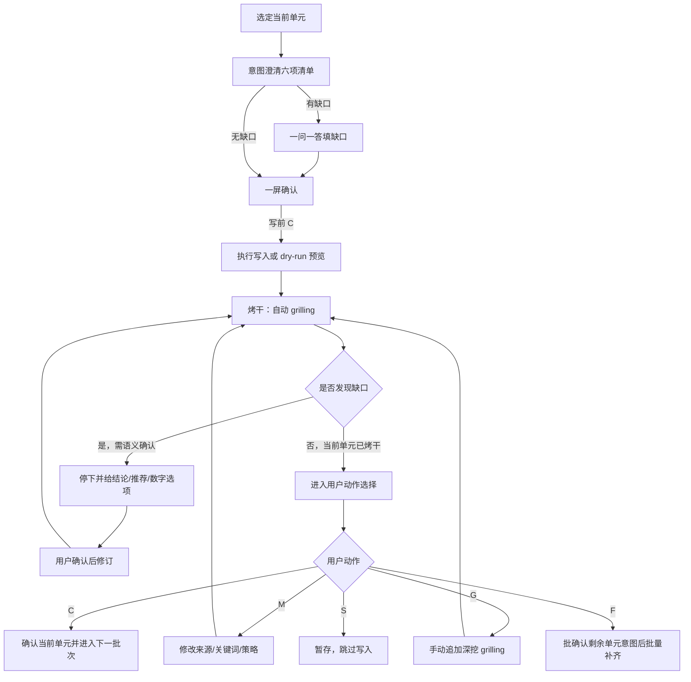

# docs-extract 推进协议

主干：[SKILL.md](../SKILL.md)。流程：[workflow.md](workflow.md)。

## 定位

本文件定义 `docs-extract` 的**单元推进协议**，用于约束：

- 写前**意图澄清**何时完成、方可生成/预览
- 当前单元何时可推进
- 自动 `grilling`（烤干）如何持续收口
- 用户动作 `C/M/G/S/F` 的阶段语义（`C` 同符异义）
- `F` 如何批确认意图后批量补齐
- 无命中与写入失败时如何停止

契约：

- [intent-clarify.md](../../../references/intent-clarify.md) — 写前意图澄清 SSOT
- [grilling-skill.md](../../../references/grilling-skill.md) — 写后烤干能力

本文只定义 `docs-extract` 的 binding。

---

## 单元推进总览

---

## 意图澄清完成条件（写前）

进入生成/预览前，至少满足：

1. 已输出公共六项清单（目标 / 范围·非范围 / 缺口 / 禁臆测 / 写后烤干预判 / 路径容器）
2. 已标明「当前阶段：意图澄清」
3. 缺口已填完（或明确为「无」）
4. 用户明确给出写前 `C`

缺任一项，不得写入第三列或输出正式预览结论。

技能特有字段（追加，不可删减公共项）：

- **`--sources` 口径**：路径列表或文本片段
- **`--overview` 目标**：单个 overview 相对路径
- **写入模式**：正式写入 / `--dry-run` 预览
- **关键词附录**：已读取 `## 文档关键词`

---

## 单元完成条件（写后）

一个当前单元进入 `confirmed` 前，至少满足：

1. 已通过写前意图澄清并执行写入或 `--dry-run` 预览
2. 已进入自动 `grilling`（本技能默认必须烤干）
3. 自动 `grilling` 已收敛，或遇到必须等待用户确认的语义性问题后完成修订并再次收敛
4. 用户在「当前阶段：烤干」下明确给出写后 `C`

若缺少以上任一项，不视为当前单元完成。

---

## 高风险场景

以下情形必须先给出结论、推荐方案与数字选项，待用户确认后再执行：

- 首次实质写第三列
- 命中异常多，需收窄关键词或来源范围
- 来源包含敏感文件或敏感目录
- 第三列已有大量内容，且本轮 `[U]` 影响面很大
- 用户要求跳过预览直接写入

`--dry-run` 是推荐方案，用于先看命中质量与影响面再决定是否落盘；**仍须写前意图澄清**。

---

## 当前单元原子性

- 4.1 无命中时，禁止进入写入
- 4.3 写入失败时，当前单元整体回滚，禁止部分落盘
- `--dry-run` 不写第三列
- 当前单元未收敛前，不得自动推进到下一个 overview 或下一批来源

---

## 自动 grilling 默认授权

进入 `grilling` 阶段后，默认授权仅用于**非语义性修订**（错别字、编号、排版、同单元微调等）。

若涉及**语义性问题**（来源范围、关键词口径、overview 目标、`A/U/D` 策略、是否改为直接写入等），必须先给出结论、推荐修订与数字选项。

---

## 用户动作

每轮等待用户时必须打印阶段横幅：`当前阶段：意图澄清` 或 `当前阶段：烤干`。

### C：确认（同符异义）

**意图澄清阶段**：

- 六项清单已可接受
- 授权执行写入或 `--dry-run` 预览

**烤干阶段**：

- 当前单元已可接受
- 进入下一批来源或结束

### M：修改

- 按用户要求修改来源范围、关键词口径或写入策略
- 修改后重新进入自动 `grilling`

### G：继续 grill

- 在已收敛基础上继续深挖命中质量、冲突或摘要力度
- **不得**用 `G` 表示意图澄清

### S：暂存

- 保留本轮命中与影响面分析
- 不落盘当前单元
- 结束当前单元或切换其他目标

### F：补齐剩余范围

- 仅在当前单元已收敛后使用
- **先**汇总剩余未完成 overview/来源批次意图表，用户一次确认（意图澄清语境 `C`）
- 确认后再连续处理剩余范围
- 每个后续单元写入后都要自动 `grilling` 到收敛
- 中途若触发新的语义问题，必须再次停下确认

### F 的边界

- `F` 不得跳过剩余单元意图批确认
- `F` 过程中若遇到语义性问题，必须停下等待用户确认
