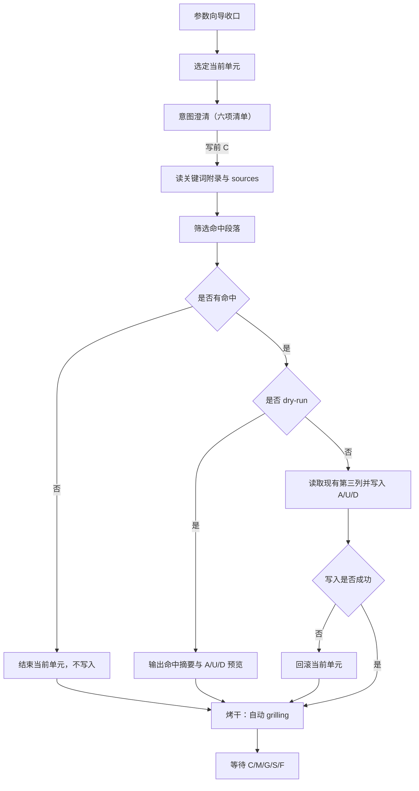

# docs-extract 工作流

主干：[SKILL.md](../SKILL.md)。推进协议：[gates.md](gates.md)。

契约分工：

- 写前**意图澄清**：[intent-clarify.md](../../../references/intent-clarify.md)
- 写后**烤干** `grilling`：[grilling-skill.md](../../../references/grilling-skill.md)

本文只定义二者在 `docs-extract` Unit Cycle 中的绑定。

## 目标

通过**参数向导 + 分段「澄清 → 生成 → 烤干」**，
把 `--sources` 中与关键词附录相关的内容整理进单个 `--overview` 第三列，
并以 `A/U/D` 形式表达新增、更新与删除。

## 与 docs-distill

任意 `--sources` 补充路径；共享目标（overview 第三列）与 A/U/D；**无** `DISTILL-LOG` / 应用蒸馏锚点。

| 维度 | docs-distill | docs-extract |
| ------ | ------ | ------ |
| 源 | `system/application-{name}/` | 用户 `--sources` |
| 过滤 | 联邦规则 | **必须**段落级关键词（[extract-spec.md](extract-spec.md)） |
| 增量锚点 | 有 | **无** |
| 写入 | overview + DISTILL-LOG | **仅**第三列 |

## 前置

- 路径：[knowledge-layout.md](../../../references/knowledge-layout.md)
- `--sources` 可解析（路径或文本）
- `--overview` 可解析
- overview 含 `## 文档关键词`
- 若环境未安装 `grilling` Skill，则按 [grilling-skill.md](../../../references/grilling-skill.md) 的 fallback 协议执行

## 参数向导

按以下顺序收口参数；用户已明确时可跳过对应项：

1. `--sources`
2. `--overview`
3. 关键词口径或过滤范围
4. 是否 `--dry-run`

参数未收口前，不进入执行。

## 当前单元

一个当前单元由两部分组成：

1. 单个 `--overview`
2. 单批命中段落与对应的 `A/U/D` 集合

一次只处理一个当前单元，不并行推进多个 overview。

## Unit Cycle（澄清 → 生成 → 烤干）

### 写后默认表

`docs-extract`：**各 overview 当前单元默认必须烤干**（含 `--dry-run` 预览结果；启发式只可升级、不可降级跳过）。

### 固定循环



1. 选定当前单元
2. **意图澄清**：输出公共六项清单，标明「当前阶段：意图澄清」；有缺口则一问一答；用户写前 `C` 后方可执行或预览
3. 读关键词附录与 sources，筛选命中段落
4. 无命中 → 结束当前单元，不写入
5. `--dry-run` → 输出命中摘要与 `A/U/D` 预览（不写第三列）
6. 正式写入 → 读现有第三列并写入 `A/U/D`；失败则整体回滚
7. **烤干**：对当前单元（含预览结果）执行自动 `grilling`，直到收敛；标明「当前阶段：烤干」
8. 若打出语义性问题，暂停等待用户确认
9. 当前单元收敛后，用户用 `C/M/G/S/F` 做写后动作选择

### 约束

- 未完成写前意图澄清（无写前 `C`），不得写入第三列或输出正式预览结论
- `grilling` 默认只拷当前单元，不跨多 overview 发散
- 进入 `grilling` 阶段，默认授权仅用于**非语义性修订**
- `grilling` 打出**语义性问题**时，必须先输出结论、推荐修订与数字选项并等待用户确认
- 自动 `grilling` 收敛前，不默认推进到下一 overview 或下一批来源

## 命令示例

```bash
/docs-extract --sources docs/design.md --overview system/knowledge/overview/billing-overview.md --dry-run
/docs-extract --sources docs/ --overview system/knowledge/overview/billing-overview.md
/docs-extract --sources docs/design.md docs/adr/ --overview system/knowledge/overview/billing-overview.md
/docs-extract --sources "这里是一段临时业务说明文本，用于提炼进 overview 第三列" --overview system/knowledge/overview/billing-overview.md --dry-run
```

## 执行摘要

- 关键词附录为筛选**唯一**依据；弱相关不入
- 禁止整段复制源文；第三列无来源脚注
- 只更新有命中的章节；写入前先读现有第三列再定 `A/U/D`
- 当前单元完成后必须停下，等待 `C/M/G/S/F`
