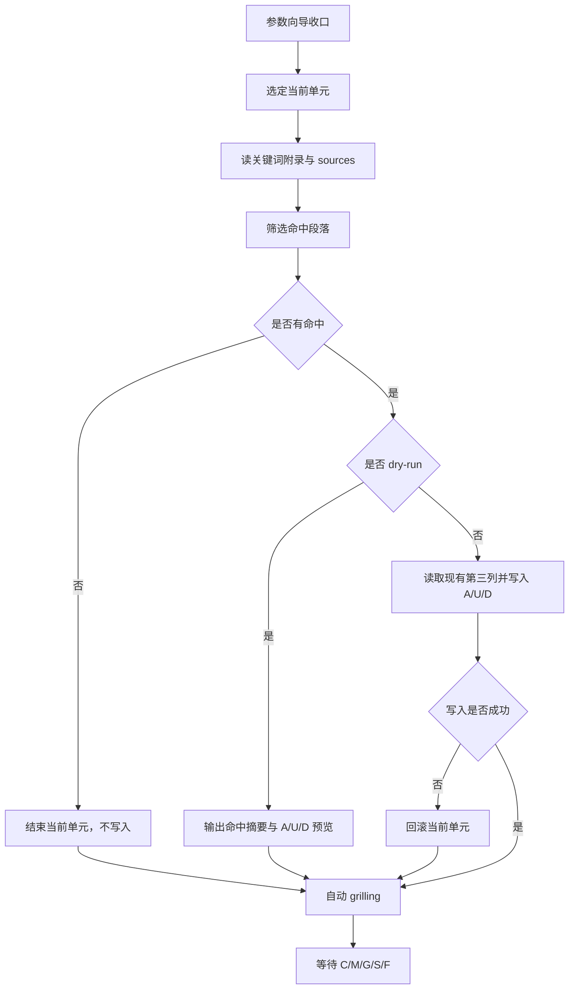

# docs-extract 工作流

主干：[SKILL.md](../SKILL.md)。风险控制与动作协议：[gates.md](gates.md)。

## 目标

通过“参数向导 + 当前单元 + 自动 grilling”的方式，
把 `--sources` 中与关键词附录相关的内容整理进单个 `--overview` 第三列，
并以 `A/U/D` 形式表达新增、更新与删除。

## 与 docs-distill

任意 `--sources` 补充路径；共享目标（overview 第三列）与 A/U/D；**无** `DISTILL-LOG` / 应用蒸馏锚点。

| 维度 | docs-distill | docs-extract |
| ------ | ------ | ------ |
| 源 | `system/application-{name}/` | 用户 `--sources` |
| 过滤 | 联邦规则 | **必须**段落级关键词（[extract-spec.md](extract-spec.md)） |
| 增量锚点 | 有 | **无** |
| 写入 | overview + DISTILL-LOG | **仅**第三列 |

## 前置

- 路径：[knowledge-layout.md](../../../references/knowledge-layout.md)
- `--sources` 可解析
- `--overview` 可解析
- overview 含 `## 文档关键词`
- 若环境未安装 `grilling` Skill，则按 [grilling-skill.md](../../../references/grilling-skill.md) 的 fallback 协议执行

## 参数向导

按以下顺序收口参数；用户已明确时可跳过对应项：

1. `--sources`
2. `--overview`
3. 关键词口径或过滤范围
4. 是否 `--dry-run`

参数未收口前，不进入执行。

## 当前单元

一个当前单元由两部分组成：

1. 单个 `--overview`
2. 单批命中段落与对应的 `A/U/D` 集合

一次只处理一个当前单元，不并行推进多个 overview。

## 执行循环



## 自动 grilling

当前单元执行或预览后，立即做自动 `grilling`：

- 检查关键词命中是否合理
- 检查 `A/U/D` 口径是否稳定
- 检查来源是否含敏感内容
- 检查第三列摘要是否避免整段照抄

若发现语义性问题，先停下给结论、推荐方案和数字选项。

## 命令示例

```bash
/docs-extract --sources docs/design.md --overview system/knowledge/overview/billing-overview.md --dry-run
/docs-extract --sources docs/ --overview system/knowledge/overview/billing-overview.md
/docs-extract --sources docs/design.md docs/adr/ --overview system/knowledge/overview/billing-overview.md
```

## 执行摘要

- 关键词附录为筛选**唯一**依据；弱相关不入
- 禁止整段复制源文；第三列无来源脚注
- 只更新有命中的章节；写入前先读现有第三列再定 `A/U/D`
- 当前单元完成后必须停下，等待 `C/M/G/S/F`
