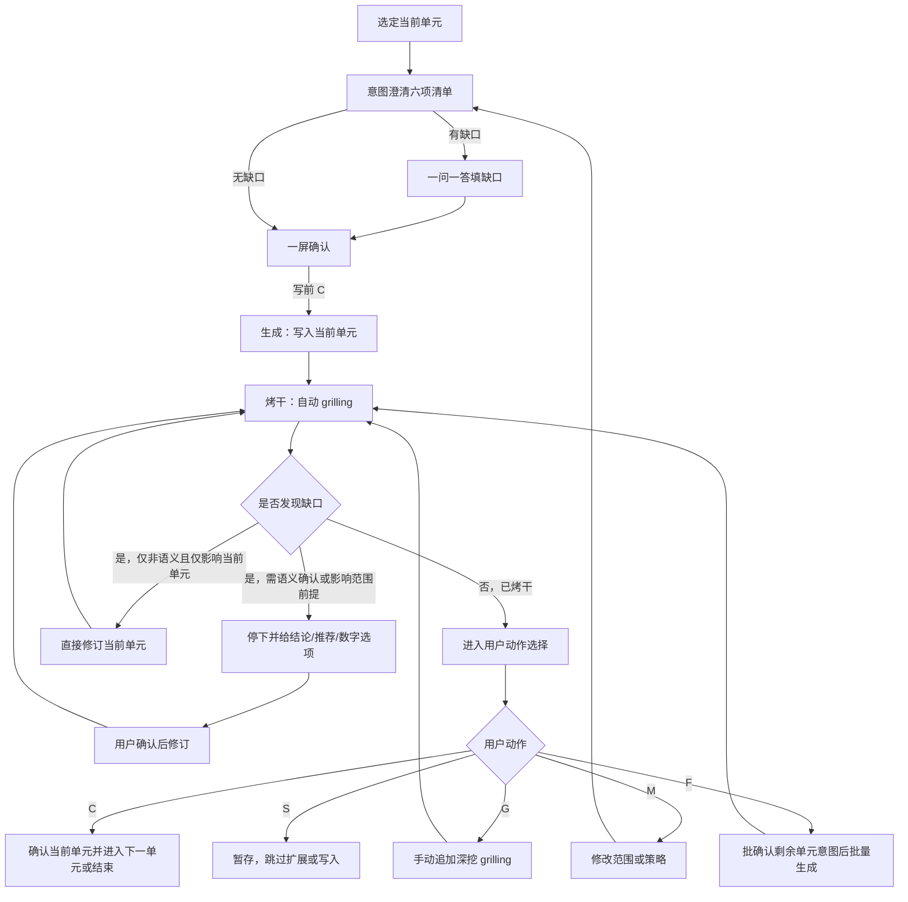

# docs-upgrade 推进协议

主干：[SKILL.md](../SKILL.md)。流程：[workflow.md](workflow.md)。

## 定位

本文件定义 `docs-upgrade` 的**单元推进协议**，用于约束：

- 写前**意图澄清**何时完成、方可生成
- 当前单元何时可推进
- 自动 `grilling`（烤干）如何持续收口
- 用户动作 `C/M/G/S/F` 的阶段语义（`C` 同符异义）
- 范围或术语边界变更后如何重开
- `F` 如何批确认意图后批量补齐

本技能默认采用**「澄清 → 生成 → 烤干」**模式。

契约：

- [intent-clarify.md](../../../references/intent-clarify.md) — 写前意图澄清 SSOT
- [grilling-skill.md](../../../references/grilling-skill.md) — 写后烤干能力

预检：[brainstorming-integration.md](brainstorming-integration.md)。实操：[gotchas.md](../gotchas.md)。

---

## 单元推进总览



---

## 意图澄清完成条件（写前）

进入生成前，至少满足：

1. 已输出公共六项清单（目标 / 范围·非范围 / 缺口 / 禁臆测 / 写后烤干预判 / 路径容器）
2. 已标明「当前阶段：意图澄清」
3. 缺口已填完（或明确为「无」）
4. 用户明确给出写前 `C`

快路径（单点修复、用户已限「仅本文件」）：可一屏六项摘要 + 范围确认书后写前 `C`。

缺任一项，不得写入当前单元正文或扩展关联。

---

## 当前单元完成条件（写后）

一个当前单元进入 `confirmed` 前，至少满足：

1. 已通过写前意图澄清并生成到目标文件
2. 已进入自动 `grilling`（本技能默认必须烤干）
3. 自动 `grilling` 已收敛，或遇到语义性问题并完成修订后再次收敛
4. 用户在「当前阶段：烤干」下明确给出写后 `C`

若缺少以上任一项，不视为当前单元完成。

---

## 写后默认表

`docs-upgrade`：**各当前单元默认必须烤干**。

出现以下任一情况时，**强制升级为必须烤干**（不可降级跳过）：

- 未确认决策写入正文
- 术语边界或关联扩展范围变更
- 导航路径、相对链接、`#anchor` 变更
- 冲突消解、范围/目标口径变更

---

## 边界（摘要）

本技能：定向改文 + 默认链式（引用 + 关键词）；简写 `a - b` / `a > b` / `a 2 b`。  
**不作为主路径**：CHANGE-LOG 聚合（docs-change）、INDEX 重建（docs-indexing）、overview 行归档（docs-archive）、实体索引（docs-build），除非用户明说附加。

满足任一时，澄清阶段须额外关注：

- 多文件或大目录替换
- 术语边界不清
- 是否扩展关联未说明
- 意图不清，可能越过 docs-upgrade 边界

---

## 风险与语义确认

以下情况属于语义性问题，必须先给出结论、推荐方案与动作选项，再等待用户确认：

- 是否把术语替换扩展到引用链和关键词链
- 是否只改当前主文件
- 术语或表述是否跨越业务语义边界
- 关联文件是否应按同一口径统一

推荐会话格式：

```text
当前阶段：意图澄清
即将执行 /docs-upgrade，当前单元如下：
- 本单元目标: <...>
- 主目标文件: <路径>
- 改动摘要: <...>
- 范围/非范围: <...>
- 写后烤干: 默认必须

写前 C 确认意图 / M 改范围
```

烤干阶段：

```text
当前阶段：烤干
C 确认当前单元 / M 改范围 / S 仅主文件 / G 继续深挖 / F 补齐剩余关联批次
```

**S** = 仅主文件，不做关联扩展。

---

## 自动 grilling 默认授权

进入 `grilling` 阶段后，默认授权仅用于**非语义性修订**：错别字、编号、排版、链接修补。

涉及术语边界、是否扩展、是否批量替换，按语义性处理。

---

## 用户动作

每轮等待用户时必须打印阶段横幅：`当前阶段：意图澄清` 或 `当前阶段：烤干`。

### C：确认（同符异义）

**意图澄清阶段**：

- 六项清单已可接受
- 授权生成并写入当前单元

**烤干阶段**：

- 当前单元内容已可接受
- 进入下一单元或结束

### M：修改

- 修改范围、术语边界、同步策略或当前单元内容
- 若修改影响范围前提，须回到澄清并重获写前 `C`
- 修改后必须重新进入自动 `grilling`

### G：继续 grill

- 自动 `grilling` 已收敛后，用户仍希望继续深挖
- **仅写后**；不得用 `G` 表示意图澄清

### S：暂存

- 仅主文件或跳过关联扩展/写入

### F：批量补齐

- 保留已确认或已收敛的前文
- **先**汇总剩余单元意图表（六项摘要），用户一次写前语境 `C` 确认
- 再连续生成；每单元仍须烤干，段间不再单独停意图澄清
- 中途若触发语义问题，立即停下等待用户确认

---

## 重开规则

- 范围或术语边界被 `M` 修改 → 回到**澄清**并重获写前 `C`
- 当前单元被 `M` 修改后尚未重新烤干 → 重新**烤干**
- `F` 批量过程中反向打穿已确认前提 → 停下并回到澄清

---

## 状态映射

| 状态 | 含义 |
| --- | --- |
| `clarifying` | 写前意图澄清中 |
| `intent_confirmed` | 写前 `C` 已过，即将/正在生成 |
| `draft` | 当前单元初稿已写入 |
| `grilling` | 当前单元烤干中 |
| `grilled` | 已烤干收敛，可等待写后动作 |
| `reopened` | 因范围前提变更重开，须再澄清 |
| `confirmed` | 写后 `C` 确认通过 |

模板：[../assets/docs-upgrade-scope-ack-template.md](../assets/docs-upgrade-scope-ack-template.md)。
