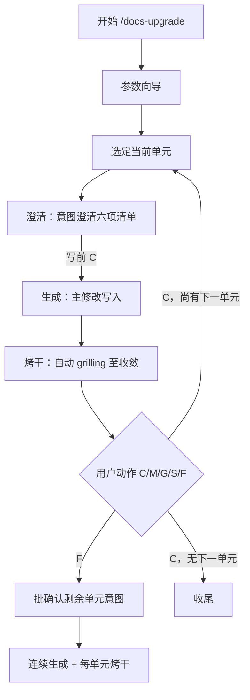

# docs-upgrade 工作流

须与 [gates.md](gates.md) 推进协议一致。预检：[brainstorming-integration.md](brainstorming-integration.md)。

契约分工：

- 写前**意图澄清**：[intent-clarify.md](../../../references/intent-clarify.md)
- 写后**烤干** `grilling`：[grilling-skill.md](../../../references/grilling-skill.md)

## 总流程

## 参数向导

按以下顺序收口参数；用户已明确时可跳过对应项：

1. 主目标文件或候选范围
2. 改动摘要或术语替换目标
3. 是否允许关联扩展
4. 当前轮起始单元（主文件 / 关联批次）

参数未收口前，不进入单元循环。

## 当前单元

一个当前单元可以是：

- 单个主文件
- 单个已确认关联批次
- 单个回链修复批次

一次只处理一个当前单元，不并行推进多批文件。

## Unit Cycle（澄清 → 生成 → 烤干）

### 1 锁定目标

解析路径；无时先搜候选，多候选**列选项**。意图糊 → brainstorming 预检。

### 2 澄清（写前意图澄清）

输出 [intent-clarify.md](../../../references/intent-clarify.md) 公共六项，标明「**当前阶段：意图澄清**」：

| 公共六项 | upgrade 落点示例 |
| --- | --- |
| 本段/单元目标 | 本轮要改清什么（术语统一 / 单点修复 / 链式同步） |
| 范围 / 非范围 | 主文件 + 关联范围或「仅本文件」 |
| 已知缺口 | 术语边界、命中规模等；无则写「无」 |
| 禁止臆测项 | 不得编造的数字、路径、全库承诺 |
| 写后烤干预判 | 按下文默认表；当前单元**默认必须烤干** |
| 写入路径/容器 | 主目标文件路径 + 本批次关联文件清单 |

可用 [docs-upgrade-scope-ack-template.md](../assets/docs-upgrade-scope-ack-template.md) 承载。

收口：无缺口则一屏确认 → 写前 `C`；有缺口则一问一答 → 再确认 → 写前 `C`。未获写前 `C` 不得写入。

### 3 生成（主修改）

增/改/替（含注释、字符串里文档路径）。简写 [core-concepts.md](core-concepts.md)。

### 4 烤干（自动 grilling）

当前单元写入后，立即进入「**当前阶段：烤干**」并执行自动 `grilling`：

- 检查术语替换是否越过既定语义边界
- 检查是否应扩展到引用链或关键词命中
- 检查用户是否已明确“只改本文件 / 不要关联 / 不要全库搜”
- 检查修改后互链、相对路径、`#anchor`、反引号路径是否仍有效

#### 写后默认表

`docs-upgrade`：**各当前单元默认必须烤干**（启发式只可升级、不可降级跳过）。出现术语边界变更、未确认扩展关联、导航/路径变更时，强制升级为必须烤干。

若发现语义性问题，先停下给结论、推荐方案和数字选项；仅非语义修订可在当前单元默认授权下直改并继续烤干。

### 5 关联与语义（下一单元）

仅在当前单元烤干收敛且用户写后 `C` 确认允许扩展时，才将下一关联批次定为新当前单元并重新走「澄清 → 生成 → 烤干」：

- 引用链：[related-doc-discovery.md](related-doc-discovery.md)
- 关键词：[semantic-keyword-discovery.md](semantic-keyword-discovery.md)

大范围或概念边界存疑 → 先 **brainstorming「范围预检」** 再扩。

### 6 用户动作

当前单元烤干收敛后，停下等待 `C/M/G/S/F`（须标明「当前阶段：烤干」）：

- `C`：确认当前单元并进入下一批或结束
- `M`：修改范围、术语边界或同步策略；修改后须回到澄清并重获写前 `C`
- `G`：继续深挖当前单元（仅写后）
- `S`：仅保留当前主文件，跳过关联扩展或跳过写入
- `F`：先汇总剩余单元意图表（六项摘要），用户一次写前语境 `C` 后连续生成；每单元仍须烤干，段间不再单独停意图澄清

## 不确定

仓内无法核实 → **停**、编号选项 → 用户选后再动。可多轮单问。
