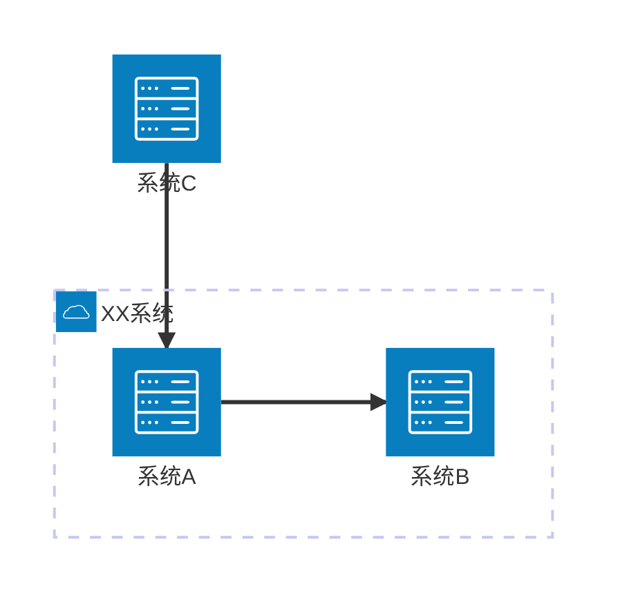
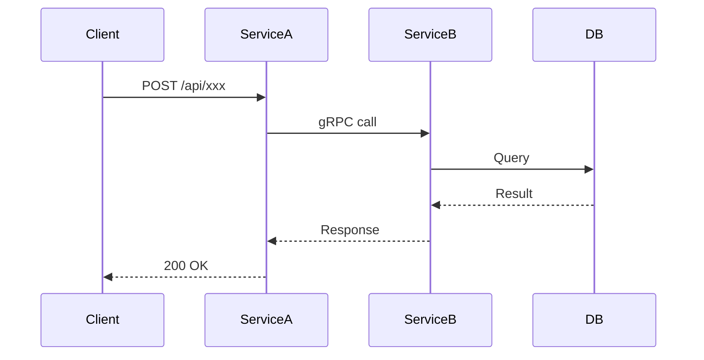
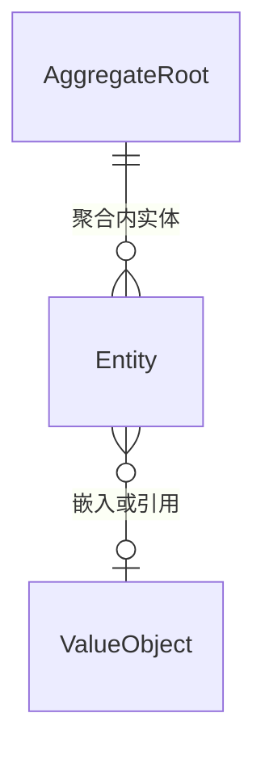
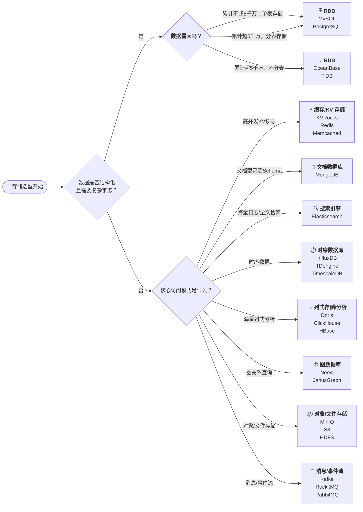
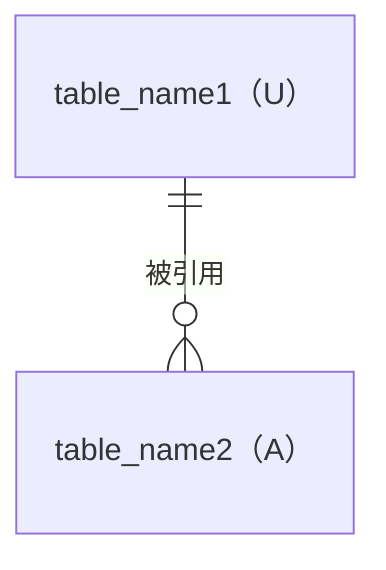

# {架构设计说明书（ASD）标题}


## 1. 设计概述

### 1.1 设计目标

- 关联需求分析：`{DOC_DIR}/analysis/ANALYSIS-{IDEA-ID}.md`
- 关联产品需求：`{DOC_DIR}/requirements/REQUIREMENT-{IDEA-ID}/MVP-Phase-{N}/PRD-{IDEA-ID}-{N}.md`
- MVP阶段：MVP-Phase-{N}

### 1.2 设计约束
<!-- 技术约束、架构约束、兼容性约束等 -->

### 1.3 关键设计决策

| 决策编号 | 决策点 | 决策结果 | 决策理由 | 备选方案 |
| --------- | ------- | --------- | --------- | --------- |
| DD-001 | | | | |

## 2. 架构设计

### 2.1 系统架构设计

#### 系统架构图



#### 服务变更

| 服务名称  | 所属应用   | 变更类型 | 变更说明    |
| ----------- | ------------ | ---------- | ------------- |
| service-a | xx-service | 变更     | 新增xxx功能 |
| service-b | yy-service | 新增     | 新服务      |

#### 服务交互



### 2.2 接口协议设计

| 接口名称 | 所属服务 | 能力说明 | 输入输出 |
| --------------- | -------- | -------- | ------ |
| XX接口 | serivice-a | 提供XX能力 | 输入：XX <br/> 输出：YY |

### 2.3 领域模型设计

#### 领域模型图



#### 领域事件

| 事件名称        | 触发条件 | 携带数据 | 消费者 |
| --------------- | -------- | -------- | ------ |
| XxxCreatedEvent |          |          |        |

### 2.4 数据架构设计

#### 数据存储选型



#### 数据库表设计



#### 数据分片设计

#### 数据迁移方案

### 2.5 发布方案设计

#### 发布步骤

<!-- 明确本次变更涉及的部署与环境变更，按顺序列出操作项（例如：容器/服务升级、数据库迁移、配置/环境变量调整、接口切换等） -->

#### 发布检查

- 变更窗口与影响面通知到位
- 相关服务和依赖是否已完成升级/发布准备
- 回滚/兜底策略是否有预案
- 数据迁移是否有验证脚本
- 三方验证、全链路验证是否已准备好

#### 回滚方案

- 回滚前需备份相关数据库与配置
- 回滚步骤：逐步逆向操作（如数据库还原、容器回滚等），确保服务健康
- 回滚注意事项：做好监控收敛，通知相关人员

## 3. 需求规约

<!-- 规约术语：与 **`./specs/spec-asd-*.md` 文件名**（**概设需求规约**，由 `/sdx-architect` 维护）或领域名一致的可读简称；应用实体 ID、服务实体 ID 须与 `{DOC_DIR}/knowledge/KNOWLEDGE_INDEX.md` / `knowledge/technical/` 中 APP-*、MS-* 对齐。 -->

<!-- 本表为架构阶段「服务能力摘要」：下游 DSD「§3 需求规约」在此行基础上扩写；详设阶段 **详设需求规约** **`spec-dsd-*.md`** 仅落在 **`requirements/.../MVP-Phase-*/specs/`**（实现级终稿，正文骨架见 sdx-design **`dsd-spec-template.md`**）。**概设需求规约** **spec-asd-***（`{DOC_DIR}/specs/`）与 **详设需求规约** **spec-dsd-***（**禁止**放 `{DOC_DIR}/specs/`）。若与 ASD 冲突，以已确认 ASD + PRD 溯源为准。联邦模式（system/company）下「规约文件」可填 `N/A` 或应用库预期路径，「规约描述」仍须写清服务级能力边界。 -->

<!-- 占位 `{app-name}`：规约文件名中的可文件名化小段（字符集与 `scripts/docs-link.sh` 登记的 `app_name` 校验一致：**小写、a-z0-9._-**）。取值优先与同库 **`{DOC_DIR}/knowledge-links.yaml`** 中与本应用那条 link 的 **`app_name`** 对齐；若无登记或本节无对应条目，再与 **`{APP-ID}`** / KNOWLEDGE_INDEX 中应用标识一致且无冲突的简称。**不得**用语义上的 `{service-name}` 替代本节文件名段占位（服务能力仍写在「规约描述」内的 **负责服务**）。 -->

| 应用 | 规约文件 | 规约描述 |
| ---- | -------- | -------- |
| `{APP-ID}` | `./specs/spec-asd-{IDEA-ID}-{N}-{app-name}.md` | **Spec结构**：参照 `asd-spec-template.md`（第1-6节）<br/>**范围（1）**：能力边界 / 覆盖 FR-UC-BR-EX / SSOT 来源<br/>**术语（2）**：核心业务概念与字段口径<br/>**需求条目（3-4）**：FR-{n} / UC-{n}<br/>**接口定义（5）**：接口签名、入参、出参、BR、EX（message/suggestions）<br/>**元数据（6）**：id/title/version/status/created/updated/parent/refs/scope |

## 文档元数据

<!-- 唯一元数据位置：须为 fenced yaml，且位于全文末尾；禁止在文件开头使用 --- YAML frontmatter -->

```yaml
id: "ASD-{IDEA-ID}"
title: "{架构设计说明书标题}"
version: "1.0.0"
status: "draft"
created: "{YYYY-MM-DD}"
updated: "{YYYY-MM-DD}"
author: "architect"
reviewers: []
parent: "PRD-{IDEA-ID}"
mvp_phase: "MVP-Phase-{N}"
tags: ["ASD"]
```
