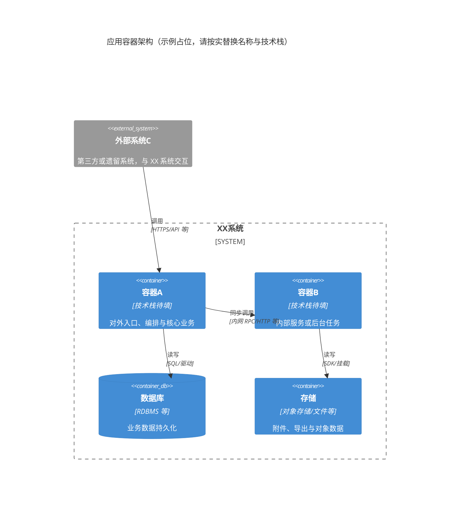
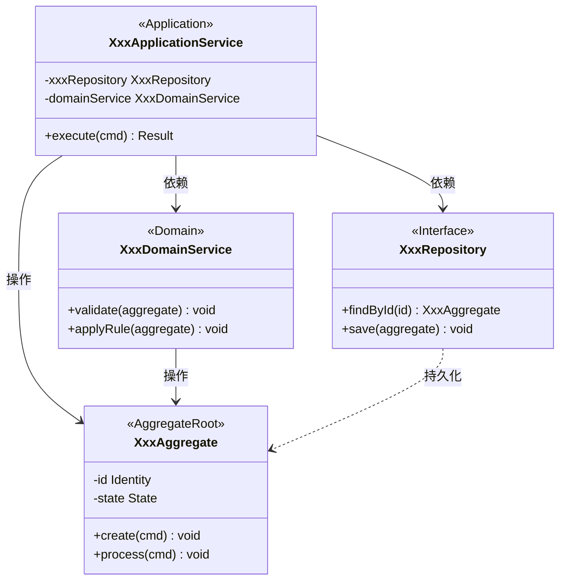
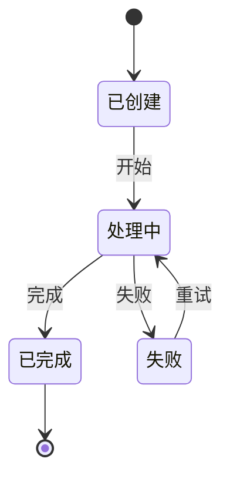
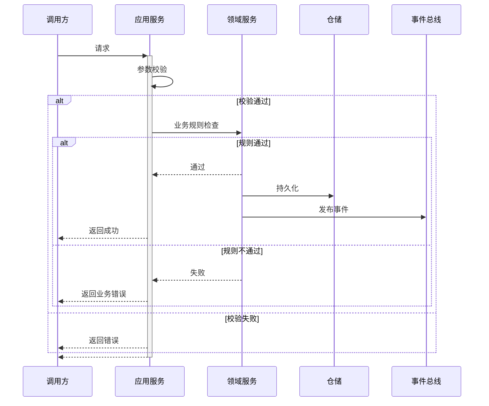

# {详细设计说明书（DSD）标题}

> 读者：**架构师**（主笔与验收）；**分析、产品、研发**参评可行性与范围。
> 写法：应用架构、API详细设计、业务逻辑设计、数据访问设计、非功能设计，不写内部调用细节。
> **§1 与 ASD**：下列「设计概述」**章节结构与字段**与 [asd-template.md §1](../../../sdx-architect/assets/asd-template.md) 对齐；可与 ASD 同源复制，或与 ASD §1 **保持可追溯一致**（若仅摘要须说明差异）。

---

## 目录

- [1. 设计概述](#1-设计概述)
- [2. 详细设计](#2-详细设计)
- [3. 附录](#3-附录)

---

## 1. 设计概述

### 1.1 设计目标

- 关联需求分析：`{DOC_DIR}/analysis/ANALYSIS-{IDEA-ID}.md`
- 关联产品需求：`{DOC_DIR}/requirements/REQUIREMENT-{IDEA-ID}/MVP-Phase-{N}/PRD-{IDEA-ID}-{N}.md`
- 架构设计说明书：`{DOC_DIR}/requirements/REQUIREMENT-{IDEA-ID}/MVP-Phase-{N}/ASD-{IDEA-ID}-{N}.md`
- 概要需求规约：`{DOC_DIR}/requirements/REQUIREMENT-{IDEA-ID}/MVP-Phase-{N}/specs/spec-asd-{IDEA-ID}-{N}-{APP-NAME}.md`
- MVP阶段：MVP-Phase-{N}

### 1.2 设计约束
<!-- 技术约束、架构约束、兼容性约束等 -->

- 业务约束
- 技术约束
- 架构约束
- 兼容性约束

### 1.3 关键设计决策

| 决策编号 | 决策点 | 决策结果 | 决策理由 | 备选方案 |
| --------- | ------- | --------- | --------- | --------- |
| DD-001 | | | | |

---

## 2. 详细设计

### 2.1 应用架构设计

> 跟外部系统集成的关系，消息队列、异步处理机制，用到的容器



### 2.2 API详细设计

#### API-001：{API名称}

- 能力描述：提供XX能力

**API签名** ：

```text
`POST /api/v1/xxx`
```

**请求参数** :

```json
{
  "field1": "string, required, 描述",
  "field2": "integer, optional, 描述"
}
```

**响应结构**：

```json
{
  "code": 0,
  "message": "success",
  "module": {
    "id": "string",
    "field1": "string"
  }
}
```

**错误码**：

| 错误码 | 错误信息 | 触发条件 | HTTP状态码 |
| ------ | -------- | -------- | ---------- |
| 400001  |          |          | 400        |

**幂等性**：
<!-- 描述幂等性保障方案 -->

### 2.3 业务逻辑设计

#### 核心类图



> 按实际 MVP 补充：应用服务、领域服务、聚合根/实体及仓储接口，并标注依赖与职责。

#### 状态机设计



#### 逻辑-001: {逻辑名称}

**流程图**：



**伪代码**：

```python
function processXxx(request):
    // 1. 参数校验
    validate(request)
    
    // 2. 业务规则检查
    checkBusinessRules(request)
    
    // 3. 执行业务逻辑
    result = executeLogic(request)
    
    // 4. 持久化
    save(result)
    
    // 5. 发布领域事件
    publishEvent(XxxCreatedEvent(result))
    
    return result
```

#### 一致性设计
<!-- 乐观锁/悲观锁/分布式锁方案 -->
<!-- 本地事务/分布式事务/最终一致性方案 -->

### 2.4 数据访问设计

#### 库表DDL

```sql
-- 创建主表
CREATE TABLE table_name1 (
    id BIGINT PRIMARY KEY COMMENT '主键ID',
    name VARCHAR(64) NOT NULL COMMENT '名称',
    code VARCHAR(32) UNIQUE NOT NULL COMMENT '编码（A）',
    created_at TIMESTAMP DEFAULT CURRENT_TIMESTAMP COMMENT '创建时间',
    updated_at TIMESTAMP DEFAULT CURRENT_TIMESTAMP ON UPDATE CURRENT_TIMESTAMP COMMENT '更新时间'
);

-- 创建附属表
CREATE TABLE table_name2 (
    id BIGINT PRIMARY KEY COMMENT '主键ID',
    name VARCHAR(64) NOT NULL COMMENT '名称',
    code VARCHAR(32) NOT NULL COMMENT '表1编码',
    created_at TIMESTAMP DEFAULT CURRENT_TIMESTAMP COMMENT '创建时间',
    updated_at TIMESTAMP DEFAULT CURRENT_TIMESTAMP ON UPDATE CURRENT_TIMESTAMP COMMENT '更新时间',
    CONSTRAINT fk_code FOREIGN KEY (code) REFERENCES table_name1(code)
);
```

#### 查询策略

**索引策略**

```sql
-- 索引
CREATE INDEX idx_table_name1_name ON table_name1(name);
CREATE INDEX idx_table_name2_name ON table_name2(name);
```

- 常用查询字段建议添加二级索引，如 `name`、`code`。
- 联合索引可依据实际查询场景补充设计，避免冗余。

**分页策略**

- 推荐使用主键/唯一索引进行物理分页（如 `where id > ? order by id limit ?`）。
- 大数据量场景下避免 offset 过大的 SQL。

#### 缓存策略

| 缓存Key模式               | 数据类型    | 过期时间 | 更新策略 | 用途               |
|--------------------------|------------|----------|----------|--------------------|
| table_name1:{id}         | hash/object| 1h       | 写后更新 | 单条主数据缓存     |
| table_name2:{id}         | hash/object| 1h       | 写后更新 | 单条附属数据缓存   |
| table_name1:list:page:{n}| list       | 10min    | 定期刷新 | 列表分页缓存       |

- 删除/更新数据时需同步刷新缓存
- 缓存雪崩可加随机抖动过期

### 2.5 非功能性设计

#### 安全设计
<!-- 认证授权、数据脱敏、审计日志等 -->

#### 可观测设计
<!-- 考虑该记录什么日志，增加什么监控，什么情况下报警 -->

**日志** ：

**监控报警策略** ：

<!-- 告警规则、通知渠道、收敛策略等 -->

> **实现级契约与追溯**：API、DDL、时序、幂等等**全部写在 §2**；与 **PRD（FR-n）**、**ASD §3**（或概设 `spec-asd-*`）的对应关系也在 §2 小节内用编号与引用写清，**不另建**独立详设 Markdown。

## 3. 附录

### 3.1 变更历史

| 版本  | 日期 | 变更说明 | 作者      |
| ----- | ---- | -------- | --------- |
| 1.0.0 |      | 初始版本 | architect |

### 3.2 质量自查表 (Self-Check)

<!-- 本节与主文 **§1–§3** 对齐；§1「设计概述」与 ASD §1 / [asd-template §1](../../../sdx-architect/assets/asd-template.md) 对齐。-->

- [ ] **结构与占位**
  *通过标准*：`## 1`–`## 3` 主章节齐全；Mermaid 可渲染；不适用处已标注。
- [ ] **§1 设计概述**
  *通过标准*：与 **ASD §1** 一致或可指回（ANALYSIS/PRD、MVP、约束、DD-n）；若为摘要须说明与 ASD 差异。
- [ ] **§2 详细设计（应用架构～非功能）**
  *通过标准*：§2.1～§2.5 对应实现级内容完整；每个 **API-n** / **DDL** / 非功能条目可追溯到 **PRD（FR-n）** 与 **ASD §3 / 概设 spec-asd**（若有）在 **§2** 中的对应表述。
- [ ] **§3 附录与元数据**
  *通过标准*：§3.1 变更历史、§3.2 自查可追溯；文首 frontmatter `id` / `architecture_ref` 与 ASD/PRD 一致。
