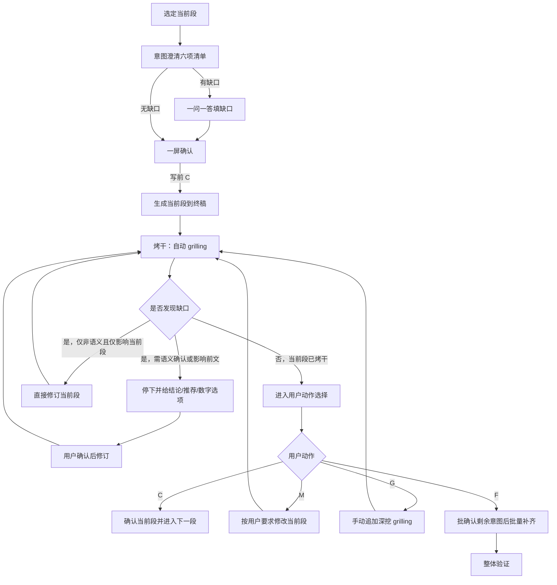
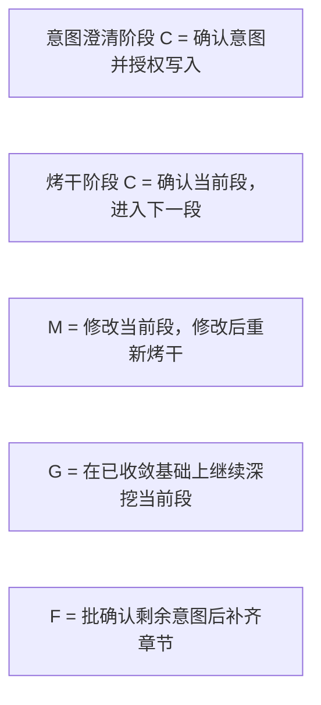

# sdx-design 推进协议

主干：[SKILL.md](../SKILL.md)。流程：[workflow.md](workflow.md)。

## 定位

本文件定义 `sdx-design` 的**段落推进协议**，用于约束：

- 写前**意图澄清**何时完成、方可生成
- 当前段何时可推进
- 自动 `grilling`（烤干）如何持续收口
- 用户动作 `C/M/G/F` 的阶段语义（`C` 同符异义）
- 前文回改后，当前段如何重开
- `F` 如何批确认意图后批量补齐

本技能默认采用**分段「澄清 → 生成 → 烤干」**模式，
不再要求先完成整份前置工作稿并做集中式收口后才允许写入。

契约：

- [intent-clarify.md](../../../references/intent-clarify.md) — 写前意图澄清 SSOT
- [grilling-skill.md](../../../references/grilling-skill.md) — 写后烤干能力

本文只定义 `sdx-design` 的 binding。

---

## 段落推进总览

---

## 意图澄清完成条件（写前）

进入生成前，至少满足：

1. 已输出公共六项清单（目标 / 范围·非范围 / 缺口 / 禁臆测 / 写后烤干预判 / 路径容器）
2. 已标明「当前阶段：意图澄清」
3. 缺口已填完（或明确为「无」）
4. 用户明确给出写前 `C`

缺任一项，不得写入当前段正文。

### sdx-design 特有补充字段（可选追加）

- 上游追溯：`PRD/ASD/spec-asd/FR` 对齐点
- 当前段类型：`§1` 决策 / `API` / `DDL` / `LOGIC` / 错误码 / 幂等 / 时序 / 非功能
- 实现路径预判：是否已有 `>=2` 条真实实现路径需段内比选

---

## 段落完成条件（写后）

一个段落进入 `confirmed` 前，至少满足：

1. 已通过写前意图澄清并生成到终稿对应位置
2. 已进入自动 `grilling`（本技能默认必须烤干）
3. 自动 `grilling` 已收敛，或遇到必须等待用户确认的语义性问题后完成修订并再次收敛
4. 用户在「当前阶段：烤干」下明确给出写后 `C`

若缺少以上任一项，不视为当前段完成。

## 自动 grilling 默认授权

进入 `grilling` 阶段后，默认授权仅用于**非语义性修订**（不改变含义的错别字、编号、排版、同段微调等）。

若涉及**语义性问题**（改变接口语义、数据模型、事务边界、错误码口径、幂等策略、服务归属、非功能取舍、优先级或术语等），必须先给出：

- 结论（或缺口）
- 推荐修订
- 快捷数字选项

在用户明确选择前，不得修订当前段或前文。

适用范围：

- 当前正在处理的章节或子章节（含单个 `API`、`DDL/TBL`、`LOGIC`、错误码组、时序块）
- 与当前段直接相邻、但仍属于同一当前段容器的微调

不适用范围：

- 前文章节
- 其他未打开段落
- 全文级结构重排

即：自动 `grilling` 的默认授权只服务于当前段收口，不自动扩展到跨段修改。

## 用户动作

每轮等待用户时必须打印阶段横幅：`当前阶段：意图澄清` 或 `当前阶段：烤干`。

### C：确认（同符异义）

**意图澄清阶段**：

- 六项清单已可接受
- 授权生成并写入当前段
- 状态经 `intent_confirmed` 进入 `draft`

**烤干阶段**：

- 当前段内容已可接受
- 当前段状态切换为 `confirmed`
- 若仍有下一段，则进入下一段（新段从意图澄清开始）
- 若无下一段，则进入整体验证

### M：修改

含义：

- 用户直接指出当前段需要调整的内容
- 格式可为：`M 旧内容 - 新内容`
- 修改完成后，当前段必须重新进入自动 `grilling`
- 未重新收敛前，不得直接写后 `C`

### G：继续 grill

含义：

- 自动 `grilling` 已收敛后，用户仍希望继续深挖当前段
- 保持当前段打开状态
- 追加一轮或多轮更深入的 `grilling`
- `G` 不是每轮必选项，只是人工加深按钮
- **不得**用 `G` 表示意图澄清

### F：全部生成

含义：

- 保留已确认或已收敛的前文
- **先**输出剩余未完成章节/块的意图表，用户一次确认（意图澄清语境 `C`）
- 再从当前段之后按模板连续补齐剩余未完成章节
- 每个后续章节仍需执行自动 `grilling`，但**不再逐段停下等待写后动作选择**，也**不再逐段停意图澄清**
- 批量补齐完成后，直接进入整体验证

### F 的边界

- `F` 不是整篇重生成
- `F` 不覆盖已确认前文
- `F` 不得跳过剩余段意图批确认
- `F` 过程中若遇到语义性问题或前文回改，必须停下等待用户确认，不能绕过确认门禁

---

## 前文回改规则

当 `grilling` 发现的问题涉及前文设定错误、接口语义漂移、DDL 调整、错误码冲突、上游追溯变化或非功能口径变化时，允许回改前面段落。

### 回改前的必做动作

涉及前文时，必须先给出：

- 受影响前提
- 推荐方案
- 快捷数字选项

在用户明确选择前，不得直接执行前文回改。

### 回改后的强制协议

一旦前文被修改：

1. 当前段状态切换为 `reopened`
2. 当前段不得直接写后 `C`
3. 必须回到**意图澄清**，基于新前提再确认
4. 写前 `C` 后重新检查/重写当前段
5. 必须重新进入自动 `grilling`
6. 再次收口后，才能接受用户确认或继续批量补齐

即：**前文回改 = 当前段重开，不等于当前段自动通过**。

---

## 重开规则

以下情况会导致当前段重开：

- 前文被修改且影响当前段成立前提
- 当前段被 `M` 修改后尚未重新收敛
- 用户显式要求重审当前段
- `F` 批量补齐过程中，后续章节反向打穿了当前段前提

### 重开后的限制

- 当前段不能沿用旧的 `confirmed`
- 旧结论仅可作为参考，不可直接复用为通过状态
- 重开后必须重新完成「澄清 → 生成/修订 → 烤干 → 用户动作」闭环

---

## 批量补齐与整体验证

用户使用 `F` 后，先完成剩余章节意图批确认，再进入连续生成。

### 批量补齐至少满足

- 保留当前段之前已确认或已收敛内容
- 剩余段意图表已获用户确认
- 逐章生成剩余未完成章节
- 每章写入后执行自动 `grilling`，直到该章收敛
- 若中途触发语义性问题或前文回改，立即停下等待用户确认

### 整体验证至少检查

- 是否存在未解释的跨段矛盾
- 术语是否一致
- 文首 frontmatter 是否完整
- DSD 是否仍保持单一详设正文
- 批量补齐后的章节是否与已确认前文自洽

若验证发现重大问题，可重新打开对应段落继续走本协议。

---

## 状态映射

| 状态 | 含义 | 进入方式 | 离开方式 |
| --- | --- | --- | --- |
| `clarifying` | 写前意图澄清中 | 选定当前段 / 重开 | 写前 `C` → `intent_confirmed` |
| `intent_confirmed` | 已授权写入 | 写前 `C` | 生成 → `draft` |
| `draft` | 当前段初稿已写入终稿 | 生成当前段 | 进入 `grilling` |
| `grilling` | 当前段处于烤干中 | 开始自动 `grilling` | 收敛、修订或暂停确认 |
| `grilled` | 当前段已烤干，可等待写后动作 | 自动 `grilling` 完成 | `C/M/G/F` |
| `revised` | 当前段刚被修改 | `M` 或本段修订 | 重新进入 `grilling` |
| `reopened` | 因前文回改或重审重新打开 | 前文变更 / 显式重开 | 回到 `clarifying` |
| `confirmed` | 当前段已确认 | 写后 `C` | 被后续回改影响时可重开 |
